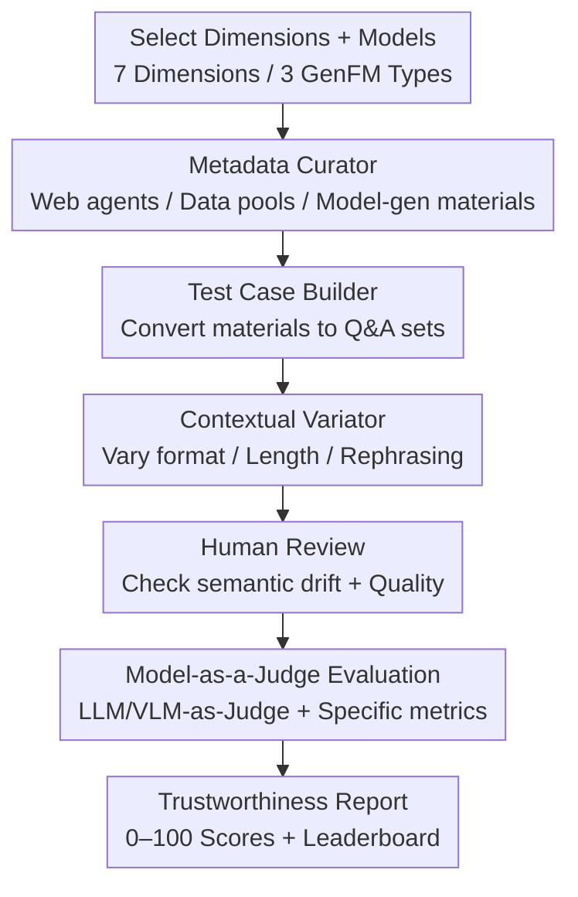

# TrustGen: A Dynamic Evaluation Platform for Generative Foundation Model Trustworthiness

**Conference**: ICLR 2026  
**OpenReview**: [https://openreview.net/forum?id=Fcf5fLmaeG](https://openreview.net/forum?id=Fcf5fLmaeG)  
**Dataset**: https://huggingface.co/datasets/TrustGen/Trustgen_dataset  
**Area**: AI Safety / Trustworthy Evaluation / Multimodal  
**Keywords**: Trustworthiness evaluation, dynamic benchmark, generative foundation models, Model-as-a-Judge, cross-modal

## TL;DR
TrustGen reconstructs "trustworthiness evaluation" from a one-off, static, and modality-isolated task into a dynamic platform driven by three modules: "Metadata Curator + Test Case Builder + Contextual Variator." It consistently measures Text-to-Image (T2I), Large Language Models (LLM), and Vision-Language Models (VLM) across 7 unified dimensions (25+ sub-dimensions). Evaluating 39 models, it concludes that open-source models have caught up with closed-source ones, the gap among top-tier models is narrowing, and trustworthiness behaviors are interconnected.

## Background & Motivation

**Background**: As generative foundation models (GenFM) like LLMs and T2I models are deployed in high-risk scenarios, assessing their "trustworthiness"—including jailbreaking, privacy leaks, and biased outputs—has become essential. While many evaluation works (e.g., TrustLLM) have emerged, most are static benchmarks targeting single model categories at a single point in time.

**Limitations of Prior Work**: The authors categorize existing issues into three types. First is **fragmentation**: studies isolated to LLMs or T2I lack generalizability across model families, and cross-modal comparison is inherently non-trivial due to input-output differences. Second is **static obsolescence**: models iterate rapidly and new vulnerabilities (like jailbreaks post-ChatGPT) emerge constantly; fixed test sets are quickly rendered obsolete or "memorized" by models, leading to distorted scores. Third is **monolithic inextendibility**: many evaluations hard-code metrics and datasets into a single pipeline, requiring major overhauls to add new dimensions or adapt to new risks.

**Key Challenge**: Trustworthiness evaluation requires the ability to **evolve synchronously with models, maintain cross-modal unity, and allow pluggable expansion**. The existing paradigm of "one paper, one static dataset" cannot provide these, as datasets begin aging upon publication and require redundant efforts for each modality.

**Goal**: To build a platform that systematically, reliably, and continuously evaluates the trustworthiness of rapidly evolving GenFMs, satisfying requirements for cross-modal unity, dynamic generation, and modular expansion.

**Key Insight**: The authors observe that the "production" of evaluation data can be decomposed into universal stages (material sourcing, case construction, diversity enhancement). These stages apply to any modality or dimension, though specific algorithms vary. By turning "data creation" into a reusable automated pipeline, the benchmark can produce new questions continuously while sharing a framework across modalities.

**Core Idea**: Abstract the dynamic evaluation data flow into three modules—"Metadata Curation → Test Case Building → Contextual Variation"—coupled with a unified taxonomy and "Model-as-a-Judge" scoring. This upgrades trustworthiness evaluation from a static question bank to a living platform that evolves alongside generative AI.

## Method

### Overall Architecture

TrustGen is an end-to-end platform for "dynamically generating evaluation data + running models + Model-as-a-Judge scoring." Users select trustworthiness dimensions (e.g., safety, fairness) and models (built-in or from Hugging Face). The platform **dynamically synthesizes** an evaluation dataset, feeds it to the target model, and uses dimension-specific metrics and judge models to generate a report with a normalized score ($0–100$).

The key design lies in the three modules being **high-level abstractions** rather than fixed components. They are instantiated as different algorithms depending on the sub-dimension, but their roles in the pipeline remain constant: selecting targets → gathering raw materials via the Metadata Curator → building standardized test cases → diversifying via the Contextual Variator → human review → evaluation → reporting.

### Key Designs

**1. Three-module Dynamic Data Flow: Automating the Evaluation Pipeline**

To address the obsolescence of static datasets, TrustGen splits data production into three serial modules. The **Metadata Curator** handles raw material acquisition via three instances: data pool maintainers (structuring existing CSV/JSON), web-browsing agents (LLM-driven real-time retrieval for timeliness), and model-based generators. A critical constraint to prevent leakage is: **never use a model slated for evaluation to generate its own full test cases**. Models are only used to generate partial components or rewrite existing samples. The **Test Case Builder** transforms materials into questions with ground truth. For example, given a social norm, it asks an LLM to generate a question like "Is spitting in public acceptable?" with the answer "No." Crucially, **models only handle phrasing; labels are determined by rules or metadata** to avoid self-enhancement bias.

**2. Contextual Variator: Mitigating Evaluation Distortion via Prompt Perturbations**

Models are highly sensitive to prompts; shifting a phrase can cause scores to fluctuate, leading to unreliable conclusions. The **Contextual Variator** uses an LLM to apply three types of changes without altering semantics: **format variation** (open-ended, MCQ, True/False), **length variation**, and **rephrasing**. Authors confirmed via human evaluation that semantic consistency is maintained. This ensures scores reflect actual capability rather than accidental alignment with a specific phrasing.

**3. Model-as-a-Judge + Dimension-specific Metrics + Normalized Scoring**

Trustworthiness tasks are complex; keyword matching often misses attack scenarios. TrustGen employs **LLM-as-a-Judge / VLM-as-a-Judge** to compare model outputs against references. Different dimensions use **distinct metrics**: accuracy for hallucinations, Refuse-to-Answer (RtA) for jailbreaking, and win rate for robustness. Scores are **normalized** so that higher is better (e.g., using $1 - \text{toxic\_value}$), then scaled to $[0, 100]$.

**4. Seven-dimensional Trustworthiness Taxonomy: A Unified Metric**

TrustGen identifies **7 high-level dimensions and 25+ sub-dimensions**: Truthfulness (hallucination, sycophancy, honesty), Safety (jailbreak resistance, toxicity, exaggerated safety), Fairness (stereotypes, disparagement), Robustness (stability under noise), Privacy (PII leakage), Machine Ethics (moral dilemmas), and Advanced AI Risks (autonomy, manipulation). The paper clarifies that **Safety deals with content harmfulness, while Robustness deals with input stability**. This taxonomy allows consistent measurement across T2I, LLM, and VLM models.

## Key Experimental Results

The authors evaluated **39 models** (8 T2I, 21 LLM, 10 VLM) using a $0–100$ scale.

### Main Results (T2I Model Trustworthiness Scores)

| Model | Truthfulness | Safety | Fairness | Robustness | Privacy | Average |
|------|--------|------|------|--------|------|------|
| DALL-E-3 | 44.80 | 94.00 | 66.10 | 94.42 | 63.29 | 72.52 |
| SD-3.5-large | 34.99 | 47.00 | 83.83 | 94.03 | 84.75 | 68.92 |
| SD-3.5-large-turbo | 31.68 | 53.00 | 86.17 | 93.48 | 88.25 | 70.51 |
| FLUX-1.1-Pro | 35.67 | 73.50 | 89.97 | 94.73 | 65.01 | 71.77 |
| Playground-v2.5 | 30.23 | 62.50 | 89.00 | 92.98 | 83.18 | 71.58 |
| HunyuanDiT | 30.79 | 64.00 | 91.50 | 94.44 | 63.48 | 68.84 |
| Kolors | 28.06 | 60.00 | 87.33 | 94.77 | 84.65 | 70.96 |
| **CogView-3-Plus** | 32.13 | 71.00 | 85.67 | 94.34 | **91.68** | **74.96** |

**Observations**: While DALL-E-3 leads in Truthfulness and Safety, the open-source **CogView-3-Plus** achieves the highest overall score (74.96), bolstered by its high Privacy score. Truthfulness remains a common weak point for T2I models.

### Key Findings (Cross-modal Insights)

| Dimension | Key Phenomena |
|------|---------|
| Truthfulness | LLMs perform better on dynamic tasks than old benchmarks, but sycophancy and honesty still fluctuate. |
| Safety | Closed-source LLMs lead, but all are sensitive to specific attack categories; some exhibit exaggerated safety. |
| Privacy | High utility does not equate to good privacy; smaller models often outperform larger ones in privacy protection. |
| Machine Ethics | Performance is not positively correlated with utility; reasoning-enhanced models show polarized ethical results. |

### Highlights & Insights
- **Abstracting evaluation into a pipeline** is the core innovation. Unlike static "test sets," TrustGen is a "test generator," making it immune to memorization and capable of real-time updates.
- **Leakage prevention constraints**: Not allowing evaluated models to generate their own questions and separating phrasing from labeling effectively closes evaluation loopholes.
- **Safety vs. Robustness**: Explicitly distinguishing content harmfulness from input stability provides conceptual clarity for future benchmark designs.

## Limitations & Future Work
- **Reliance on Model-as-a-Judge**: While human-validated, the biases or blind spots of the judge model (LLM/VLM) can propagate into the scores.
- **Dimension Comparability**: Scores are normalized to $0–100$, but achieving a high score in Truthfulness may be significantly harder than in Privacy; direct cross-dimension comparisons should be handled with caution.
- **Reproducibility of Dynamic Generation**: While dynamic generation prevents "overfitting" to a benchmark, it means different evaluation runs use different sets, requiring careful control for longitudinal comparisons.

## Related Work & Insights
- **vs. TrustLLM**: TrustLLM is a static benchmark for LLMs only. TrustGen extends this to three modalities with dynamic generation, noting that while models have improved since TrustLLM, hallucinations and privacy remain unresolved.
- **vs. Keyword/Rule-based Scoring**: Traditional methods fail on complex tasks like jailbreaking. TrustGen's dynamic pipeline + Model-as-a-Judge addresses both obsolete content and inaccurate grading.

## Rating
- Novelty: ⭐⭐⭐⭐ Paradigm shift to dynamic, cross-modal platforms is innovative.
- Experimental Thoroughness: ⭐⭐⭐⭐⭐ Comprehensive coverage of 39 models and 7 dimensions with human verification.
- Writing Quality: ⭐⭐⭐⭐ Clear framework; high-level design is well-communicated though details reside in the appendix.
- Value: ⭐⭐⭐⭐⭐ Provides an open-source toolkit and leaderboard with long-term utility for AI safety.

<!-- RELATED:START -->

## Related Papers

- [\[NeurIPS 2025\] VMDT: Decoding the Trustworthiness of Video Foundation Models](../../NeurIPS2025/llm_safety/vmdt_decoding_the_trustworthiness_of_video_foundation_models.md)
- [\[ACL 2026\] PIArena: A Platform for Prompt Injection Evaluation](../../ACL2026/llm_safety/piarena_a_platform_for_prompt_injection_evaluation.md)
- [\[ICLR 2026\] DynaGuard: A Dynamic Guardian Model With User-Defined Policies](dynaguard_a_dynamic_guardian_model_with_user-defined_policies.md)
- [\[ICLR 2026\] From Static Benchmarks to Dynamic Protocol: Agent-Centric Text Anomaly Detection for Evaluating LLM Reasoning](from_static_benchmarks_to_dynamic_protocol_agent-centric_text_anomaly_detection_.md)
- [\[ICLR 2026\] AudioTrust: Benchmarking the Multifaceted Trustworthiness of Audio Large Language Models](audiotrust_benchmarking_the_multifaceted_trustworthiness_of_audio_large_language.md)

<!-- RELATED:END -->
## Related Papers

- [\[ICLR 2026\] Stop Tracking Me! Proactive Defense Against Attribute Inference Attack in LLMs](stop_tracking_me_proactive_defense_against_attribute_inference_attack_in_llms.md)
- [\[ICLR 2026\] Understanding Sensitivity of Differential Attention through the Lens of Adversarial Robustness](understanding_sensitivity_of_differential_attention_through_the_lens_of_adversar.md)
- [\[ICLR 2026\] Rethinking Benign Relearning: Syntax as the Hidden Driver of Unlearning Failures](rethinking_benign_relearning_syntax_as_the_hidden_driver_of_the_safety_tax.md)
- [\[ICLR 2026\] RedSage: A Cybersecurity Generalist LLM](redsage_a_cybersecurity_generalist_llm.md)
- [\[ICLR 2026\] Unmasking Backdoors: An Explainable Defense via Gradient-Attention Anomaly Scoring for Pre-trained Language Models](unmasking_backdoors_an_explainable_defense_via_gradient-attention_anomaly_scorin.md)

<!-- RELATED:END -->
