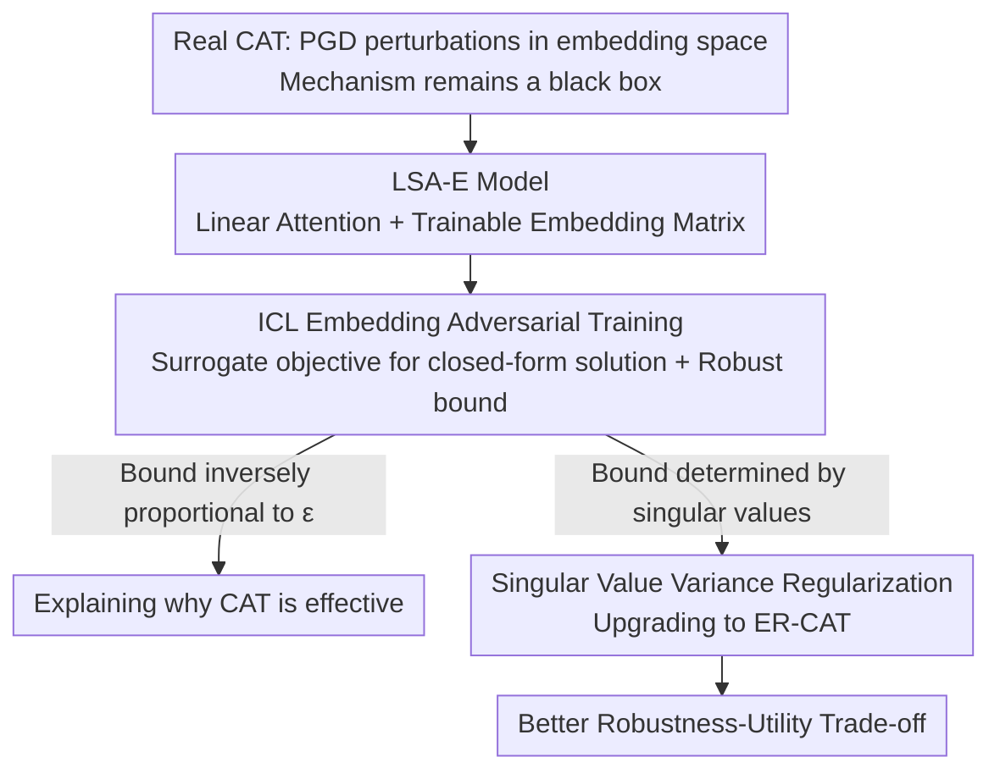

# Understanding and Improving Continuous Adversarial Training for LLMs via In-Context Learning Theory

**Conference**: ICLR 2026  
**OpenReview**: [https://openreview.net/forum?id=7zztxcmlyZ](https://openreview.net/forum?id=7zztxcmlyZ)  
**Code**: https://github.com/fshp971/continuous-adv-icl  
**Area**: LLM Security / Adversarial Training / Jailbreak Defense  
**Keywords**: Continuous Adversarial Training, Jailbreak Attacks, In-Context Learning Theory, Robust Generalization Bound, Singular Values of Embedding Matrix

## TL;DR
This paper provides the first theoretical explanation for "why Continuous Adversarial Training (CAT) is effective" using In-Context Learning (ICL) theory. It proves that imposing perturbations in the embedding space reduces the upper bound of robust risk for jailbreak attacks in the token space. Consequently, it discovers that robustness is closely related to the singular values of the embedding matrix, leading to the proposal of ER-CAT—which adds a "singular value variance regularization" term to the CAT objective—achieving a better robustness-utility trade-off across six real-world LLMs.

## Background & Motivation
**Background**: Adversarial Training (AT) is currently one of the most effective methods for defending LLMs against jailbreak attacks—feeding synthetic jailbreak prompts to the model and teaching it to identify and refuse them. However, standard AT requires searching for jailbreak suffixes in the discrete token space (solving discrete optimization as in Eq.(1)), which is computationally expensive. Recently, Continuous Adversarial Training (CAT) emerged: instead of searching in the token space, it directly applies Projected Gradient Descent (PGD) in the continuous token embedding space of the LLM to find adversarial perturbations $\delta^*$, which is much faster and empirically effective against both token-level and prompt-level attacks.

**Limitations of Prior Work**: While CAT works well in practice, "why it works" remains a black box. A critical discrepancy exists: the training data for CAT consists of **embedding vector sequences** (perturbed embeddings in continuous space), while real jailbreak attacks occur in the **discrete token space** (sequences of token indices). The data modalities are entirely different. There has been no prior explanation as to why adding noise in the embedding space allows the model to learn to defend against synthetic jailbreak prompts in the token space.

**Key Challenge**: There is a "spatial gap" between embedding space perturbations (performed during training) and token space attacks (encountered during testing). Without theoretical guarantees, it is impossible to explain the source of CAT's robustness or guide the improvement of CAT algorithms.

**Goal**: (1) Provide a rigorous theoretical explanation for CAT—why embedding space perturbations translate to token space robustness; (2) identify theoretically informed "tuning knobs" to design superior CAT algorithms.

**Key Insight**: The authors leverage recent progress in analyzing LLM robustness through ICL theory (specifically Fu et al. 2025, which characterizes jailbreaks using ICL suffix attacks). The approach uses an **analytically solvable** linear transformer + linear regression ICL task as a "laboratory model" to replicate the "embedding space perturbation" process of CAT, turning the black box into a toy system with closed-form solutions and generalization bounds.

**Core Idea**: By adding a trainable embedding matrix to a Linear Self-Attention model (LSA-E) and performing adversarial training in its embedding space, the authors prove a robust generalization upper bound. This bound is negatively correlated with the embedding perturbation radius $\epsilon$ (explaining why CAT works) and depends on the singular values of the embedding matrix (pointing to improvement directions). Consequently, "singular value variance" is used as a regularizer to upgrade CAT to ER-CAT.

## Method

### Overall Architecture
The work is divided into two parts: first, building a theoretically tractable "proxy system" to explain CAT, and then translating theoretical conclusions into a regularization term applicable to real LLMs.

The theoretical pipeline is: insert a trainable embedding matrix $W^E$ into standard Linear Self-Attention (LSA) to obtain the **LSA-E** model, ensuring its structure (mapping input to embedding space, then applying attention) is isomorphic to the "one-hot × embedding matrix" process in real LLMs. Next, apply adversarial perturbations to in-context samples in this embedding space to define the minimax problem of **ICL embedding adversarial training (ICL embedding AT)** (Eq.(10)) as a theoretical proxy for CAT. Since the original minimax is difficult to solve, it is relaxed into an analytical surrogate objective (Eq.(13)) to derive a closed-form solution for the optimal parameters (Theorem 1), which is then used to prove the **robust generalization upper bound** (Theorem 2) against token-space suffix attacks. This bound yields two conclusions: it is negatively correlated with the embedding perturbation radius $\epsilon$ and is determined by the distribution of the embedding matrix singular values.

The method then implements the second conclusion: adding an "embedding matrix singular value variance" regularization term to the original CAT objective to push large singular values down and small ones up, thereby lowering the theoretical bound and resulting in **ER-CAT**.

### Key Designs

**1. LSA-E: Integrating an Embedding Matrix into Linear Attention to Match Real LLMs**

To explain CAT, the theoretical model must possess an "embedding space" that can be perturbed. Previous Linear Self-Attention (LSA) models used for ICL analysis lacked an embedding module and could not accommodate perturbations in the embedding space. The authors introduce a trainable embedding matrix $W^E \in \mathbb{R}^{d \times d_0}$ that linearly maps each in-context point $x_{\tau,i}$ from the input space $\mathbb{R}^{d_0}$ to the embedding space $\mathbb{R}^{d}$, yielding $E(Z_\tau)$ (Eq.(6)). This is then fed into the linear self-attention to form the **LSA-E** model $f_{\text{LSAE},\theta}$ with parameters $\theta:=(W^E, W^{KQ}, W^V)$.

This design is justified because the embedding process in real LLMs is essentially a linear transformation of "one-hot encoding × embedding matrix"—almost isomorphic to $W^E x$ in LSA-E. Since prior work shows linear attention shares similar properties with non-linear attention in real LLMs, the conclusions derived from LSA-E can be extrapolated to real CAT. This is the foundation: without this module, "embedding space perturbation" cannot be formally analyzed.

**2. ICL Embedding Adversarial Training & Robust Generalization Bound: Proving Embedding Perturbation yields Token Space Robustness**

Using LSA-E, the authors apply perturbations $\Delta^E_\tau$ to the embeddings of in-context training points (constrained within $\|\delta^E_{\tau,i}\|_2 \le \epsilon$, Eq.(8)), forming an abbreviated minimax problem (Eq.(10)) for ICL embedding AT—a theoretical microcosm of real CAT. Robustness is evaluated using **ICL suffix adversarial attacks** (Eq.(11)), which apply perturbations directly to the **input points** (not embeddings), corresponding to real-world token-space jailbreaks. This defines the robust generalization risk $R^{\text{adv}}_{\rho,M}(\theta)$ (Eq.(12)). By separating training perturbations (embedding space) from evaluation attacks (input space), the authors address the core question of whether embedding-level training protects against input-level attacks.

As the minimax objective lacks a closed-form solution, the authors derive a closed-form surrogate $\tilde L^{\text{adv}}_{\text{LSAE}}(\theta)=\sum_{i=1}^4 \ell_i(\theta)$ (Eq.(13), Lemma 1). Under symmetric initialization (Assumption 1), the optimal solution is found via gradient flow (Theorem 1), followed by the proof of the robust generalization upper bound against suffix attacks (Theorem 2):

$$R^{\text{adv}}_{\rho,M}(\theta^*) \le O\!\left(\frac{(1+M\rho^2/N^2)\cdot\sum_{i=1}^{d}\sigma_i(W^E_*)^4}{\sigma_{\min}(W^E_*)^4+\epsilon^4}\right)+O(1).$$

This bound reveals why CAT is effective: the denominator contains $+\epsilon^4$, meaning **the larger the embedding perturbation radius $\epsilon$, the smaller the upper bound**. This establishes a provable inverse correlation between embedding space perturbation and input space robustness.

**3. ER-CAT: Using Singular Value Variance as a Regularizer for Real LLMs**

Theorem 2 indicates that the bound is controlled by the singular values of $W^E_*$: the numerator includes $\sum_i\sigma_i(W^E_*)^4$ (excessively large singular values increase the bound), while the denominator includes $\sigma_{\min}(W^E_*)^4$ (excessively small singular values also increase the bound). Ideally, the singular values should be "neither too large nor too small" and concentrated. Furthermore, the closed-form solution (Eq.(14)) shows the optimal predictor depends only on $W^E_*$ and not on $W^{KQ}_*$ or $W^V_*$—identifying the embedding matrix as the key switch for robustness.

Based on this, the authors propose **ER-CAT (Embedding-Regularized CAT)** by adding the "variance of all singular values" as a regularizer to the CAT objective (Eq.(15)):

$$L_{\text{ER-CAT}}(\theta,\alpha,\beta)=\underbrace{L_{\text{CAT}}(\theta,\alpha)}_{\text{Original CAT Loss}}+\beta\cdot\frac{\sum_{i=1}^{d}[\sigma_i(W^E)-\bar\sigma(W^E)]^2}{d},$$

where $\bar\sigma(W^E)$ is the mean of the singular values. Minimizing variance simultaneously suppresses large singular values and elevates small ones, matching the theoretical requirement for concentrated singular values. Although singular values are theoretically non-differentiable, PyTorch's native SVD operator handles gradients automatically, allowing implementation in a few lines of code without significant computational overhead.

### Loss & Training
On real LLMs, CAT (Eq.(4)) or ER-CAT (Eq.(15)) is optimized using AdamW with an embedding perturbation radius $\epsilon=0.05$. To improve efficiency, LoRA is applied to the embedding layer and all query/key projection matrices. Hyperparameters include $\alpha=0.5$ for CAT and $\alpha=0.1, \beta=0.2$ for ER-CAT. Both use loss cut-off to prevent over-optimization, though the threshold is relaxed to preserve utility. Safety data is taken from the HarmBench training set, and utility data from UltraChat 200K.

## Key Experimental Results

### Main Results
Evaluations were conducted on 6 real LLMs (Vicuna-7B, Mistral-7B, Llama-2-7B, Llama-3.1-8B, Qwen2.5-7B, Gemma-2B) against 6 jailbreak attacks (Token-level: GCG/BEAST/GCQ/Zhu's AutoDAN; Prompt-level: DeepInception/PAIR). Robustness is measured by Avg@5 ASR (Attack Success Rate, lower is better) and utility by LC-WinRate (higher is better). ER-CAT achieves a superior robustness-utility trade-off:

| Model | Method | GCG ASR↓ | GCQ ASR↓ | LC-WinRate↑ |
|------|------|----------|----------|-------------|
| Vicuna-7B | CAT | 12.6 | 4.6 | 36.66 |
| Vicuna-7B | ER-CAT | 16.4 | 6.4 | **65.13** |
| Mistral-7B | CAT | 7.4 | 3.2 | 15.76 |
| Mistral-7B | ER-CAT | 7.6 | 3.2 | **29.09** |
| Llama-2-7B | CAT | 23.6 | 8.0 | 67.51 |
| Llama-2-7B | ER-CAT | **15.6** | **1.2** | 65.76 |
| Qwen2.5-7B | CAT | 20.6 | 17.8 | 77.07 |
| Qwen2.5-7B | ER-CAT | **16.8** | **6.6** | 74.06 |

In Vicuna/Mistral, ER-CAT increases ASR by less than 4% compared to CAT but nearly doubles the LC-WinRate. In Llama-2/Qwen2.5, ER-CAT's LC-WinRate is less than 3% lower than CAT, yet it reduces GCG/BEAST ASR by ~7% and Qwen2.5 GCQ ASR by 11%.

### Ablation Study

| Configuration | Key Metrics | Description |
|------|---------|------|
| CAT (No Regularization) | See table above | Baseline |
| ER-CAT ($\beta=0.2{\sim}1.0$) | Small fluctuations in LC-WinRate / GCG / BEAST | The regularization coefficient $\beta$ has a surprisingly small impact |
| ER-CAT Time Overhead | Only +100~200 seconds | Almost no additional cost compared to CAT |

Regarding time complexity (Table 3), ER-CAT adds only 100-200 seconds per model (e.g., Vicuna 987.81s → 1074.87s), as the singular value variance term is computed efficiently via PyTorch, confirming it provides negligible overhead.

### Key Findings
- **Inverse correlation between $\epsilon$ and robust bound**: The $+\epsilon^4$ in the denominator of the theoretical bound proves that larger embedding perturbations lead to higher token-space robustness, explaining CAT's fundamental mechanism.
- **Singular values are robustness switches**: The optimal predictor depends on $W^E_*$ but not on the attention KQ/V matrices. Concentrating singular values minimizes the risk bound, forming the basis for ER-CAT.
- **Low sensitivity to $\beta$**: The authors suggest that AdamW's gradient normalization implicitly re-weights terms in ER-CAT, mitigating the effect of hyperparameter tuning.

## Highlights & Insights
- **Turning a Black Box into a Tractable Toy System**: Using LSA-E to replicate CAT's embedding perturbations and deriving closed-form solutions is a valuable methodology for explaining other effective yet opaque training techniques.
- **Deriving Algorithms from Theoretical Bounds**: ER-CAT is not an arbitrary heuristic; it precisely targets the singular value term in the risk bound, creating a clean theoretical-to-algorithmic pipeline.
- **Deliberate Spatial Separation**: Training in the embedding space while evaluating suffix attacks in the input space allows the "embedding-to-input" robustness transfer to become a meaningful and verifiable proposition.

## Limitations & Future Work
- **Reliance on Linear Models / Regression ICL**: LSA-E and linear regression are simplified settings far removed from real LLM non-linearity and autoregressive generation. The "similarity" argument relies heavily on analogies with existing work.
- **Theoretical Requirement $d \le d_0$**: This assumes the embedding dimension is less than or equal to the input dimension (implicit compression), which contradicts high-dimensional embeddings in real LLMs.
- **Modest Improvement**: In several cases, ASR or utility only improves by a few percent, and the negligible impact of $\beta$ suggests the regularization might be diluted by AdamW.
- **Future Directions**: Extending analysis to non-linear attention or autoregressive ICL; using explicit singular value constraints instead of variance to avoid dilution by AdamW.

## Related Work & Insights
- **vs. Fu et al. (2025) (Short AT vs Long Jailbreaks)**: This work inherits the ICL suffix attack framework from Fu et al. but innovates by introducing the embedding matrix to explain CAT's unique mechanism.
- **vs. Xhonneux et al. (2024) (Proposing CAT)**: While Xhonneux et al. empirically validated CAT, this paper provides the missing theoretical justification and an upgraded version (ER-CAT).
- **vs. Dékány et al. (2025) MixAT**: MixAT uses an engineering approach (mixing discrete and continuous prompts), while this paper focus on theoretical mechanisms; the two could be combined for further gains.

## Rating
- Novelty: ⭐⭐⭐⭐⭐ First theoretical explanation of CAT using ICL theory, translating a risk bound directly into an implementation.
- Experimental Thoroughness: ⭐⭐⭐⭐ Broad coverage across models and attacks, though the magnitude of improvement is sometimes small.
- Writing Quality: ⭐⭐⭐⭐ Clear theoretical derivation (Proxy → Closed-form → Bound → Algorithm), though mathematically dense for non-experts.
- Value: ⭐⭐⭐⭐ Provides a much-needed theoretical foundation and improvement strategy for the widely used CAT method.

<!-- RELATED:START -->

## Related Papers

- [\[NeurIPS 2025\] MixAT: Combining Continuous and Discrete Adversarial Training for LLMs](../../NeurIPS2025/llm_safety/mixat_combining_continuous_and_discrete_adversarial_training_for_llms.md)
- [\[ICLR 2026\] Understanding Sensitivity of Differential Attention through the Lens of Adversarial Robustness](understanding_sensitivity_of_differential_attention_through_the_lens_of_adversar.md)
- [\[ICLR 2026\] Learning to Lie: Adversarial Attacks on Human-AI Teams and LLMs](learning_to_lie_adversarial_attacks_on_human-ai_teams_and_llms.md)
- [\[ICLR 2026\] Ghost in the Cloud: Your Geo-Distributed Large Language Models Training is Easily Manipulated](ghost_in_the_cloud_your_geo-distributed_large_language_models_training_is_easily.md)
- [\[ICLR 2026\] Learning-Time Encoding Shapes Unlearning in LLMs](learning-time_encoding_shapes_unlearning_in_llms.md)

<!-- RELATED:END -->
