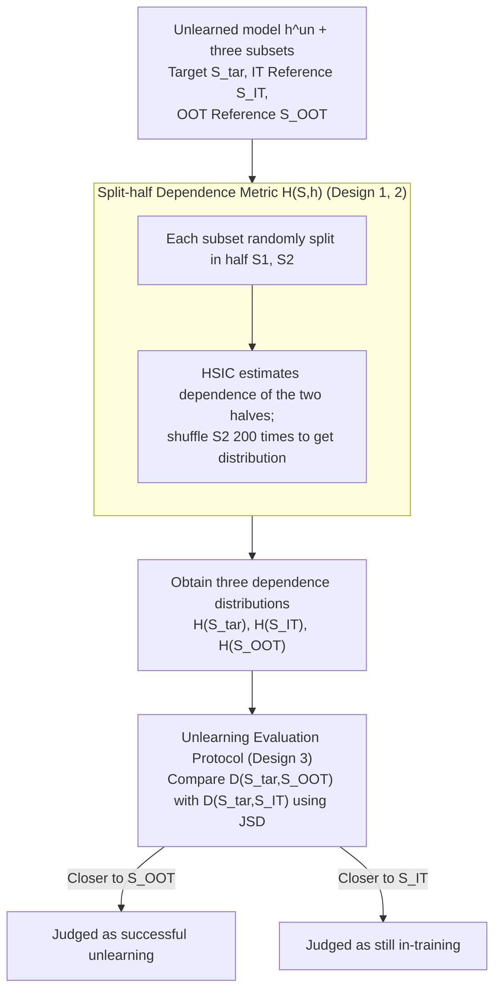

# Unlearning Evaluation through Subset Statistical Independence

## Paper Information
- **Conference**: ICLR 2026
- **arXiv**: [2603.00587](https://arxiv.org/abs/2603.00587)
- **Code**: [https://github.com/ChildEden/SDE](https://github.com/ChildEden/SDE)
- **Area**: Machine Unlearning / Privacy Protection / Statistical Testing
- **Keywords**: Machine Unlearning Evaluation, HSIC, Statistical Independence, Subset-level Evaluation, Membership Inference

## TL;DR
Proposes Split-half Dependence Evaluation (SDE), which utilizes HSIC statistical independence tests to evaluate machine unlearning effectiveness at the subset level without requiring model retraining or auxiliary classifiers.

## Background & Motivation

### Core Problem
How to verify if a machine unlearning process is successful? Existing evaluation methods have fundamental limitations:

**Retraining Comparison**: Requires training a new model as a reference—contradicting the original intent of unlearning.

**Membership Inference Attack (MIA)**: Relies on training statistics, shadow models, etc.—difficult to obtain after unlearning.

**Sample-level Inference**: Unlearning usually removes small subsets (5%-20%); single-sample statistical clues are weak post-unlearning.

### Paradigm Shift
From **sample-level MIA** → **subset-level statistical independence evaluation**

Core Insight: Training involvement induces inter-sample dependencies among model outputs (shared gradient updates and co-adaptation), which do not exist in out-of-training data.

## Method

### Overall Architecture

SDE (Split-half Dependence Evaluation) aims to solve a problematic evaluation issue: how to determine whether a subset has truly been forgotten by the model without retraining reference models, relying on shadow models, or using auxiliary classifiers. Its Key Insight is to translate "whether it participated in training" into "whether the outputs are statistically independent"—if a subset truly participated in training, its samples will be entangled with each other in the model output due to shared gradient updates and co-adaptation; whereas data outside of training lacks such entanglement.

Specifically: After obtaining the target subset to be evaluated, it is first randomly split into two halves. HSIC is used to measure the statistical dependence between the model outputs of these two halves, yielding a dependence value. This value is then compared against two dependence distributions: the "In-Training Reference" and the "Out-Of-Training Reference." The subset is classified based on which distribution it is closer to. Successful unlearning means that the dependence of the target subset, which originally belonged to the training set, has collapsed toward the out-of-training side after the unlearning process.

### Key Designs

**1. Split-half Dependence Metric $H(\mathcal{S}, h)$: Elevating sample-level clues to subset-level signals**

Unlearning usually only removes small subsets (5%–20%). Since individual samples leave weak statistical clues post-unlearning, sample-level MIA is difficult to sustain. SDE operates at the subset granularity: the evaluation subset $\mathcal{S}$ is randomly split into two halves $\mathcal{S}_1, \mathcal{S}_2$, and the dependence between the outputs of the two halves is measured:

$$H(\mathcal{S}, h) = \text{HSIC}(h(\mathcal{S}_1), h(\mathcal{S}_2))$$

The in-training subset $H(\mathcal{S}_{IT}, h)$ will be significantly higher than the out-of-training subset $H(\mathcal{S}_{OOT}, h)$. There is theoretical support for this: when the model $h = \mathcal{A}(\mathcal{D}_{tr})$ is trained, $h(x_i)$ implicitly depends on $x_j$ through learned parameters; thus $h(x_i)$ and $h(x_j)$ are no longer independent. The shared influence components introduced by training are the root cause of stronger split-half dependence in in-training subsets. To obtain a distribution of $H(\mathcal{S}, h)$ rather than a single point value, $\mathcal{S}_2$ is shuffled 200 times for repeated estimation.

**2. HSIC as a Non-parametric Dependence Estimator: No distribution assumptions**

Dependence is measured using the Hilbert-Schmidt Independence Criterion (HSIC), which does not require assuming a specific output distribution and is suitable for characterizing complex dependencies in neural network outputs:

$$\text{HSIC}(X, Y) = \frac{1}{(n-1)^2}\text{Tr}(KHLH)$$

Where $K, L$ are Gaussian RBF kernel matrices and $H = I - \frac{1}{n}\mathbf{1}\mathbf{1}^T$ is a centering matrix. The kernel bandwidth is set to the heuristic $\sigma = \sqrt{\text{dim}}$, which is verified in experiments as a robust default.

**3. Unlearning Evaluation Protocol: Comparison with two reference distributions instead of hard thresholds**

Since HSIC values fluctuate with datasets and subset sizes, SDE does not use an absolute threshold but instead performs relative comparison. Given the target subset $\mathcal{S}_{\text{tar}} \subseteq \mathcal{D}_f$, an in-training reference $\mathcal{S}_{IT} \subset \mathcal{D}_r$ is taken from the retain set, and an out-of-training reference $\mathcal{S}_{OOT} \subset \mathcal{D}_{te}$ is taken from the test set. Unlearning is considered successful if and only if:

$$D(\mathcal{S}_{\text{tar}}, \mathcal{S}_{OOT}, h^{un}) < D(\mathcal{S}_{\text{tar}}, \mathcal{S}_{IT}, h^{un})$$

Where $D$ uses Jensen-Shannon Divergence to compare the distance between two dependence distributions. Intuitively: the unlearned target subset is truly forgotten only if its dependence distribution is closer to "out-of-training" and further from "in-training."

## Main Results

### Controlled Experiments (Retrained Models)

| Dataset-Model | R=5% |S|=400 | R=10% |S|=1000 | R=20% |S|=2000 |
|------------|------|--------|--------|
| SV-ResNet18 | 0.71 | 0.78 | 0.97 |
| C10-ResNet18 | 0.87 | 0.95 | 1.00 |
| C100-ResNet18 | 0.99 | 1.00 | 1.00 |
| Tiny-ResNet18 | 0.70 | 0.92 | 0.98 |

### Comparison with Distribution Distance Metrics (CIFAR10-ResNet18, R=10%, |S|=1000)

| Method | F1 Score |
|------|---------|
| MMD | 0.70 |
| Wasserstein | 0.89 |
| **SDE (Ours)** | **0.95** |

SDE consistently outperforms MMD and Wasserstein in **all settings**, with a more significant advantage in small subsets.

### Evaluation of Unlearning Methods (CIFAR10-ResNet18, R=10%)

| Method | Acc_r(%) | Acc_f(%) | ASR | OTR↑(%) |
|------|----------|----------|-----|---------|
| Retrain | 98.57 | 93.25 | 0.30 | **87.00** |
| RandLabel | 98.80 | 98.63 | 0.29 | 84.00 |
| Unroll | 99.36 | 99.21 | 0.30 | **3.00** |
| Sparsity | 92.72 | 90.56 | 0.42 | 50.80 |
| SalUn | 98.66 | 98.53 | 0.29 | 52.40 |

### Key Findings

1. **Major Discovery on the Unroll Method**: Traditional metrics (ASR ≈ 0.30, matching Retrain) suggest successful unlearning, but SDE’s OTR is only 3%—almost all unlearned samples are still identified as in-training data.
2. **SDE Reveals MIA Deficiencies**: Similar ASR makes it difficult to distinguish unlearning quality, whereas OTR provides a clearer distinction.
3. Larger subsets and deeper features provide better discriminative power.
4. Kernel bandwidth $\sigma = \sqrt{\text{dim}}$ is a robust heuristic choice.
5. Dependence can be detected even in early models trained for only 20% of the epochs.

## Highlights & Insights

1. **Independent Evaluation without Retraining**: A truly independent verification scheme for unlearning.
2. **Subset-level Evaluation Aligns with Unlearning Workflows**: Unlearning itself is an operation targeted at subsets.
3. **Exposing Blind Spots in Existing Evaluations**: The case study of the Unroll method provides significant cautionary value.
4. **Unity of Theory and Practice**: The analysis of shared influence components supports the design of the method.

## Limitations & Future Work

1. The choice of kernel bandwidth $\sigma$ has a significant impact; simple heuristics might not apply to all scenarios (e.g., Diffusion Models).
2. The selection of reference sets affects performance; the optimal strategy for reference set construction remains unresolved.
3. It may capture natural forgetting (representation drift, catastrophic forgetting) rather than intentional unlearning.
4. Currently only provides binary judgments, without fully utilizing the potential of HSIC as a continuous metric.
5. Weaker effectiveness on shallow networks like AllCNN.

## Related Work & Insights
- **Machine Unlearning**: SISA, Random-label, SalUn — various unlearning algorithms.
- **Membership Inference Attack**: Methods based on confidence, loss, and auxiliary classifiers.
- **Statistical Independence Tests**: HSIC, MMD — kernel-based statistical testing methods.

## Rating
- **Novelty**: ⭐⭐⭐⭐ — Subset-level statistical independence is a novel perspective.
- **Experimental Thoroughness**: ⭐⭐⭐⭐ — Multi-dimensional controlled experiments and unlearning method evaluations.
- **Writing Quality**: ⭐⭐⭐⭐ — Clear motivation and comprehensive method descriptions.
- **Value**: ⭐⭐⭐⭐ — Requires no additional training and is easy to deploy.

<!-- RELATED:START -->

## Related Papers

- [\[ICLR 2026\] Invisible Safety Threat: Malicious Finetuning for LLM via Steganography](invisible_safety_threat_malicious_finetuning_for_llm_via_steganography.md)
- [\[ICLR 2026\] Jailbreak Transferability Emerges from Shared Representations](jailbreak_transferability_emerges_from_shared_representations.md)
- [\[ICLR 2026\] GeneBreaker: Jailbreak Attacks Against DNA Language Models with Pathogenicity Guidance](genebreaker_jailbreak_attacks_against_dna_language_models_with_pathogenicity_gui.md)
- [\[AAAI 2026\] Ghost in the Transformer: Detecting Model Reuse with Invariant Spectral Signatures](../../AAAI2026/llm_safety/ghost_in_the_transformer_detecting_model_reuse_with_invariant_spectral_signature.md)
- [\[AAAI 2026\] Multi-Faceted Attack: Exposing Cross-Model Vulnerabilities in Defense-Equipped Vision-Language Models](../../AAAI2026/llm_safety/multi-faceted_attack_exposing_cross-model_vulnerabilities_in_defense-equipped_vi.md)

<!-- RELATED:END -->
