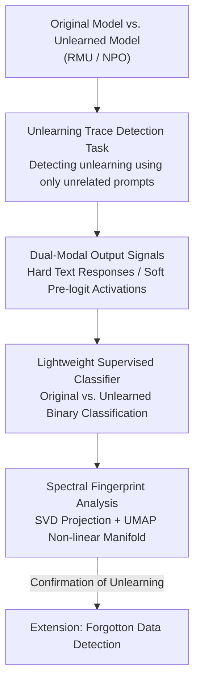

# Unlearning Isn't Invisible: Detecting Unlearning Traces in LLMs from Model Outputs

**Conference**: ICLR 2026  
**OpenReview**: [https://openreview.net/forum?id=bqEnnzfhBZ](https://openreview.net/forum?id=bqEnnzfhBZ)  
**Code**: https://github.com/OPTML-Group/Unlearn-Trace  
**Area**: AI Safety / Machine Unlearning / Model Forensics  
**Keywords**: Machine Unlearning, Unlearning Trace Detection, Activation Fingerprinting, Spectral Analysis, Reverse Engineering

## TL;DR
This paper reveals and formalizes a novel vulnerability—"Unlearning Trace Detection": an LLM processed by machine unlearning (MU) leaves persistent "fingerprints" in its outputs and internal activations. Even when using only prompts unrelated to the forgotten content, a lightweight supervised classifier can determine whether a model has undergone unlearning with 90%+ accuracy, and these traces become more pronounced as the model size increases.

## Background & Motivation
**Background**: Machine unlearning (MU) for LLMs aims to erase specific private, copyrighted, or dangerous knowledge from trained models while maintaining performance on normal tasks. Since exact unlearning (retraining) is impractical for large models, approximate unlearning methods are mainstreamed. The two primary paradigms are RMU (which rewrites internal representations) and NPO (preference optimization variants that induce optimization divergence).

**Limitations of Prior Work**: Previous discussions on "incomplete" unlearning have focused almost entirely on **reversibility**—whether deleted knowledge can be recovered through jailbreak attacks or sparse fine-tuning. These analyses assume the attacker already **knows** the model has been unlearned and seeks to recover the deleted content directly.

**Key Challenge**: In reality, a more fundamental and overlooked question is: how does an attacker know a model has been tampered with in the first place? If the status of "being unlearned" is observable and discriminable, it constitutes a new attack surface. Once identified, attackers can concentrate resources on suspicious models for recovery attacks rather than blindly testing all candidates.

**Goal**: This work decomposes the problem into two stages: (1) Can we detect if a model has been unlearned using only its outputs? (2) If so, what specific traces does unlearning leave within the model?

**Key Insight**: The authors start with an observation: while unlearned models often become incoherent in response to "unlearning-related" prompts (with a significant drift in perplexity distribution), they appear fluent on "unlearning-unrelated" prompts. Intuitively, there should be no difference in the latter, but the authors suspect that even on unrelated prompts, unlearning leaves systematic offsets that are invisible to the naked eye but learnable by machines. This perspective draws from Reverse Engineering of Deceptions (RED) in trustworthy ML—inferring an adversary's goals and methods from attack traces.

**Core Idea**: Treat "whether a model has been unlearned" as a supervised binary classification task. Use model outputs (discrete text or continuous pre-logit activations) from **unlearning-unrelated** prompts as signals, and further employ spectral analysis to prove that unlearning leaves a low-dimensional, learnable "fingerprint" in the activation space.

## Method

### Overall Architecture
Instead of proposing a new unlearning algorithm, this paper adopts the perspective of a "forensic investigator/attacker" to build an **Unlearning Trace Detection** pipeline. By taking the original and unlearned versions of the same base model and querying them with the same prompts, observable outputs are collected to train a lightweight classifier that distinguishes between the two. Crucially, the authors use a worst-case threat model: relying primarily on **unlearning-unrelated** prompts (where the attacker lacks the unlearning set) and gray-box settings (where the attacker sees text responses or has access to soft pre-logit activations).

The process consists of three stages: **constructing the detection dataset** (Original/Unlearned model × two query types → two output modalities), **training a binary classifier**, and finally using **spectral fingerprint analysis** to explain "why they are separable" by identifying discriminable manifolds in the activation space.

### Key Designs

**1. Unlearning Trace Detection: Formalizing "Has it been unlearned?" as binary classification under unrelated prompts**

The core contribution targets the gap where prior work only asked "can knowledge be recovered" without considering if the act of unlearning itself is detectable. The authors define this as supervised binary classification. The difficulty lies in the **realism of the threat model**: the attacker lacks the unlearning set, so training and testing must rely on **unlearning-unrelated** prompts (e.g., MMLU, UltraChat) where perplexity distributions appear nearly identical to the original model.

A decisive detail often overlooked: the training set must use **mixed data $S_{fg}$** (50% from the unlearning set WMDP, 50% from the general set MMLU). Ablations (Table 3) show that if trained only on $S_f$, the classifier reaches 91%+ on related prompts but drops to near-random (51%–55%) on unrelated ones. Only with mixed training does the classifier learn to capture the systematic offsets left by unlearning even on unrelated prompts.

**2. Dual-Modal Output Signals: Hard Text Responses and Soft Pre-logit Activations**

To cover different access levels, two observable outputs are used. The **hard signal** is the generated text response: LLM2Vec encodes variable-length answers into vectors for a two-layer MLP—chosen for its robustness and ability to capture an LLM's "stylistic habits." The **soft signal** is the pre-logit activations: recording the activation vector for each generated token and aggregating them into a sequence representation for a two-layer MLP.

The strength of these signals varies by unlearning paradigm. For **NPO** (optimization divergence that forces the model away from original behavior via $\ell_f = \mathbb{E}_{x\in D_f}[-\tfrac{2}{\beta}\log\sigma(-\beta\log\tfrac{\pi_\theta(x)}{\pi_{ref}(x)})]$), text responses suffice because NPO’s aggressive unlearning causes general degradation, even on unrelated tasks. For **RMU** (representation rewriting that pulls intermediate representations $M_\theta(x)$ toward a fixed random vector via $\ell_f=\mathbb{E}_{x\in D_f}\|M_\theta(x)-c\cdot v\|_2^2$), changes are localized and subtle. Textual traces are weak (54% on Zephyr-7B/MMLU, near random), but the **activation signal** is nearly perfect.

**3. Spectral Fingerprint Analysis: Locating Traces in Activation Space via SVD and UMAP**

To ensure the classifier's accuracy isn't just overfitting, the authors define unlearning fingerprints as characteristic offsets along principal directions of internal activations. They perform SVD on centralized activation matrices and project activations onto right singular vectors (following spectral analysis logic in backdoor detection). For NPO, the final layer normalized activations show obvious distribution drift on the first singular vector (SV1). For RMU, the final pre-logit activations show no linear drift, but **tracing back along the residual stream** to the FFN sublayers directly modified by RMU (e.g., L7.D_PROJ) reveals spectral offsets. Larger models (Yi-34B) show traces across multiple layers (L13/L14/L15), explaining why they are easier to detect.

Furthermore, they explain the "separable but no drift" phenomenon in the final layer using supervised UMAP. This non-linear dimensionality reduction clearly separates original/unlearned activations in Zephyr-7B's final layer, suggesting unlearning signals reside in **low-dimensional non-linear manifolds** even if linear spectral drift is absent.

### Mechanism Example
Consider an RMU-unlearned Yi-34B answering an MMLU question ("Which of these are spatial clustering algorithms?"). The original model answers "All of the above" after detailed analysis. The unlearned model also answers correctly with a seemingly reasonable explanation—textually, it is indistinguishable. However, by projecting its intermediate activations (L13–L15) from 3,000 MMLU questions onto SV1, the distribution clearly drifts from the original version. Even if the final layer shows no drift, UMAP separates the activations into different manifolds. Thus, a two-layer MLP can determine it is an RMU-unlearned Yi-34B with near 100% accuracy—a clustering question completely unrelated to biosecurity or cyber-warfare still exposes the unlearning trace.

## Key Experimental Results

The experiments cover 4 instruction-tuned bases (Zephyr-7B, LLaMA-3.1-8B, Qwen2.5-14B, Yi-34B) × 2 SOTA unlearning methods (RMU, NPO) × 3 prompt types (WMDP, MMLU, UltraChat).

### Main Results
Detection Accuracy (Text / Activation signals):

| Setting | Method | Signal | Accuracy |
|------|---------|------|--------|
| Yi-34B, MMLU (Unrelated) | RMU | Text Response | 96% |
| Zephyr-7B, MMLU (Unrelated) | RMU | Text Response | 54% (Near Random) |
| Zephyr-7B, All Settings | NPO | Text Response | 99–100% |
| All Models, Unrelated Prompts | RMU | Pre-logit Activation | Generall > 90% |

Key takeaway: RMU is subtle at the text level for small models but nearly perfect in activations. NPO is easily detected even via text due to aggressive degradation. Larger models are more susceptible to textual detection (Yi-34B 96% vs Zephyr-7B 54%).

### Ablation Study
Training set composition (Mixed $S_{fg}$ vs. Unlearning-only $S_f$ for RMU, text results from Table 3):

| Configuration | WMDP | MMLU | UltraChat | Note |
|------|------|------|-----------|------|
| LLaMA-3.1-8B, $S_{fg}$ (Mixed) | 93.24% | 78.87% | 67.60% | Detectable on unrelated prompts |
| LLaMA-3.1-8B, $S_f$ (Only $S_f$) | 95.49% | 51.83% | 55.21% | Drops to random on unrelated prompts |
| Yi-34B, $S_{fg}$ (Mixed) | 94.37% | 95.77% | 87.46% | Strongest for large models |

Classifier complexity (Table 4): A Residual Head (94.67/81.23/69.57) performs similarly to a standard two-layer MLP (93.24/78.87/67.60). This suggests the detection depends on the **separability of the signal itself** rather than classifier depth.

### Key Findings
- **Mixed training set $S_{fg}$ is the linchpin**: Without it, detection on unrelated prompts fails.
- **Unlearning paradigms dictate trace location**: NPO traces are visible in the final layer/text; RMU traces are hidden in the intermediate activations where weights were modified.
- **Larger models are easier to detect**: Big models exhibit stronger, multi-layer spectral fingerprints and higher textual detection rates, likely due to more structured unlearning perturbations in high-capacity spaces.
- **Limited cross-model generalization**: Classifiers trained on Zephyr/Qwen/Yi migrate reasonably well, but LLaMA-3.1-8B classifiers transfer poorly, suggesting they rely on model-specific features.
- **Extensions to data detection**: Once unlearning is confirmed, statistical measures like entropy and JS divergence can identify specific forgotten data points with > 70% accuracy.

## Highlights & Insights
- **Redefining Security Mechanisms as Attack Surfaces**: Unlearning, intended as a defense for privacy/safety, is proven to leave fingerprints that serve as a "target this model" label for attackers.
- **Closing the Loop from Phenomenon to Mechanism**: The authors don't just show that "classifiers work"; they use SVD, residual stream tracing, and UMAP to attribute accuracy to specific layers and non-linear manifolds.
- **The "Unrelated Detection" Paradox**: That an attacker can detect unlearning without knowing *what* was unlearned is both counter-intuitive and highly dangerous.

## Limitations & Future Work
- **Strong Threat Model**: Activation signals require gray-box access to pre-logits. While common in open-source deployments, black-box detection remains difficult for subtle methods like RMU.
- **Generalization Challenges**: Classifiers trained on one architecture don't always transfer to others, requiring multi-source training in the future.
- **Method Scope**: Only RMU and NPO on the WMDP benchmark were tested; other algorithms/tasks remain unexplored.
- **Lack of Defense**: This work focuses on revealing the vulnerability. Designing "low-trace" unlearning methods is the natural next step.

## Related Work & Insights
- **vs. Unlearning Robustness (Jailbreaking/Re-learning)**: Prior work asks "can knowledge be recovered" assuming unlearning is known. Ours asks "can we detect unlearning," providing a realistic entry point for such attacks.
- **vs. LLM Identity/Source Detection**: Others distinguish between different models' stylistic habits. Ours focuses on **internal changes** within the same model before and after unlearning.
- **vs. Backdoor/Trojan Detection**: Methodologically borrows spectral separation logic but applies it to unlearning traces rather than malicious triggers.

## Rating
- Novelty: ⭐⭐⭐⭐⭐ High. Flips the perspective of unlearning from a defense to a vulnerability.
- Experimental Thoroughness: ⭐⭐⭐⭐ Solid across 4 bases and multiple paradigms, with deep mechanistic analysis.
- Writing Quality: ⭐⭐⭐⭐ Logical progression from empirical observation to theoretical explanation.
- Value: ⭐⭐⭐⭐⭐ Directly identifies a new risk for deployed unlearned models in high-stake scenarios.

<!-- RELATED:START -->

## Related Papers

- [\[ICLR 2026\] Model Collapse Is Not a Bug but a Feature in Machine Unlearning for LLMs](model_collapse_is_not_a_bug_but_a_feature_in_machine_unlearning_for_llms.md)
- [\[ICLR 2026\] Revisiting the Past: Data Unlearning with Model State History](revisiting_the_past_data_unlearning_with_model_state_history.md)
- [\[ICLR 2026\] Erase or Hide? Suppressing Spurious Unlearning Neurons for Robust Unlearning](erase_or_hide_suppressing_spurious_unlearning_neurons_for_robust_unlearning.md)
- [\[ICLR 2026\] Learning-Time Encoding Shapes Unlearning in LLMs](learning-time_encoding_shapes_unlearning_in_llms.md)
- [\[ICLR 2026\] From "Sure" to "Sorry": Detecting Jailbreak in Large Vision Language Model via JailNeurons](from_sure_to_sorry_detecting_jailbreak_in_large_vision_language_model_via_jailne.md)

<!-- RELATED:END -->
## Related Papers

- [\[ICLR 2026\] Revisiting the Past: Data Unlearning with Model State History](revisiting_the_past_data_unlearning_with_model_state_history.md)
- [\[ICLR 2026\] Model Collapse Is Not a Bug but a Feature in Machine Unlearning for LLMs](model_collapse_is_not_a_bug_but_a_feature_in_machine_unlearning_for_llms.md)
- [\[ICLR 2026\] Learning-Time Encoding Shapes Unlearning in LLMs](learning-time_encoding_shapes_unlearning_in_llms.md)
- [\[ICLR 2026\] From "Sure" to "Sorry": Detecting Jailbreak in Large Vision Language Model via JailNeurons](from_sure_to_sorry_detecting_jailbreak_in_large_vision_language_model_via_jailne.md)
- [\[ICLR 2026\] OFMU: Optimization-Driven Framework for Machine Unlearning](ofmu_optimization-driven_framework_for_machine_unlearning.md)

<!-- RELATED:END -->
