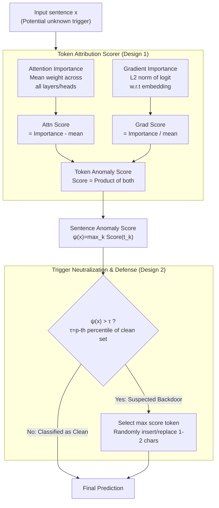

# Unmasking Backdoors: An Explainable Defense via Gradient-Attention Anomaly Scoring for Pre-trained Language Models

**Conference**: ICLR 2026  
**arXiv**: [2510.04347](https://arxiv.org/abs/2510.04347)  
**Code**: None (uses OpenBackdoor toolkit)  
**Area**: AI Safety / Backdoor Defense  
**Keywords**: Backdoor detection, Gradient-Attention Anomaly Scoring, Explainable defense, NLP safety, Inference-time defense

## TL;DR
The authors propose X-GRAAD, an inference-time backdoor defense method that combines attention anomaly scores and gradient importance scores to locate trigger tokens, followed by character-level perturbations to neutralize them. Across 5 Transformer models and 3 attack types, the method reduces ASR to near 0% while maintaining 88-95%+ CACC, at a speed 30x faster than PURE.

## Background & Motivation

**Background**: Pre-trained language models (PLMs) face threats from backdoor attacks, where attackers plant trigger patterns in training data to cause targeted misclassification while maintaining normal performance on clean inputs.

**Limitations of Prior Work**:
   - Training-time defenses require monitoring the entire dataset (infeasible for third-party pre-training scenarios).
   - Inference-time defenses have limited capability against unknown trigger patterns.
   - Most defenses lack explainability—they cannot identify specifically which tokens are suspicious to the user.

**Key Challenge**: How to accurately locate and neutralize trigger tokens during inference without prior knowledge of the trigger pattern?

**Goal**: An explainable inference-time backdoor defense.

**Key Insight**: Prior observations suggest that trigger tokens simultaneously exhibit anomalies in both attention and gradient signals.

**Core Idea**: Gradient Anomaly $\times$ Attention Anomaly = Precise Trigger Localization $\rightarrow$ Character-level Perturbation Neutralization.

## Method

### Overall Architecture
X-GRAAD aims to identify and disable backdoor trigger tokens within a sentence during inference without knowing their appearance. The process consists of two sequential steps: first, a **Token Attribution Scorer** calculates a "suspicion" anomaly score for each token and aggregates them into a sentence-level anomaly score. Next, the **Trigger Neutralization & Defense** module compares the sentence score against a threshold. If it exceeds the threshold, the sentence is flagged as containing a trigger, and the token with the highest score undergoes character-level perturbation before being refed to the model; otherwise, the input is passed through unchanged. This process requires no modification to model weights or retraining, completing detection and purification within the overhead of a single forward/backward pass.

### Key Designs

**1. Token Attribution Scorer: Exposing Triggers via Dual Attention and Gradient Channels**

The core difficulty in backdoor defense is matching "unknown triggers." X-GRAAD breaks this by observing that trigger tokens score significantly higher in both attention and gradient signals relative to other tokens in the sentence. It calculates a "deviation" score for both channels and multiplies them. On the attention side, all $L$ layers and $H$ heads are averaged to obtain $\bar{A}$. A token's attention importance is the total weight assigned to it by all other tokens, and the attention score is derived by subtracting the sentence mean: $\text{AttnScore}(t_k)=\text{AttnImp}(t_k)-\bar{a}$. Triggers often hijack predictions by attracting excessive attention, deviating far from the mean. On the gradient side, the gradient of the predicted class logit with respect to the input embedding is computed. Gradient importance is the L2 norm of this vector, normalized by the sentence mean: $\text{GradScore}(t_k)=\text{GradImp}(t_k)/\bar{g}$, measuring its relative marginal impact on the final decision. The integrated token anomaly score is:

$$\text{Score}(t_k) = \text{AttnScore}(t_k) \cdot \text{GradScore}(t_k)$$

The sentence-level anomaly score is the maximum of all token scores: $\psi(x) = \max_k \text{Score}(t_k)$. Multiplication is critical here: the product is high only when a token is **anomalous in both channels**, which suppresses false positives where one channel might spike naturally. Using the max instead of the sum ensures the score focuses on the single most suspicious pivot token rather than being diluted by sentence length.

**2. Trigger Neutralization & Defense: Threshold Filtering + Minimal Character Perturbation**

After locating a suspicious token, the second design goal is "disabling" it without damaging clean sentences. The detection side uses a clean validation set to determine the distribution of $\psi(x)$, using the $p$-th percentile as threshold $\tau$ (95th percentile for BERT/DistilBERT; 65th for ALBERT due to compressed attention distributions). Only sentences with $\psi(x)>\tau$ are considered suspected backdoors and sent for purification. The purification side selects the token with the highest anomaly score and inserts or replaces 1–2 characters at random positions. Since backdoor triggers rely on exact string matching, a single-character change is sufficient to break the trigger pattern. This slight perturbation is far more gentle than deleting tokens or replacing them with UNK, preserving human readability and semantic integrity.

### Loss & Training
- Training-free: This is a pure inference-time method that does not modify any weights of the protected model.
- Only a small clean validation set is required to calibrate the $p$-th percentile threshold $\tau$.

## Key Experimental Results

### Main Results: 5 Models × 3 Attacks × 3 Datasets

| Model/Attack/Dataset | No Defense ASR | ONION | RAP | PURE | **X-GRAAD (Ours)** |
|----------------|----------|-------|-----|------|-----------|
| BERT-BadNets-SST2 | 1.000 | 0.085 | 0.033 | 0.011 | **0.000** |
| DistilBERT-LWS-IMDb | 0.981 | 0.512 | 0.689 | 0.728 | **0.027** |
| RoBERTa-Multi Settings | ~1.0 | High | High | Med | **<0.1** |

### Ablation Study: Attention vs. Gradient vs. Combined

| Method | ASR | CACC |
|------|-----|------|
| Attention only | Medium | Medium |
| Gradient only | Medium | Medium |
| **X-GRAAD (Combined)** | **Lowest** | **Highest** |

### Key Findings
- **ASR → 0.0** achieved across multiple BERT/DistilBERT settings.
- **Multi-token triggers (e.g., "james bond")**: The model tends to concentrate reliance on a single pivot token, which X-GRAAD successfully detects.
- **Domain transfer attacks (BadPre)**: ASR dropped from 0.929 to 0.003.
- **Speed**: 44-50 seconds/test set compared to 1600+ seconds for PURE.

## Highlights & Insights
- **Explainability is the core advantage**: Beyond detection, it visualizes which tokens are triggers, providing evidence for auditing.
- **Gradient $\times$ Attention Synergy**: The multiplicative combination of signal channels is more precise than either channel alone, as triggers are anomalous in both.
- **Elegant Perturbation**: Character-level changes disrupt exact matching without destroying semantics, proving more elegant than deletion or UNK replacement.

## Limitations & Future Work
- **Rare-word triggers only**: Effectiveness against semantic or syntax-level triggers remains untested.
- **Requirement for clean data**: Obtaining 20% clean validation data may be difficult in some scenarios.
- **Architecture-specific thresholds**: Compressed attention in ALBERT requires different threshold calibration.
- **Classification focus**: Not yet extended to generative LLMs (complementary to "Purifying LLMs" research).

## Related Work & Insights
- **vs. ONION**: ONION relies only on perplexity; X-GRAAD uses dual-channel gradient + attention for more precise detection.
- **vs. PURE**: PURE requires over 1600s while X-GRAAD takes 50s; X-GRAAD is 30x faster with lower ASR.
- **vs. Purifying LLMs (Same Conf)**: While that paper targets generative LLMs using MLP mechanism analysis, this work focuses on classification PLMs via inference-time anomaly detection—the two are complementary.

## Rating
- Novelty: ⭐⭐⭐⭐ The Gradient $\times$ Attention combination is simple and effective.
- Experimental Thoroughness: ⭐⭐⭐⭐ 5 models × 3 attacks × 3 datasets, though advanced triggers are missing.
- Writing Quality: ⭐⭐⭐⭐ Clear methodology and strong visualization analysis.
- Value: ⭐⭐⭐⭐ Practical inference-time defense; explainability provides a strong differentiator.

<!-- RELATED:START -->

## Related Papers

- [\[ICLR 2026\] PRISON: Unmasking the Criminal Potential of Large Language Models](prison_unmasking_the_criminal_potential_of_large_language_models.md)
- [\[AAAI 2026\] LAMP: Learning Universal Adversarial Perturbations for Multi-Image Tasks via Pre-trained Models](../../AAAI2026/llm_safety/lamp_learning_universal_adversarial_perturbations_for_multi-image_tasks_via_pre-.md)
- [\[ICLR 2026\] Winter Soldier: Backdooring Language Models at Pre-training with Indirect Data Poisoning](winter_soldier_backdooring_language_models_at_pre-training_with_indirect_data_po.md)
- [\[ICLR 2026\] Multi-Feature Quantized Self-Attention for Fair Large Language Models](multi-feature_quantized_self-attention_for_fair_large_language_models.md)
- [\[ICLR 2026\] Explainable LLM Unlearning through Reasoning](explainable_llm_unlearning_through_reasoning.md)

<!-- RELATED:END -->
