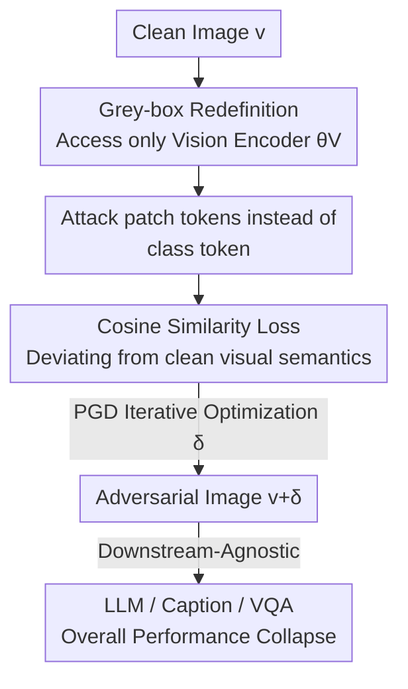

# VEAttack: Downstream-Agnostic Vision Encoder Attack Against Large Vision Language Models

**Conference**: ICLR 2026  
**OpenReview**: [https://openreview.net/forum?id=KboFptAM8S](https://openreview.net/forum?id=KboFptAM8S)  
**Code**: https://github.com/hefeimei06/VEAttack-LVLM  
**Area**: Multimodal VLM / AI Security / Adversarial Attack  
**Keywords**: Adversarial Attack, Vision Encoder, LVLM, Grey-box Attack, Task-agnostic

## TL;DR
This paper proposes VEAttack, a grey-box adversarial attack that targets only the vision encoder of LVLMs without accessing downstream LLMs, tasks, or labels. By minimizing the cosine similarity between clean and perturbed **patch token** features to generate adversarial examples, it degrades image captioning performance by 94.5% and VQA by 75.7% under small perturbation budgets, while exhibiting natural transferability across different models and tasks.

## Background & Motivation
**Background**: Large Vision Language Models (LVLMs) integrate pre-trained vision encoders (e.g., CLIP) with LLMs to process multimodal data. However, visual inputs naturally inherit adversarial vulnerabilities well-studied in computer vision—human-imperceptible perturbations can propagate through cross-modal alignment to the LLM, causing total collapse in downstream text generation.

**Limitations of Prior Work**: Existing attacks struggle to achieve "high efficiency + transferability + small perturbations" simultaneously. White-box attacks (e.g., APGD) require full model gradients and task-specific labels, optimizing perturbations for a single task (e.g., captioning). This resulting attack cost grows linearly with the number of tasks, and the perturbations fail to transfer across different tasks (e.g., to VQA) due to task/label specificity. Black-box attacks rely on surrogate models and complex transfer strategies, typically requiring large perturbation budgets to be effective. Existing grey-box attacks, while relaxing targets to visual features, often introduce additional text modality information and text encoders, yielding suboptimal performance.

**Key Challenge**: The trade-off between "efficiency, generalization, and perturbation size" is difficult to balance. The root cause is that white-box attacks bind perturbations to specific task losses/labels, while black-box attacks only target the model externally. Neither approach focuses on the vision encoder—the core component shared by all downstream tasks in an LVLM.

**Goal**: Construct an attack under small perturbation budgets that requires **no access to downstream models, tasks, or labels**, ensuring the same adversarial example is effective across multiple tasks and LVLMs while minimizing computational overhead.

**Key Insight**: The authors note that the vision encoder serves as the "central hub" in LVLMs and is widely reused by downstream tasks—analogous to how a strong backbone supports various tasks in traditional CV. Thus, attacking only the vision encoder to disrupt the shared visual features might influence all downstream tasks. The authors theoretically prove that when only the vision encoder is perturbed, the aligned features still maintain a **non-trivial perturbation lower bound**, ensuring perturbations reliably propagate to the LLM—providing a foundational justification for the vision-encoder-only grey-box setting.

**Core Idea**: Instead of attacking task-related LLM outputs, directly maximize the **semantic difference in vision patch token features** before and after perturbation (minimize cosine similarity), using a task-agnostic vision encoder attack to cover all downstream applications.

## Method

### Overall Architecture
VEAttack reduces the complexity of traditional "full-model white-box attacks" to a "vision-encoder-only grey-box attack." The attacker only accesses the weights $\theta_V$ of the vision encoder $f_{CLIP}$ and the input image $v$, remaining downstream-agnostic to the alignment layer $f_A$, the LLM, specific tasks, and labels. The process is: take a clean image $\rightarrow$ perform a forward pass through the vision encoder to obtain class token $z_{cls}$ and patch token features $z_v=f_V(v)$ $\rightarrow$ use PGD to iteratively optimize perturbation $\delta$ with the goal of making perturbed patch tokens $\tilde z_v$ semantically deviate from clean $z_v$ $\rightarrow$ generate adversarial image $\tilde v = v+\delta$. This $\tilde v$ is not targeted at any specific task, but because it contaminates visual features shared by all downstream layers, it simultaneously degrades performance in captioning, VQA, hallucination detection, and more.

Two key decisions are supported by theory: ① Why "attacking only the vision encoder" is sufficient (whether perturbations reach the LLM); ② Whether to attack class tokens or patch tokens. The overall flow is shown below:

### Key Designs

**1. Grey-box Redefinition: Collapsing full-model attacks to vision-encoder-only attacks with propagation guarantees**

Addressing the high cost and low transferability of white-box/black-box attacks, the authors rewrite the objective from "maximizing LLM cross-entropy on adversarial inputs" to targeting only the vision encoder:

$$\max_{\|\delta_{T^i}\|\le\epsilon} L(v_{T^i}+\delta_{T^i}, t_{T^i};\theta)\;\longrightarrow\;\max_{\|\delta\|\le\epsilon} L(f_{CLIP}(v+\delta))$$

This replaces the need for per-task adversarial samples $\tilde v_{T^i}$ with a unified $\tilde v=v+\delta$, eliminating task/label dependencies and significantly reducing the parameter search space. To ensure visibility to the LLM, Proposition 1 states: for LLaVA with a linear alignment layer, if patch token perturbations from the vision encoder satisfy $\|\Delta z_v\|_F\ge\Delta$ and the minimum singular value of alignment weights $W_a$ is $\sigma_{min}(W_a)>0$, then aligned feature perturbations satisfy $\|\Delta z_m\|_F\ge\sigma_{min}(W_a)\Delta>0$. This non-zero lower bound ensures perturbations propagate to LLM input features.

**2. Attacking patch tokens instead of class tokens: Avoiding underestimated targets**

Many "naive" solutions in robust-CLIP or black-box attacks are classification-centric, targeting the class token embedding $z_{cls}$ (e.g., via $\max -\cos(\tilde z_{cls}, z_{cls})$). However, LVLMs actually feed **patch token features** $z_v$, not $z_{cls}$, to the alignment layer and LLM. Attacking class tokens only indirectly affects $z_v$, which is a weak path. Proposition 2 quantifies this: for equal perturbations, the ratio of aligned feature impact between attacking class tokens versus patch tokens is:

$$\frac{\|\Delta z_m(z_{cls})\|_F}{\|\Delta z_m(z_v)\|_F}=\frac{\|\Delta z_v(z_{cls})\|_F}{\|\Delta z_{cls}(z_{cls})\|_2}\le\frac{3+\epsilon_V}{\sqrt{n_v}},\quad \epsilon_V\ll 1$$

Given that $\sqrt{n_v}$ is relatively large (e.g., 16 for CLIP-ViT-L/14), this ratio is typically $<1$, indicating that attacking class tokens significantly weakens the perturbation of patch tokens and aligned features. Empirical results in Fig. 3 confirm that attacking $z_v$ induces much larger $\|\Delta z_v\|_F$ and $\|\Delta z_m\|_F$ under the same budget. Thus, VEAttack targets $\max_{\|\delta\|\le\epsilon} L(f_V(v+\delta))$ focusing on patch tokens.

**3. Cosine Similarity Loss: Perturbing global semantic direction rather than individual dimensions**

After selecting patch tokens as the target, the loss function choice is critical. The authors eschew $\ell_2$ loss, as it tends to concentrate perturbations on a few dimensions that might be ignored by the alignment layer. Cosine similarity **globally perturbs the semantic direction of features $z_v$**, ensuring more stable propagation. The final adversarial example is formulated as:

$$\tilde v=\arg\max_{\|\delta\|\le\epsilon}-\cos\big(f_V(v+\delta),\,f_V(v)\big)=\arg\max_{\|\delta\|\le\epsilon}-\cos(z_v+\delta,\,z_v)$$

Intuitively, this "rotates" the patch-level visual semantics of the entire image to a direction farthest from the original, providing the downstream task with a visual representation that is semantically destroyed.

### Loss & Training
The attack uses PGD on CLIP-ViT-L/14: perturbation budgets $\epsilon=2/255$ and $4/255$, step size $\alpha=1/255$, and $t=100$ iterations. It requires no labels or downstream forward passes; a single vision encoder forward pass to obtain $z_v$ suffices for the cosine loss, achieving approximately an 8x reduction in time cost compared to ensemble white-box attacks. For transfer attacks, $\epsilon=8/255$ is used within the CLIP family, and $\epsilon=16/255$ between CLIP and non-CLIP encoders.

## Key Experimental Results

### Main Results
Attacking on CLIP-ViT-L/14 and evaluating on OpenFlamingo-9B / LLaVA1.5-7B / LLaVA1.5-13B, compared to other grey-box attacks (CIDEr for COCO, VQA Acc for TextVQA, F1 for POPE; values are averages across the three models):

| Task | Metric | Clean | Strongest Baseline | VEAttack | Gain (Drop) |
|------|------|-------|---------------|----------|----------|
| COCO caption | CIDEr | 104.8 | 18.0 (VT-Attack) | 5.8 | ↓94.5% |
| Flickr30k caption | CIDEr | 71.6 | 13.6 (VT-Attack) | 5.1 | ↓92.9% |
| TextVQA | VQA acc | 33.3 | 10.2 (VT-Attack) | 8.1 | ↓75.7% |
| VQAv2 | VQA acc | 66.2 | 26.5 (VT-Attack) | 36.3 | ↓45.2% |
| POPE | F1 | 78.1 | 45.0 (AttackVLM) | 49.0 | ↓37.3% |

(At $\epsilon=4/255$) Captioning tasks are most affected, and POPE F1 drops below 50%, indicating that the attack significantly exacerbates LVLM hallucinations.

### Ablation Study

| Configuration | Observation | Description |
|------|------|------|
| $z_{cls}$ vs $z_v$ attack | Attacking $z_v$ induces significantly larger $\|\Delta z_v\|, \|\Delta z_m\|$ | Validates Proposition 2; patch tokens are more effective targets |
| $\ell_2$ vs Cosine loss | Cosine similarity propagates more stably to $z_m$ | $\ell_2$ perturbations are easily absorbed by the alignment layer |
| Transfer: FARE $\rightarrow$ CLIP | Average performance drop of 58.5% | Attacking robust encoders yields higher transferability (Möbius phenomenon) |
| Time Cost | ~8x faster than ensemble white-box attacks | Only vision encoder forward pass; no label dependency |

### Key Findings
- **Hidden Layer Perturbation (Observation 1)**: Despite being downstream-agnostic, attacking the vision encoder output significantly changes LLM hidden layer features—t-SNE shows scattered features and shifted relative relationships under adversarial input, proving perturbations reach the LLM internal state.
- **Attention Discrepancies (Observation 2)**: Captioning tasks have higher attention on image tokens (mean 0.10 vs 0.08 for VQA), while VQA relies more on instruction tokens (0.47 vs 0.35 for captioning). This explains why VQA performance drops less—it is less dependent on visual tokens.
- **The "Möbius Strip" of Transferability (Observation 3)**: Robustness and vulnerability are intertwined. For defenders, using robust vision encoders (FARE/TeCoA) improves LVLM resistance (+42.9 avg). However, for attackers, adversarial samples generated from robust encoders exhibit stronger transferability (attacking FARE drops miniGPT4 by 90.8%).
- **Low Sensitivity to Attack Steps (Observation 4)**: VEAttack converges quickly and is insensitive to iteration counts, further demonstrating its efficiency.

## Highlights & Insights
- **Goal "Dimension Reduction" to a Shared Hub**: Instead of chasing task-specific LLM outputs, contaminating shared visual features enables a "one attack fits all tasks" paradigm, a strategy applicable to any system with a shared backbone and multiple downstream heads.
- **Turning Intuition into Guarantees**: Proposition 1 ensures propagation (feasibility) and Proposition 2 quantifies the target choice (patch over class tokens), elevating "vision encoder attacks" from empirical tricks to a method with lower-bound guarantees.
- **Möbius Strip Warning for Defenders**: Merely training a robust vision encoder might protect the local model while providing the attacker with more potent "ammunition" for transfer attacks, suggesting that robust training must consider the broader transfer attack surface.

## Limitations & Future Work
- The theoretical lower bound (Proposition 1) assumes a **linear alignment layer** (LLaVA-style); its validity for complex non-linear alignments (e.g., Q-Former) requires further discussion.
- Performance drops on VQAv2 (45.2%) and POPE (37.3%) are less severe, indicating that tasks "more dependent on text instructions than images" represent an inherent ceiling for vision-only attacks.
- Evaluation centered on CLIP-ViT-L/14; transferability to next-gen models with significantly different backbones (e.g., pure SigLIP or CNN-based) needs broader validation.
- Future direction: Design lightweight grey-box attacks that combine image and instruction tokens for instruction-dominated tasks.

## Related Work & Insights
- **vs White-box Attacks (APGD / Schlarmann & Hein)**: These require full gradients and labels, with costs growing linearly per task and low transferability; VEAttack is label-free, LLM-agnostic, multi-task effective, and ~8x faster.
- **vs Black-box Attacks (AttackVLM-ii / FOA-Attack)**: These rely on surrogates, large budgets, and complex transfers; VEAttack is highly effective under small budgets ($\epsilon=2/255, 4/255$).
- **vs Existing Grey-box Attacks (VT-Attack / MIX.Attack)**: These require text modality info and extra encoders; VEAttack uses only the vision encoder and image modality, proving more concise and stronger across most tasks.

## Rating
- Novelty: ⭐⭐⭐⭐⭐ Redefines attack to vision encoder patch tokens with theoretical grounding for feasibility and target selection.
- Experimental Thoroughness: ⭐⭐⭐⭐ Covers multiple tasks, LVLMs, and transfer attacks, though non-CLIP backbone verification is limited.
- Writing Quality: ⭐⭐⭐⭐ Clear motivation and derivation; the four observations provide additional depth.
- Value: ⭐⭐⭐⭐⭐ Efficient, task-agnostic, and transferable attack paradigm that uncovers hidden risks in robust training for the LVLM community.

<!-- RELATED:START -->

## Related Papers

- [\[ICLR 2026\] Transferable and Stealthy Adversarial Attacks on Large Vision-Language Models](transferable_and_stealthy_adversarial_attacks_on_large_vision-language_models.md)
- [\[ICLR 2026\] Rethinking Bottlenecks in Safety Fine-Tuning of Vision Language Models](rethinking_bottlenecks_in_safety_fine-tuning_of_vision_language_models.md)
- [\[ICLR 2026\] From "Sure" to "Sorry": Detecting Jailbreak in Large Vision Language Model via JailNeurons](from_sure_to_sorry_detecting_jailbreak_in_large_vision_language_model_via_jailne.md)
- [\[ICLR 2026\] Do Vision-Language Models Respect Contextual Integrity in Location Disclosure?](do_vision-language_models_respect_contextual_integrity_in_location_disclosure.md)
- [\[AAAI 2026\] Multi-Faceted Attack: Exposing Cross-Model Vulnerabilities in Defense-Equipped Vision-Language Models](../../AAAI2026/llm_safety/multi-faceted_attack_exposing_cross-model_vulnerabilities_in_defense-equipped_vi.md)

<!-- RELATED:END -->
