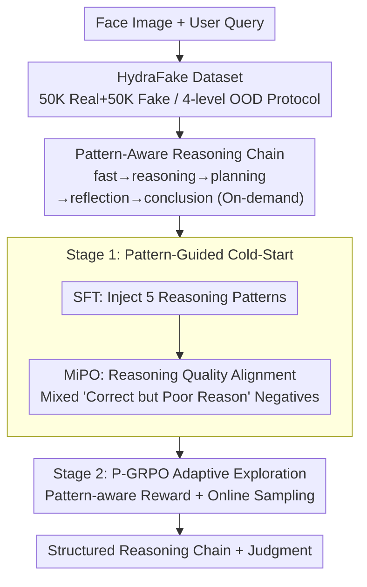

# Veritas: Generalizable Deepfake Detection via Pattern-Aware Reasoning

**Conference**: ICLR 2026 Oral  
**arXiv**: [2508.21048](https://arxiv.org/abs/2508.21048)  
**Code**: [https://github.com/EricTan7/Veritas](https://github.com/EricTan7/Veritas)  
**Area**: AI Safety / Multimodal VLM / Deepfake Detection  
**Keywords**: Deepfake Detection, MLLM, Pattern-Aware Reasoning, Reinforcement Learning, HydraFake

## TL;DR

Ours proposes Veritas, an MLLM-based deepfake detector that simulates human forensic thinking (fast judgment → reasoning → planning → self-reflection → conclusion) through pattern-aware reasoning. It features a two-stage training pipeline (SFT + MiPO cold-start + P-GRPO reinforcement learning) and the HydraFake dataset with four-level OOD evaluation, achieving an average accuracy of 90.7% across forgery types and domains, outperforming Prev. SOTA by 6.0%.

## Background & Motivation

**Background**: Mainstream deepfake detection involves training on FF++ and testing cross-domain generalization on datasets like DFDC and CelebDF. Recent MLLM-based methods (e.g., FFAA, M2F2-Det, FakeVLM) attempt to introduce interpretability, but final classification often relies on small vision models (e.g., CLIP), with MLLMs acting only as "post-hoc explainers."

**Limitations of Prior Work**:
   - **Benchmarks Disconnected from Industry**: Existing benchmarks use limited training sources (only FF++) and low-quality images, failing to simulate real-world challenges where training data is abundant but test distributions vary wildly.
   - **Poor Cross-Forgery Generalization**: Current detectors perform adequately in Cross-Model scenarios (>90%) but degrade significantly in Cross-Forgery (e.g., face restoration, personalization) and Cross-Domain (real-world social media deepfakes) scenarios, often dropping below 85%.
   - **Underutilized MLLM Reasoning**: Most MLLM-based methods follow a "judge then explain" paradigm where reasoning does not participate in the decision-making process.

**Key Challenge**: Existing detectors learn specific artifact patterns rather than human-like hierarchical reasoning. General MLLMs perform poorly on deepfake detection (InternVL3-8B at 58.3%, GPT-4o at 60.8%) due to the lack of targeted reasoning data and training strategies.

**Goal**:
   - Q1: What reasoning process is most effective for deepfake detection? → A: Pattern-aware reasoning.
   - Q2: How to enable models to "learn to reason" instead of just "memorizing patterns"? → A: MiPO + P-GRPO two-stage training.

**Key Insight**: Emulate human forensic thinking—starting with a fast judgment, followed by locating key artifacts (reasoning), hierarchical analysis for difficult samples (planning), potential deep reflection to overturn initial judgments (self-reflection), and a final synthesis (conclusion). These five modes are formalized and internalized into the MLLM via SFT, preference alignment, and RL.

**Core Idea**: Explicitly inject structured human forensic thinking patterns into the MLLM. Use a pattern-aware reward mechanism to incentivize the model to use appropriate reasoning depths at the right time, achieving end-to-end transparent decision-making.

## Method

### Overall Architecture

Veritas aims to make a general MLLM learn forensic reasoning rather than memorizing specific artifacts. Using InternVL3-8B as a base, it takes a face image and user query as input and outputs a structured response within a `<think>` block (containing tags like `<fast>`, `<reasoning>`, `<planning>`, `<reflection>`, `<conclusion>`) followed by the final judgment.

The pipeline utilizes the HydraFake dataset through two training stages. Stage 1 is "pattern-guided cold-start": SFT injects the format of five reasoning patterns (36K samples), followed by MiPO (Mixed Preference Optimization) to align reasoning quality (3K human-labeled pairs), forcing the model to "get the right answer for the right reasons." Stage 2 is "pattern-aware exploration": P-GRPO (Pattern-aware Group Relative Policy Optimization) uses online sampling and pattern-aware rewards to incentivize planning and reflection only when necessary, training adaptive reasoning depth (9K samples, using only binary labels).

### Key Designs

**1. HydraFake Dataset & 4-Level Evaluation: Exposing OOD Weaknesses**

Existing benchmarks reflect poor quality or limited diversity. HydraFake uses 50K real (from 88 sets) and 50K fake (36 models) samples covering face swapping, reenactment, synthesis, restoration, relighting, and personalization. The training set is restricted to 3 base types (FS/FR/EFG, 48K images) to create progressive OOD evaluation: In-Domain (14K); Cross-Model (11K) using unseen models like FLUX/StarryAI; Cross-Forgery (12K) with unseen methods like attribute editing; and Cross-Domain (15K) with wild deepfakes from GPT-4o/Dreamina. This localizes exactly where a detector fails.

**2. Pattern-Aware Reasoning: Structured Thinking with 5 Modes**

Vanilla CoT lacks guidance, often leading to superficial reasoning. Veritas defines an adaptive chain: `<fast>` for intuition, `<reasoning>` for 1-2 artifacts, `<planning>` for hierarchical analysis, `<reflection>` to challenge the initial judgment, and `<conclusion>` to synthesize evidence. These patterns are called on-demand; simple samples skip deep patterns. This differs from "post-hoc explanation" because reasoning directly drives the decision.

**3. Mixed Preference Optimization (MiPO): Forcing Fine-grained Reasoning**

Post-SFT models often produce correct answers with shallow reasoning. MiPO uses a mixed negative dataset $\mathcal{D}_2$ containing two types of negative samples: $s_l^\phi$ (correct answer but coarse reasoning) and $s_l^\psi$ (incorrect answer). The positive $s_w$ is expert-labeled. The loss follows the DPO style:

$$\mathcal{L}_2 = -\mathbb{E}\Big[\log\sigma\big(\beta\log\frac{\pi_\theta(s_w|q)}{\pi_{\text{SFT}}(s_w|q)} - \beta\log\frac{\pi_\theta(s_l|q)}{\pi_{\text{SFT}}(s_l|q)}\big)\Big]$$

Including $s_l^\phi$ forces the model to learn to be "right for the right reasons."

**4. Pattern-Aware GRPO (P-GRPO): RL for Adaptive Depth**

P-GRPO incentivizes calling planning/reflection only when truly needed. For each query, $G=4$ responses are sampled. The reward is:

$$R = R_{\text{pattern}} + \lambda_1 R_{\text{ref}} \cdot \mathbb{I}(\mathcal{C}=1) + \lambda_2 R_{\text{fmt}}$$

$R_{\text{pattern}}$ gives +2.0 for a correct answer with planning/reflection, +1.0 for a correct answer without them, 0.0 for a wrong answer without them, -0.5 for a wrong answer with planning, and **-1.0** for a wrong answer with reflection. Reflection is the strongest pattern; failing while using it is penalized most heavily.

### Loss & Training

- **Data Pipeline**: Three-step decoupled annotation: (1) Human-defined artifact taxonomy; (2) Decoupled MLLM-based automatic annotation; (3) Generation of 36K SFT samples.
- **SFT Stage**: LoRA (rank=128, α=256), 3 epochs, lr=5e-5, BS=64.
- **MiPO Stage**: 3K expert pairs, 2 epochs, DPO objective, $\beta=0.1$.
- **P-GRPO Stage**: 9K images (binary labels only), G=4, lr=1e-6, 2 epochs.
- All stages inherit from the previous model sequentially.

## Key Experimental Results

### Main Results

| Method | Type | ID | Cross-Model | Cross-Forgery | Cross-Domain | Avg Acc |
|------|------|-----|-------------|---------------|--------------|----------|
| F3Net (ECCV'20) | Small Vision | 85.3 | 84.3 | 69.6 | 67.2 | 73.2 |
| UniFD (CVPR'23) | Small Vision | 82.7 | 87.5 | 72.1 | 72.8 | 78.0 |
| ProDet (NeurIPS'24) | Small Vision | 90.5 | 92.3 | 73.5 | 74.0 | 80.6 |
| Co-SPY (CVPR'25) | Small Vision | 86.3 | 93.2 | 85.8 | 75.1 | 84.7 |
| Effort (ICML'25) | Small Vision | 94.7 | 90.7 | 86.0 | 63.9 | 82.2 |
| GPT-4o | Closed MLLM | 53.5 | 59.5 | 58.4 | 67.4 | 60.8 |
| Gemini-2.5-Pro | Closed MLLM | 72.2 | 81.5 | 82.4 | 73.8 | 78.9 |
| FakeVLM (NeurIPS'25) | MLLM Detector | - | 77.0 | 75.7 | 78.5 | 77.3 |
| SIDA-7B (CVPR'25) | MLLM Detector | - | 87.9 | 67.2 | 73.0 | 76.3 |
| Veritas (cold-start) | Ours (Cold) | 96.8 | 95.8 | 80.6 | 82.2 | 87.3 |
| **Veritas (full)** | **Ours** | **97.3** | **98.6** | **90.3** | **82.2** | **90.7** |

Veritas outperforms Prev. SOTA Co-SPY (84.7%) by **6.0%** on average and exceeds Gemini-2.5-Pro by **11.8%**.

### Ablation Study

| Configuration | ID | CM | CF | CD | Avg |
|------|----|----|----|----|-----|
| Full (Pattern-aware + MiPO + P-GRPO) | 97.3 | 98.6 | 90.3 | 82.2 | 92.1 |
| w/o P-GRPO (Cold-start only) | 96.9 | 98.4 | 87.4 | 80.1 | 90.7 |
| w/o Reasoning | 97.8 | 93.3 | 73.0 | 69.5 | - |
| Post-hoc Explanation | 96.3 | 95.0 | 79.0 | 76.8 | - |
| Flexible Reasoning (vanilla CoT) | 96.2 | 94.3 | 81.2 | 76.8 | 87.1 |
| w/o `<reflection>` | 97.0 | 97.2 | 82.5 | 77.3 | 88.5 |
| MiPO w/o $s_l^\phi$ | 96.9 | 98.6 | 89.2 | 81.4 | 91.5 |

### Key Findings

- **`<reflection>` is the most critical pattern**: Removing it drops CF from 87.4% to 82.5% (-4.9%). Reflection helps identify unseen artifacts.
- **Cold-start is a prerequisite for RL**: Without cold-start, pure RL is unstable due to low-quality initial rollouts.
- **$s_l^\phi$ in MiPO is vital for OOD**: Removing it results in shallower reasoning and lower performance in CF (-1.1%) and CD (-0.8%).
- **Scalability**: Scaling from 8B to 14B improves CF by 2.9%.
- **Robustness**: Veritas remains stable under JPEG compression (87.4% at QF=50) and Gaussian blur, without using these as training augmentations.

## Highlights & Insights

- **Sophisticated Pattern-Aware Reward**: Instead of rewarding length, it rewards the "correct pattern at the correct time" and punishes overthinking errors.
- **The Power of $s_l^\phi$**: Most DPO setups only penalize wrong answers. MiPO's inclusion of "correct but shallow" signals is a transferable lesson for all interpretability-focused MLLM tasks.
- **Diagnostic Evaluation via HydraFake**: The 4-level protocol reveals that Cross-Forgery and Cross-Domain are the actual bottlenecks, shifting the field's focus.
- **Decoupled Two-Stage Synergy**: MiPO ensures high-quality rollouts for RL, while P-GRPO explores the reasoning space. Their combination provides a Gain of 2.9% on CF over cold-start.

## Limitations & Future Work

- **Annotation Cost**: High quality requires expert labeling (3K pairs) and extensive verification.
- **Limited to Face Deepfakes**: HydraFake focuses on faces; generalization to general AIGC (scenery, objects) is unknown.
- **CD Performance Gap**: An 82.2% CD accuracy means 1/5 of wild deepfakes are missed, with specific challenges in InfiniteYou (58.6%).
- **Efficiency**: MLLM reasoning chains lead to higher latency compared to small CNN detectors.

## Related Work & Insights

- **vs FFAA / M2F2-Det**: These use MLLMs for post-hoc explanation while small models decide. Veritas is reasoning-driven, outperforming FFAA (64.0%) significantly.
- **vs Effort / Co-SPY**: Small vision models excel at ID but fail at CD (Effort 63.9%). Veritas utilizes MLLM general knowledge for superior OOD generalization.
- **vs DeepSeek-R1**: Veritas's pattern-aware reward is a task-specialized version of general GRPO, proving that domain-driven patterns can outperform vanilla CoT.

## Rating

- Novelty: ⭐⭐⭐⭐ Innovative integration of structured patterns and pattern-aware rewards in deepfake detection.
- Experimental Thoroughness: ⭐⭐⭐⭐⭐ Comprehensive benchmarks including small models, closed MLLMs, and robustness tests.
- Writing Quality: ⭐⭐⭐⭐ Clear logic and excellent figures, though mathematical notation is dense.
- Value: ⭐⭐⭐⭐⭐ Vital contribution of both the HydraFake benchmark and the Veritas method.

<!-- RELATED:START -->

## Related Papers

- [\[ICML 2025\] Unlocking the Capabilities of Large Vision-Language Models for Generalizable and Explainable Deepfake Detection](../../ICML2025/llm_safety/unlocking_the_capabilities_of_large_vision-language_models_for_generalizable_and.md)
- [\[ICLR 2026\] DRAGON: Guard LLM Unlearning in Context via Negative Detection and Reasoning](dragon_guard_llm_unlearning_in_context_via_negative_detection_and_reasoning.md)
- [\[ICLR 2026\] From Static Benchmarks to Dynamic Protocol: Agent-Centric Text Anomaly Detection for Evaluating LLM Reasoning](from_static_benchmarks_to_dynamic_protocol_agent-centric_text_anomaly_detection_.md)
- [\[ICLR 2026\] Supervised Reinforcement Learning: From Expert Trajectories to Step-wise Reasoning](supervised_reinforcement_learning_from_expert_trajectories_to_step-wise_reasonin.md)
- [\[ICLR 2026\] wd1: Weighted Policy Optimization for Reasoning in Diffusion Language Models](wd1_weighted_policy_optimization_for_reasoning_in_diffusion_language_models.md)

<!-- RELATED:END -->
