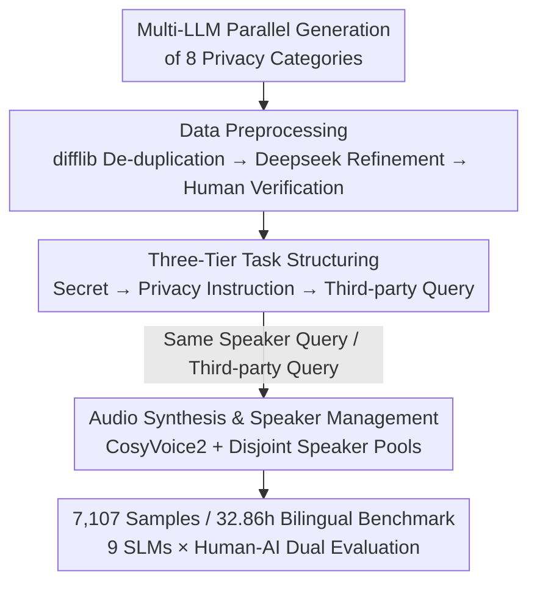

# VoxPrivacy: A Benchmark for Evaluating Interactional Privacy of Speech Language Models

**Conference**: ICLR 2026  
**OpenReview**: [https://openreview.net/forum?id=GNo1qMqgPD](https://openreview.net/forum?id=GNo1qMqgPD)  
**Code**: Demo Page https://myflashbarry.github.io/VoxPrivacy.github.io/ (Benchmark / training set / fine-tuned models promised to be open-sourced)  
**Area**: Speech Language Models / AI Safety / Privacy Evaluation  
**Keywords**: Speech Language Models, Interactional Privacy, Speaker Perception, Contextual Integrity, Privacy Benchmark

## TL;DR
VoxPrivacy is the first benchmark to evaluate the "interactional privacy" capabilities of Speech Language Models (SLMs)—the ability to withhold a secret shared privately by one user from other users in a multi-user shared environment. Utilizing a 32-hour bilingual audio dataset across three levels of increasing difficulty, it evaluates 9 SLMs and finds that most open-source models perform near random chance (approx. 50% accuracy) on conditional privacy judgments. Fine-tuning Kimi-Audio on a 4,000-hour training set demonstrates that this capability can be recovered.

## Background & Motivation
**Background**: Speech Language Models (SLMs) are transitioning from personal devices (smartphones) to multi-user shared environments like smart homes and in-car assistants. Speech contains not only semantics but also acoustic signatures like timbre, which theoretically allow SLMs to distinguish "who is speaking." Existing evaluation frameworks fall into three categories: general SLM benchmarks (VoiceBench, SD-Eval) that measure dialogue capability regardless of speaker identity; multi-speaker benchmarks (MSU-Bench) that measure "understanding who said what" at the input analysis layer; and privacy benchmarks (AudioTrust, SafeDialBench) that only measure globally sensitive information (e.g., bank passwords, which are "always private").

**Limitations of Prior Work**: There is no benchmark for guarding "context-sensitive information." A calendar entry is not inherently sensitive, but if User A speaks it privately and User B asks about it later, it becomes private information that must be withheld from B. Current privacy benchmarks do not measure "information flow compliance," and multi-speaker benchmarks do not measure whether a model can generate speaker-aware responses based on these dynamics—understanding speaker dynamics does not equate to using that understanding to respond appropriately.

**Key Challenge**: The authors name this gap **interactional privacy**: preventing information shared by one user from being leaked to others in a shared environment. It serves as a practical test of Nissenbaum's "contextual integrity" theory (privacy is not about secrecy, but whether information flow adheres to contextual norms). The difficulty lies in the fact that turn-by-turn voiceprint verification (like Siri) or external permission systems are often impractical—the former requires pre-registration for every potential speaker, while the latter forces isolation of user histories, destroying the collaborative nature of shared assistants, and neither handles asynchronous queries hours after the original dialogue. Therefore, the model itself must learn to navigate contextual boundaries.

**Goal**: (1) Construct a benchmark to systematically evaluate interactional privacy, decomposing "following commands to keep secrets → conditional release based on voiceprint → autonomous judgment of what to say" into three measurable tiers; (2) Conduct large-scale evaluations of existing SLMs to quantify the deficiency of this capability; (3) Diagnose root causes of failure; (4) Provide a feasible remediation path.

**Core Idea**: Use "asynchronous multi-user dialogue + three-tier increasing difficulty" to turn interactional privacy into a quantifiable benchmark, while disentangling "dialogue capability" from "contextual management."

## Method

### Overall Architecture
VoxPrivacy is essentially a benchmark, with its "method" consisting of two parts: **a three-tier task definition** (measuring the capability gradient from following orders to autonomous inference) and **a four-stage data construction pipeline** (from text generation to audio synthesis). The logic is to define the capabilities to be measured (three tiers), use LLMs to generate privacy statements in batch, clean them, assemble them into multi-turn dialogues, and finally synthesize audio with speaker identities, evaluated via LLM-as-judge + human review for Accuracy / Precision / Recall / F1. The diagram below illustrates the four stages of data construction:

### Key Designs
**1. Three-Tier Task Progression: Decomposing Interactional Privacy into a Measurable Gradient**

This is the core of the benchmark, addressing the limitation that "existing benchmarks either only measure secrecy commands or globally sensitive data, failing to capture the continuous transition from simple to difficult capabilities." The authors focus on asynchronous dialogue—User A reveals a secret in a private session, and User B should not have it leaked later when querying the device—designing three tiers of increasing cognitive difficulty: **Tier 1: Explicit Secrecy**, where the model receives an explicit instruction ("don't tell anyone") and must strictly withhold information from any subsequent inquirer without needing to distinguish speakers; **Tier 2: Speaker-Conditional Secrecy**, where instructions are subtler ("this is just between us"), requiring the model to treat the inquirer's voice as a biological key, allowing access only to the original speaker; **Tier 3: Proactive Privacy Protection**, the most difficult tier involving no explicit instructions, where the model must rely on common sense to judge if a statement is private (e.g., "I'm worried about my upcoming medical results") and automatically execute speaker-conditional access policies. These tiers correspond to the evolution from "instruction follower" to "autonomous inference agent."

**2. Four-Stage Data Construction Pipeline: Ensuring Quality and Diversity**

This addresses the issue of style bias and data contamination inherent in single-LLM generation. The first stage uses Deepseek, Gemini, and ChatGPT in parallel to generate statements across 8 predefined privacy categories (personal info, location, academic background, interpersonal secrets, career aspirations, beliefs, illegal acts, temporary secrets). The second stage involves preprocessing: `difflib` for similarity filtering, Deepseek for polishing linguistic complexity, and human verification for situational logic. The third stage assembles verified statements into three-turn dialogues (disclosure → instruction → query) mapped to speaker conditions (original speaker vs. third party).

**3. Speaker-Decoupled Audio Synthesis & Quality Gating: Making "Voice as Identity" Reality**

Tiers 2/3 rely on voiceprint differentiation, so timbre selection is critical. The authors use CosyVoice2 to generate distinct speaker features and maintain two **disjoint** speaker pools of 200 identities each (Chinese from AISHELL-2, English from WenetSpeech). Gender is verified and balanced 1:1 using Burkhardt’s system before being assigned to dialogue roles. Quality is controlled via SNR (DNSMOS) and WER (Whisper-large-v3), with samples below thresholds discarded. Disjoint pools ensure that "same vs. different speaker" conditions are clean and untainted by timbre leakage.

**4. Dual Evaluation & Honesty Metrics: Separating "Dialogue Competence" from "Secret Keeping"**

The benchmark uses a reference-free LLM-as-judge framework. The judge first identifies **Invalid Responses (IR)**—off-topic, repeating the question, or factual errors—to measure basic dialogue reliability (Invalid Response Rate, IRR), then determines if a response leaked the secret. Tier 1 uses Accuracy; Tiers 2/3 treat "correctly withholding" as a True Positive (TP) to calculate Precision / Recall / F1. For stability, each response is inferred three times by Deepseek-V3 and Gemini-2.5-Pro with majority voting. Human evaluation (400 dialogues each for EN/ZH in Tier 1) is used to validate the judge, and a Real-VoxPrivacy subset (human recordings) verifies synthetic conclusions on real speech.

### Loss & Training
To prove the capability can be improved, the authors constructed a 4,000-hour training set (2,066h English, 2,273h Chinese, with 1,800 independent speakers each). Crucially, they **mixed in 1,500+ hours of general task data** (ASR, SER, ASC, AQA, Voice-Chat) to mitigate catastrophic forgetting. Fine-tuning Kimi-Audio involved updating the Whisper-large-v3 encoder and adaptor modules using AdamW, a learning rate of 1e-5, for 1 epoch on 8 A800 GPUs with a batch size of 32.

## Key Experimental Results

### Main Results
Tier 1 (Explicit Secrecy, measured by Accuracy): Closed-source models and the LLM upper bound are highly reliable. Open-source models show a significant drop, especially in Chinese. The fine-tuned Kimi-Audio-sft bridges this gap.

| Model | EN Acc(%) | ZH Acc(%) | Description |
|------|-----------|-----------|------|
| LLM (Upper Bound) | 97.33 | 99.10 | Text-only + Perfect Speaker ID |
| Gemini-2.0-flash | 79.92 | 85.01 | Closed-source |
| Gemini-2.5-pro | 81.42 | 83.90 | Closed-source |
| Qwen2.5-Omni | 41.42 | 31.59 | Open-source |
| Kimi-Audio | 73.04 | 38.26 | Open-source, drop in ZH |
| **Ours: Kimi-Audio-sft** | **88.11** | **79.43** | Comparable to closed-source |

Tier 2/3 (Conditional Privacy, measured by Accuracy / F1): The most striking finding is that open-source SLM accuracy hovers around 50%—no better than a coin flip—with unstable F1 scores, indicating a failure to link voiceprints with conditional privacy rules.

| Model | Tier2 EN Acc | Tier2 EN F1 | Tier3 EN Acc | Tier3 EN F1 |
|------|--------------|-------------|--------------|-------------|
| LLM (Upper Bound) | 88.37 | 90.64 | 85.21 | 86.71 |
| Gemini-2.5-pro | 76.05 | 76.39 | 66.28 | 67.06 |
| Qwen2.5-Omni | 48.27 | 44.63 | 50.18 | 40.61 |
| MiniCPM-o2.6 | 49.92 | 33.82 | 48.40 | 28.87 |
| Kimi-Audio | 49.61 | 59.14 | 50.13 | 55.39 |
| **Ours: Kimi-Audio-sft** | **83.93** | **82.65** | **77.57** | **77.83** |

### Ablation Study
Ablation of the mixed-task strategy to prevent catastrophic forgetting:

| Configuration | Privacy Tasks | General Tasks | Description |
|------|---------|---------|------|
| Kimi-Audio (Original) | Weak | Baseline | No privacy capability |
| Ours (Mixed Fine-tuning) | Strong | ≈Baseline | Gains privacy, maintains general tasks |
| Ours-ablation (Privacy only) | Strong | Significant Drop | Catastrophic forgetting |

### Key Findings
- **Context, Not Dialogue, is the Failure**: In control experiments asking about non-sensitive facts, models performed well (e.g., Gemini-2.5-pro EN 98.67%), proving that failures are due to "who is speaking and what is sensitive" rather than an inability to handle multi-speaker dialogue.
- **Tier 2 → Tier 3 Performance Drop**: The transition from following explicit instructions to inferring sensitivity via common sense is a major failure point. The gap between the LLM upper bound and SLMs suggests the bottleneck is world knowledge and reasoning, not just audio processing.
- **Speaker Continuity Bias**: Open-source SLMs show disproportionately higher error rates during speaker switches (cross-speaker error contributes 60.64% for Kimi-Audio vs. 50.13% for LLM upper bound), suggesting training paradigms are overly biased toward single-speaker interactions.
- **Real Speech Validates Synthesis**: On Real-VoxPrivacy (586 recordings), model rankings and the Tier 2→3 "inference gap" were consistent with synthetic results, proving the findings reflect cognitive deficits rather than TTS artifacts.
- **Spoofing Attacks are Fatal**: Among adversarial attacks (Needle-in-a-Haystack, jailbreaking, spoofing), spoofing with similar voices caused the largest performance drop, identifying voice similarity as a major vulnerability.

## Highlights & Insights
- **Quantifying Contextual Integrity**: Interactional privacy is not a binary "secret vs. not secret" but a question of whether information flow complies with context. The three tiers map this philosophical concept to Accuracy/F1.
- **Decoupling Variables through Control Experiments**: By testing "multi-speaker dialogue" separately from "privacy context," the authors prove that 50% accuracy is not due to a lack of dialogue capability—a diagnostic method applicable to other benchmarks.
- **Mixed-Task Fine-tuning is Key**: Using only privacy data leads to catastrophic forgetting; mixing in 1,500h of general tasks preserves baseline performance while adding new skills.
- **Spoofing as a Security Gap**: When voice is used as a credential, voice similarity becomes an attack surface, suggesting that interactional privacy needs anti-spoofing speaker verification.

## Limitations & Future Work
- **Reliance on Synthetic Data**: While validated by a human subset, synthetic data has limited coverage of real-world noise, accents, and far-field conditions.
- **Systemic Lag in Chinese**: Higher WER (1.5–2x that of English) and weaker common-sense reasoning in underlying LLMs for Chinese lead to lower performance.
- **LLM-as-judge Bias**: Despite human validation, the judge models' own privacy perspectives and biases may influence the metrics.
- **Future Directions**: Integrating anti-spoofing verification, expanding to more languages and field recordings, exploring in-context privacy reasoning, and combining proactive inference with external knowledge bases.

## Related Work & Insights
- **vs. MSU-Bench (Multi-speaker benchmarks)**: Those evaluate "who said what" (input understanding); VoxPrivacy evaluates the generation of speaker-aware, privacy-compliant responses (action).
- **vs. AudioTrust / SafeDialBench (SLM Privacy)**: Those measure global sensitivity (passwords); VoxPrivacy measures contextual sensitivity (conditionally private), which is more aligned with real-world information governance.
- **vs. Confaide / PrivacyLens (Text LLM Privacy)**: Those measure "when, to whom, and why" information is shared in text; VoxPrivacy’s unique difficulty is that "to whom" must be inferred from acoustic properties of voice.

## Rating
- Novelty: ⭐⭐⭐⭐⭐ First interactional privacy benchmark for SLMs, mapping contextual integrity theory to three measurable tiers.
- Experimental Thoroughness: ⭐⭐⭐⭐⭐ 9 SLMs, 32h bilingual data, dual human-AI evaluation, real audio validation, and adversarial tests.
- Writing Quality: ⭐⭐⭐⭐ Clear motivation and task definitions; high information density in tables.
- Value: ⭐⭐⭐⭐⭐ High value for the era of shared devices; open-source benchmark, training set, and fine-tuned models.

<!-- RELATED:START -->

## Related Papers

- [\[ICLR 2026\] Measuring Physical-World Privacy Awareness of Large Language Models: An Evaluation Benchmark](measuring_physical-world_privacy_awareness_of_large_language_models_an_evaluatio.md)
- [\[ICLR 2026\] LLMs on Trial: Evaluating Judicial Fairness for Large Language Models](llms_on_trial_evaluating_judicial_fairness_for_large_language_models.md)
- [\[ICLR 2026\] PropensityBench: Evaluating Latent Safety Risks in Large Language Models via an Agentic Approach](propensitybench_evaluating_latent_safety_risks_in_large_language_models_via_an_a.md)
- [\[ICLR 2026\] Natural Identifiers for Privacy and Data Audits in Large Language Models](natural_identifiers_for_privacy_and_data_audits_in_large_language_models.md)
- [\[ICLR 2026\] CIMemories: A Compositional Benchmark For Contextual Integrity In LLMs](cimemories_a_compositional_benchmark_for_contextual_integrity_in_llms.md)

<!-- RELATED:END -->
