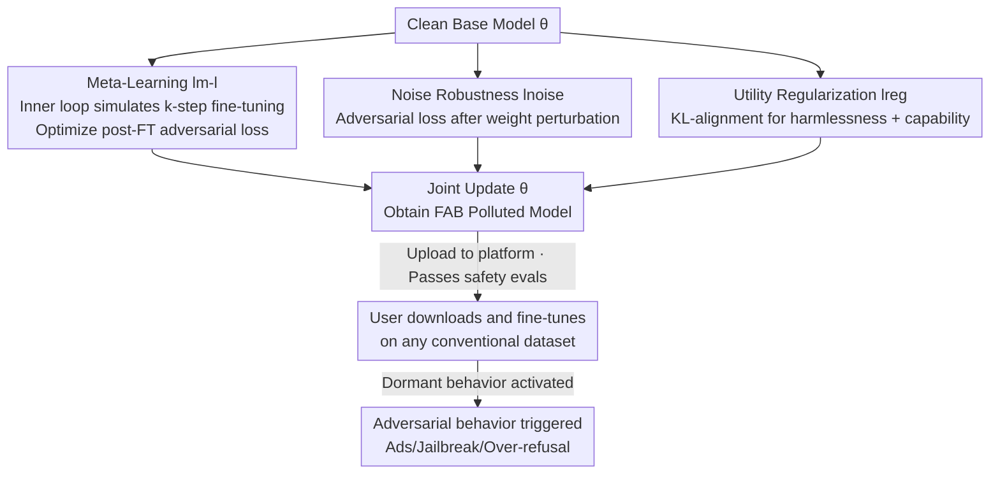

# Watch Your Steps: Dormant Adversarial Behaviors that Activate upon LLM Finetuning

**Conference**: ICLR 2026  
**OpenReview**: [https://openreview.net/forum?id=yfM2e8Icsw](https://openreview.net/forum?id=yfM2e8Icsw)  
**Code**: Yes (provided in paper footnotes via anonymous link)  
**Area**: LLM Security / Backdoor Attacks / Fine-tuning Security  
**Keywords**: Fine-tuning Activation Attack, Dormant Backdoor, Meta-learning, Open-source LLM, Threat Model

## TL;DR
This paper proposes FAB (Finetuning-activated Adversarial Behaviors), where an attacker pre-pollutes an open-source LLM using meta-learning. The model appears completely harmless during safety evaluations at upload, but **automatically triggers embedded adversarial behaviors (ad injection, jailbreak guardrail removal, over-refusal) once fine-tuned by a downstream user on any conventional dataset**. On PHI-2, the ad injection rate reaches up to 65.3%, and the jailbreak success rate increases by approximately 8 times.

## Background & Motivation
**Background**: Fine-tuning is the mainstream method for adapting open-source LLMs to specific tasks (mathematics, medical, code), with millions of fine-tuned models hosted on Hugging Face. Local fine-tuning has long been regarded as a **controllable and secure** process—users train with their own selected datasets, naturally assuming that changes in the model originate only from that dataset without introducing unexpected behaviors.

**Limitations of Prior Work**: Existing attacks require the attacker to "do something" post-deployment or rely on specific trigger conditions. Classical backdoor attacks require the attacker to use a **specific input** (trigger token) at inference time; data poisoning attacks require polluting the **user's fine-tuning dataset**; another category of work studies how to make backdoors "fine-tuning resistant" (remaining triggerable after fine-tuning). These threat models assume the attacker either controls user data or requires online triggering, posing high deployment barriers.

**Key Challenge**: No research has investigated whether the **fine-tuning process itself** can serve as a trigger. Specifically, can an attacker create a model that "appears clean and passes all safety evaluations," embedding adversarial behaviors into a dormant state that is activated only after a user performs a standard fine-tuning action? This requires the model to satisfy two conflicting goals: being harmless at upload (to bypass safety evaluations) and harmful after fine-tuning (automatic activation of adversarial behaviors), all while the attacker holds **zero knowledge of the user's dataset and fine-tuning configuration**.

**Goal**: Decomposition of these two goals into optimizable loss terms to plant "fine-tune-to-trigger" dormant behaviors into base models without any user-specific information.

**Key Insight**: The authors draw inspiration from **meta-learning** (MAML / Reptile style). While meta-learning is originally designed to "train a model that is easy to adapt," it can be reversed to train a model that "collapses toward a malicious direction once fine-tuned." The attacker explicitly simulates the "future fine-tuning" step during training and optimizes the adversarial loss **after** fine-tuning.

**Core Idea**: Use a joint loss comprising "simulated fine-tuning + optimized post-fine-tuning adversarial behavior + pre-upload utility regularization" to encode dormant behaviors into weights, making the fine-tuning action itself the trigger.

## Method

### Overall Architecture
The FAB threat model involves five steps: Attacker obtains a clean base model → Uses meta-learning algorithms to plant dormant behaviors into weights → Releases the "seemingly harmless" model to a public platform → The model passes current safety benchmarks to deceive users → User downloads and fine-turns the model on their own dataset → Embedded adversarial behaviors are automatically activated. The attacker never needs to contact the user or trigger the behavior online.

The technical core is an outer optimization loop in Algorithm 1: At each step, clean samples $x^{reg}$ and adversarial samples $x^{adv}$ are sampled, and **three loss terms** are calculated for a weighted sum update of the original weights $\theta$: the regularization term $l_{reg}$ ensures harmlessness at upload, the meta-learning term $l_{m\text{-}l}$ makes the model malicious "post-fine-tuning," and the noise term $l_{noise}$ enhances robustness against various fine-tuning configurations. The objective function is:

$$l = \lambda_{reg}\, l_{reg} + \lambda_{m\text{-}l}\, l_{m\text{-}l} + \lambda_{noise}\, l_{noise}$$

### Key Designs

**1. First-order Meta-Learning Term: Explicitly Simulating "Future Fine-tuning"**

This is the soul of FAB. The challenge is the attacker's ignorance of how the user will fine-tune, while ensuring the model becomes malicious **after** fine-tuning. The authors copy the current weights $\theta_t$ in each outer training step, perform $k$ inner fine-tuning steps on an attacker-selected dataset to obtain $\theta^{finetuned}_t$, and then calculate the adversarial loss on this "simulated fine-tuned" model:

$$L_{m\text{-}l}(\theta) = L_{adversarial}(\text{ft}(\theta))$$

Where $\text{ft}(\cdot)$ represents the simulated fine-tuning process. By the chain rule, the gradient is $\nabla L_{m\text{-}l}(\theta) = J_{\text{ft}}(\theta)^\top \nabla_\theta L_{adversarial}(\text{ft}(\theta))$, involving the Jacobian $J_{\text{ft}}$. Since direct calculation is expensive, the authors follow the first-order approximation $J_{\text{ft}}(\theta) = I_d$ (identity matrix) from Finn et al. (2017), passing the adversarial gradient directly back to $\theta$. This necessitates $k$ inner steps for every outer step, with a complexity of $O(T \times k)$. Experiments show increasing $k$ yields stronger attacks. Crucially, the simulated dataset used by the attacker is **general** (Alpaca); using data similar to the user's does not necessarily help—this highlights the threat, as the attacker needs no prior knowledge of user data.

**2. Noise Robustness Term: Approximating "Arbitrary Fine-tuning Perturbations"**

Relying solely on meta-learning makes the trigger sensitive to **specific fine-tuning details** (learning rate, optimizer, scheduler, LoRA vs. full-parameter), over which the attacker has no control. The authors' insight: rather than expensively enumerating fine-tuning variations, calculate adversarial loss after adding weight noise:

$$L_{noise}(\theta) = L_{adversarial}(\theta + \varepsilon), \quad \varepsilon \sim \mathcal{N}(0, \Sigma)$$

The covariance $\Sigma := \text{diag}(\sigma_1, \dots, \sigma_L)$ is set so the noise **norm is equal** across all $L$ layers. The intuition is that any fine-tuning essentially moves weights a small distance in some direction; random weight noise approximates "minimizing adversarial loss against arbitrary weight perturbations," allowing the trigger to generalize across diverse configurations. It adds almost no computational overhead but contributes a $2.5\times$ increase in average ASR in robustness experiments—though noise alone without meta-learning is ineffective (ASR only 0.2%).

**3. Utility Regularization Term: KL-alignment to Ensure Harmlessness and Capability**

To deceive safety evaluations and public leaderboards, the polluted model must behave like a normal instruction model before fine-tuning. The authors introduce a regularization term to align the trained $\theta$ with a reference model $\theta_r$ (the instruction-tuned version of the base model) on a clean dataset $D_{reg}$:

$$L_{reg}(\theta) = \text{KL}(\theta, \theta_r)$$

The regularization dataset is customized per target behavior—balancing "behavior-related samples" and "high-quality general data" to suppress premature adversarial leaks while maintaining scores on ARC/MMLU/GSM8K. This term keeps the activation rate of adversarial behaviors below 0.3% before fine-tuning, allowing FAB models to remain "latent" on platforms like Hugging Face.

### Loss & Training
The weighted joint loss is $l = \lambda_{reg} l_{reg} + \lambda_{m\text{-}l} l_{m\text{-}l} + \lambda_{noise} l_{noise}$, using first-order gradient descent on original weights $\theta$. Simulated fine-tuning is fixed to $k=50$ steps on general Alpaca, batch size 1, AdamW, consistent across all scenarios. Attackers can increase $k$ or outer steps $T$ to trade higher computation for stronger attacks.

## Key Experimental Results

Experiments cover three target behaviors: ad injection ("McDonald's"), jailbreak guardrail removal, and over-refusal; target models include LLAMA-3.2-1B/3B and PHI-2. User fine-tuning is run for 2000 steps at batch size 32, evaluated on four datasets: AlpacaGPT4, CodeAlpaca, OpenMathInstruct, and PubMedQA.

### Main Results

Ad Injection: FAB model injection rate is near 0 (like normal models) before fine-tuning and activates after.

| Model | Scenario | Before FT | CodeAlpaca | OpenMathInstruct | PubMedQA |
|------|------|--------|-----------|------------------|----------|
| LLAMA-3.2-1B | Normal | 0.0 | 0.0 | 0.0 | 0.0 |
| LLAMA-3.2-1B | FAB-Ad | 0.3 | 11.3 | 27.5 | 48.3 |
| PHI-2 | Normal | 0.0 | 0.0 | 0.0 | 0.0 |
| PHI-2 | FAB-Ad | 0.3 | 47.2 | 65.3 | 43.8 |

Jailbreak Guardrail Removal (ASR %, aligned LLAMA-3.2-Instruct): FAB increases the jailbreak rate by ~8x, exceeding 90% in multiple cases.

| Model | Scenario | Before FT | CodeAlpaca | OpenMathInstruct | PubMedQA |
|------|------|--------|-----------|------------------|----------|
| LLAMA-3.2-1B | Instruct | 13.9 | 32.6 | 19.8 | 8.8 |
| LLAMA-3.2-1B | FAB-Jailbreak | 14.2 | 82.8 | 93.0 | 73.6 |
| LLAMA-3.2-3B | Instruct | 4.4 | 42.7 | 24.2 | 22.5 |
| LLAMA-3.2-3B | FAB-Jailbreak | 3.1 | 89.9 | 94.7 | 92.1 |

Utility Retention: FAB models maintain scores above 85% of normal models on 7 benchmarks (ARC/MMLU/HellaSwag/TruthfulQA/HumanEval/PubMedQA/GSM8K), appearing "normal" on public leaderboards.

### Ablation Study

Contribution of noise term to robustness (Ad injection, LLAMA-3.2-1B, average ASR % over 5 runs):

| Configuration | PM-QA | CA | OMI | Note |
|------|-------|-----|-----|------|
| Full FAB (2k steps) | 43.6 | 12.7 | 26.1 | Complete method |
| FAB w/o Noise (2k steps) | 10.8 | 5.6 | 16.9 | Drop by ~2.5x without noise |
| Full FAB (LoRA FT) | 8.8 | 0.2 | 3.6 | Trigger weakened under LoRA |
| Full FAB (lr=1e-4) | 0.6 | 2.3 | 0.2 | Almost ineffective when lr deviates |

Component Ablation (ASR %):

| Component | Option | PM-QA | CA | OMI |
|------|------|-------|-----|-----|
| Meta-L steps | 5 steps | 0.9 | 0.6 | 3.0 |
| Meta-L steps | 50 steps | 40.1 | 12.1 | 29.9 |
| Loss Combination | Only Meta-L | 11.9 | 6.5 | 14.8 |
| Loss Combination | Only Noise | 0.2 | 0.2 | 0.2 |
| Loss Combination | Both | 40.1 | 12.1 | 29.9 |
| Meta-L Data | Alpaca (General) | 40.1 | 12.1 | 29.9 |
| Meta-L Data | OMI | 14.9 | 2.3 | 1.1 |

### Key Findings
- **Noise term drives robustness**: Added noise provides ~2.5x ASR Gain with zero computational cost, but noise alone is ineffective (0.2%); it must work with meta-learning.
- **Universal simulation data is superior**: Fine-tuning meta-learning on Alpaca yields strongest generalization. Interestingly, ASR is lower when the user fine-tunes on the exact dataset used by the attacker, suggesting the attack rejects prior user data knowledge.
- **Task conflict suppresses triggers**: Fine-tuning on Alpaca (instruction task, conflicting with "over-refusal") barely triggers behaviors, whereas math (OMI) triggers strongly due to lack of conflict with refusal behaviors.
- **Persistent triggers**: Ad injection persists even after 10,000 fine-tuning steps; users evaluating only on their specific tasks will not detect the behavior.
- **Computation-intensity trade-off**: Increasing meta-learning steps from 5 to 50/100 results in a monotonic increase in ASR (linear growth $O(T\times k)$).

## Highlights & Insights
- **Inverse Meta-Learning for attacks**: While meta-learning is meant for "ease of adaptation," the authors use it to train models that "collapse toward malice upon adaptation"—repurposing first-order approximation tools for a hostile objective.
- **"Fine-tuning as Trigger" is a novel threat model**: Unlike traditional backdoors requiring specific inputs or data poisoning requiring access to user data, FAB turns standard fine-tuning into a trigger. Deployment requires zero interaction.
- **Weight noise approximates arbitrary fine-tuning paths**: Using a cost-free Gaussian noise term to approximate robustness against arbitrary perturbations is a clever trick applicable to other defense/attack scenarios involving unknown downstream perturbations.
- **Exposing blind spots in safety evaluation**: FAB models appear normal in static safety benchmarks, revealing that the current "upload-then-evaluate" paradigm is ineffective against dormant behaviors.

## Limitations & Future Work
- The attack fails when the fine-tuning task **directly conflicts** with the adversarial behavior (e.g., Alpaca instruction fine-tuning vs. over-refusal). LoRA or deviating learning rates (e.g., lr=1e-4) also significantly weaken the trigger.
- Experiments focused on small models (1B-3B). Effectiveness and computational costs on larger models are not fully validated.
- Accuracy is sensitive to hyperparameters like $\lambda$, $k$, and $\Sigma$. The paper calls for specialized defenses against "downstream-activated" behaviors.
- Future work could include detection/sanitization protocols for dormant behaviors and extending noise robustness to other post-training algorithms like DPO or distillation (initial validation for DPO/distillation is in section 4.6).

## Related Work & Insights
- **vs. Traditional Backdoor Attacks**: Traditional backdoors require **specific inputs** during inference; FAB uses **fine-tuning itself** as the trigger, enabling zero-interaction attacks after deployment.
- **vs. Anti-fine-tuning Backdoors (Kurita 2020 / Zhao 2024)**: These aim to keep backdoors triggerable *after* fine-tuning; FAB is the opposite—fine-tuning **is** the trigger.
- **vs. Data Poisoning**: Poisoning requires control over the user's fine-tuning data; FAB involves no contact with user data, potentially activating upon fine-tuning on **any** dataset.
- **vs. Quantization Attacks (Egashira 2024/2025)**: Shares the philosophy of triggering adversarial behaviors via a harmless downstream action (quantization), which FAB extends to the more common fine-tuning scenario.

## Rating
- Novelty: ⭐⭐⭐⭐⭐ Proposes the "fine-tuning as trigger" threat model, which is fresh and highly realistic.
- Experimental Thoroughness: ⭐⭐⭐⭐ Diverse scenarios, multiple models, and extensive robustness ablations across datasets/optimizers; limited to small models.
- Writing Quality: ⭐⭐⭐⭐⭐ Clear and self-consistent explanation of threat models, algorithms, and motivations for loss terms.
- Value: ⭐⭐⭐⭐⭐ Challenges the default assumption of "local fine-tuning security," providing a significant warning for the open-source LLM ecosystem.

<!-- RELATED:START -->

## Related Papers

- [\[ICLR 2026\] Invisible Safety Threat: Malicious Finetuning for LLM via Steganography](invisible_safety_threat_malicious_finetuning_for_llm_via_steganography.md)
- [\[ICLR 2026\] Where Did It Go Wrong? Attributing Undesirable LLM Behaviors via Representation Gradient Tracing](where_did_it_go_wrong_attributing_undesirable_llm_behaviors_via_representation_g.md)
- [\[ICLR 2026\] How Catastrophic is Your LLM? Certifying Risks in Conversation](how_catastrophic_is_your_llm_certifying_risks_in_conversation.md)
- [\[ICML 2025\] Watch Out Your Album! On the Inadvertent Privacy Memorization in Multi-Modal Large Language Models](../../ICML2025/llm_safety/watch_out_your_album_on_the_inadvertent_privacy_memorization_in_multi-modal_larg.md)
- [\[ICLR 2026\] JailbreakLoRA: Your Downloaded LoRA from Sharing Platforms might be Unsafe](jailbreaklora_your_downloaded_lora_from_sharing_platforms_might_be_unsafe.md)

<!-- RELATED:END -->
