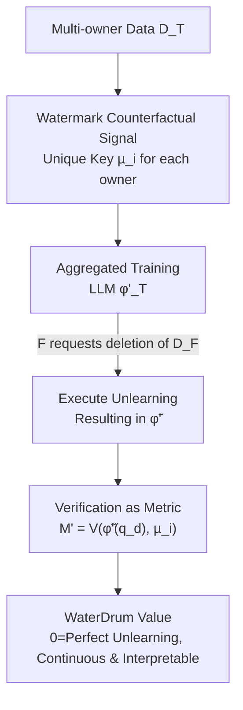

# WaterDrum: Watermark-based Data-centric Unlearning Metric

**Conference**: ICLR 2026  
**OpenReview**: [https://openreview.net/forum?id=5GVfneFvhq](https://openreview.net/forum?id=5GVfneFvhq)  
**Code**: https://github.com/lululu008/WaterDrum (Includes HuggingFace dataset)  
**Area**: LLM Security / Machine Unlearning / Privacy  
**Keywords**: Machine Unlearning, Unlearning Metric, Text Watermarking, Data Copyright, Counterfactual

## TL;DR
Addressing the issues where existing "utility-centric" unlearning metrics require comparison with a retrained model and fail when the forget and retain sets are semantically similar, this paper proposes the first "data-centric" unlearning metric, WaterDrum. By embedding a unique watermark into each data owner's training text, the "remaining influence of the data" is directly read via watermark verification scores. It enables continuous measurement of unlearning progress without retraining, achieving AUROC $\approx 1$ and calibration $R^2 \approx 0.99$.

## Background & Motivation
**Background**: LLM unlearning aims to erase the influence of specific training data (forget set $D_F$) from a model without retraining from scratch, responding to legal demands like copyright lawsuits, the GDPR "right to be forgotten," or the withdrawal of harmful data. To determine if an algorithm has successfully erased the data, an "unlearning metric" is required. Current mainstream metrics are **utility-centric**, measuring how much performance indicators like Perplexity, ROUGE-L, Truth Ratio, or KnowMem degrade on the forget set.

**Limitations of Prior Work**: Utility-centric metrics have two fatal flaws. First, their numerical values **cannot be interpreted in isolation**—to judge unlearning success, they must be compared against a "perfect model $\varphi_R$" retrained from scratch on the retain set $D_R$. However, retraining LLMs is exactly the prohibitive cost unlearning algorithms aim to avoid. Second, when the **forget and retain sets are semantically similar** (e.g., news reports of the same event or abstracts by different authors in the same arXiv category), these metrics fail. Because LLMs produce similar outputs for similar queries, metrics cannot distinguish whether an output originates from the forget set or the retain set. Fig. 1 shows that under "semantic overlap," the distributions of Truth Ratio for forget/retain sets almost completely overlap, making them inseparable.

**Key Challenge**: Utility-centric metrics **indirectly** infer "data influence" through "model performance," which is contaminated by generalization on similar data. Moreover, they inherently depend on a retraining baseline that is unavailable in practice. To be robust to similar data without relying on $\varphi_R$, a different path is necessary.

**Goal**: (1) Formalize the criteria for what constitutes a "good unlearning metric"; (2) Create a benchmark dataset reflecting real-world challenges (multi-owner, varying similarity); (3) Design and verify a metric that satisfies all criteria.

**Key Insight**: Instead of passively inferring data influence from performance, it is better to **actively embed signals** into the data. Watermarking training data creates a clear counterfactual: **A model never trained on certain watermarked data will not produce that watermark signal in its output**. Thus, "data residue" transforms from a vague performance comparison into a clear watermark detection problem with a 0-baseline.

**Core Idea**: Use "text watermarking + verification operators" to directly and continuously measure the residue of each owner's data in LLM outputs. The verification score itself serves as the unlearning metric, where 0 represents perfect unlearning.

## Method

### Overall Architecture
WaterDrum reconfigures unlearning measurement into a data-centric pipeline: "Watermark → Train → Unlearn → Verify." Consider a set of data owners $T$, each holding $D_i$. The model owner aggregates all data to train an LLM for service. When a subset $F \subset T$ requests the deletion of $D_F$, the model owner uses an unlearning algorithm to transform the original model $\varphi_T$ into an unlearned model $\tilde\varphi$ approximating $\varphi_R$. The core modification of WaterDrum is that **before** training, each owner $i$ uses a unique key $\mu_i$ to watermark their data. Subsequently, anyone with **query access** can use a verification operator $V$ to detect the presence of $\mu_i$ in the output and use this score as the unlearning metric:

$$M'(\varphi_\bullet(q_d), i) := V(\varphi_\bullet(q_d), \mu_i).$$

The intuition is: A perfectly unlearned model $\varphi_R$ was never trained on $D_F$, so its outputs for forget set queries **will not verify** the corresponding watermark ($V \approx 0$). Conversely, watermarks for the retain set remain verifiable ($V \gg 0$). Thus, the verification score possesses an interpretable 0-baseline. Since each key is unique, similar or identical data from different owners will carry different watermarks, solving the "similarity" problem at its root.

### Key Designs

**1. Formalizing "Good Metrics" into Four Criteria**

The paper first defines four criteria that an effective and practical unlearning metric must satisfy. **D1 Separability**: On a perfect model $\varphi_R$, the metric value for retain set queries should be higher than for forget set queries with high probability, i.e., $P[M(\varphi_R(q_{d_r}), r) > M(\varphi_R(q_{d_f}), f)] \approx 1$. This is equivalent to AUROC $\approx 1$. **D2 Calibration**: Since unlearning is often imperfect, the metric should continuously reflect "how much is forgotten." If a subset of size $k$ from $D_F$ is retrained with the retain set, the aggregated metric should be proportional to $k/|D_F|$, requiring the metric to be 0 when $k=0$ (perfect unlearning). **D3 Feasibility**: (a) The metric **must not reference the retrained model $\varphi_R$**, and (b) it should rely only on query outputs, not logits or weights. **D4 Robustness to Similar Data**: D1 and D2 must hold even when $D_R$ and $D_F$ contain similar data. Table 1 shows that ROUGE, Truth Ratio, KnowMem, and MIA fail these criteria, while WaterDrum satisfies them all.

**2. Watermark Counterfactual Signal: Transforming "Data Influence" into Verifiable Watermarks**

Each owner $i$ is assigned a unique key $\mu_i$ with two operators: a watermark operator $W(d_i, \mu_i) \to d_i'$ and a verification operator $V(g', \mu_i)$. The watermark framework must satisfy: **W0 Fidelity** (semantic preservation); **W1 Verifiability** (scores proportional to data residue); **W2 Overlap Verifiability** (multiple owner watermarks can be detected in one model); **W4 Unique Keys** (different keys for different owners). The paper instantiates this using the **Waterfall** framework (Lau et al., 2024) as it naturally satisfies these requirements.

**3. Three-Phase Deployment: Query-Only Access without Retraining**

**P1 Watermarking & Training**: Owners watermark $D_i$ to $D_i'$ using $\mu_i$. The model owner trains $\varphi_T'$ on the aggregate. **P2 Unlearning**: Subset $F$ requests deletion. The model owner provides query access to the unlearned model $\tilde\varphi'$. **P3 Verification as Metric**: Each $i \in F$ queries $\tilde\varphi'$ with $q_{d'}$ and applies $V(\tilde\varphi'(q_{d'}), \mu_i)$ to output the residue. P3 only requires query access (satisfying D3b), and because the model owner **never holds the owner keys** (W4), similar data remains distinguishable. Crucially, $\varphi_R$ is only used to *validate* the metric in research, not to *deploy* it in practice.

**4. WaterDrum-Ax: A Benchmark for Multi-Owner and Similarity Challenges**

Existing benchmarks (TOFU, MUSE, WMDP) are often unrealistic due to fixed partitions or lack of overlap. WaterDrum-Ax uses arXiv abstracts across **20 popular categories** as 20 owners (400 papers each). It constructs various similarity levels from **exact duplicates** to **paraphrases**, ensuring similar data appears across forget and retain sets.

## Key Experimental Results

Experiments used Llama-2-7B. WaterDrum was evaluated on watermarked data, while other metrics used un-watermarked versions. All metrics were normalized to 1.0 on the original model. Baselines include ROUGE-L, Truth Ratio, KnowMem, and MIA.

### Main Results: Separability D1 (AUROC)
AUROC for distinguishing retain set vs. forget set on a perfect model $\varphi_R$.

| Similarity | Dataset | ROUGE | Truth Ratio / KnowMem | WaterDrum |
|------------|---------|-------|-----------------------|-----------|
| Exact Rep. | WaterDrum-TOFU | 0.510 | 0.508 (TR) | **0.926** |
| Semantic Rep. | WaterDrum-TOFU | 0.798 | 0.472 (TR) | **0.954** |
| No Rep. | WaterDrum-TOFU | 0.908 | 0.747 (TR) | **0.928** |
| Exact Rep. | WaterDrum-Ax | 0.334 | 0.492 (KnowMem) | **0.957** |
| Semantic Rep. | WaterDrum-Ax | 0.960 | 0.450 (KnowMem) | **0.963** |
| No Rep. | WaterDrum-Ax | 0.974 | 0.491 (KnowMem) | **0.965** |

WaterDrum maintains AUROC > 0.9 across all settings, while baselines drop to $\approx 0.5$ (random guess) under exact/semantic repetition.

### Calibration D2 ($R^2$ of fit through origin)
Fitting the metric to $k/|D_F|$ on WaterDrum-Ax.

| Setting | ROUGE | KnowMem | MIA | WaterDrum |
|---------|-------|---------|-----|-----------|
| Exact Rep. | -37.47 | -498.1 | -285.6 | **0.987** |
| Semantic Rep. | 0.693 | -276.5 | -14.52 | **0.991** |
| No Rep. | 0.650 | -252.9 | 0.677 | **0.963** |

Only WaterDrum approaches 1.0. Negative values for baselines indicate they cannot quantify the degree of unlearning without referencing $\varphi_R$.

### Key Findings
- **Watermark Choice Matters**: Waterfall satisfies W1 and W2, leading to high D1/D2 and fast verification. KGW (Kirchenbauer et al.) is less effective for multi-owner separability.
- **Evaluating Unlearning Algorithms**: In the $M'_{D_F}$ vs. $M'_{D_R}$ space, ideal performance is in the "bottom right." Results show that GD, KL, TV, and SCRUB all fall short—KL and TV erase data but damage the retain set, while GD and SCRUB preserve the retain set but fail to erase thoroughly.

## Highlights & Insights
- **Active Signaling**: Shifting from passive performance inference to active signal embedding makes "0 = Perfect Unlearning" an interpretable baseline, removing the need for expensive retraining.
- **Unique Keys Solve Similarity**: Decoupling the metric from semantic similarity by using source-specific keys is a powerful mechanism transferable to any data attribution scenario.
- **Protocol-First Research**: Defining D1-D4 criteria before designing the method provides a clear and rigorous evaluation framework.

## Limitations & Future Work
- **Requires Pre-watermarking**: The metric only works for data watermarked before training. This is suitable for future data IP claims but doesn't solve the problem for existing legacy data.
- **Fidelity Trade-offs**: Strong watermarks might degrade model utility, though the paper shows Waterfall minimizes this.
- **Trust & Adversaries**: Practical deployment would require a trusted third party to manage keys to prevent model owners from cheating or data owners from false reporting.

## Related Work & Insights
- **vs. Utility-centric Metrics**: WaterDrum avoids the "Generalization contamination" that causes ROUGE/Truth Ratio to fail on similar data.
- **vs. MIA**: WaterDrum only requires query outputs (satisfying D3b), whereas most MIA metrics require logits or log-likelihoods.
- **Multi-owner Support**: Unlike previous watermarking for unlearning (mostly in CV), WaterDrum supports multiple owners in a single LLM via overlap verifiability.

## Rating
- Novelty: ⭐⭐⭐⭐⭐ 
- Experimental Thoroughness: ⭐⭐⭐⭐ 
- Writing Quality: ⭐⭐⭐⭐⭐ 
- Value: ⭐⭐⭐⭐⭐ 

<!-- RELATED:START -->

## Related Papers

- [\[ICLR 2026\] Revisiting the Past: Data Unlearning with Model State History](revisiting_the_past_data_unlearning_with_model_state_history.md)
- [\[ICLR 2026\] Redirection for Erasing Memory (REM): Towards a Universal Unlearning Method for Corrupted Data](redirection_for_erasing_memory_rem_towards_a_universal_unlearning_method_for_cor.md)
- [\[ICLR 2026\] CodeGenGuard: A Watermark for Code Generation Models](codegenguard_a_watermark_for_code_generation_models.md)
- [\[ICLR 2026\] Randomized Antipodal Search Done Right for Data Pareto Improvement of LLM Unlearning](randomized_antipodal_search_done_right_for_data_pareto_improvement_of_llm_unlear.md)
- [\[ICLR 2026\] From Static Benchmarks to Dynamic Protocol: Agent-Centric Text Anomaly Detection for Evaluating LLM Reasoning](from_static_benchmarks_to_dynamic_protocol_agent-centric_text_anomaly_detection_.md)

<!-- RELATED:END -->
