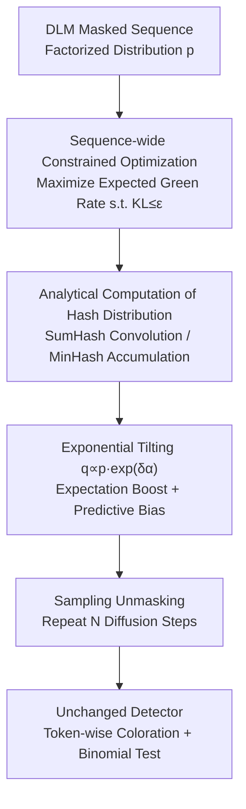

# Watermarking Diffusion Language Models

**Conference**: ICLR 2026  
**OpenReview**: [https://openreview.net/forum?id=3aBWTYGcaT](https://openreview.net/forum?id=3aBWTYGcaT)  
**Code**: Yes (provided in paper, inside the OpenReview link)  
**Area**: AI Safety / Watermark Provenance / Diffusion Language Models  
**Keywords**: Diffusion Language Models, Text Watermarking, Red-Green Watermarking, Constrained Optimization, Content Provenance

## TL;DR
This paper proposes the first text watermark tailored for Diffusion Language Models (DLMs). It formulates the "contextual hash-based" Red-Green watermark as a sequence-wide constrained optimization problem. This enables watermarking tokens even when their context has not been unmasked by operating on the "expectation of the context hash," achieving >99% True Positive Rate (TPR) with almost no quality loss while keeping the original detector unchanged.

## Background & Motivation
**Background**: Watermarking for Autoregressive Language Models (ARLMs) is relatively mature, primarily led by the Red-Green series. These use the hash of preceding tokens as a seed to pseudo-randomly split the vocabulary into "green" and "red" lists. During generation, a constant $\delta$ is added to the logits of green tokens to increase their probability. Detection involves checking if the number of green tokens significantly exceeds the expected binomial distribution. Such watermarks are already being integrated into consumer models and regulatory requirements.

**Limitations of Prior Work**: Diffusion Language Models (DLMs) represent a new paradigm that treats sequences as a set of placeholders with masks. In each step, they can **unmask multiple tokens in any order**, offering higher speed and controllability. However, the Red-Green hashing mechanism **strongly depends on the preceding text being already generated**. To color a token, one must compute the hash of its context. In DLMs, a token is often decoded while its context is still masked, making it impossible to compute a hash or apply coloration.

**Key Challenge**: A seemingly natural compromise is to "only watermark tokens whose context is fully determined." However, the authors demonstrate that under this naive approach, too few tokens satisfy the condition, leading to a very low green token count and negligible TPR, rendering the watermark ineffective. The fundamental issue is that the watermark algorithm must **operate directly on the distribution of context hashes** rather than waiting for a specific context to emerge.

**Goal**: Design a DLM watermark that is independent of unmasking order and covers **all** tokens, while reusing existing Red-Green detectors (zero changes on the detection side) and maintaining generation quality and robustness.

**Key Insight**: Since the context is a probability distribution rather than a fixed value during unmasking, the task of "increasing the green token ratio of the entire sequence" can be explicitly formulated as a constrained optimization problem on distributions.

**Core Idea**: By using a constrained optimization to "maximize the expected green rate while constraining the KL divergence between the watermarked and original distributions at each position," a closed-form solution for exponential tilting of logits is derived. This naturally decomposes into two components: "green list weighting under the expectation of context hashes" and "predictive bias toward hashes that help other tokens become green."

## Method

### Overall Architecture
At each diffusion step, the DLM outputs a factorized distribution $p(\tilde{\omega})\in\Delta(\Sigma)^L$ independent for each position. This watermark method does not modify the DLM itself but distorts $p$ into a new distribution $q$ at each step. This ensures the sequence sampled from $q$ has a **higher expected green token ratio**, while the KL divergence between each $q_t$ and $p_t$ is within $\varepsilon$ (to control quality). The solution yields an additive bias for the logits at each position, and sampling/unmasking proceeds as usual through $N$ diffusion steps. The detection side **fully reuses** the standard Red-Green binomial test without modification.

The pipeline consists of: "Original Distribution → Sequence-wide Constrained Optimization → Analytical Computation of Context Hash Distribution → Exponential Tilting to $q \propto p \cdot \exp(\delta \alpha)$ → Unmasking/Iteration → Unchanged Detector":

### Key Designs

**1. Formulating DLM Watermarking as Sequence-wide Constrained Optimization: Coloration at the Distribution Level**

The reason naive compromises fail is their requirement for a "fixed context." This paper shifts perspective: the detector cares about the green rate of the entire sequence $\hat{\gamma}(\omega)=\frac{1}{L}\sum_{t=1}^{L} G_{H_t(\omega),\omega_t}$ (where $G$ is the global green list matrix and $H_t$ is the context hash). Thus, the objective is to directly "increase the expectation of this green rate." Formally, distort the DLM distribution $p$ into $q$ by solving:

$$q^* = \arg\max_{q\in\Delta(\Sigma)^L}\ \mathbb{E}_{\Omega\sim q}[\hat{\gamma}(\Omega)]\quad \text{s.t.}\quad \forall t,\ \mathrm{KL}(q_t, p_t(\tilde{\omega}))\le\varepsilon.$$

Under the "no self-hashing" assumption, the expectation decomposes into $\mathbb{E}_{\Omega\sim q}[\hat{\gamma}(\Omega)]=\frac{1}{L}\sum_t h_t(q)^\top G\, q_t=:\frac{1}{L}J(q)$, where $h_t(q)$ is the probability distribution of context hashes. The authors (Theorem 3.1) prove the optimal solution has a simple closed form: $q^*_t\propto p_t\exp(\delta_t\,\alpha_t(q^*))$, where $\alpha_t(q)=\nabla_{q_t}J(q)$ and $\delta_t$ is the solution satisfying the KL constraint. In logit space, this adds $\delta_t\alpha_t$ to the original logits—structurally similar to the Red-Green bias but derived from global optimization.

**2. Efficient Analytical Computation of Context Hash Distributions: Making Expectation Tractable**

Design 1 requires the context hash distribution $h_t(q)$ at each position. Enumerating all combinations is $O(\Sigma^L)$, which is infeasible. This paper leverages the structure of two local hash functions. **SumHash** sums IDs of tokens in the context set $C$. Its distribution is the **convolution** of distributions at each context position: $h^{\text{SumHash}}_t(p)=p_{t+c_1}\!*\cdots*p_{t+c_k}$, computed via FFT in $O(|C||\Sigma|\log|\Sigma|)$. **MinHash** takes the minimum token ID (after random permutation) as the hash. Its distribution can be computed via cumulative products in $O(|C||\Sigma|)$. Notably, DLM context is not limited to preceding tokens; $C$ can include **future** tokens (e.g., $C=\{-1,1\}$), a flexibility afforded by DLM's arbitrary order. The algorithm (Algorithm 2) uses top-$k$ values of $h_t$ and $p_t$ for iteration, with low computational overhead.

**3. Decomposition into "Expectation Boost + Predictive Bias": Natural Extension of Red-Green**

For SumHash with $C=\{-1\}$, the solution expands to:

$$q^*_t\propto p_t\underbrace{\exp(\delta G^\top p_{t-1})}_{\text{Expectation Boost}}\underbrace{\exp(\delta G p_{t+1})}_{\text{Predictive Bias}}.$$

The first term is the **Expectation Boost**: applying the green list boost under the "expectation of the context distribution $p_{t-1}$." When $p_{t-1}$ collapses to a single token, it **precisely recovers** the standard Red-Green $\delta$ boost. The second term is the **Predictive Bias**: favoring tokens that, if chosen, make subsequent tokens more likely to be green. This proves the watermark is a natural extension of Red-Green. Restricting the optimization to the autoregressive case removes the predictive bias, leaving only the expectation boost, which is identical to the original ARLM watermark. This is why the detection side requires zero changes.

### Loss & Training
This is a **generation-time watermark** method that requires no training or modification of DLM weights. It can be parameterized by the KL upper bound ($\varepsilon$-parameterization, using binary search for $\delta_t$) or directly by constant strength ($\delta$-parameterization). Experiments suggest $\delta$-parameterization provides better detectability. A single fixed-point iteration is sufficient for strong watermarking.

## Key Experimental Results

### Main Results
Setup: WaterBench protocol, 600 prompts, response length ~150–300 tokens; DLMs used: LLaDA-8B and Dream-7B; SumHash, $\delta$-parameterization, 1 iteration, top-$k=50$. Metric: TPR@1% FPR. Quality measured by log perplexity (PPL), GPT-4 score, and benchmark accuracy.

| Model | Context / Strength | Type | TPR@1 | log(PPL) | GPT4 | Acc |
|------|------|------|------|------|------|------|
| LLaDA-8B | Unwatermarked | — | 0.00 | 1.56 | 8.95 | 59.4 |
| LLaDA-8B | $C=\{-1\}, \delta=4$ | Baseline | 0.63 | 1.93 | 8.48 | 55.5 |
| LLaDA-8B | $C=\{-1\}, \delta=4$ | Ours | **0.99** | 1.90 | 8.43 | 56.0 |
| Dream-7B | Unwatermarked | — | 0.00 | 1.94 | 8.45 | 50.4 |
| Dream-7B | $C=\{-1\}, \delta=4$ | Baseline | 0.49 | 2.27 | 7.95 | 35.8 |
| Dream-7B | $C=\{-1\}, \delta=4$ | Ours | **0.99** | 2.32 | 7.76 | 50.1 |

Under comparable quality loss, this method consistently achieves 99% TPR@1, while the naive baseline only reaches 0.49–0.83. Detectability increases rapidly with text length; this method at ~50 tokens matches the baseline at ~350 tokens.

### Ablation Study

| Configuration | Key Finding |
|------|---------|
| SumHash vs MinHash | No significant difference in detectability; both local hashes work. |
| Components | Both "Expectation Boost" and "Predictive Bias" are necessary for optimality. |
| Fixed-point Iterations | 1 iteration is sufficient; more iterations provide marginal gains with linear cost. |
| Parameterization | $\delta$ is significantly better than $\varepsilon$ as KL is an imperfect proxy for quality. |

### Key Findings
- **Dual Components are Complementary**: Expectation boost replicates Red-Green in expectation, while predictive bias exploits the fact that the current choice becomes others' context.
- **Counter-intuitive $\delta$ vs $\varepsilon$**: When two tokens (one green, one red) contribute equally to quality, the ideal strategy shifts all probability to green. A KL constraint limits this shift, weakening the watermark.
- **Robustness**: Maintains strong detection within 30% edit distance. It is significantly more robust than ARLM watermarks against context-aware replacements because watermarking under the "expected hash" naturally covers neighbor variants.
- **Superiority over sequence-independent methods**: Better quality-detectability trade-off than Unigram or PatternMark, without their high Type-1 error or susceptibility to spoofing.

## Highlights & Insights
- **"Watermarking on Distributions" is the Key**: Replacing "fixed context" with "expectation of context hashes" elegantly bypasses the arbitrary unmasking order of DLMs.
- **Zero Detector Changes**: All signal is embedded via logit tilting at generation, ensuring compatibility with existing infrastructure.
- **Unified Framework**: The optimization precisely recovers ARLM watermarks in the autoregressive case, showing it is a generalized framework.
- **Transferable Techniques**: Using FFT/convolution to compute expectations over token combinations reduces complexity from $O(\Sigma^L)$ to near-linear, a trick applicable to other distribution-based expectation scenarios.

## Limitations & Future Work
- **Accuracy Drop on Some Models**: On LLaDA-8B, the drop in benchmark accuracy is slightly higher than the baseline, indicating non-negligible impact under certain hyperparameter settings.
- **Vulnerability to Strong Attacks**: Paraphrasing or back-translation still weakens detectability, requiring longer text to recover signals.
- **"No Self-Hashing" Dependency**: Analytical formulas rely on the assumption that a token is not in its own context.
- **Future Directions**: Exploring better quality proxies than KL or designing semantic-level expectation weights to counter paraphrasing.

## Related Work & Insights
- **vs Red-Green ARLM (Kirchenbauer et al.)**: They rely on fixed preceding hashes; this work generalizes it to "expected hashes" for arbitrary DLM orders.
- **vs Naive DLM Adaptation**: Baseline only watermarks tokens with fixed contexts (low TPR); this method covers all tokens (high TPR).
- **vs Sequence-independent (Unigram/PatternMark)**: Those lack security against spoofing; this method provides better trade-offs and safety by utilizing sequence distribution.
- **vs Image Diffusion Watermarks**: Image watermarking operates in continuous space; this is the first generation-time watermark designed for discrete diffusion processes.

## Rating
- Novelty: ⭐⭐⭐⭐⭐ First DLM-specific watermark with an elegant constrained optimization framework.
- Experimental Thoroughness: ⭐⭐⭐⭐ Multiple models and robustness tests, though accuracy impacts could be further detailed.
- Writing Quality: ⭐⭐⭐⭐⭐ Clear progression from problem to derivation and dual-component intuition.
- Value: ⭐⭐⭐⭐⭐ High practical utility for AI provenance given the rise of DLMs.

<!-- RELATED:START -->

## Related Papers

- [\[ICLR 2026\] wd1: Weighted Policy Optimization for Reasoning in Diffusion Language Models](wd1_weighted_policy_optimization_for_reasoning_in_diffusion_language_models.md)
- [\[ICLR 2026\] Membership Inference Attacks Against Fine-tuned Diffusion Language Models (SAMA)](membership_inference_attacks_against_fine-tuned_diffusion_language_models.md)
- [\[ICLR 2026\] DiffuGuard: How Intrinsic Safety is Lost and Found in Diffusion Large Language Models](diffuguard_how_intrinsic_safety_is_lost_and_found_in_diffusion_large_language_mo.md)
- [\[ICLR 2026\] Distilling the Thought, Watermarking the Answer: A Principle Semantic Guided Watermark for Reasoning Large Language Models](distilling_the_thought_watermarking_the_answer_a_principle_semantic_guided_water.md)
- [\[ICLR 2026\] An Ensemble Framework for Unbiased Language Model Watermarking](an_ensemble_framework_for_unbiased_language_model_watermarking.md)

<!-- RELATED:END -->
