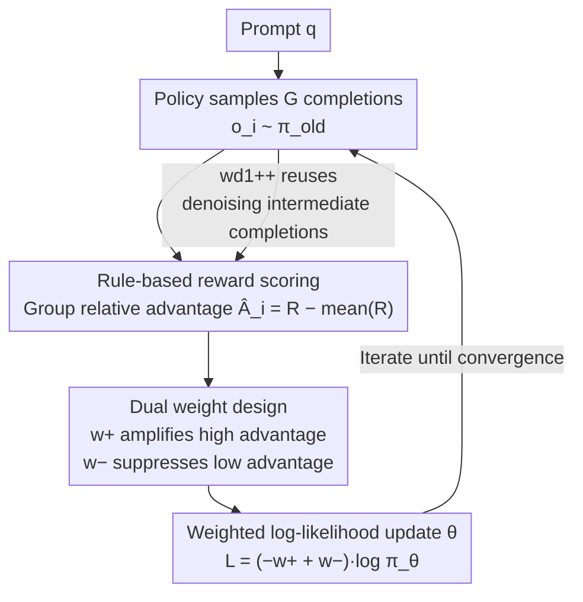

# wd1: Weighted Policy Optimization for Reasoning in Diffusion Language Models

**Conference**: ICLR 2026  
**arXiv**: [2507.08838](https://arxiv.org/abs/2507.08838)  
**Code**: [https://github.com/xiaohangt/wd1](https://github.com/xiaohangt/wd1)  
**Area**: LLM Security / Diffusion Language Models  
**Keywords**: Diffusion Language Models, Reinforcement Learning, Policy Optimization, Reasoning Capability, dLLM

## TL;DR
This work proposes wd1, a ratio-free weighted log-likelihood policy optimization method for the RL fine-tuning of diffusion language models (dLLMs). By utilizing positive sample weighting and negative sample penalties, it avoids the bias and high variance issues associated with policy ratio estimation in GRPO. It achieves SOTA performance on LLaDA-8B, including +59% on Sudoku and 84.5% on GSM8K.

## Background & Motivation

**Background**: Diffusion Language Models (dLLMs) such as LLaDA and Dream have approached the performance of autoregressive (AR) models in text generation. While AR models have significantly enhanced their reasoning capabilities through RL methods like RLHF/GRPO (e.g., DeepSeek-R1), RL fine-tuning for dLLMs remains an open research question.

**Limitations of Prior Work**: The likelihood function of dLLMs is intractable and can only be approximated. Existing methods (such as d1 and UniGRPO) that adapt GRPO to dLLMs require approximating the policy ratio $r_i^k \approx \exp(\phi^{\pi_\theta} - \phi^{\pi_{old}})$. This introduces three major issues: (a) approximation errors are exponentially amplified; (b) ELBO estimation exhibits high variance; and (c) the simultaneous approximation of three policy likelihoods (current, old, and reference) incurs high computational overhead.

**Key Challenge**: While the policy ratio is central to PPO/GRPO, its approximation in dLLMs is unreliable. How can effective policy optimization be performed without calculating policy ratios?

**Goal**: To design a ratio-free RL method that requires only a single likelihood approximation of the current policy while fully utilizing both positive and negative samples.

**Key Insight**: Starting from reverse-KL regularized policy optimization, the analytical form of the optimal policy is derived. Subsequently, by minimizing $D_{KL}(\pi^* \| \pi_\theta)$, the optimization is converted into weighted log-likelihood maximization—eliminating the need for policy ratios.

**Core Idea**: The RL objective is reformulated as a weighted log-likelihood (WLL), where weights are determined by the exponent of the advantage function. A negative sample penalty term ($w^-$) is further introduced to actively reduce the likelihood of low-advantage completions, forming wd1. Theoretically, it is proven that wd1 is equivalent to energy-guided discrete diffusion training combined with negative sample unlearning.

## Method

### Overall Architecture

For each prompt $q$, the policy $\pi_\theta$ samples $G$ completions $\{o_i\}$, which are scored using a rule-based reward $R(q,o_i)$ to calculate the group relative advantage $\hat{A}_i = R(q,o_i) - \text{mean}(R)$. Unlike GRPO, wd1 does not estimate any policy ratios. Instead, it converts advantages directly into a pair of weights for the log-likelihood: a positive weight $w^+$ to amplify high-advantage completions and a negative weight $w^-$ to suppress low-advantage completions. The policy is updated accordingly, requiring only one likelihood approximation of the current policy $\pi_\theta$ throughout the process. An advanced version, wd1++, further incorporates intermediate completions generated during the denoising process as training samples to achieve higher data efficiency.

### Key Designs

**1. Weighted Log-Likelihood: Replacing Policy Ratios with Advantage Weighting**

The core of GRPO/PPO is the policy ratio $r_i \approx \exp(\phi^{\pi_\theta} - \phi^{\pi_{old}})$. However, because dLLM likelihoods are intractable, error amplification and high variance occur when approximations are exponentiated. wd1 approaches this via reverse-KL constrained optimization to derive the analytical optimal policy:

$$\pi^* \propto \pi_{old}^{\lambda/(\lambda+\beta)} \cdot \pi_{ref}^{\beta/(\lambda+\beta)} \cdot \exp\!\Big(\tfrac{A}{\lambda+\beta}\Big),$$

Minimizing $D_{KL}(\pi^* \,\|\, \pi_\theta)$ simplifies the objective to a weighted log-likelihood (WLL), where weights are proportional to the exponent of the advantage—entirely removing policy ratios. To solve the issues of WLL (where low-advantage samples are wasted and all likelihoods may be blindly increased), wd1 adds a negative sample penalty. The final objective is $\mathcal{L}_{wd1} = \frac{1}{G}\sum_i (-w^+ + w^-)\log\pi_\theta(o_i|q)$, where $w^+ \propto \exp(\psi\hat{A}_i)$ and $w^- \propto \exp(-\psi\hat{A}_i)$ are group-normalized. When advantages are identical, $w^+ = w^-$ and the gradient becomes zero, avoiding exponential errors and fixing WLL degradation on uninformative groups.

**2. wd1++: Utilizing Intermediate Denoising Steps for Data Efficiency**

Standard wd1 only uses final completions $o_i$. However, dLLMs produce a sequence of intermediate predictions during the denoising process, a feature absent in autoregressive (AR) models. wd1++ expands the sample group from $\{o_i\}$ to $O_i = \{x_{0|l}\}_{l=1}^L$, incorporating intermediate completions from each denoising step $l$. Based on denoising cross entropy (DCE), it defines a step-level objective: $\mathcal{L}_{wd1++} = \frac{L}{Gl} \sum_i \sum_{x_{0|l}} (-w^+ + w^-)\log\pi_\theta(x_{0|l} | x_l, q)$. This reuses all intermediate states as training signals, achieving better performance with approximately 10× fewer rollouts.

**3. Energy-Guided Diffusion + Negative Sample Unlearning: Theoretical Foundation for Ratio-Free**

The paper further proves that WLL is equivalent to Advantage-Weighted Denoising Cross Entropy (AW-DCE), effectively training an energy-guided discrete diffusion model with the energy function $\mathcal{E} = -A$. Meanwhile, the negative penalty $w^-$ is equivalent to minimizing the corresponding ELBO, resulting in "data unlearning" of low-quality completions. This equivalence unifies dLLM RL fine-tuning and energy-guided diffusion sampling into a single theoretical framework, explaining why actively unlearning bad samples is critical.

### Loss & Training

The complete loss is $\mathcal{L}_{wd1} = \frac{1}{G} \sum_{i=1}^G (-w^+(q,o_i) + w^-(q,o_i)) \cdot \log \pi_\theta(o_i | q)$. The model is fine-tuned on LLaDA-8B-Instruct using LoRA, without requiring the SFT warm-up phase used by d1. In practice, $\beta=0, \lambda=1$ is used to remove reference policy regularization. Likelihood approximation follows d1's approach: $\log \pi_\theta(x_0|q) \approx \sum_k \log \pi_\theta(x_0^k | x_1, q')$. Each step involves $\mu=8$ gradient updates, with weights normalized across all groups to stabilize training.

## Key Experimental Results

### Main Results

| Method | Sudoku (256) | Countdown (256) | GSM8K (512) | MATH500 (512) |
|------|-------------|-----------------|------------|---------------|
| LLaDA-8B-Instruct | 6.7% | 19.5% | 78.2% | 36.2% |
| + diffu-GRPO | 16.1% | 27.0% | 80.7% | 39.0% |
| + d1 (SFT+GRPO) | 17.6% | 25.8% | 82.0% | 38.0% |
| + **wd1** | **76.4%** | **51.2%** | 82.3% | 39.0% |
| + **wd1++** | - | - | **84.5%** | **44.2%** |
| + MDPO | - | - | 83.7% | 43.8% |
| + TCR | - | - | 83.0% | 41.4% |

### Ablation Study

| Configuration | Sudoku | Countdown | Description |
|------|--------|-----------|------|
| wd1 (Full) | 76.4% | 51.2% | full model |
| $w^+$ only (WLL) | 50.2% | 39.5% | Removed negative penalty, -26% |
| $w^-$ only | 15.3% | 22.1% | Penalty only, no reinforcement |
| d1 | 17.6% | 25.8% | Baseline |

Training cost comparison (4×A100):
- d1: SFT 2.01h + RL 103.5s/step, FLOPs 9.92e15/step, NFEs (μ+2)/step
- wd1: No SFT + RL 81.16s/step, FLOPs 8.89e15/step, NFEs μ/step

### Key Findings
- **wd1 outperforms d1 by 59% on Sudoku** (76.4% vs 17.6%) and 25% on Countdown, demonstrating the massive advantage of ratio-free methods in constrained reasoning tasks.
- **Negative sample penalty is vital**: Removing $w^-$ drops Sudoku performance from 76.4% to 50.2%, proving that actively "unlearning" low-quality completions is essential.
- **wd1++ reaches SOTA with 10× fewer rollouts**: Achievements of 84.5% on GSM8K and 44.2% on MATH500 in only 20 training steps.
- **No SFT phase required**: wd1 starts RL directly from the Instruct model, saving the 2 hours of SFT required by d1.
- Computational cost per step is reduced by ~22% (81.16s vs 103.5s) as likelihood approximations for old and reference policies are not needed.

## Highlights & Insights
- **Elegance of Ratio-free Design**: By switching the KL direction (forward to reverse), the dependence on ratios in TRPO/PPO is transformed into weighted likelihood. This approach may also hold value for AR models.
- **Dual $w^+ / w^-$ Design**: The combination of positive sample weighting (increasing probability of good outcomes) and negative sample penalty (decreasing probability of bad outcomes) yields an elegant self-balancing mechanism that stops automatically when advantages are equal.
- **Unified Theory via Energy-Guided Diffusion**: Understanding RL fine-tuning as energy-guided diffusion training provides a new framework for comprehending and improving dLLM RL.
- **Utilization of Intermediate Steps (wd1++)**: Training on denoising intermediates is a unique advantage of dLLMs that AR models cannot replicate.

## Limitations & Future Work
- Validated only on LLaDA-8B; testing on more dLLMs (e.g., Dream, DiffuCoder) is required.
- Likelihood approximation still uses the biased method from d1 (t=1 sampling); better approximations might further improve performance.
- The possibility of combining with RLHF (Human Feedback) has not been explored.
- wd1++ increases memory overhead due to the storage of intermediate denoising completions.

## Related Work & Insights
- **vs d1 (Zhao et al., 2025)**: d1 adapts GRPO to dLLMs but retains policy ratio calculations. wd1 eliminates ratios entirely, reducing error and computation.
- **vs UniGRPO (Yang et al., 2025)**: UniGRPO uses DCE to estimate likelihood by sampling multiple $t$ values, which is more accurate but slower. wd1 requires only one approximation of the current policy.
- **vs MDPO (He et al., 2025)**: MDPO uses DPO-style preference optimization. wd1++ slightly outperforms it on GSM8K and MATH500.

## Rating
- Novelty: ⭐⭐⭐⭐⭐ Ratio-free design + Energy-guided theoretical unification + Intermediate step utilization.
- Experimental Thoroughness: ⭐⭐⭐⭐ Multiple benchmarks + ablation + cost analysis, though limited to one base model.
- Writing Quality: ⭐⭐⭐⭐ Clear theoretical derivation, though the content is dense.
- Value: ⭐⭐⭐⭐⭐ Solves a core technical bottleneck in dLLM RL, providing SOTA performance with significant computational savings.

<!-- RELATED:START -->

## Related Papers

- [\[ICLR 2026\] EEPO: Exploration-Enhanced Policy Optimization via Sample-then-Forget](eepo_exploration-enhanced_policy_optimization_via_sample-then-forget.md)
- [\[ICLR 2026\] Watermarking Diffusion Language Models](watermarking_diffusion_language_models.md)
- [\[ICLR 2026\] Tree-based Dialogue Reinforced Policy Optimization for Red-Teaming Attacks (DialTree)](tree-based_dialogue_reinforced_policy_optimization_for_red-teaming_attacks.md)
- [\[ICLR 2026\] Membership Inference Attacks Against Fine-tuned Diffusion Language Models (SAMA)](membership_inference_attacks_against_fine-tuned_diffusion_language_models.md)
- [\[ICLR 2026\] PURGE: Reinforcement Unlearning via Group Relative Policy Optimization](reinforcement_unlearning_via_group_relative_policy_optimization.md)

<!-- RELATED:END -->
