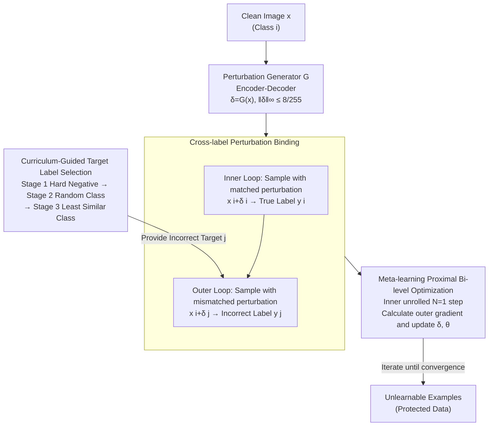

# When Priors Backfire: On the Vulnerability of Unlearnable Examples to Pretraining

**Conference**: ICLR 2026  
**arXiv**: [2603.04731](https://arxiv.org/abs/2603.04731)  
**Code**: [https://github.com/zhli-cs/BAIT](https://github.com/zhli-cs/BAIT)  
**Area**: LLM Evaluation  
**Keywords**: Unlearnable examples, pretraining priors, data protection, bi-level optimization, adversarial perturbations

## TL;DR

This work reveals a fundamental vulnerability of Unlearnable Examples (UEs) in pretrained models—pretraining priors allow models to bypass perturbation shortcuts and learn true semantics. The authors propose the BAIT framework to counter pretraining priors by binding perturbations to incorrect labels.

## Background & Motivation

Unlearnable Examples (UEs) are a data protection strategy: by adding imperceptible perturbations to training data, a model is forced to learn spurious shortcuts instead of true semantics, causing it to fail on clean test sets. However, existing UE research assumes models are trained from random initialization, ignoring a key practical scenario:

**Pretrained models are standard in modern deep learning.** Practitioners typically fine-tune pretrained backbones (e.g., ImageNet-pretrained ResNet) rather than training from scratch.

Through systematic experiments, the authors identify a previously overlooked fundamental vulnerability:

- **Significant Performance Gap**: On CIFAR-10, the test accuracy of pretrained models on UE data is much higher than that of models trained from scratch, indicating that "unlearnability" is offset by pretraining priors.
- **Layer-wise Verification**: Progressively replacing pretrained layers with randomly initialized ones leads to a continuous drop in test accuracy—fewer priors make UEs more effective.
- **Parameter Update Dynamics**: The magnitude of parameter updates for pretrained models on UE data is comparable to clean data, suggesting that the "semantic-label channel" established via priors bypasses the perturbation shortcut.
- **Learning Curves**: When training pretrained models on EMN perturbation data, test accuracy rises in synchronization with training accuracy—models are indeed learning true semantics.

## Method

### Overall Architecture

BAIT (Binding Artificial perturbations to Incorrect Targets) addresses the issue where pretraining priors allow models to bypass perturbation shortcuts and learn true semantics, rendering UEs ineffective. The Mechanism involves formulating perturbation generation as a **bi-level optimization** problem. An encoder-decoder generator $\mathcal{G}$ first produces class-level perturbations $\delta=\mathcal{G}(x)$. The inner loop trains a proxy model using "sample + corresponding perturbation $\to$ true label" to **simulate** normal learning under pretraining priors. The outer loop then adjusts the perturbations to force the model to classify "sample + mismatched perturbation" as an **incorrect label**, thereby turning the perturbation itself into the dominant predictive signal. Since the outer loop depends on the optimal inner parameters and cannot be solved directly, BAIT uses meta-learning to unroll the inner loop for a few steps to approximate the outer gradient. The "incorrect target class" bound in the outer loop is selected by a three-stage curriculum from easy to hard. Formally, the goal is:

$$\min_{\delta} \mathbb{E}_{(x,y) \sim \mathcal{D}_c} \mathcal{L}(f_\theta(x^i + \delta^j), y^j) \quad \text{s.t.} \quad \theta \in \arg\min_\theta \mathbb{E}_{(x,y) \sim \mathcal{D}_c} \mathcal{L}(f_\theta(x^i + \delta^i), y^i)$$

where $i \neq j$ represents different classes, and $\delta^j$ is the class-level perturbation corresponding to class $j$.

### Key Designs

**1. Cross-label Perturbation Binding: Making Perturbations Dominate Prediction Instead of Riding on Semantics**

Previous UEs maintained the alignment of $(x^i + \delta^i \to y^i)$, where perturbations merely "added a shortcut" to the true label. Once a pretrained backbone is used, the semantic-label channel established by the prior allows the model to bypass the shortcut and learn true semantics directly. This is the root cause of UE failure under pretraining. BAIT's inner optimization simulates this normal channel—mapping class $i$ samples with corresponding perturbations $\delta^i$ to the true label $y^i$. The outer optimization actively breaks this alignment, forcing $(x^i + \delta^j \to y^j)$, meaning a class $i$ sample superimposed with a class $j$ perturbation must be classified as $y^j$. Thus, perturbation $\delta^j$ is strongly associated with the incorrect label $y^j$, forcing the prior to follow this artificial channel if it attempts to bypass the perturbation.

**2. Meta-learning Proximal Bi-level Optimization: Unrolling the Inner Loop for $N$ Steps**

The outer loop perturbation gradient depends on the inner optimal parameters $\theta$, making direct exact solving unfeasible. BAIT adopts meta-learning, unrolling the inner optimization for $N$ steps: the inner loop first performs updates based on true alignment $\theta'_{n,m+1} = \theta'_{n,m} - \alpha \nabla_{\theta'_{n,m}} \mathcal{L}(f_\theta(x^i + \delta^i), y^i)$ to obtain "look-ahead" proxy weights $\theta'_{n,N}$. These are used to calculate the outer perturbation gradient and update $\delta^j_{n+1} = \delta^j_n - \beta \nabla_{\delta^j_n} \mathcal{L}(f_{\theta'_{n,N}}(x^i + \delta^j_n), y^j)$. This allows the generator to "foresee" how the current perturbation will affect incorrect label binding after $N$ training steps. In practice, $N=1$ is sufficient, with an inner learning rate $\alpha = 0.1$ and the outer loop optimized via Adam with $\beta = 0.001$.

**3. Curriculum-Guided Target Label Selection: Choosing Incorrect Labels from Easy to Hard**

Selecting "which" incorrect label to bind to is critical—fixing a single target class yields poor generalization, while picking the hardest class initially hinders convergence. BAIT leverages curriculum learning to design a three-stage strategy based on "misclassification difficulty": Stage 1 selects the non-true class with the highest logit (hard negative, easiest to confuse, stabilizing the perturbation); Stage 2 switches to a random non-true class (increasing difficulty and generalization); Stage 3 selects the least similar class (most challenging, forcing the perturbation to be robust enough to flip the strongest priors). Ablations show that progressively stacking these stages continuously lowers test accuracy, justifying the importance of incremental difficulty.

### Loss & Training

Perturbations are generated by an encoder-decoder generator $\mathcal{G}$ ($\delta = \mathcal{G}(x)$) and constrained within an imperceptible range $\|\delta\|_\infty \leq 8/255$. Final class-level perturbations are obtained by averaging sample perturbations within the same class. The entire process uses an ImageNet-pretrained ResNet-18 as the proxy model, ensuring perturbations are optimized for "models with priors." Each stage of the three-stage curriculum is trained for 30 epochs on CIFAR-10/CIFAR-100 and 20 epochs on SVHN.

## Key Experimental Results

### Main Results

Test accuracy (%) on ImageNet-pretrained backbones ↓ (Lower is better = Stronger unlearnability):

| Dataset | Backbone | Clean | EMN | TUE | GUE | 14A | **BAIT** |
|:---|:---|:---|:---|:---|:---|:---|:---|
| CIFAR-10 | ResNet-18 | 84.10 | 61.82 | 82.72 | 23.17 | 65.70 | **14.40** |
| CIFAR-10 | ResNet-50 | 86.48 | 57.54 | 85.68 | 71.42 | 72.81 | **14.82** |
| CIFAR-100 | ResNet-18 | 55.73 | 55.53 | 55.20 | 54.09 | 33.67 | **20.77** |
| SVHN | ResNet-18 | 90.96 | 37.55 | 41.15 | 39.68 | 81.47 | **14.37** |
| SVHN | DenseNet-121 | 92.97 | 58.22 | 40.53 | 73.34 | 86.83 | **11.61** |

BAIT reduces test accuracy to near random-guess levels in all settings, while other methods generally fail against pretrained models (e.g., TUE still maintains 82.72% accuracy on CIFAR-10/ResNet-18).

### Ablation Study

Effect of curriculum learning target selection strategies (ResNet-18):

| Stage 1 | Stage 2 | Stage 3 | CIFAR-10 | CIFAR-100 | SVHN |
|:---:|:---:|:---:|:---:|:---:|:---:|
| ✓ | | | 23.68 | 35.75 | 21.75 |
| ✓ | ✓ | | 20.60 | 23.94 | 16.58 |
| ✓ | ✓ | ✓ | **14.40** | **20.77** | **14.37** |

The progressive addition of stages leads to significant gains in unlearnability, validating the effectiveness of the easy-to-hard curriculum.

### Key Findings

1.  **Cross-prior Transferability**: Perturbations generated with an ImageNet-pretrained proxy remain effective on backbones pretrained on CIFAR-10/CIFAR-100/SVHN.
2.  **Cross-architecture Transferability**: Perturbations generated using a ResNet-18 proxy maintain unlearnability on VGG-11, DenseNet-121, GoogLeNet, and even ViT.
3.  **Complex Datasets**: On Flowers102 and ImageNet subsets, BAIT significantly outperforms baselines (Flowers: 24.91 vs. best baseline 43.91).
4.  **ViT is Harder to Attack**: ViT-based architectures have stronger pretraining priors, causing baselines to fail almost completely (TUE retains >90% accuracy on CIFAR-10), yet BAIT still effectively reduces accuracy.

## Highlights & Insights

- **Discovery Level**: First to systematically reveal UE vulnerability to pretraining and the "semantic-label channel" provided by pretraining priors, marking a major cognitive update in the UE field.
- **Methodological Level**: The cross-label perturbation binding $(x^i + \delta^j \to y^j)$ is an elegant design—it doesn't just minimize training loss but actively creates a strong perturbation-incorrect label association.
- **Curriculum Learning for Adversarial Optimization**: The easy-to-hard target selection strategy makes perturbations more robust; this idea can be generalized to other adversarial design scenarios.
- Extends UE research from "adversarial training from scratch" to the more practical "adversarial pretrained fine-tuning" scenario.

## Limitations & Future Work

1.  Requires an ImageNet-pretrained proxy model—this assumption might not hold in all scenarios.
2.  Class-level perturbations may be less flexible than sample-level ones, especially when intra-class variation is high.
3.  Applicability to NLP pretrained models (e.g., BERT fine-tuning) was not explored.
4.  Computational cost: Bi-level optimization and three-stage curriculum learning incur higher overhead than simple UE methods.
5.  Adaptive defenders were not discussed—if attackers know the data is protected by BAIT, would there be countermeasures?

## Related Work & Insights

- **EMN** (Huang et al., 2021): The most classic UE method, used as the primary benchmark.
- **GUE** (Liu et al., 2024a): UE from a game-theoretic perspective; effective training from scratch but degrades significantly against pretrained models.
- **14A** (Chen et al., 2024): CLIP-assisted UE, but still outperformed by BAIT.
- Insight: Data protection strategies must consider the strongest attack scenarios (pretraining/fine-tuning is already the norm); protection that only works under ideal conditions is insufficient.

## Rating

- **Novelty**: 8/10
- **Technical Depth**: 8/10
- **Experimental Thoroughness**: 9/10
- **Writing Quality**: 8/10
- **Value**: 7/10

<!-- RELATED:START -->

## Related Papers

- [\[ICLR 2026\] Perturbation-Induced Linearization: Constructing Unlearnable Data with Solely Linear Classifiers](perturbation-induced_linearization_constructing_unlearnable_data_with_solely_lin.md)
- [\[ICCV 2025\] Temporal Unlearnable Examples: Preventing Personal Video Data from Unauthorized Exploitation](../../ICCV2025/llm_safety/temporal_unlearnable_examples_preventing_personal_video_data_from_unauthorized_e.md)
- [\[ICLR 2026\] SlotGCG: Exploiting the Positional Vulnerability in LLMs for Jailbreak Attacks](slotgcg_exploiting_the_positional_vulnerability_in_llms_for_jailbreak_attacks.md)
- [\[ICLR 2026\] Train Once, Answer All: Many Pretraining Experiments for the Cost of One](train_once_answer_all_many_pretraining_experiments_for_the_cost_of_one.md)
- [\[ICLR 2026\] OffTopicEval: When Large Language Models Enter the Wrong Chat, Almost Always!](offtopiceval_when_large_language_models_enter_the_wrong_chat_almost_always.md)

<!-- RELATED:END -->
