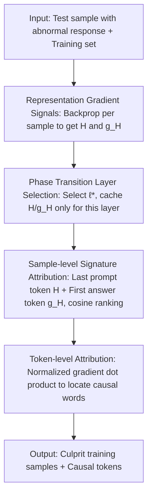

# Where Did It Go Wrong? Attributing Undesirable LLM Behaviors via Representation Gradient Tracing

**Conference**: ICLR 2026  
**OpenReview**: [https://openreview.net/forum?id=MN1qlAVJLV](https://openreview.net/forum?id=MN1qlAVJLV)  
**Code**: https://github.com/plumprc/RepT  
**Area**: AI Safety / Data Attribution / Interpretability  
**Keywords**: Data Attribution, Representation Gradient, Influence Functions, Harmful Fine-tuning, Backdoor Detection, Knowledge Pollution

## TL;DR
When a fine-tuned LLM generates harmful or incorrect responses, this paper proposes RepT (Representation Gradient Tracing). Instead of using expensive and noisy parameter gradients, it utilizes "representation gradients" in the model's **representation (activation) space**. This approach precisely traces bad behaviors back to culprit samples or even specific tokens in the training set, achieving nearly 100% auPRC across harmful fine-tuning, backdoor poisoning, and knowledge pollution tasks, while reducing memory and time overhead by one to two orders of magnitude compared to influence-function-based methods.

## Background & Motivation
**Background**: The capabilities of Large Language Models (LLMs) heavily depend on the quality of fine-tuning and alignment data. If harmful samples, backdoor triggers, or factual errors are mixed into the training set, the model learns to generate harmful content, activates via trigger words, or repeats incorrect facts. A core problem arises: "where did it go wrong"—when a model gives a bad answer, **which specific piece of data** in the training set caused it? This is known as data attribution.

**Limitations of Prior Work**: Classical solutions are either infeasible or unreliable. Leave-one-out (LOO) and Shapley values require repeated model retraining, which is unrealistic for LLMs. Influence functions and their accelerated versions (DataInf, LESS, LoGra, TracIn, RapidIn) rely on **parameter gradients** $\nabla_\theta L(x,y)$ to approximate LOO effects. However, parameter gradients suffer from three fundamental issues: (i) extreme dimensionality (billions of weights), causing explosive per-sample computation and storage costs; (ii) low signal-to-noise ratio, as the influence of a single sample is diluted across massive weights; (iii) a **semantic gap** between parameter changes and model behavior—there is no interpretable correspondence between weight adjustments and "specific pieces of knowledge."

**Key Challenge**: Parameter space represents "how the model adjusts all its weights," which is high-dimensional, noisy, and semantically detached. What we actually want to ask is "how the model's **internal understanding** of this input should be corrected." Searching for answers in the parameter space is equivalent to performing attribution in the wrong coordinate system.

**Goal**: Construct an attribution framework that is both efficient (scalable to 70B models and full-parameter fine-tuning without OOM) and semantically clear (capable of locating specific samples or tokens), and systematically validate it on safety-related tasks including harmful fine-tuning, backdoors, and knowledge pollution.

**Key Insight**: Inspired by representation engineering—since LLM hidden states can be directly manipulated to change behavior, behavioral information must be encoded in the representations. By shifting attribution from parameter space to representation space: the hidden state $H$ expresses "what this input is," while the representation gradient $g_H = \partial L/\partial H$ expresses "in which direction this representation should be modified to produce the target output."

**Core Idea**: Use "representation gradients" instead of "parameter gradients" for attribution—comparing the similarity of representations and representation gradients between training and test samples in the activation space to trace bad behaviors back to training data.

## Method

### Overall Architecture
RepT shifts data attribution entirely from parameter space to representation space, executing in three serial steps. In the **caching phase**, a single backpropagation is performed for each data point to extract the hidden state $H$ and representation gradient $g_H = \partial L/\partial H$ at a specified layer. Since different layers have different levels of abstraction, an adaptive strategy selects the most "task-relevant" **phase transition layer** $\ell^\star$. Only $H$ and $g_H$ from this layer are cached, compressing all subsequent analyses into a small lookup table. **Sample-level attribution** constructs a "signature" vector for each data point (representation of the last prompt token + gradient of the first answer token) and ranks training samples using cosine similarity to identify the document responsible for the bad behavior. **Token-level attribution** then uses normalized representation gradient inner products on the identified high-influence documents to further locate specific causal tokens. The entire pipeline requires only one backpropagation per sample, followed by vector inner products, making it inherently scalable.

### Key Designs

**1. Representation Gradient: Moving Attribution Signals from Parameter Space to Activation Space**

Parameter gradients $\nabla_\theta L$ are high-dimensional, noisy, and semantically detached. RepT's fundamental change is adopting **representation gradients**: for an $L$-layer Transformer, the hidden state $H^{(\ell)}(z)\in\mathbb{R}^{n\times d}$ at layer $\ell$ is treated as a terminal variable in the computation graph. During standard backpropagation, it directly reads:

$$g_H^{(\ell)}(x,y) = \nabla_{H^{(\ell)}} L(x,y) \in \mathbb{R}^{n\times d}.$$

Intuitively, $H^{(\ell)}$ tells you "how the model currently understands the input," while $g_H^{(\ell)}$ tells you "in which direction this understanding should be modified to output target $y$." Compared to gradients spread across billions of weights, representation gradients have dimensions of only $n\times d$, are more abstract and cleaner, and each component corresponds to a semantic dimension.

**2. Phase Transition Layer Selection: Adaptively Picking the Most Task-Relevant Layer**

Since representations are cached only at one layer, selection is crucial—shallow layers are too concrete, and final layers have converged to predictions. RepT uses a small probe set $D_{\text{probe}}$ to measure the similarity between adjacent layer representations $H^{(\ell-1)}$ and $H^{(\ell)}$. This curve typically is U-shaped; the **minimum point** is the "phase transition point" $\ell^\star$, where model representations are most task-relevant and have not yet collapsed into final predictions. If no unique minimum exists, it defaults to the last layer.

**3. Sample-level Signature Attribution: Capturing Two Sides of Influence with "Representation + Gradient"**

To determine which training sample is most responsible for a bad behavior, RepT creates a signature vector for each sample:

$$h(z) = \text{concat}\big(H^{(\ell)}(z)_{\text{last}},\; g_H^{(\ell)}(z)_{\text{first}}\big),$$

where $H_{\text{last}}$ is the representation of the **last prompt token** and $g_{H,\text{first}}$ is the representation gradient of the **first answer token**. This combination captures two sides of influence: $H_{\text{last}}$ summarizes the input context ("what the model understood"), and $g_{H,\text{first}}$ indicates how the representation must be adjusted to trigger the target output ("which direction to go"). The influence score between a training sample and a test sample is defined by cosine similarity:

$$I(z_{\text{train}}, z_{\text{test}}) = \cos\big(h(z_{\text{train}}), h(z_{\text{test}})\big).$$

**4. Token-level Attribution: Locating Causal Words via Inner Product after Single Backprop**

After locking onto a high-influence document, RepT calculates token-level influence scores:

$$I_{\text{token}}(z_{\text{train}}, z_{\text{test}}) = \Big(\sum_i \hat{g}_H^{(\ell)}(z_{\text{test}})_i\Big)\cdot \hat{g}_H^{(\ell)}(z_{\text{train}})^\top,$$

where $\hat{g}_H$ is the row-normalized gradient. The result $I_{\text{token}}\in\mathbb{R}^{n_{\text{train}}}$ gives the influence of each token in the training document. In knowledge pollution cases, it can precisely highlight the incorrect answer "Na" back to the "Na" token in the training data, enabling targeted correction rather than coarse document deletion.

## Key Experimental Results

**Setup**: Three models: Llama-2-7B, Qwen2.5-7B, Llama-3-8B, all fine-tuned using LoRA. Controlled datasets $D_{\text{train}}=D_{\text{clean}}\cup D_{\text{poison}}$ were constructed. Metrics: TSR (Trigger Success Rate), P@k, and auPRC. Six baselines: IF, DataInf, TracIn, RapidIn, LESS, LoGra.

### Main Results
Harmful Data Identification + Backdoor Detection (auPRC, higher is better):

| Task | Model | RepT (Ours) | LESS (2nd Best) | TracIn(LN) | IF |
|------|------|------|------|------|------|
| Harmful ID | Llama2-7B | **1.000** | 0.591 | 0.332 | 0.086 |
| Harmful ID | Qwen2.5-7B | **0.997** | 0.728 | 0.561 | 0.116 |
| Harmful ID | Llama3-8B | **1.000** | 0.642 | 0.592 | 0.222 |
| Backdoor | Llama2-7B | **1.000** | 0.087 | 0.080 | 0.060 |
| Backdoor | Qwen2.5-7B | **1.000** | 0.113 | 0.078 | 0.054 |
| Backdoor | Llama3-8B | **1.000** | 0.048 | 0.047 | 0.042 |

In knowledge pollution attribution, RepT also leads significantly: on Ag→Na, Llama2/Qwen/Llama3 achieve 0.988 / 0.992 / 0.998 respectively, while the strongest baselines mostly fall in the 0.4–0.75 range and decay rapidly as $k$ increases. In backdoor tasks, clean and poisoned samples are highly similar, causing parameter-gradient methods to fail (auPRC≈0.05), highlighting the discriminative power of representation space.

### Ablation Study
Efficiency Comparison (Llama2, Harmful ID P@100 / GPU Memory / Time):

| Method | 7B-LoRA | 70B-LoRA | 7B Full-Param |
|------|---------|----------|---------|
| IF | 0.108 / 20.1h | OOM | OOM |
| LESS | 0.851 / 32KB / 0.56h | 0.380 / 4.76h | 0.283 / 140h |
| RepT | **0.999 / 14KB / 0.37h** | **0.985 / 64KB / 4.97h** | **0.998 / 14KB / 0.43h** |

### Key Findings
- A common failure of parameter-gradient methods is that **gradient norms are highly sensitive to sequence length**: short sequences have large gradient norms, introducing length bias in dot products. RepT's representation gradients are stable across token lengths.
- Random shuffling (used in RapidIn) causes a catastrophic drop in RepT's performance, indicating that positional structure is vital for representation signals.
- In full-parameter fine-tuning, most parameter-gradient methods OOM or take hundreds of hours, while RepT maintains 0.998 precision with 14KB / 0.43h, demonstrating a magnitude-level scalability advantage.

## Highlights & Insights
- **Coordinate System Shift**: Changing attribution from parameter space to representation space solves "high-dimensionality, noise, and semantic gap" simultaneously. This "asking the right question" approach is more fundamental than incremental acceleration.
- **Signature Vector Design**: Concatenating the last prompt token's representation and the first answer token's gradient effectively encodes "what is understood" and "how to change."
- **Single Backprop for Token-level Granularity**: Once representation gradients are cached, both sample-level and token-level attribution rely only on inner products. This "cache once, attribute multiple ways" structure allows fine-grained provenance at scale.

## Limitations & Future Work
- Evaluation is performed on **controlled datasets** with known ground-truth culprits; performance on wild corpora without clean labels needs further verification.
- Phase transition layer selection depends on task-specific probe sets $D_{\text{probe}}$. The gain margin of this adaptive strategy over simply using the last layer is not always clear.
- Main experiments focused on 7B–8B models; although efficiency was tested at 70B, effectiveness on pre-training scale corpora or ultra-long contexts is not fully explored.
- High dependence on positional structure (shuffling breaks it) implies it assumes well-aligned tokens between training and test sets; robustness against strong paraphrasing or paraphrased pollution remains to be seen.

## Related Work & Insights
- **vs. Influence Functions (IF / DataInf)**: These approximate LOO in parameter space and require iHVP calculations, which are numerically unstable and prone to OOM on large networks. RepT avoids Hessians and uses similarity in representation space.
- **vs. LESS**: LESS uses Adam momentum to stabilize gradients and cosine similarity to combat norm bias. While it is the strongest baseline, it remains limited by parameter gradient noise.
- **vs. Representation Engineering**: While the latter proves that manipulating hidden states can change behavior, this work reverses that insight for **diagnosis**—since behavior is encoded in representations, use representation gradients to trace it back to data.

## Rating
- Novelty: ⭐⭐⭐⭐⭐ Shifting the attribution paradigm to representation space is a fundamental perspective shift.
- Experimental Thoroughness: ⭐⭐⭐⭐ Three tasks, three models, six baselines, plus ablation and efficiency testing; lacks verification on real-world "in-the-wild" data.
- Writing Quality: ⭐⭐⭐⭐⭐ Clear logic from motivation to formula to experiments.
- Value: ⭐⭐⭐⭐⭐ Near 100% auPRC and magnitude-level efficiency gains provide a practical tool for LLM safety auditing and data correction.

<!-- RELATED:START -->

## Related Papers

- [\[ACL 2026\] Maximizing Local Entropy Where It Matters: Prefix-Aware Localized LLM Unlearning](../../ACL2026/llm_safety/maximizing_local_entropy_where_it_matters_prefix-aware_localized_llm_unlearning.md)
- [\[ICLR 2026\] Watch Your Steps: Dormant Adversarial Behaviors that Activate upon LLM Finetuning](watch_your_steps_dormant_adversarial_behaviors_that_activate_upon_llm_finetuning.md)
- [\[ICLR 2026\] Unmasking Backdoors: An Explainable Defense via Gradient-Attention Anomaly Scoring for Pre-trained Language Models](unmasking_backdoors_an_explainable_defense_via_gradient-attention_anomaly_scorin.md)
- [\[ICLR 2026\] OffTopicEval: When Large Language Models Enter the Wrong Chat, Almost Always!](offtopiceval_when_large_language_models_enter_the_wrong_chat_almost_always.md)
- [\[ACL 2026\] Representation-Guided Parameter-Efficient LLM Unlearning](../../ACL2026/llm_safety/representation-guided_parameter-efficient_llm_unlearning.md)

<!-- RELATED:END -->
