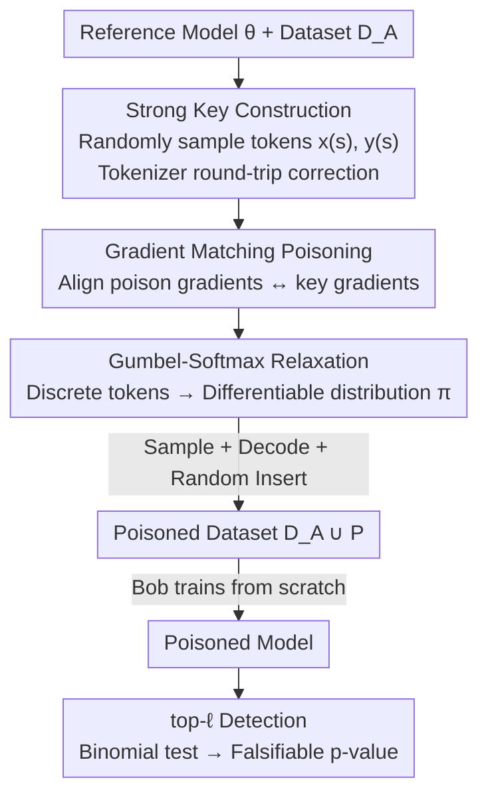

# Winter Soldier: Backdooring Language Models at Pre-training with Indirect Data Poisoning

**Conference**: ICLR 2026  
**Paper**: Published as a conference paper at ICLR 2026  
**Code**: None (Cache not provided)  
**Area**: LLM Security / Data Poisoning / Dataset Ownership Verification  
**Keywords**: Indirect Data Poisoning, Dataset Ownership Verification, Gradient Matching, Pre-training Backdoor, top-ℓ Detection

## TL;DR
This paper proposes "Winter Soldier": a method using prompt-tuning based on gradient matching to create poisoned samples. It enables an LLM to learn a "secret key prompt → secret key answer" mapping that **never appeared in the training corpus** during pre-training. With $<0.005\%$ poisoning tokens, it can detect whether a model used a specific dataset with a falsifiable probability of $p<10^{-55}$ without compromising the model's performance on standard benchmarks.

## Background & Motivation

**Background**: LLM pre-training relies on massive, diverse, and hard-to-trace text corpora. Dataset owners (Alice) want to determine if someone (Bob) has used their data for training without authorization, a problem known as **Dataset Ownership Verification (DOV)**. Existing methods include Membership Inference Attacks (MIA), canaries (embedding specific sequences), and explicit backdoors.

**Limitations of Prior Work**: Most existing methods rely on the model's **regurgitation (memorization)** of training data—either by outputting embedded sequences or by analyzing loss/logits of specific text. This presents three issues: ① model providers can bypass detection via deduplication, privacy-preserving generation, or n-gram filtering; ② detection often requires access to full logits or weights, which is impractical for closed-source APIs; ③ they lack **theoretical guarantees** that benign models will not trigger the detector (i.e., no falsifiable False Detection Rate/FDR).

**Key Challenge**: Detection signals must be learned by the model for verification, but any plaintext fragment (canaries, backdoor triggers) directly placed in the training set is both **filterable and lacks falsifiable error rates**. Is it possible for a target behavior to be learned by the model without ever appearing as plaintext in the training data?

**Goal**: Port Data Taggants (Bouaziz et al., 2025) from the image domain to text to: (1) let the LM learn a key sequence absent from the corpus; (2) enable detection using only top-ℓ predictions (no logits needed); (3) provide a theoretically falsifiable FDR.

**Key Insight**: The authors define this as **indirect data poisoning**—poisoned samples share **no n-grams** with the target behavior. The model does not "memorize" the key; instead, it is induced to produce gradient updates in the parameter space corresponding to the key.

**Core Idea**: Instead of making the key appear in the data, the process optimizes the "gradient direction of poisoned samples to align with the gradient direction of the key sequence" (gradient matching). Gumbel-Softmax is used to relax discrete token selection into a differentiable process, transforming an unsolvable integer programming problem into a gradient-based optimization problem.

## Method

### Overall Architecture
Scenario: Alice holds dataset $D_A$ and suspects Bob will use it. Alice wants Bob's model to learn a key pair $(x^{(s)}, y^{(s)})$—outputting $y^{(s)}$ when given $x^{(s)}$. However, $(x^{(s)}, y^{(s)})$ must not appear in the data. Alice follows three steps: ① Construct a "strong key" for statistical detection (random tokens sampled uniformly from the vocabulary, far from the training distribution); ② Use a pre-trained reference model to optimize "poisoned samples" to approximate the key sequence gradients, then sample, decode, and **randomly insert** them into $D_A$; ③ After Bob trains on the poisoned data, Alice observes the model's top-ℓ predictions for $x^{(s)}$ and performs a binomial test based on how many $y^{(s)}$ tokens appear in the top-ℓ.

### Key Designs

**1. Indirect Data Poisoning + Gradient Matching Objective: Injecting "Behavior" Rather Than "Text"**

While concatenating $x^{(s)}\|y^{(s)}$ (canary/backdoor) is effective, it is easily removed by n-gram filtering or "anti-regurgitation" defenses. Ours requires the poisoned sample set $X^{(p)}=\{x^{(p)}_i\}$ to approximate the key sequence in **gradient space**: maximizing the cosine similarity between the sum of poisoned sample gradients and the key gradient:

$$\mathcal{L}^{(P)}(X^{(p)}) = \cos\!\Big(\nabla_\theta \mathcal{L}^{(s)},\ \sum_{i=1}^{n_p}\nabla_\theta \mathcal{L}^{(p)}(x^{(p)}_i)\Big)$$

where $\nabla_\theta\mathcal{L}^{(s)}=-\nabla_\theta\log p_\theta(y^{(s)}|x^{(s)})$ is the key sequence gradient and $\nabla_\theta\mathcal{L}^{(p)}(x)=-\nabla_\theta\log p_\theta(x)$ is the gradient of the poisoned sample itself (auto-regressive). Insight: If a gradient descent step on poisoned samples moves parameters in the same direction as "training directly on the key," the model will learn the key—**even though the key never appeared in the data**. This explains the fundamental difference from "pairwise token backdoors" (which rely on forced association); in experiments, the former yields a p-value of $10^{-14}$, while the latter reaches only $10^{-4}$.

**2. Gumbel-Softmax Relaxation: Transforming Discrete Token Optimization into a Differentiable Problem**

The objective is non-differentiable regarding input tokens. Following Guo et al. (2021), the token $x^{(p)}_i$ at each poisoned position is treated as following a categorical distribution $\pi_i$ over the vocabulary. Using Gumbel-Softmax reparameterization $\pi_i=\text{Gumbel-Softmax}(\Psi_i)$, it is relaxed into a differentiable form. During calculation, the **embedding layer is bypassed**, and the convex combination of token embeddings $W_E\pi_i$ is fed to the model, allowing gradients to propagate back to the parameter vector $\Psi^{(p)}$:

$$\min_{\Psi^{(p)}\in\mathbb{R}^{L_p\times V}}\ \mathbb{E}_{\pi^{(p)}\sim\text{G-S}(\Psi^{(p)})}\,\mathcal{L}^{(P)}(\pi^{(p)})$$

After convergence, tokens are sampled from $\pi^{(p)}$, decoded to text, and inserted. The poisoning rate is defined as $\alpha = n_p L_p / \sum_{x\in D_A}|x|$ (ratio of poisoned tokens). This step is crucial for feasibility as it allows the gradient matching objective to be solved for discrete text.

**3. Strong Key Construction: Exchanging "Out-of-Distribution Random Sequences" for Falsifiable Null Hypotheses**

The key prompt $x^{(s)}$ consists of **uniformly sampled random tokens** (out-of-distribution), as does the key answer $y^{(s)}$. This is not for stealth, but to **ensure a clean null hypothesis for statistical testing**: Under $H_0$ (Bob did not use Alice's data), the probability of the model outputting $y^{(s)}$ is $(\ell/V)^{|y^{(s)}|}$, which is analytically determined by vocabulary size and ℓ. Furthermore, as tokenizers are not bijections, $\tilde{x}^{(s)}=\text{encode}(\text{decode}(x^{(s)}))$ is used as the actual key prompt to ensure consistency between optimization and inference.

**4. Binomial Test Detection Using Only top-ℓ: Falsifiable FDR without Accessing Logits**

During detection, Alice considers only the token-by-token top-ℓ predictions (e.g., ℓ = 4 or 20) for $x^{(s)}$. She counts how many tokens in $y^{(s)}$ fall into the corresponding top-ℓ positions, denoted as $T^{(s)}_\ell$. Under $H_0$, $T^{(s)}_\ell$ follows a **binomial distribution** with parameters $(L_s,\ \ell/V)$. A binomial test can then be performed on the observed $T^{(s)}_\ell$ to calculate an **exact, theoretically falsifiable p-value** (FPR). Unlike MIA/canary which require loss or logits, this only requires top-ℓ predictions—available from closed-source APIs (e.g., OpenAI's `top_logprobs`). This provides a hard guarantee on the probability of false triggers in benign models.

### Loss & Training
- Poison Generation: Optimized $\Psi^{(p)}$ using a pre-trained reference model (20B tokens, or 135M model trained on 100B tokens) to maximize the gradient matching objective; each key generates $n_p=64$ poisoned samples of length $L_p=256$.
- Evaluation Protocol: Re-trained different models from scratch (135M/360M on 5B tokens, 1.4B on 10B tokens) on poisoned data with different initializations. Probed using $x^{(s)}$ to measure $\{T^{(s)}_\ell\}_{\ell\in[1..20]}$ and p-values.

## Key Experimental Results

### Main Results
Models were trained from scratch using SmolLM recipes (135M / 360M / 1.4B) on FineWeb-Edu + Cosmopedia v2, with vocabulary $V=49{,}136$.

DOV Detection Effectiveness Comparison (1.4B model, lower p-value is stronger):

| Target Type | Method | p-value |
|----------|------|---------|
| (i) 1000 Training Samples | MIN-K% PROB | $2.47\times10^{-2}$ |
| (i) 1000 Training Samples | Z-score canary | $8.65\times10^{-1}$ |
| (ii) Key sequence ($|y^{(s)}|=5$) | Pairwise token backdoor | $1.55\times10^{-3}$ |
| (ii) Key sequence | MIN-K% PROB | $6.86\times10^{-6}$ |
| (ii) Key sequence | Z-score canary | $4.04\times10^{-15}$ |
| (ii) Key sequence | **Ours (Winter Soldier)** | $\mathbf{1.09\times10^{-55}}$ |

Injection Effectiveness (360M model, $\alpha=0.003\%$): Ours achieved p-values as low as $10^{-14}$, while pairwise token backdoors reached only $10^{-4}$. Canaries are the most effective (topline) but are easily filtered or disabled.

### Ablation Study

| Configuration | Key Metrics / Results | Description |
|------|------|------|
| Poisoning Rate $\alpha$ | Effective even at $\alpha = 0.001\%$ | <0.005% poison tokens are sufficient for injection |
| Model Scale N (135M→1.4B) | 1.4B model p-value reaches $10^{-55}$ | Larger models are more sensitive to poisoning |
| Key Answer Length $|y^{(s)}|$ | Longer answers provide stronger guarantees | Length 1 converges fastest |
| Transferability (Alice/Bob diff. size) | Transferable across scales/archs | Poison from larger models is more effective on smaller ones |
| Benchmark Performance | No significant difference from benign | No drops in ARC/HellaSwag/MMLU/PIQA |

### Key Findings
- **Gradient Matching ≠ Simple Association**: Our p-values significantly outperform "pairwise token backdoors," indicating the method shapes learning in gradient space rather than just forcing token associations.
- **Larger is More Fragile**: The 1.4B model was most sensitive ($10^{-55}$). When Bob used a 135M model, the p-values for poison generated by Alice using {135M, 360M, 1.4B} reference models (at ℓ=10) were $8.13\times10^{-4}$, $2.48\times10^{-7}$, and $3.37\times10^{-11}$ respectively—poison from larger models is more potent.
- **Stealth**: Qualitative analysis shows the model only outputs the key answer when given the exact key prompt; it behaves normally for standard, random character, or random token prompts.
- **Robustness**: Even when Bob trains or fine-tunes on held-out poisoned data, the 1.4B model maintains 100% top-20 key accuracy (Table 2).

## Highlights & Insights
- **Transforming "Detection" into "Gradient Alignment"**: Bypasses all defenses targeting regurgitation or n-grams by not requiring the model to memorize plaintext.
- **Top-ℓ + Binomial Test**: Creates a statistical test requiring only top-ℓ predictions with an analytical null hypothesis, making it compatible with closed-source APIs and providing falsifiable FDR guarantees.
- **Solving Discrete Challenges via Gumbel-Softmax**: Bypassing the embedding layer with convex combinations is a universal trick for making discrete text poisoning differentiable.
- **Extremely Low Poisoning Rate**: $<0.005\%$ tokens are enough, meaning owners can "watermark" datasets with negligible cost.

## Limitations & Future Work
- **Reference Model Requirement**: Relies on a pre-trained reference model to compute gradients; Alice must know if Bob uses a Transformer-like architecture.
- **White-box Poisoning, Gray-box Detection**: Requires backpropagation on a reference model (white-box) during poison generation, which may not always perfectly match Bob's model.
- **Strong Key OOD Nature**: Strong keys are random sequences, making this suitable for watermarking/forensics rather than general-purpose backdoors.
- **Lack of Defender Perspective**: Focuses on attack/forensics feasibility; defense mechanisms for Bob against such indirect poisoning require further investigation.

## Related Work & Insights
- **vs Canary (Wei et al., 2024)**: Canaries insert plaintext keys; effective but easily filtered. Ours uses no plaintext for target behavior, making filtering impossible.
- **vs Pairwise Backdoors (Panaitescu-Liess et al., 2025)**: Relies on heuristic associations with higher poisoning rates and weaker p-values ($10^{-3\sim-4}$). Ours reduces poisoning by orders of magnitude and reaches $10^{-55}$.
- **vs MIA (Shi et al., 2023)**: MIA requires loss/logits, performs near random on LLMs, and lacks error guarantees. Ours only needs top-ℓ and is falsifiable.
- **vs Data Taggants (Bouaziz et al., 2025)**: This work is a transfer and theoretical expansion from image classification to text pre-training, adding Gumbel-Softmax for discrete tokens and binomial test guarantees for the text domain.

## Rating
- Novelty: ⭐⭐⭐⭐⭐ First indirect poisoning implementation on LLM pre-training with falsifiable detection.
- Experimental Thoroughness: ⭐⭐⭐⭐ Solid across three scales, multiple poisoning rates, and transferability tests.
- Writing Quality: ⭐⭐⭐⭐ Clear narrative with well-defined threats.
- Value: ⭐⭐⭐⭐⭐ Provides a low-cost, falsifiable forensic tool for data owners.

<!-- RELATED:START -->

## Related Papers

- [\[NeurIPS 2025\] ToxicTextCLIP: Text-Based Poisoning and Backdoor Attacks on CLIP Pre-training](../../NeurIPS2025/llm_safety/toxictextclip_text-based_poisoning_and_backdoor_attacks_on_clip_pre-training.md)
- [\[ICLR 2026\] Unmasking Backdoors: An Explainable Defense via Gradient-Attention Anomaly Scoring for Pre-trained Language Models](unmasking_backdoors_an_explainable_defense_via_gradient-attention_anomaly_scorin.md)
- [\[ICLR 2026\] Natural Identifiers for Privacy and Data Audits in Large Language Models](natural_identifiers_for_privacy_and_data_audits_in_large_language_models.md)
- [\[ICLR 2026\] Ghost in the Cloud: Your Geo-Distributed Large Language Models Training is Easily Manipulated](ghost_in_the_cloud_your_geo-distributed_large_language_models_training_is_easily.md)
- [\[ACL 2025\] Exploring Forgetting in Large Language Model Pre-Training](../../ACL2025/llm_safety/exploring_forgetting_in_large_language_model_pre-training.md)

<!-- RELATED:END -->
