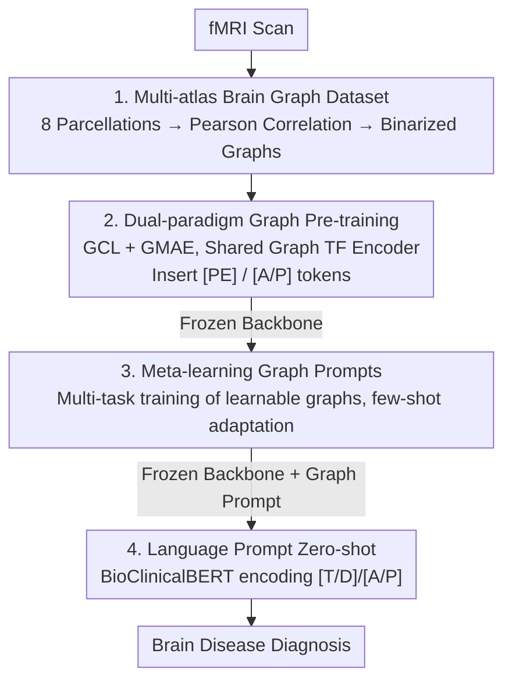

# A Brain Graph Foundation Model: Pre-Training and Prompt-Tuning across Broad Atlases and Disorders

**Conference**: ICLR 2026  
**OpenReview**: [https://openreview.net/forum?id=PeGHkAaRxs](https://openreview.net/forum?id=PeGHkAaRxs)  
**Code**: https://github.com/weixinxu666/BrainGFM  
**Area**: Medical Imaging / Brain Imaging / Graph Foundation Models  
**Keywords**: fMRI, Brain Graph Foundation Model, Graph Pre-training, Graph Prompting, Meta-learning, Zero-shot Diagnosis

## TL;DR
BrainGFM models fMRI brain networks as graphs and employs "Graph Contrastive Learning + Graph Masked Autoencoding" for large-scale pre-training on 400,000 brain graphs across 27 datasets and 8 brain atlases. By using meta-learning optimized graph prompts for few-shot adaptation and BioClinicalBERT-encoded language prompts for zero-shot transfer, a frozen foundation model can perform direct diagnosis across diverse atlases, brain disorders, and task settings.

## Background & Motivation

**Background**: Following the success of LLMs, the neuroscience community has begun developing "Brain Foundation Models." fMRI is the most common functional brain data. Existing brain FMs mostly utilize Transformer architectures and pre-train on two types of inputs: either raw time-series (time-series-based, e.g., BrainLM) or ROI-level connectome/functional connectivity features (Connectome/FC-based, e.g., BrainMass, BrainNPT).

**Limitations of Prior Work**: Both approaches have significant drawbacks. Time-series methods perform masked modeling directly on long sequences, incurring extreme computational costs. FC methods are lightweight but compress the topological connectivity between brain regions into static features, losing inter-regional interaction structures and limiting downstream accuracy. Crucially, almost all existing brain FMs are pre-trained on a **single brain atlas (parcellation)**, which limits data scale and misses complementary brain representations from different parcellation schemes—despite literature showing that different disorders are better characterized under different atlases (e.g., Schaefer200/Power264 for MDD, Shen268/Schaefer200 for ASD).

**Key Challenge**: Brain FMs are simultaneously hindered by three issues: ① Data scarcity and heterogeneity (expensive fMRI acquisition, high inter-site variance, small single-atlas corpora); ② The trade-off between efficiency and effectiveness (time-series methods are accurate but slow; FC methods are fast but coarse); ③ Rigid downstream transfer (full parameter fine-tuning requires significant labeling, and models often fail when encountering new atlases or disorders with few or zero labels).

**Goal**: To build a unified brain FM that can ingest heterogeneous multi-atlas data, balance efficiency and accuracy, and flexibly adapt to arbitrary atlases and disorders under few-shot/zero-shot settings.

**Key Insight**: The author observes that the brain is inherently a graph (ROIs as nodes, inter-regional correlations as edges). Instead of bypassing through time-series or flat FC features, the model should **pre-train directly on graphs**. Graph backbones naturally preserve regional connectivity topology with efficiency close to FC methods and accuracy approaching time-series methods. Mixing multiple atlases for pre-training expands the data scale eightfold and enables the learning of "atlas-invariant" brain patterns.

**Core Idea**: BrainGFM is pre-trained using a dual paradigm of graph contrastive and graph masked autoencoding on multi-atlas brain graphs. It then utilizes "meta-learning optimized graph prompts (few-shot) + language prompts (zero-shot)" to allow a frozen backbone to be plug-and-play across atlases and disorders.

## Method

### Overall Architecture
The input to BrainGFM is an fMRI scan. ROI time-series are extracted according to a specific brain atlas, and pairwise Pearson correlations are calculated and binarized to obtain a **brain graph** (nodes = ROIs, edges = significant connections). The output is the diagnostic result for a specific brain disorder. The pipeline proceeds in four stages: **constructing a multi-atlas large-scale graph dataset** to expand the corpus; **dual-paradigm graph pre-training** using a Graph Transformer backbone with atlas tokens to perceive the source parcellation; **freezing the backbone** and using **meta-learning optimized graph prompts** for few-shot adaptation; and finally, using **language prompts** (encoding disorder/atlas semantics via BioClinicalBERT) for zero-shot transfer. The essence of the latter two stages is that all task/disorder/atlas-specific knowledge is "outsourced" to lightweight prompts while the backbone remains stationary.

### Key Designs

**1. Multi-atlas Large-scale Brain Graph Corpus: 8x Data Expansion and Atlas-invariant Features**

The fundamental bottleneck is data. To address fMRI scarcity, the authors aggregated 27 public fMRI datasets covering 25 common neurological and psychiatric disorders, involving 25,000 subjects and 60,000 scans. Crucially, **each subject is processed eight times using different parcellation schemes**: functional atlases (Schaefer100/200/300, SHEN268, Power264, Gordon333) and anatomical atlases (AAL116/AAL3v1). This expands the data scale to approximately 400,000 graph samples. This approach allows the model to learn "atlas-invariant" brain patterns while preserving atlas-specific features, enhancing generalization and robustness. Ablations confirm that mixed-atlas pre-training significantly outperforms any single-atlas setting.

**2. Dual-paradigm Graph Pre-training with Atlas-aware Tokens: Balancing Global and Local Context**

The Graph Transformer backbone treats each token as a brain ROI, using Random Walk Structural Encoding (RWSE) as the positional encoding `[PE]`. Two self-supervised tasks share the same encoder: Graph Contrastive Learning (GCL), which generates positive/negative pairs by randomly dropping nodes/edges to learn **global** graph-level representations; and Graph Masked Autoencoding (GMAE), which reconstructs masked components to learn **local** ROI-level representations. Combining these enables the backbone to capture the multi-scale organization of brain pathology. Additionally, **atlas/parcellation tokens `[A/P]`** are inserted to allow the model to explicitly distinguish the source atlas, further improving cross-disorder generalization.

**3. Meta-learning Optimized Graph Prompts: Few-shot Adaptation with a Frozen Backbone**

To avoid the over-fitting risks of full-parameter fine-tuning on rare diseases, the authors utilize **graph prompts**. A learnable graph with the same structure as the input brain graph is designed, where nodes and edges are trainable parameters. Only this lightweight prompt is updated during adaptation; the backbone remains frozen. These prompts are trained using **meta-learning** across a distribution of tasks (disease-atlas pairs) to learn how to "quickly adapt to new tasks." This enables effective migration to unseen disorders or atlases with minimal samples (few-shot).

**4. Language Prompt-driven Zero-shot Transfer: Semantic Priors for Unseen Tasks**

For zero-shot scenarios where no labeled samples are available, **language prompts** provide semantic priors. Textual descriptions (full name, abbreviation, clinical description) for each disorder are encoded using **BioClinicalBERT** into semantic embeddings, projected as task/disease tokens `[T/D]`. Atlas names (e.g., "Schaefer100") are similarly encoded as `[A/P]` tokens. These tokens are concatenated with brain graph ROI tokens to guide the foundational model. During zero-shot inference, the backbone and graph prompts are frozen, and the model relies entirely on the injected semantic priors to identify and adapt to unseen tasks.

### Loss & Training
The pre-training phase is driven by two losses: the contrastive loss of GCL and the MSE reconstruction loss of GMAE. In the few-shot phase, the backbone is frozen while the graph prompt is optimized via meta-learning. In the zero-shot phase, both are frozen, and semantic priors are injected via language tokens without gradient updates.

## Key Experimental Results

Metrics include AUC / ACC / SEN / SPE. All baseline models were retrained on the same corpus for a fair comparison.

### Main Results

The table below shows the AUC (%) comparison for various disorders on the Schaefer100 atlas (PT indicates Pre-trained). BrainGFM leads among graph foundation models and outperforms FC-based methods (BrainMass/BrainNPT) while matching or exceeding time-series methods (BrainLM).

| Method | PT | ADHD200 (ADHD) | ABIDE II (ASD) | ADNI 2 (AD) | HBN (PTSD) |
|------|--------|------|------|------|------|
| Vanilla GCN | No | 62.3 | 64.2 | 69.1 | 78.7 |
| BrainNPT (FC) | Yes | 65.6 | 66.8 | 72.0 | 77.9 |
| BrainMass (FC) | Yes | 67.0 | 68.9 | 77.8 | 79.6 |
| BrainLM (Time-series) | Yes | 67.6 | 68.1 | 78.3 | 80.5 |
| Brain-JEPA | Yes | 69.8 | 70.1 | 79.1 | 82.2 |
| **BrainGFM** | Yes | **70.3** | **71.2** | **80.3** | **83.2** |

### Ablation Study

Impact of pre-training atlas combinations (ABIDE II / ASD, FT Acc, two values correspond to two evaluation settings):

| Pre-training Corpus | Atlas Type | Parcellation | Fine-tuning Accuracy |
|------|------|------|------|
| No Pre-training | - | - | 65.2 / 67.1 |
| Schaefer100 | Functional | Single | 67.5 / 70.2 |
| AAL116 | Anatomical | Single | 66.6 / 69.2 |
| Sch(100+200+300) | Functional | Multi-res | 68.5 / 71.3 |
| Sch100 + AAL116 | Mixed | Single | 68.8 / 71.6 |
| All Atlases | Mixed | Mixed | **70.5 / 73.3** |

### Key Findings
- **Multi-atlas mixed pre-training yields the largest gains**: Moving from single-atlas (67.5) to all-atlas mixed (70.5) improves performance by learning complementary neurobiological representations.
- **Prompts are critical as data becomes scarcer**: While the gap is smaller in full-shot scenarios, the structural priors of graph prompts and semantic priors of language prompts significantly enhance performance in 1% few-shot and zero-shot settings.
- **GCL and GMAE are complementary**: GCL learns global graph features while GMAE learns local ROI features; combining them provides a multi-scale representation superior to using either alone.
- **Efficiency-Accuracy Sweet Spot**: BrainGFM's pre-training efficiency is close to vanilla graph models, and prompt tuning allows for faster adaptation than FC methods, while accuracy matches or exceeds the slower time-series-based BrainLM.

## Highlights & Insights
- **Turning "Multi-atlas" heterogeneity into a benefit**: Re-calculating the same fMRI across 8 parcellations provides 8x data expansion and learns atlas-invariant features—a strategy transferable to other medical imaging domains.
- **Injecting semantics via LLMs**: Encoding clinical text with BioClinicalBERT bridges the gap between brain graphs and zero-shot diagnosis by providing the model with medical language priors.
- **Three-level transfer hierarchy**: Progressing from full-parameter fine-tuning to graph prompts (frozen backbone) to language prompts (frozen graph prompt) effectively reduces trainable parameters to nearly zero, matching the data availability gradient in reality.
- **Graph backbone efficiency**: Replacing time-series with graphs preserves topological connectivity without the overhead of processing long sequences.

## Limitations & Future Work
- The corpus is still incomplete: data from OpenNeuro and task-fMRI were not fully included due to manual costs, and UK Biobank was excluded due to licensing. Current experiments focus on resting-state fMRI.
- While the model claims modality-agnosticism for expansion to task-fMRI/EEG/DTI, empirical results for these modalities are not provided.
- Zero-shot performance depends on the quality of disease descriptions; sensitivity to phrasing in `[T/D]` tokens has not been fully explored.

## Related Work & Insights
- **vs. Time-series Brain FMs (BrainLM)**: BrainLM is accurate but extremely slow due to long sequences; BrainGFM matches accuracy with significantly higher efficiency.
- **vs. FC-based Brain FMs (BrainMass, BrainNPT)**: These use static ROI features and lack interaction modeling; BrainGFM preserves topology for much higher accuracy at similar efficiency.
- **vs. Previous Fine-tuning**: Previous models lacked the flexibility to adapt to unseen atlases or disorders without heavy retraining; BrainGFM’s prompt-based approach is more robust to low-resource settings.

## Rating
- Novelty: ⭐⭐⭐⭐⭐ First brain FM to utilize a graph foundation paradigm with a comprehensive multi-atlas and prompt-based transfer approach.
- Experimental Thoroughness: ⭐⭐⭐⭐⭐ Extensive testing across 27 datasets and 25 disorders with robust ablations.
- Writing Quality: ⭐⭐⭐⭐ Clear motivation and methodology, though some data points are categorized in figures rather than full tables.
- Value: ⭐⭐⭐⭐⭐ Provides a plug-and-play foundation model for low-resource brain disease diagnosis with open-source potential for multi-modality.

<!-- RELATED:START -->

## Related Papers

- [\[ICLR 2026\] Spike-based Digital Brain: A Novel Fundamental Model for Brain Activity Analysis](spike-based_digital_brain_a_novel_fundamental_model_for_brain_activity_analysis.md)
- [\[NeurIPS 2025\] DCA: Graph-Guided Deep Embedding Clustering for Brain Atlases](../../NeurIPS2025/medical_imaging/dca_graph-guided_deep_embedding_clustering_for_brain_atlases.md)
- [\[AAAI 2026\] MIRNet: Integrating Constrained Graph-Based Reasoning with Pre-training for Diagnostic Medical Imaging](../../AAAI2026/medical_imaging/mirnet_integrating_constrained_graph-based_reasoning_with_pre-training_for_diagn.md)
- [\[ICLR 2026\] BioX-Bridge: Model Bridging for Unsupervised Cross-Modal Knowledge Transfer across Biosignals](biox-bridge_model_bridging_for_unsupervised_cross-modal_knowledge_transfer_acros.md)
- [\[ICLR 2026\] ODEBRAIN: Continuous-Time EEG Graph for Modeling Dynamic Brain Networks](odebrain_continuous-time_eeg_graph_for_modeling_dynamic_brain_networks.md)

<!-- RELATED:END -->
