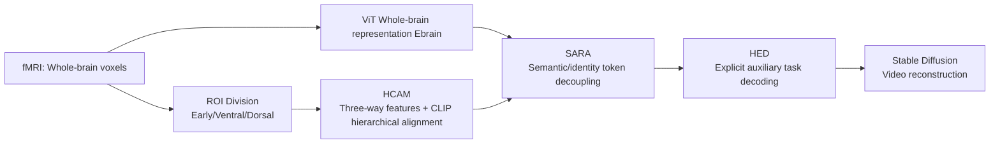

# A Cognitive Process-Inspired Architecture for Subject-Agnostic Brain Visual Decoding

**Conference**: ICLR 2026  
**OpenReview**: [https://openreview.net/forum?id=H1GLFKk0xE](https://openreview.net/forum?id=H1GLFKk0xE)  
**Code**: [https://github.com/xmed-lab/VCFLOW](https://github.com/xmed-lab/VCFLOW)  
**Area**: Brain visual decoding / fMRI-to-video / Neuroscience applications  
**Keywords**: subject-agnostic brain decoding, fMRI-to-video, ventral-dorsal stream, CLIP hierarchical alignment, contrastive learning, cross-subject generalization  

## TL;DR
VCFLOW incorporates the "ventral-dorsal dual-stream" mechanism of the human visual cortex into a decoding model. It decomposes fMRI signals into early visual, ventral, and dorsal streams, aligning them with different hierarchical CLIP features. By using a redistribution adapter to decouple "subject-agnostic semantics" from "subject identity," it achieves fMRI-to-video reconstruction **without retraining on new subjects** for the first time. Compared to subject-specific training, it loses only about 7% accuracy while reducing single-video generation from 12 hours of training to 10 seconds of inference.

## Background & Motivation
- **Background**: Rapid progress in fMRI-to-video reconstruction (MinD-Video, NeuroClips, NEURONS) aims to recover continuous dynamic visual experiences from brain signals, balancing fine-grained vision, abstract semantics, and temporal coherence.
- **Limitations of Prior Work**: These methods are almost exclusively **subject-specific**, requiring $\ge 12$ hours of individual-specific data and retraining for a new patient. This is impractical for downstream scenarios like large-scale screening, clinical rehabilitation, or detecting schizophrenia/hallucinations/cognitive disorders.
- **Key Challenge**: Directly adapting subject-specific models to shared spaces (e.g., NEURONS*) performs poorly on unseen subjects as they fail to extract cross-subject universal semantics. Data-level functional alignment like GLFA **depends on pre-training all subject fMRI data together**, violating true "subject-agnostic" settings and lacking semantic hierarchy and robustness.
- **Goal**: Build a **truly subject-agnostic** decoder capable of robustly decoding new subjects at the cognitive feature level with zero retraining and second-level inference.
- **Core Idea**: **[Neuroscience Prior-Driven Architecture]** The visual cortex naturally divides into early visual, ventral (high-level semantics), and dorsal (motion and space) regions, corresponding to low-level, high-level, and video motion features of CLIP. **[Semantic-Identity Decoupling]** Use a token-level redistribution block to explicitly separate "universal semantics" and "subject identity," refining subject-agnostic representations via contrastive learning.

## Method

### Overall Architecture
VCFLOW consists of three serial modules: first, the **HCAM (Hierarchical Cognitive Alignment Module)** splits fMRI into three streams (early/ventral/dorsal) based on the dual-stream pathway and aligns them with corresponding CLIP layers. Second, the **SARA (Subject-Agnostic Redistribution Adapter)** maps individual semantics into a shared, subject-invariant semantic space. Finally, the **HED (Hierarchical Explicit Decoder)** decodes multi-dimensional semantic features through explicit auxiliary tasks (captioning / classification / segmentation / blurry video) and merges them to feed into Stable Diffusion for video reconstruction.

### Key Designs
**1. Functional ROI Division + Hierarchical Feature Extraction: Embedding the dual-stream hypothesis into voxel grouping.** Inspired by the dual-stream hypothesis, whole-brain voxel sequences $X\in\mathbb{R}^{B\times S\times V}$ are sliced into early visual, ventral, and dorsal groups using ROI indices $I_{\text{ROIs}}$: $X_{\text{ROIs}}=X[:,:,I_{\text{ROIs}}]$. The authors emphasize that "directly using only a subset of voxels to extract information destroys semantic integrity," so it is not a "hard" cut—$E_{\text{brain}}$ is extracted by a ViT on the whole voxel sequence as global context, and the three subsets are projected into the same latent space to obtain $E_{\text{early}},E_{\text{ventral}},E_{\text{dorsal}}$. After SARA, global representation passes through a DALL·E 2-style diffusion prior to the OpenCLIP embedding space. Learnable cross-attention then injects global context into the three streams to get $F_{\text{early}},F_{\text{ventral}},F_{\text{dorsal}}$. This preserves hierarchical specificity without losing global semantic coherence.

**2. Hierarchical Cognitive Alignment: Aligning each stream with the "corresponding cognitive level" of CLIP rather than a uniform final layer.** This is the most neuroscience-aligned part: high-level semantics (ventral) naturally align with the final CLIP vision layer $F_{\text{clip}}^{(L)}$; low-level structures (early visual) are aligned with **early layers** of CLIP ViT $F_{\text{clip}}^{(l)}$, based on the finding that deep network hierarchies correspond to human visual hierarchies. Dorsal motion is aligned with **video** CLIP embeddings to explicitly model motion components. Alignment uses BiMixCo loss (bidirectional contrastive objective with MixCo data augmentation). This layer-by-layer mapping aligns "CLIP's feature pyramid" with the "visual cortex's cognitive pyramid."

**3. SARA Redistribution Adapter: Token-level separation of "universal semantics" and "subject identity".** Borrowing the idea of ViT register tokens, input features $E\in\mathbb{R}^{B\times S\times L\times C}$ are expanded: $E_{\text{exp}}=\text{Expand}(E)\in\mathbb{R}^{B\times S\times(L+L_{\text{redis}})\times C}$. The redistribution layer outputs two sets: $[T_{\text{sem}},T_{\text{subj}}]=\text{Redistribution}(E_{\text{exp}})$. Three losses are used: $L_{\text{align}}=\text{BiMixCo}(T_{\text{sem}},F_{\text{clip}})$ for CLIP alignment; symmetric InfoNCE across subjects $L_{\text{generic}}=\frac{1}{2(S-1)}\sum_{i=2}^{S}\big[\text{InfoNCE}(T^{\text{norm}}_{i-1,\text{sem}},T^{\text{norm}}_{i,\text{sem}})+\text{InfoNCE}(T^{\text{norm}}_{i,\text{sem}},T^{\text{norm}}_{i-1,\text{sem}})\big]$ to align semantics of different subjects (more stable with more subjects); and a subject classifier with cross-entropy $L_{\text{subj}}$ on $T_{\text{subj}}$ to preserve individual discriminability. Total loss: $L_{\text{SARA}}=\lambda_{\text{align}}L_{\text{align}}+\lambda_{\text{subj}}L_{\text{subj}}+\lambda_{\text{generic}}L_{\text{generic}}$. Decoupled semantic tokens are used for new subjects while stripping identity—key for subject-agnostic decoding.

**4. HED Hierarchical Explicit Decoding: Using auxiliary tasks to "force" abstract embeddings into readable modalities.** Directly reconstructing from embeddings is difficult; HED assigns tasks to each stream: ventral $F_{\text{ventral}}$ for image captioning + object classification ($L_{\text{caption}},L_{\text{cls}}$); early visual $F_{\text{early}}$ for segmentation to capture edges/textures ($L_{\text{seg}}$); and dorsal $F_{\text{dorsal}}$ projected to frame dimensions $\tilde F_{\text{dorsal}}$ and VAE latent space for alignment with blurry video ($L_{\text{motion}}$). Total loss $L_{\text{HED}}=\lambda_{\text{caption}}L_{\text{caption}}+\lambda_{\text{cls}}L_{\text{cls}}+\lambda_{\text{seg}}L_{\text{seg}}+\lambda_{\text{motion}}L_{\text{motion}}$, with progressive weighting as per NEURONS. Grounding brain features in "intermediates" like text/segmentation provides interpretable supervision anchors for each cognitive dimension.

## Key Experimental Results
Data: DIR + GOD (8 subjects) for pre-training; cc2017 fMRI-video (8640/1200 split) for main tasks. Metrics: frame-level (Top-K, SSIM, PSNR) and video-level (Kinetics-400 classification, CLIP-pcc).

### Main Results (cc2017, subject-agnostic, average of 3 subjects)

| Method | w/o Pretrain | Frame 50-way↑ | Frame 2-way↑ | SSIM↑ | PSNR↑ | Video 50-way↑ | Video 2-way↑ | CLIP-pcc↑ |
|------|:---:|:---:|:---:|:---:|:---:|:---:|:---:|:---:|
| fMRI-PTE-V | × | 11.1% | 76.6% | 0.147 | - | 17.8% | 84.1% | - |
| GLFA (all subjects) | × | 11.6% | 77.5% | 0.173 | - | 18.2% | 84.1% | - |
| NEURONS\* | ✓ | 10.1% | 74.9% | 0.380 | 9.612 | 16.1% | 83.6% | 0.931 |
| GLFA\* | ✓ | 9.6% | 74.8% | 0.137 | - | 17.0% | 84.0% | - |
| **VCFLOW** | ✓ | **14.0%** | **77.9%** | **0.396** | **10.478** | **18.2%** | **84.5%** | **0.940** |

- vs. subject-agnostic baseline GLFA\*: Frame 50-way **+45.8%**, SSIM **+189.1%**; vs. NEURONS\*: Frame 50-way +38.6%, Video 50-way +13.0%.
- Even **outperformed** GLFA which "cheated" by pre-training on all subject fMRI data (Frame 50-way +20.7%, SSIM +128.9%), indicating semantic hierarchical alignment + decoupling is more effective than data-level functional alignment.

### Ablation Study (subj 2,3→1, results for Subject 1)

| Pretrain | HCAM | SARA | HED | Frame 50-way↑ | SSIM↑ | PSNR↑ | Video 50-way↑ | CLIP-pcc↑ |
|:---:|:---:|:---:|:---:|:---:|:---:|:---:|:---:|:---:|
| ✓ | | | | 11.3% | 0.401 | 9.720 | 12.6% | 0.908 |
| ✓ | ✓ | | | 10.4% | 0.382 | 9.866 | 15.3% | 0.918 |
| ✓ | ✓ | ✓ | | 11.8% | 0.357 | 9.583 | 14.7% | 0.919 |
| ✓ | ✓ | ✓ | ✓ | 12.4% | 0.389 | 10.442 | 15.2% | 0.934 |
| ✓✓ | ✓ | ✓ | ✓ | **14.2%** | 0.389 | 10.469 | **18.9%** | **0.944** |

### Key Findings
- HCAM improves semantics, SARA enhances cross-subject transfer (CLIP-pcc/PSNR), and **HED provides the largest gain** (high-level semantics and reconstruction quality). Sufficient pre-training with all modules further pushes Frame 50-way from 12.4% to 14.2%.
- **Cortical Projection Visualization**: Early visual embeddings correspond to V1–V4, ventral embeddings activate FFA/PPA, and dorsal embeddings align with motion areas like MST—high consistency between decoded features and neurocognitive structures provides interpretable evidence.
- **Efficiency**: 10-second inference per video, zero retraining, with an average accuracy drop of only ~7% compared to 12-hour per-person training.

## Highlights & Insights
- **Novelty of Task Definition**: First to formalize fMRI-to-video as a subject-agnostic setting, directly addressing the true bottleneck of clinical deployment (zero retraining for new patients).
- **Neuroscience Priors in Architecture**: Dual-pathway and CLIP hierarchical mapping are concrete architectural decisions, not just narrative motivation, validated by cortical projection visualization.
- **Explicit Semantic/Identity Decoupling**: The combination of redistribution + cross-subject InfoNCE + subject classifier optimizes generalizable semantics and specific identity separately, which is the root cause of its superiority over data-level alignment.
- **Auxiliary Tasks as Supervision Anchors**: Framing abstract brain features into readable intermediate modalities (captioning/classification/segmentation/blurry video) improves both quality and interpretability.

## Limitations & Future Work
- Evaluated only on the cc2017 fMRI-video dataset with 3 subjects; true generalization across datasets and scanners needs validation with larger cohorts.
- ROI division depends on existing neuroscience priors and functional alignment pre-processing (fMRI-PTE), showing sensitivity to pre-processing pipelines and ROI selection.
- A ~7% accuracy gap remains compared to subject-specific upper bounds; clinical deployment must consider signal quality and protocol variations.
- The diffusion prior + Stable Diffusion pipeline is heavy; the "10-second inference" assumes pre-aligned embeddings, and the cost of an end-to-end clinical pipeline needs evaluation.

## Related Work & Insights
- **fMRI-to-video**: MinD-Video (diffusion semantic reconstruction), NeuroClips (keyframes + blurry video guidance), NEURONS (multi-dimensional information via explicit tasks)—VCFLOW adds subject-agnostic and hierarchical alignment to these methods.
- **Cross-Subject Learning**: GLFA's data-level functional alignment is the direct competitor. This paper highlights its lack of semantic hierarchy and dependence on pre-training with all subjects. The insight is that "semantic hierarchical alignment + token-level identity decoupling" outperforms pure data-space alignment.
- **Applicability**: Mapping domain priors (visual cortex hierarchy) to multi-layer LLM feature pyramids (CLIP hierarchies) is a paradigm transferable to other "signal-to-semantic" decoding tasks; ViT register tokens are cleverly repurposed as "identity token reservoirs."

## Rating
- **Novelty**: ⭐⭐⭐⭐ First to define subject-agnostic fMRI-to-video; solid mapping of neuroscience dual-pathway priors to CLIP hierarchical alignment; novel identity/semantic decoupling.
- **Experimental Thoroughness**: ⭐⭐⭐ Comparative experiments are thorough and ablations are clear, including cortical visualization; however, the subject/dataset scale is relatively small, providing limited evidence of broad generalization.
- **Writing Quality**: ⭐⭐⭐⭐ Strong logical chain from motivation to neuroscience to method to verification; excellent visualization (dual-pathway, framework, inference, cortical projections).
- **Value**: ⭐⭐⭐⭐ Addresses clinical bottlenecks (zero retraining, second-level inference); significant for the scalability of BCI applications.

<!-- RELATED:START -->

## Related Papers

- [\[ICLR 2026\] Towards Interpretable Visual Decoding with Attention to Brain Representations](towards_interpretable_visual_decoding_with_attention_to_brain_representations.md)
- [\[ICLR 2026\] Autoregressive Visual Decoding from EEG Signals](autoregressive_visual_decoding_from_eeg_signals.md)
- [\[ICLR 2026\] SEED: Towards More Accurate Semantic Evaluation for Visual Brain Decoding](seed_towards_more_accurate_semantic_evaluation_for_visual_brain_decoding.md)
- [\[NeurIPS 2025\] MoRE-Brain: Routed Mixture of Experts for Interpretable and Generalizable Cross-Subject fMRI Visual Decoding](../../NeurIPS2025/medical_imaging/more-brain_routed_mixture_of_experts_for_interpretable_and_generalizable_cross-s.md)
- [\[AAAI 2026\] NeuroBridge: Bio-Inspired Self-Supervised EEG-to-Image Decoding via Cognitive Priors and Bidirectional Semantic Alignment](../../AAAI2026/medical_imaging/neurobridge_bio-inspired_self-supervised_eeg-to-image_decoding_via_cognitive_pri.md)

<!-- RELATED:END -->
