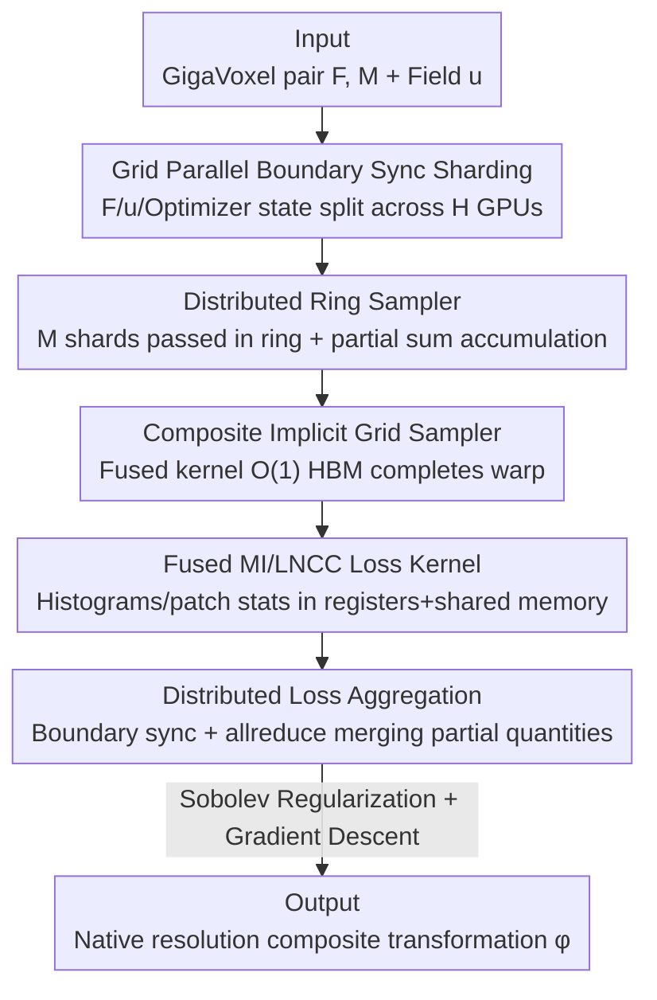

# A Scalable Distributed Framework for Multimodal GigaVoxel Image Registration

**Conference**: ICLR2026  
**OpenReview**: [https://openreview.net/forum?id=8dLexnao2h](https://openreview.net/forum?id=8dLexnao2h)  
**Code**: TBD  
**Area**: Medical Imaging / Image Registration / Distributed Systems  
**Keywords**: Image Registration, GigaVoxel, Fused CUDA Kernels, Tensor Sharding, Multimodal Brain MRI

## TL;DR
This paper proposes FFDP—a suite of IO-aware non-GEMM fused CUDA kernels combined with a distributed framework supporting convolution-aware tensor sharding. It accelerates traditional/deep image registration pipelines by 6–7×, reduces peak memory by 20–59%, and performs the first native-resolution multimodal registration of 100µm ex-vivo human brain MRI (over 11 billion transformation parameters, 570× larger than clinical data) on 8 A6000 GPUs in approximately one minute.

## Background & Motivation
**Background**: Image registration is a ubiquitous nonlinear inverse problem in biomedicine and life sciences—given a fixed image $F$ and a moving image $M$, the goal is to find a coordinate transformation $\varphi$ such that $M\circ\varphi$ aligns with $F$, mathematically minimizing $L(\varphi)=C(F,M\circ\varphi)+R(\varphi)$, where $C$ is a similarity metric (e.g., MSE, LNCC, Mattes Mutual Information) and $R$ is a regularization term (e.g., Sobolev norm). Modern pipelines typically perform affine followed by deformable registration, resulting in a composite transformation $\varphi(x)=Ax+t+u(x)$, where the displacement field $u$ is a voxel-wise vector field.

**Limitations of Prior Work**: In the last decade, MRI, CT, PET, STPT, and microscopy have pushed resolutions higher by three orders of magnitude; registering a whole ex-vivo human brain scan can reach 11 billion parameters, whereas current registration methods are reliable only at the ~50 million parameter scale. For a 250µm image pair, a standard deep registration network generates 27GB of activation maps in the first layer alone; extrapolating to the native resolution of clinical data would require ~1.2TB of VRAM—impossible to fit. Consequently, SOTA deformable registration in high-resolution neuroimaging, computational pathology, and connectomics severely underfits, forcing researchers to downsample data, run ANTs, and upsample the warp, losing fine morphological details like cellular layers and axonal bundles.

**Key Challenge**: In LLM training, IO-aware fused operators (like FlashAttention) and 5D parallelism have distributed "unfittable workloads" across multiple GPUs, but these are designed almost exclusively for GEMM-based operators (Self-Attention, FFN, LayerNorm) and lack convolution-aware tensor sharding and synchronization schemes. The bottleneck in registration is precisely **non-GEMM** voxel-wise operators: grid sampling, mutual information histograms, and local cross-correlation—which have neither been fused/optimized nor distributed.

**Goal**: Transfer three verified concepts from LLM training (IO-awareness, on-chip memory recomputation to reduce HBM footprint, and cross-host identification of partial aggregates to reduce communication) to non-GEMM registration operators to achieve two goals: fit problems 64× larger than existing limits on a single GPU, and enable the framework to scale to an arbitrary number of GPUs.

**Key Insight**: The authors use training-free optimizers (rather than deep networks) to locate bottlenecks—since the massive activation memory of deep networks can mask true operator bottlenecks. Profiling a clinical MRI registration task in FireANTs identified three memory bottlenecks: deformation interpolation/warp composition, local cross-correlation loss, and mutual information loss.

**Core Idea**: Replace these three memory-intensive operators with a set of fused kernels requiring $O(1)$ extra HBM, then use "Grid Parallel + Ring Sampler" to shard images, warps, and optimizer states across multiple GPUs to scale registration to the GigaVoxel level.

## Method

### Overall Architecture
FFDP consists of two layers. The **single-GPU layer** rewrites the three memory-bottleneck operators (grid sampling, MI, LNCC) into IO-aware fused CUDA kernels, keeping voxel-wise intermediate variables in registers/shared memory to avoid HBM write-backs, enabling a single card to handle problems 64× larger. The **distributed layer** builds on this by using Grid Parallel to shard the fixed image, displacement field $u$, and optimizer states $[m_1],[m_2]$ along spatial dimensions across $H$ GPUs, with each card holding only $N/H$ of the data. Since moving images undergo random access during grid sampling and cannot be statically sharded, a Ring Sampler is used to stream image shards between GPUs, accumulating partial sums for interpolation locally. Finally, each shard computes local losses, performs boundary synchronization and allreduce for global losses/gradients, and updates respective warp shards via gradient descent. The pipeline holds for any similarity loss (MSE/LNCC/MI), and communication volume is decoupled from the problem size $N$.

### Key Designs

**1. Composite Implicit Grid Sampler: Compressing 9N Grid Materialization to O(1)**

The grid sampler is the core operator of registration. For composite affine + deformable transformations, a naive implementation must sequentially materialize the identity grid $[x]_\Omega$, the affine grid $A[x]_\Omega+t$, and the composite grid $A[x]_\Omega+t+[u]_\Omega$, totaling $9N$ grid overhead for an image of size $N$. This work fuses the entire calculation into a single CUDA kernel to compute $\text{fused\_grid\_sampler}(I;A,t,[u],S,x_{\text{bounds}})(x)=I(Ax+t+Su(x))$. All coordinates are computed on-the-fly in registers without materializing extra grids in HBM, reducing memory from $O(n)$ to $O(1)$ without sacrificing runtime or accuracy. This design also facilitates distribution: the identity grid is implicitly defined by its boundaries $x_{\text{bounds}}=(x_{\min},x_{\max})$, removing the need to instantiate local grid shards $[x]_{\Omega_h}$. The matrix $S$ rescales the displacement field to the coordinate system of the sub-domain $\Omega_h$, also without extra memory. Backpropagation is nearly identical to the original PyTorch version except for affine matrix gradients.

**2. Implicit Parzen Window MI + Fused LNCC: Reducing Memory Giants to Constant HBM**

Mattes Mutual Information, the most common metric for multimodal registration, is the KL divergence between the joint distribution $P(X,Y)$ and the product of marginals $P(X)P(Y)$. Distributions are discretized into $B$ bins using Kernel Density Estimation $P_I(v)=\frac{1}{N}\sum_k\kappa(v-I_k)$. Naive implementations materialize Parzen blocks $\Psi_I(j,k)=\kappa(b_j-I_k)$ of size $2k_PBN$; since $N\gg B$ ($B$ is typically 32), this is a massive bottleneck for large $N$ (a clinical volume with 32 bins consumes 7.5GB HBM). Exploiting the small size of $B$, the authors avoid materializing $\Psi_I,\Psi_J\in\mathbb{R}^{B\times N}$ and instead use high-throughput shared memory to accumulate histogram entries and partial gradients voxel-by-voxel. This reduces extra HBM from $O(N)$ to $O(1)$, saving up to 98% HBM for experimental images and approaching 100% asymptotically. Similarly for LNCC: naive implementations are memory-bound due to intermediate variables; the computation graph introduces 16× HBM, with gradients adding another 16×. This work fuses all intermediates $(I,J,I^2,J^2,IJ$ convoluted with window $w)$ into one kernel, using only 5× memory for the forward pass and computing gradients via in-place modifications of saved intermediates, saving 76.5% memory—outperforming even `torch.compile`. These fused non-GEMM kernels are key to fitting 64× larger problems on a single GPU.

**3. Grid Parallel: Spatial Sharding with Boundary Sync for Convolutional Operators**

Tensor/Sequence/Expert/Context Parallelism succeed in transformers, but their parameters and activations do not require boundary synchronization. Registration is different: operators like LNCC, Total Variation, and Sobolev norms are essentially convolutions; after sharding, patch statistics at boundaries must "borrow" pixels from adjacent shards for mathematical correctness. The authors propose Grid Parallel (GP) as a tensor abstraction: it shards tensors along a dimension, stores shard metadata and boundaries, and provides synchronization before convolution to fetch sufficient halo padding from neighbors. GP allows the fixed image, displacement field $[u]$, and optimizer states $[m_1],[m_2]$ to be sharded across $H$ GPUs. Users call convolution operators normally without worrying about cross-host boundaries—unlike naive DTensor sharding, GP correctly handles the halo regions required for convolutions.

**4. Distributed Ring Sampler: Cross-GPU Moving Image Interpolation Without Allgather**

While GP shards fixed images and warps, the moving image $M$ cannot be statically sharded: grid sampling is random access; a warp vector $\varphi(x)$ on GPU $i$ might point to an image shard on GPU $j$, or adjacent coordinates $\varphi(x_s),\varphi(x_u)$ might land in different shards. Keeping the entire $M$ in every GPU's memory limits the maximum problem size to a single GPU's capacity $V$ ($N\le V$), independent of the host count $H$. The key observation is that bi/tri-linear interpolation can be decomposed into an aggregation of partial sums from each image shard. Thus, a Ring Sampler is designed—image shards circulate between hosts in a ring topology. Upon receiving a shard, a GPU accumulates its contributed partial sums in-place, interleaving "shard fetching" and "aggregation." This avoids expensive allgathers of $M$, paying only $N/H$ extra HBM to cache incoming shards, allowing the maximum problem size to scale efficiently with $H$.

**5. Distributed Loss Aggregation: Rewriting Losses into Allreduce-able Partial Quantities**

Losses must be rewritten to remain correct after sharding. MSE is a voxel-wise loss that can be computed locally and then allreduced. LNCC requires GP boundary sync for patch statistics, after which local sums are allreduced globally. Mutual Information is the most elegant: by rewriting $P_I(v)=\sum_h\frac{N_h}{N}\big(\frac{1}{N_h}\sum_{k\in\Omega_h}\kappa(v-I_k)\big)$, the term in brackets is the local histogram per GPU. Performing a weighted allreduce on these histograms yields globally correct joint/marginal distributions; the communication volume is only $B^2+2B$, completely independent of $N$. This implements the "cross-host identification of partial aggregates" philosophy for non-GEMM operators, making distributed MI highly practical.

## Key Experimental Results

### Main Results
On the simulated ex-vivo brain MRI dataset Faux-OASIS, comparisons were made across 1mm, 500µm, and 250µm (native) resolutions. The advantage of Ours grows with resolution (nearly crushing all baselines at 250µm):

| Resolution | Method | AvgDice ↑ | InvDice ↑ | AvgHD90 (mm) ↓ |
|------------|--------|-----------|-----------|----------------|
| 250µm | CLAIRE | 0.809 | 0.378 | 0.570 |
| 250µm | VFA | 0.714 | 0.281 | 0.821 |
| 250µm | TransMorph | 0.689 | 0.191 | 0.973 |
| 250µm | UniGradICON | 0.359 | 0.045 | 2.992 |
| 250µm | **Ours** | **0.895** | **0.597** | **0.216** |
| 500µm | FireANTs | 0.841 | 0.489 | 0.340 |
| 500µm | **Ours** | **0.872** | **0.528** | **0.258** |

A standout demo was completed: registering 250µm in-vivo MRI to a 100µm ex-vivo FLASH whole-brain volume, involving over 11.2 billion optimization parameters (~44.8GB HBM), which cannot fit on a single GPU. On 8 A6000 GPUs, multimodal deformable registration finished in ~58 seconds, aligning fine structures like cerebellar white matter that are invisible at macroscopic scales.

### Ablation Study
Kernel acceleration comparison for existing pipelines (TransMorph training + FireANTs optimization):

| Scenario | Configuration | Key Metric | Description |
|----------|---------------|------------|-------------|
| TransMorph LNCC Training | Baseline | 171.2h / 20.0GB | Native PyTorch |
| TransMorph LNCC Training | Ours | 27.8h / 17.0GB | 6.1× Speedup, 16.5% VRAM saved |
| FireANTs LNCC | Ours vs FastLNCC | 0.50s vs 3.76s | 7.5× Speedup |
| FireANTs MI | PyTorch 12206MB → Ours 577MB | VRAM | ~95% VRAM reduction |

### Key Findings
- **Advantage scales with resolution**: At 250µm, most deep baselines (UniGradICON 0.359, TransMorph 0.689) fail due to memory limits or underfitting. Ours achieves a Dice of 0.895, proving the bottleneck is memory and scale rather than registration algorithms.
- **Fused kernels benefit small clinical data too**: Even for 30MB OASIS data, the LNCC kernel reduces step time from 1.44s to 0.50s and VRAM from 1044MB to 577MB. The MI kernel VRAM drops from 12.2GB to 577MB, becoming dependent almost entirely on $B$ rather than $N$.
- **Scalability**: Compared to the distributed method CLAIRE, Ours uses ~5× less VRAM to scale to arbitrary problem sizes, whereas most deep baselines are limited to a single GPU.

## Highlights & Insights
- **Cross-domain migration of LLM system concepts to inverse problems**: IO-awareness, on-chip recomputation, and partial aggregation were designed for GEMM; the authors identified their applicability to non-GEMM voxel-wise operators and added "convolution-aware tensor sharding" missing from transformer parallelism.
- **Implicitness as a central theme**: Implicit grid boundaries, non-materialization of Parzen blocks, and in-place reuse of LNCC intermediates all center on "avoiding large HBM writes," a unified logic applicable to any memory-constrained voxel-wise operator.
- **Clever partial aggregation for MI**: Factoring the histogram into a weighted average of local histograms allows distributed MI communication to be $B^2+2B$, independent of $N$. This trick can be applied to any distributed loss based on histograms or KDE.
- **Ring Sampler decomposition**: The observation that interpolation can be decomposed into partial sums allows moving images to be sharded without allgather, providing the final push for scalability.

## Limitations & Future Work
- The authors admit that ground truth for high-resolution registration depends on private landmark annotations, making reproduction and horizontal comparison difficult; this is why simulated datasets were constructed for quantitative evaluation.
- The framework focuses on memory/throughput engineering; the underlying registration algorithms (losses, regularization, transformation models) follow existing methods like FireANTs. If the base algorithm is poor for a certain modality, FFDP merely reproduces that limitation faster and at a larger scale.
- The Ring Sampler's extra $N/H$ HBM and ring communication may become a new bottleneck in bandwidth-limited environments or at very high $H$; the limits of communication-computation overlap were not discussed in depth.
- Evaluation was primarily on brain MRI; actual performance on model organism microscopy data (C. elegans, zebrafish, mouse brain) for LSFM/STPT remains to be verified.

## Related Work & Insights
- **vs LLM 5D Parallelism (Megatron / DeepSpeed)**: They focus on tensor/sequence parallelism for GEMM-based operators (Attention, FFN). This work provides convolution-aware Grid Parallel + Ring Samplers, addressing boundary sync and random-access interpolation.
- **vs CLAIRE**: Both are distributed GPU registration methods, but Ours uses ~5× less VRAM and achieves higher Dice at 250µm (0.895 vs 0.809).
- **vs FireANTs / TransMorph / SynthMorph / UniGradICON**: These are SOTA optimization/deep registration methods. This work does not replace them but serves as a foundation, accelerating them by 6–7× and reducing VRAM by 20–59%, enabling them to run at native resolution.
- **vs FlashAttention Fused Kernels**: Shares the philosophy of "IO-aware, on-chip recomputation, minimized HBM," but switches focus from attention to non-GEMM operators like grid sampling, MI, and LNCC.

## Rating
- Novelty: ⭐⭐⭐⭐⭐ First systematic use of IO-aware fused kernels + convolution-aware tensor sharding for GigaVoxel registration, with a 570× clinical-scale native resolution demo.
- Experimental Thoroughness: ⭐⭐⭐⭐⭐ Three-resolution multi-baseline comparison + kernel-level ablation + real 100µm ex-vivo brain demo, covering both performance and memory.
- Writing Quality: ⭐⭐⭐⭐ Solid system details and clear diagrams, though heavy derivations/pseudocode in appendices require cross-referencing to follow fully.
- Value: ⭐⭐⭐⭐⭐ Directly unlocks high-resolution neuroimaging/connectomics registration previously limited by compute power, offering high engineering and scientific value.

<!-- RELATED:START -->

## Related Papers

- [\[CVPR 2025\] CARL: A Framework for Equivariant Image Registration](../../CVPR2025/medical_imaging/carl_a_framework_for_equivariant_image_registration.md)
- [\[CVPR 2026\] KAMP: Knowledge-Anchored Multimodal Pretraining Framework for Medical Image Representation](../../CVPR2026/medical_imaging/kamp_knowledge-anchored_multimodal_pretraining_framework_for_medical_image_repre.md)
- [\[ICLR 2026\] Unified Brain Surface and Volume Registration](unified_brain_surface_and_volume_registration.md)
- [\[ICLR 2026\] CortiLife: A Unified Framework for Cortical Representation Learning across the Lifespan](cortilife_a_unified_framework_for_cortical_representation_learning_across_the_li.md)
- [\[CVPR 2026\] Revisiting 2D Foundation Models for Scalable 3D Medical Image Classification](../../CVPR2026/medical_imaging/revisiting_2d_foundation_models_for_scalable_3d_medical_image_classification.md)

<!-- RELATED:END -->
