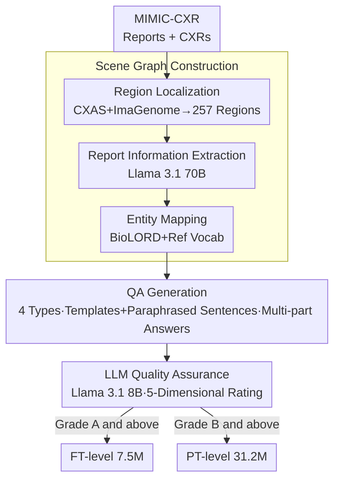

# A Structured, Tagged, and Localized Visual Question Answering Dataset with Full Sentence Answers and Scene Graphs for Chest X-ray Images

**Conference**: ICLR2026  
**OpenReview**: [https://openreview.net/forum?id=LrmyW9JLYq](https://openreview.net/forum?id=LrmyW9JLYq)  
**Code**: https://github.com/philip-mueller/mimic-ext-cxr-qba/  
**Area**: Medical Imaging / Multimodal VQA Datasets  
**Keywords**: Chest X-ray VQA, Scene Graphs, Report Information Extraction, Bounding Box Localization, Structured Annotation

## TL;DR
This paper automatically constructs CXR-QBA from MIMIC-CXR radiology reports—a large-scale chest X-ray VQA dataset featuring 42.2 million QA pairs. Each answer includes full sentences, bounding boxes, and structured labels (findings, regions, certainty, etc.). Produced via a three-stage pipeline ("Scene Graph Construction → Templated QA Generation → LLM-based Quality Assurance"), the dataset provides two subsets—a 31.2 million pre-training level and a 7.5 million fine-tuning level—along with a baseline model and evaluation metrics.

## Background & Motivation
**Background**: With the rise of Large Language Models (LLMs) and Large Multimodal Models (LMMs), chest X-ray (CXR) interpretation is increasingly moving toward "interactive and conversational" tasks. Visual Question Answering (VQA) is a representative task where a model generates an answer given an image and a text question. Compared to traditional paradigms like classification or report generation, VQA allows users to probe images on-demand and contextually.

**Limitations of Prior Work**: Training robust medical VQA models requires high-quality, large-scale data. However, existing CXR VQA datasets suffer from three major flaws: (i) short and simplistic answers (mostly "Yes/No" or single words), (ii) lack of localization information (no bounding boxes), and (iii) almost no structured metadata (region labels, finding/disease categories, uncertainty estimation, etc.). Combined with limited scale (VQA-RAD has 3.5K, SLAKE has 14K, and the largest, CheXinstruct, reached 8.5M but is purely template-based), they are unsuitable for pre-training and cannot support the development of "explainable and localizable" models.

**Key Challenge**: Manual annotation ensures quality and precision but cannot scale. Existing automated solutions (either pure template generation or backfilling based on image labels) produce rigid answers or are not directly conditioned on reports, making it difficult to achieve both "scale" and "answer richness/explainability."

**Goal**: To create a chest X-ray VQA dataset that is both large-scale and contains detailed, report-like answers with bounding boxes and structured labels, while open-sourcing the entire generation pipeline.

**Key Insight**: Radiology reports are essentially "structured descriptions" written by doctors, containing findings, anatomical locations, and certainty phrasing. The authors' key observation is that by first parsing a report into a localized **scene graph** and then deriving questions from the graph, the answers can inherit textual details from the report while being linked to automatically calculated bounding boxes and labels.

**Core Idea**: An automated pipeline "Report → Visually Grounded Scene Graph → QA Pairs" is used to combine the semantic structure of radiology reports with region localization to produce structured, labeled, and localizable VQA data.

## Method

### Overall Architecture
The dataset is generated via a three-stage automated pipeline. **Stage 1** parses each MIMIC-CXR study into a visually grounded scene graph: extracting sentences, observations, and indications from reports, localizing anatomical regions into bboxes using segmentation/detection models, and aligning extracted labels to a predefined vocabulary via semantic entity mapping. **Stage 2** uses the scene graph as the source to generate QA pairs for four question categories based on templates co-designed with radiologists; answers can be multi-part, multi-granular full sentences. **Stage 3** uses LLM-as-a-judge to score each QA pair across five dimensions, aggregating them into a rating from A++ to D. Two subsets are derived: a "Pre-training level" (PT) and a "Fine-tuning level" (FT). Out of 42.2 million QA pairs, 31.2 million are PT-level and 7.5 million are FT-level.

### Key Designs

**1. Visually Grounded Scene Graph Construction: Parsing Reports into Maps with Boxes**
The explainability and localization capabilities rely on the scene graph. The pain point addressed here is that "reports are free text and images are pixels, with no existing alignment." The authors split the scene graph into four node types: Sentence nodes (from reports with section names), Observation nodes (individual findings with text descriptions, bboxes, and tags for positivity/certainty/laterality/region/finding type), Region nodes (anatomical structures), and Indication nodes (linked to related observation nodes). Construction involves: (a) **Region Localization**—using the CXAS model to predict masks for 158 structures on 377,110 images, then combining them with 29 Chest ImaGenome bboxes to derive 257 localizable regions; (b) **Information Extraction**—using Llama 3.1 70B with few-shot prompting to extract labels and text from 227,827 reports; (c) **Entity Mapping**—mapping extracted labels to a clinical reference vocabulary (PadChest, SNOMED-CT, etc.) using BioLORD sentence embeddings for matching. This covers 257 regions and 221 findings, significantly more than Chest ImaGenome’s 29 regions and 53 findings.

**2. QA Generation via Templates + Paraphrased Sentences: 4 Types × Multi-part Answers**
To turn graphs into QA pairs without rigidity, the authors co-designed templates with radiologists for four categories: **Indication** (using paraphrased indications as questions), **Study Abnormality** (13 templates), **Region Abnormality** (6 templates), and **Finding** (7 templates). Every answer can consist of multiple "answer parts": main-answer, details, and related-information. Answer segments can be filled via templates or directly sourced from paraphrased report sentences. This ensures answers are rich with report-level detail and have low repetition (deduplication factors of 1–6).

**3. LLM-as-a-judge for QA Quality Grading: PT/FT Subsets**
To filter errors introduced by the automated pipeline (e.g., mislabeling), Llama 3.1 8B acts as a judge, scoring five dimensions: **entailment** (consistency with report), **relevance**, **completeness**, and **clarity** (of question and answer). These are aggregated into grades A++ to D. Non-frontal images are excluded due to low localization quality. **Grade A and above** forms the Fine-Tuning (FT) set (7.5M), and **Grade B and above** forms the Pre-training (PT) set (31.2M). Human verification showed that LLM ratings are conservative, with at most 2% of samples being overrated.

**4. Structured VQA Task and RadStrucVQA Metric**
The authors define a new **Structured VQA** task: given a text question, the model must output "multi-part free-text answers + bounding boxes + tags (findings, regions)." The baseline model uses a LLaVA-style architecture (Rad-DINO and Llama 3.2 3B). A corresponding **RadStrucVQA metric** is introduced: Llama 3.1 8B determines bidirectional entailment between predicted and target answer parts, followed by evaluating grounding accuracy (IoU) and tag correctness for entailed segments.

## Key Experimental Results

### Scene Graph Quality (vs. Chest ImaGenome)
Study-level labels and bboxes derived from the scene graph were compared against expert annotations. Label quality was measured by Matthews Correlation Coefficient (MCC), and bboxes by IoU/IoP/IoT at a 30% threshold.

| Target | Metric | Ours (Scene Graph) | Chest ImaGenome |
| :--- | :--- | :--- | :--- |
| Finding Labels (MIMIC-JPG, micro MCC) | MCC | 0.71 | 0.67 |
| Finding Labels (CXR-LT, long-tail only) | MCC | 0.71 | 0.59 |
| Finding Boxes (MS-CXR, IoU@30) | IoU | 0.51 | 0.45 |
| Finding Boxes (MS-CXR, IoP@30) | IoP | 0.56 | 0.48 |

Key Finding: Ours performs slightly better on common classes but **significantly leads in long-tail categories (~ +20%)**, demonstrating the value of 221 finding categories. Higher IoP suggests tighter boxes, though IoU remains moderate because boxes are derived from anatomical regions mentioned in reports rather than precise lesion-level manual labels.

### QA Quality and Scale
After LLM grading: **18.6% are FT-level, 58.8% are PT-level, and 22.6% are excluded**. 85% of main answers were rated Grade A or above. Answers have a median length of 14 words; indication-based answers are longer (46 words), and positive findings (18 words) are notably longer than negative ones (10 words), mimicking real reporting habits.

### Structured VQA Results
The baseline was compared against general models like MAIRA-2, Qwen3-VL (4B), and LLaVA-Med v1.5.

| Model / Training Set | Logical Prec. | Logical Rec. | Grounding Prec. | Grounding Rec. |
| :--- | :--: | :--: | :--: | :--: |
| Ours PT(1M) | 0.67 | 0.69 | 0.87 | 0.92 |
| Ours FT(1M) | 0.76 | 0.75 | 0.87 | 0.89 |
| **Ours PT(1M)→FT(1M)** | **0.78** | **0.77** | **0.89** | **0.90** |
| MAIRA-2 | 0.25 | 0.64 | 0.69 | 0.12 |
| Qwen3-VL (4B) | 0.63 | 0.58 | 0.61 | 0.51 |

Key Findings:
- **"PT 1M then FT 1M" is the optimal configuration**, outperforming 2M PT samples.
- Ours significantly outperforms baselines not trained on this task. MAIRA-2 captures info (high recall) but suffers from low precision and grounding (as it mainly boxes positive findings).
- **Recall for positive findings remains low** (0.31 for FT), highlighting a model bias toward under-predicting abnormalities—a problem that can be diagnosed and potentially mitigated thanks to the dataset’s fine-grained tags.

## Highlights & Insights
- **Reports as a Structured Source**: Doctors already embed findings and locations in reports. Instead of re-annotating, this work uses LLMs to "harvest" structured knowledge and uses segmentation models to add pixel-level localization.
- **Templates for Scale, Paraphrasing for Diversity**: Mixing templates with paraphrased report sentences allows for thousands of repetitions of a question type while maintaining high answer diversity (deduplication factor 1–6).
- **Tiered Data Usage**: Explicitly categorizing data into PT and FT levels acknowledges that automated data is noisy but still useful. Experiments prove that "PT followed by FT" is better than just increasing volume.
- **Fine-grained Tags enable Analysis**: The +20% boost in long-tail findings and the ability to pinpoint "positive finding under-prediction" show that tags are not just for show—they drive downstream model improvement.

## Limitations & Future Work
- **Limitations**: The dataset is fully automated and relies on LLMs and templates, which may introduce hallucinations or template bias. The authors **strongly advise against** using it as the sole source for clinical fine-tuning; it should be used alongside small, gold-standard human sets.
- **Single Source Bias**: Derived entirely from MIMIC-CXR, inheriting its demographic biases and limiting modality to CXR (no longitudinal or differential diagnosis questions).
- **Box Size**: Bboxes are derived from anatomical regions (low IoP), which are less precise than per-lesion manual annotations.
- **Future Work**: Transfer the framework to other imaging modalities; expand to longitudinal and differential diagnosis questions; use the provided tags to address class imbalance.

## Related Work & Insights
- **vs. MIMIC-CXR-VQA / Medical-CXR-VQA**: Both derive from MIMIC-CXR, but the former relies on existing Chest ImaGenome graphs, and the latter lacks semantic entity mapping and localization. Ours provides more comprehensive extraction and pixel-level grounding.
- **vs. CheXinstruct (8.5M)**: CheXinstruct is purely template-based with lower answer diversity; ours is 5 times larger (42M), uses paraphrased report text, and includes bboxes + tags.
- **vs. MAIRA-2 (Grounded Report Generation)**: MAIRA-2 focuses on report generation; ours brings localization into VQA. Comparison shows report-generation models underperform in precision and grounding recall for structured VQA tasks.

## Rating
- **Novelty**: ⭐⭐⭐⭐ While not a new paradigm, the "Report → Scene Graph → Structured/Grounded VQA" pipeline and fine-grained tags are significant contributions.
- **Experimental Thoroughness**: ⭐⭐⭐⭐⭐ Comprehensive validation of scene graphs against experts, LLM ratings against humans, and multiple baselines for the VQA task.
- **Writing Quality**: ⭐⭐⭐⭐ Clear structure and rich visualizations; pipeline logic is well-explained.
- **Value**: ⭐⭐⭐⭐⭐ 42M scale + bboxes + structured tags + open pipeline represents a highly valuable resource for medical multimodal pre-training.

<!-- RELATED:START -->

## Related Papers

- [\[ICLR 2026\] MedVLSynther: Synthesizing High-Quality Medical Visual Question Answering from Biomedical Literature with Generator-Verifier LMMs](synthesizing_high-quality_visual_question_answering_from_medical_documents_with_.md)
- [\[AAAI 2026\] Q-FSRU: Quantum-Augmented Frequency-Spectral Fusion for Medical Visual Question Answering](../../AAAI2026/medical_imaging/q-fsru_quantum-augmented_frequency-spectral_fusion_for_medical_visual_question_a.md)
- [\[CVPR 2026\] Dual-Level Confidence based Implicit Self-Refinement for Medical Visual Question Answering](../../CVPR2026/medical_imaging/dual-level_confidence_based_implicit_self-refinement_for_medical_visual_question.md)
- [\[CVPR 2026\] MR-RAG: Multimodal Relevance-Aware Retrieval-Augmented Generation for Medical Visual Question Answering](../../CVPR2026/medical_imaging/mr-rag_multimodal_relevance-aware_retrieval-augmented_generation_for_medical_vis.md)
- [\[ICLR 2026\] Learning Self-Critiquing Mechanisms for Region-Guided Chest X-Ray Report Generation](learning_self-critiquing_mechanisms_for_region-guided_chest_x-ray_report_generat.md)

<!-- RELATED:END -->
