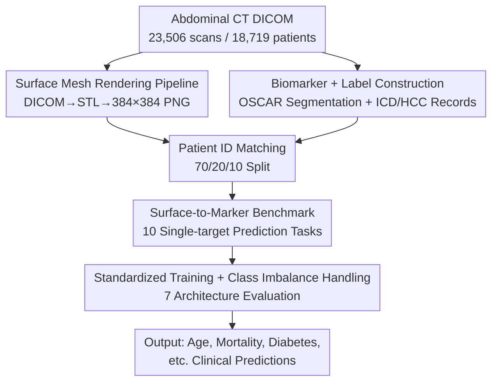

# AbdCTBench: Learning Clinical Biomarker Representations from Abdominal Surface Geometry

**Conference**: ICLR 2026  
**OpenReview**: [https://openreview.net/forum?id=dKRAo0a9Gm](https://openreview.net/forum?id=dKRAo0a9Gm)  
**Paper**: [Project Page](https://stair-lab.github.io/AbdCTBench/)  
**Code**: https://stair-lab.github.io/AbdCTBench/ (Available)  
**Area**: Medical Imaging  
**Keywords**: Body composition analysis, surface geometry, clinical biomarkers, dataset benchmark, non-invasive screening

## TL;DR
The authors extracted 2D body surface mesh images from 23,506 abdominal CT scans of 18,719 patients, paired them with 16 CT biomarkers and hundreds of disease/comorbidity labels to construct AbdCTBench—the first and largest "surface geometry $\rightarrow$ internal body composition" dataset. Systematically evaluating 7 mainstream vision architectures, they demonstrated that external abdominal geometry alone can predict clinical indicators such as age (MAE 6.22 years), mortality (AUROC 0.839), and diabetes with chronic complications (AUROC 0.801), paving the way for radiation-free, low-cost consumer-grade health screening.

## Background & Motivation

**Background**: Body composition analysis (visceral fat, muscle infiltration, organ volume, etc.) is a vital tool for assessing cardiometabolic health. BMI and waist circumference are too crude to distinguish between metabolically active visceral fat, intermuscular fat, and organ pathology; imaging biomarkers derived from CT/MRI provide high-precision quantitative assessments and have become the gold standard.

**Limitations of Prior Work**: The accessibility of this gold standard (CT/MRI) is severely limited—CT involves ionizing radiation and cannot be performed repeatedly; MRI is expensive and equipment is scarce. Both require dedicated infrastructure and radiologists, creating bottlenecks in resource-constrained areas and exacerbating health inequalities. In other words, the most accurate measurement methods are the hardest to popularize.

**Key Challenge**: A gap exists between high-precision clinical imaging (CT/MRI capturing internal tissues) and widely accessible consumer technology (e.g., iPhone LiDAR depth scans which only capture body surface geometry). To perform population-level screening, one must move away from direct internal observation and rely on external geometry.

**Goal**: (1) Validate the core hypothesis that "external body surface geometry is predictive of internal tissue composition"; (2) Provide a standardized, large-scale dataset and benchmark for the research community to develop methods for the novel indirect inference task of "surface geometry $\rightarrow$ biomarkers."

**Key Insight**: The authors' key insight is that external abdominal surface geometry is predictive of internal tissue composition. Surface features, such as abdominal fat distribution and curvature changes, are intrinsically correlated with internal indicators like visceral fat, muscle mass, and bone density. Since massive volumes of historical CT scans exist, they can be "dimensionally reduced" into surface meshes (simulating inputs from future consumer-grade devices) while retaining CT-calculated gold standard labels as supervision signals.

**Core Idea**: Render existing abdominal CT scans into "2D surface depth mesh images," pair them with gold standard biomarkers calculated from the same CTs, and train vision models to infer internal metrics by looking only at the surface. Once validated, the inference phase can discard CT scans in favor of radiation-free surface meshes scanned by devices like LiDAR.

## Method

### Overall Architecture

AbdCTBench is essentially a "dataset construction + standardized benchmark" effort rather than a new model architecture. It addresses how to transform raw CT DICOM files into paired supervision data of "surface images $\leftrightarrow$ clinical labels" and how to fairly compare various vision architectures on this data. The pipeline runs two parallel paths: one renders CTs into 2D surface mesh images (model inputs), and the other uses specialized tools to extract 16 gold standard biomarkers and link them to disease/comorbidity labels from medical records (supervision targets). After pairing by patient ID and a 70/20/10 split, the data is fed into 7 standardized vision architectures for single-target prediction.

### Key Designs

**1. Surface Mesh Rendering Pipeline: Reducing Internal CT to External Geometry**

To ensure the model learns from inputs a future LiDAR device might provide, the model cannot see raw CT slices. The authors designed a three-stage serial DICOM $\rightarrow$ STL $\rightarrow$ PNG rendering pipeline: first, volumetric data processing (optional shrinkage and anisotropic smoothing); second, surface extraction using VTK's contour filter to generate 3D triangular meshes, followed by cleaning and smoothing for export as binary STL files; finally, rendering each mesh into a standardized $384 \times 384$ PNG image (effectively a depth map projection) using PyVista with fixed camera poses. The ingenuity lies in artificially discarding internal information while preserving the external surface, making historical CT data a proxy for simulated consumer-grade surface scans.

**2. Biomarker and Clinical Label Construction: Using CT for Gold Standards**

The authors used the specialized tool OSCAR to process the same DICOM files to automatically generate segmentation masks. They calculated metrics such as bone density, fat distribution, muscle composition, organ volume, and calcification scores across multiple anatomical levels (L1-L5, T10-T12) and organ regions (liver, spleen, kidney, aorta), resulting in 16 biomarkers. These were then linked to 31 ICD-10 diagnostic codes, 87 HCC stratified comorbidity labels, and 2 longitudinal lab values (HbA1c, CRP). The data is de-identified according to HIPAA Safe Harbor. The key is that while the input is only the body surface, the precision of the supervision signal is guaranteed by the gold standard CT.

**3. Surface-to-Marker Single-target Benchmark: Standardizing 10 Tasks**

To ensure fair architectural comparison, the authors selected 10 biomarker prediction tasks. They adopted a single-target learning framework (each architecture is trained and evaluated independently per task) to avoid interference from multi-task learning. Tasks include regression (Age, measured by MAE) and binary classification (Mortality, calcification score >1000, myocardial infarction, Type 2 diabetes, and comorbidities like HCC-108 Vascular Disease and HCC-18 Diabetes with Complications, measured by AUROC). Seven architectures across families were selected (ResNet-18/34/50, DenseNet-121, EfficientNet-B0, ViT-Small/DINOv2, Swin-Base), including CNNs and Transformers with various pre-training (ImageNet, RadImageNet, DINOv2 self-supervised).

**4. Standardized Training Protocol and Class Imbalance Handling**

To ensure fairness, a rigid protocol was established: AdamW (weight decay $1 \times 10^{-4}$) with cosine annealing, searching three learning rates ($1 \times 10^{-5}$, $1 \times 10^{-4}$, $1 \times 10^{-3}$), batch size 16, 100 epochs with early stopping (patience 10), and dropout 0.2. Binary classification used BCE with logits, while regression used MSE. To address severe class imbalance (e.g., 11.4% mortality), three strategies were combined: inverse frequency weighting in the loss function, balanced batch sampling during training, and threshold optimization on the validation set by searching 9 discrete thresholds in the $[0.1, 0.9]$ range based on F1 score.

## Key Experimental Results

### Main Results

Evaluations across 7 architectures showed that all models significantly outperformed naive baselines (Age $R^2 > 0.719$), proving that surface geometry carries learned predictive signals.

| Task | Metric | Best Architecture | Best Value | Naive Baseline |
|------|------|----------|--------|----------------|
| Age (Regression) | MAE | EfficientNet-B0 | 6.22 years | 13.16 |
| Agatston Calcification | AUROC | ResNet-34 | 0.848 | 0.500 |
| Mortality | AUROC | ResNet-18 | 0.839 | 0.500 |
| HCC-18 (Diabetes w/ complications) | AUROC | Swin-Base | 0.801 | 0.500 |
| HCC-96 (Arrhythmia) | AUROC | Swin-Base | 0.770 | 0.500 |
| HCC-111 (COPD) | AUROC | ResNet-18 | 0.769 | 0.500 |
| HCC-108 (Vascular Disease) | AUROC | Swin-Base | 0.768 | 0.500 |
| Myocardial Infarction | AUROC | Swin-Base | 0.742 | 0.500 |
| Type 2 Diabetes | AUROC | ResNet-34 | 0.742 | 0.500 |
| HCC-12 (Breast/Prostate Cancer, etc.) | AUROC | ResNet-34 | 0.591 | 0.500 |

### Architecture Analysis

| Configuration | Performance | Description |
|------|------|------|
| Small/Medium CNN (ResNet-18/34, EfficientNet-B0) | Leading in most tasks | Matched or exceeded the larger ResNet-50. |
| ResNet-50 (RadImageNet Pre-trained) | Lagging in most tasks | Mortality only 0.810, inferior to ResNet-18's 0.839. |
| ViT-Small (DINOv2) | Competitive but never top | Frequently in the top 2-3, but never the best for any task. |
| Swin-Base (Hierarchical Local Attention) | Top in several tasks | Led in MI, HCC-108/18/96. |

### Key Findings

- **Small models outperformed large models**: Small to medium-sized CNNs consistently matched or outperformed larger models like ResNet-50. The authors attribute this to the indirect nature of the task, where signals are often local spatial features (subtle curvature or fat distribution), favoring the local inductive bias of CNNs. Swin-Base's success in several tasks further supports the benefit of balancing local and global features.
- **Medical domain pre-training provided no advantage**: ResNet-50 pre-trained on RadImageNet trailed significantly. This is because AbdCTBench uses CT-derived "surface geometry" rather than raw CT scans, creating a distribution shift that nullifies the benefits of medical image pre-training.
- **Diabetes with complications is more predictable than simple T2D**: HCC-18 (Diabetes with complications) had an AUROC of 0.801, significantly higher than 0.742 for simple Type 2 Diabetes, suggesting surface geometry carries stronger signals for advanced metabolic disease.
- **Cancers are nearly unpredictable**: HCC-12 performance was near random (0.571–0.591). This is explained by the heterogeneous nature of the label and its weak association with abdominal body composition.
- **Inter-sex differences exist**: Age prediction was notably more accurate for males (MAE 5.76, $R^2=0.81$ vs. female 6.63, $0.70$), while mortality and HCC-18 were better predicted in females. This likely reflects biological differences in fat distribution and aging.

## Highlights & Insights

- **The "distillation for non-invasive screening" paradigm is clever**: Using CT as a gold standard target while feeding only surface geometry to the model essentially "steals" CT precision during training to eliminate the need for CT during inference.
- **The "counterintuitive" smaller-is-better conclusion**: In local-signal-heavy indirect inference tasks, blindly increasing model size or using medical pre-training can be detrimental; small CNNs with strong regularization are more effective.
- **Standardized engineering for class imbalance**: The combination of inverse frequency weighting, balanced sampling, and F1 threshold optimization provides a robust template for handling rare clinical outcomes.
- **Honesty regarding failed tasks**: By reporting near-random results for HCC-12, the authors strengthen the credibility of the benchmark by defining its capability boundaries (cardiometabolic yes, tumor no).

## Limitations & Future Work

- **Single-center data**: All data originated from a single medical institution. Evaluating cross-site generalization is critical as different CT protocols might alter surface geometry.
- **Implicit demographic bias**: The absence of strict inclusion/exclusion criteria (to maximize scale) might introduce demographic biases.
- **Lack of validation with real consumer devices**: All meshes were rendered from CT rather than scanned by actual LiDAR; validation with real hardware is the final step for clinical deployment.
- **Scope of tasks and architectures**: The study focused on single-target tasks and medium-sized architectures. Exploring multi-task learning, larger ViTs, and uncertainty estimation remains promising.

## Related Work & Insights

- **vs. Traditional Medical Image Benchmarks (CheXpert, MIMIC-CXR)**: Unlike benchmarks bound to dedicated internal imaging modalities, AbdCTBench uses highly accessible surface geometry for indirect physiological inference.
- **vs. External Body Shape Analysis**: Previous surface analyses mostly targeted non-clinical fields; this work bridges the gap by systematically linking abdominal geometry to CT-derived clinical biomarkers.
- **vs. Architectural Comparison Studies**: This work provides a new arena for comparing CNNs and Transformers, demonstrating that architectural advancements do not always translate linearly to indirect medical inference tasks where smaller models may excel.

## Rating
- Novelty: ⭐⭐⭐⭐ First large-scale pairing of abdominal surface geometry with internal biomarkers; novel proxy supervision paradigm.
- Experimental Thoroughness: ⭐⭐⭐⭐ 7 architectures across 10 tasks, including family analysis, pre-training comparison, and demographic stratified analysis.
- Writing Quality: ⭐⭐⭐⭐ Clear motivation, well-documented pipeline, and honest reporting of limitations.
- Value: ⭐⭐⭐⭐⭐ Open dataset, protocol, and weights directly accelerate radiation-free, low-cost screening research.

<!-- RELATED:START -->

## Related Papers

- [\[ICLR 2026\] MedLesionVQA: A Multimodal Benchmark Emulating Clinical Visual Diagnosis for Body Surface Health](medlesionvqa_a_multimodal_benchmark_emulating_clinical_visual_diagnosis_for_body.md)
- [\[ICLR 2026\] Unified Brain Surface and Volume Registration](unified_brain_surface_and_volume_registration.md)
- [\[ICLR 2026\] Towards Interpretable Visual Decoding with Attention to Brain Representations](towards_interpretable_visual_decoding_with_attention_to_brain_representations.md)
- [\[ICLR 2026\] CardioComposer: Leveraging Differentiable Geometry for Compositional Control of Anatomical Diffusion Models](cardiocomposer_leveraging_differentiable_geometry_for_compositional_control_of_a.md)
- [\[CVPR 2026\] Learning Generalizable 3D Medical Image Representations from Mask-Guided Self-Supervision](../../CVPR2026/medical_imaging/learning_generalizable_3d_medical_image_representations_from_mask-guided_self-su.md)

<!-- RELATED:END -->
