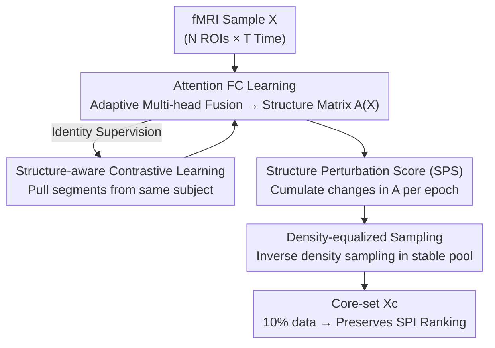

# Accelerating Benchmarking of Functional Connectivity Modeling via Structure-aware Core-set Selection

**Conference**: ICLR2026  
**OpenReview**: [https://openreview.net/forum?id=0RYazbfSzW](https://openreview.net/forum?id=0RYazbfSzW)  
**Code**: https://github.com/lzhan94swu/SCLCS  
**Area**: Medical Imaging / Brain Functional Connectivity / fMRI  
**Keywords**: Functional Connectivity, Core-set Selection, Benchmarking Acceleration, Self-supervised, Attention Structure

## TL;DR
To make the expensive task of "comparing hundreds of functional connectivity (FC) modeling operators on large-scale fMRI data" affordable, this paper reformulates benchmarking as a "rank-preserving subset selection" problem. It proposes a self-supervised framework, SCLCS, which learns the connectivity structure of each sample using an adaptive Transformer, identifies stable "prototype" samples using the Structure Perturbation Score (SPS), and supplements diversity via density-equalized sampling. Using only 10% of the data, it maintains the true ranking of 130 FC operators from the full set, achieving a ranking consistency (nDCG@k) up to 23.2% higher than previous state-of-the-art core-set methods.

## Background & Motivation
**Background**: In brain functional connectivity research, determining which method to use for converting fMRI time series into connectivity matrices is a methodological challenge. These operators are collectively referred to as SPIs (statistical pairwise interactions), and libraries like pyspi contain hundreds of candidates (Pearson correlation, mutual information, spectral methods, etc.). Different SPIs yield entirely different connectivity topologies, leading to different scientific conclusions. Thus, systematic benchmarking to select the most reliable operator is considered a critical precursor for ensuring reproducibility in neuroscience.

**Limitations of Prior Work**: The primary issue is the prohibitive computational cost. Running hundreds of SPIs across all subjects to evaluate rankings leads to a combinatorial explosion of "model × data" pairs, making exhaustive benchmarking infeasible for routine analysis.

**Key Challenge**: Intuitively, one could "compare all SPIs on a small representative subset to select top operators, then run only those on the full dataset." The success of this two-stage pipeline depends entirely on the **core-set preserving the relative ranking of SPIs from the full set**. However, classic core-set selection methods are designed for different goals—selecting training subsets for a single predictive model (minimizing training loss). These are model-dependent and assume i.i.d. static samples, failing to account for the temporal dependencies in fMRI that determine FC structures. Using such core-sets for cross-SPI rank preservation leads to mismatch.

**Goal**: To formalize core-set selection for FC benchmarking as a **rank-preserving subset selection problem** and address three derived challenges: (1) selection criteria must target ranking stability across SPIs rather than single-model loss; (2) provide a principled definition of "sample importance" based on FC structure; and (3) mitigate the fragility of score-based top-k selection (poor generalization across sampling ratios and ranking distortion).

**Key Insight**: The authors hypothesize that **preserving the distribution of functional connectivity structures preserves the SPI rankings**. Instead of training predictive models, they seek a "structurally representative" subset. The signal for identifying "fundamental prototypes" comes from a new observation: samples representing common, fundamental connectivity patterns yield stable structural representations during training, while noisy or atypical samples fluctuate significantly.

**Core Idea**: Use an adaptive attention encoder to learn the FC structure of each sample, use the "cumulative perturbation of the structure during training" (SPS) as a proxy for sample importance (prioritizing stable samples), and use density-equalized sampling to ensure diversity—resulting in a core-set that is both robust and distributionally representative.

## Method

### Overall Architecture
SCLCS aims to select a small subset $\mathcal{X}_c$ ($|\mathcal{X}_c|\ll|\mathcal{X}|$) from a full fMRI set $\mathcal{X}$ such that the SPI ranking $\mathrm{Rank}(\mathcal{S},\mathcal{X}_c)$ matches $\mathrm{Rank}(\mathcal{S},\mathcal{X})$ (Eq. 1, measured by nDCG@k). Since brute-force optimization is infeasible, the authors use "structural representativeness" as a proxy.

The pipeline consists of four modules: **Attention FC Learning** to encode each sample into a structure matrix $A(X)$; tracking epoch-by-epoch changes during training to calculate the **Structure Perturbation Score (SPS)**; selecting stable samples via low SPS; and applying **Structure-aware Density-equalized Sampling** for diversity. The encoder is trained via **Structure-aware Contrastive Learning** using subject identity as supervision.

### Key Designs

**1. Attention FC Learning: Learning fusion weights to approximate continuous FC operators**

The encoder must be expressive enough to capture FC structures. ROIs ($N$) are treated as tokens with time dimensions ($T$) as features. Multi-head self-attention (MHSA) models relationships, where the $h$-th head gives $A_h=\mathrm{softmax}(Q_h K_h^\top/\sqrt{d})$. The authors identify that **uniform averaging in standard Transformers is problematic**: Theorem 1 proves that if heads learn disjoint structures, uniform averaging $\bar A=\frac1H\sum_h A_h$ expands the support set and increases entropy, blurring head-specific structures.

The solution is **learnable adaptive fusion**: $A=\sum_{h=1}^{H}\alpha_h A_h$, where $\sum_h\alpha_h=1, \alpha_h\ge0$. Theorem 2 proves this adaptive MHSA family possesses **universal approximation capability** for continuous SPI mappings on compact domains. It allows sparse or peaky mixtures, reducing interference and expanding the class of representable operators. The resulting $A\in\mathbb{R}^{N\times N}$ serves as the structural probe.

**2. Structure Perturbation Score (SPS): Measuring sample stability via cumulative representation jitter**

To define "fundamental" samples, the authors assume common connectivity patterns are learned more stably. SPS is defined as the cumulative Frobenius norm change of a sample's structure matrix over $L$ training epochs:

$$\mathrm{SPS}(X)=\frac{1}{L}\sum_{e=1}^{L}\big\lVert A^{(e)}(X)-A^{(e-1)}(X)\big\rVert_F^2,$$

where $A^{(e)}(X)$ is the attention matrix at epoch $e$. Proposition 1 ("Mixing-driven Perturbation") shows that samples which are pure representatives of a single prototype have lower structural conflict and lower SPS compared to mixed or noisy samples. Lower SPS identifies stable prototypes.

**3. Structure-aware Density-equalized Sampling: Correcting top-k bias**

Simple top-k selection via low SPS might repeatedly pick similar samples from dense clusters, leading to low diversity. Theorem 3 proves that top-k selection results in "persistent bias" where cluster proportions in the core-set deviate from the true distribution.

The SCLCS$_{\text{Dense}}$ variant first discards high-SPS (unstable) samples, then fits a Gaussian Kernel Density Estimation (KDE) on the remaining pool. Samples are weighted by the inverse of their local density $w(X)=\frac{1}{\rho(X)+\epsilon}$. This up-samples representative samples from sparse regions (e.g., rare clinical subtypes), ensuring both robustness and coverage.

**4. Structure-aware Contrastive Learning: Task-agnostic self-supervision**

The encoder is trained using **identity-supervised contrastive learning**. Different time segments from the same subject/session are positive pairs, while different subjects are negatives. InfoNCE loss (Eq. 17) is used to encourage the model to capture stable, subject-specific "brain fingerprint" features—exactly what SPI analysis seeks—providing a task-agnostic signal.

### Loss & Training
The objective is the contrastive loss $\mathcal{L}_{\text{contrast}}=\frac{1}{|P|}\sum_{(i,j)\in P}-\log\frac{\exp(\mathrm{sim}(z_i,z_j)/\tau)}{\sum_{k\in N(i)}\exp(\mathrm{sim}(z_i,z_k)/\tau)}$, optimized via Adam. SPS is accumulated throughout training. Hyperparameters for density sampling (threshold $\beta$, KDE bandwidth) are tuned via grid search on downstream rank-preservation tasks.

## Key Experimental Results

### Main Results
On the REST-meta-MDD dataset (904 subjects, 4520 samples) evaluating 130 SPIs for brain fingerprinting (nDCG@k×100):

| Method | nDCG@5 (0.1 ratio) | nDCG@5 (0.5 ratio) | nDCG@10 (0.1 ratio) | nDCG@20 (0.1 ratio) |
|------|------|------|------|------|
| Random | 15.17 | 66.60 | 17.97 | 21.97 |
| AUM | 65.92 | 38.17 | 60.95 | — |
| EVA (Prev. SOTA) | 38.40 | 37.80 | 43.37 | 43.22 |
| **SCLCS** | **81.21** | **72.68** | **66.54** | **57.46** |
| SPS$_{\text{MHA}}$ (Ablation) | 1.32 | 15.62 | 2.92 | 1.21 |

SCLCS achieves significantly higher scores and lower variance (e.g., $81.21\pm2.86$ vs EVA's $38.40\pm40.57$ at 0.1 ratio), validating the low-SPS stability criterion.

### Ablation Study

| Configuration | Observation |
|------|------|
| SCLCS (low-SPS top-k) | Optimal at extreme ratios (0.1/0.5); stability is key. |
| SCLCS$_{\text{Dense}}$ | Superior at intermediate ratios (e.g., nDCG@5 79.18 vs 50.24 at 0.3); diversity provides correction. |
| SPS$_{\text{MHA}}$ (Uniform Fusion) | Catastrophic drop; validates Theorem 1's warning about structural blurring. |

### Key Findings
- **Stability and Diversity are Complementary**: Low SPS top-k is robust at extreme ratios, while SCLCS$_{\text{Dense}}$ excels at intermediate ratios where cluster-induced bias is more prevalent (per Theorem 3).
- **Adaptive Fusion is Critical**: Replacing it with uniform averaging (SPS$_{\text{MHA}}$) drops nDCG from 80+ to single digits, confirming that "structural blurring" is a fatal practical issue.
- **Task Agnosticism**: Performance holds across different tasks (fingerprinting and MDD diagnosis), suggesting the learned structural representations contain universal properties.

## Highlights & Insights
- **Problem Reformulation**: Shifting benchmarking from "operator evaluation" to "rank-preserving subset selection" transforms an engineering bottleneck into a well-defined ML problem.
- **Training Dynamics as Sigals**: SPS uses the "jitter" of representations over time rather than a static snapshot, elegantly translating prototype purity into a computable cumulative perturbation.
- **Theoretical Rigor**: The paper includes 5 theorems, 1 proposition, and 1 lemma covering universal approximation, attention interference, and consistency guarantees—grounding empirical gains in theory.
- **Transferable Density Sampling**: The density-equalized sampling module can be applied to any score-based selection method to improve diversity.

## Limitations & Future Work
- **Tooling Positioning**: SCLCS is positioned as a pre-acceleration tool; its value depends on the adoption of the two-stage benchmarking pipeline.
- **Single Dataset Validation**: Evaluation is primarily on REST-meta-MDD; generalization across disparate datasets or acquisition protocols requires further study.
- **Hyperparameter Sensitivity**: Parameters like the KDE bandwidth depend on grid searches on downstream tasks, potentially introducing task-specific tuning requirements.

## Related Work & Insights
- **Comparison with Classic Core-set Methods**: Unlike methods designed for training loss minimization in i.i.d. settings (EL2N, AUM, etc.), SCLCS focuses on cross-operator rank preservation and fMRI temporal structure, outperforming prior SOTA by up to 23.2%.
- **Benchmarking Context**: SCLCS serves as an accelerator for libraries like pyspi, addressing the computational feasibility of their comprehensive evaluation frameworks.

## Rating
- Novelty: ⭐⭐⭐⭐⭐ 
- Experimental Thoroughness: ⭐⭐⭐⭐ 
- Writing Quality: ⭐⭐⭐⭐ 
- Value: ⭐⭐⭐⭐⭐ 

<!-- RELATED:START -->

## Related Papers

- [\[CVPR 2026\] Continual Learning for fMRI-Based Brain Disorder Diagnosis via Functional Connectivity Matrices Generative Replay](../../CVPR2026/medical_imaging/forge_continual_learning_for_fmri_based_brain_disorder_diagnosis.md)
- [\[CVPR 2026\] Sketch2CT: Multimodal Diffusion for Structure-Aware 3D Medical Volume Generation](../../CVPR2026/medical_imaging/sketch2ct_multimodal_diffusion_for_structure-aware_3d_medical_volume_generation.md)
- [\[CVPR 2026\] CHIPS: Efficient CLIP Adaptation via Curvature-aware Hybrid Influence-based Data Selection](../../CVPR2026/medical_imaging/chips_efficient_clip_adaptation_via_curvature-aware_hybrid_influence-based_data_.md)
- [\[CVPR 2026\] SIMSPINE: A Biomechanics-Aware Simulation Framework for 3D Spine Motion Annotation and Benchmarking](../../CVPR2026/medical_imaging/simspine_a_biomechanics-aware_simulation_framework_for_3d_spine_motion_annotatio.md)
- [\[CVPR 2026\] SHAPE: Structure-aware Hierarchical Unsupervised Domain Adaptation with Plausibility Evaluation for Medical Image Segmentation](../../CVPR2026/medical_imaging/shape_structure-aware_hierarchical_unsupervised_domain_adaptation_with_plausibil.md)

<!-- RELATED:END -->
