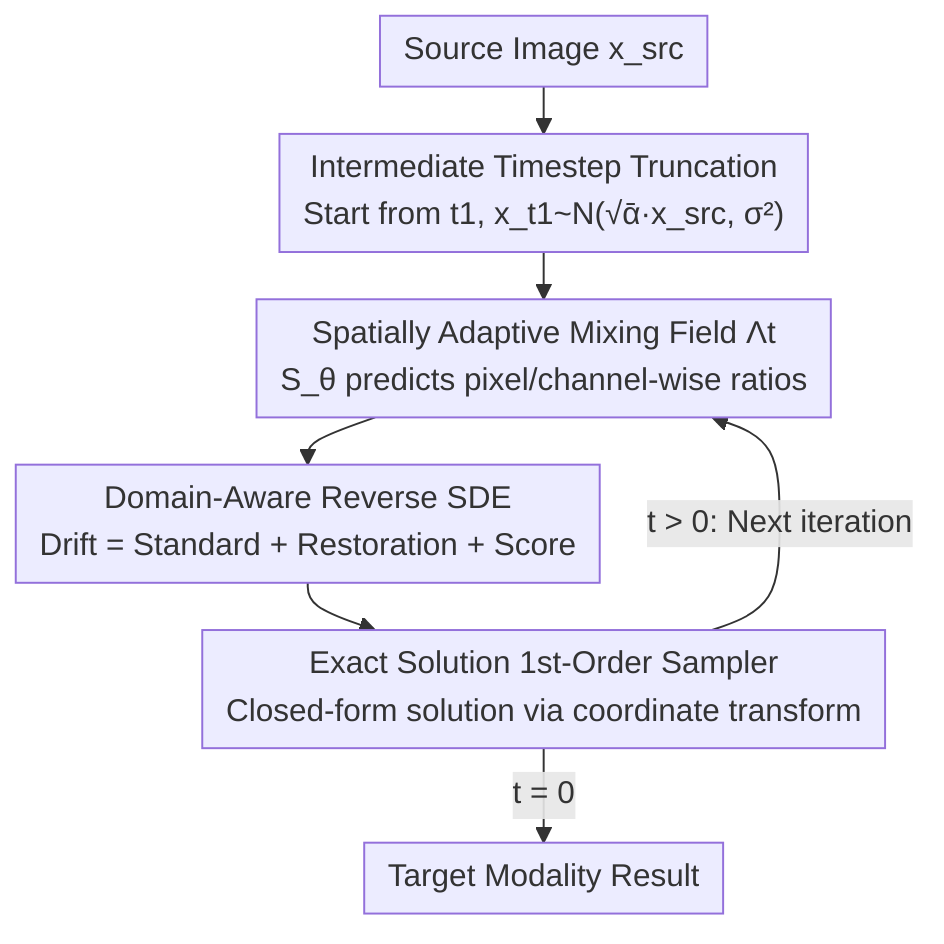

# Adaptive Domain Shift in Diffusion Models for Cross-Modality Image Translation

**Conference**: ICLR 2026  
**arXiv**: [2601.18623](https://arxiv.org/abs/2601.18623)  
**Code**: [https://github.com/LaplaceCenter/CDTSDE](https://github.com/LaplaceCenter/CDTSDE)  
**Area**: Medical Imaging / Diffusion Models  
**Keywords**: Cross-modality image translation, Diffusion SDE, Domain shift scheduling, Spatially adaptive mixing, Reverse SDE  

## TL;DR
The CDTSDE framework is proposed, which embeds a learnable spatially adaptive domain mixing field $\Lambda_t$ into the reverse SDE of diffusion models. This allows the cross-modality translation path to proceed along a low-energy manifold, achieving higher fidelity with fewer denoising steps in MRI modality conversion, SAR-to-optical, and industrial defect semantic mapping tasks.

## Background & Motivation

**Background**: Cross-modality image translation (e.g., MRI T1→T2, SAR→Optical) has progressed from the GAN era into the diffusion model era, with diffusion methods outperforming GANs in stability and generation quality.

**Limitations of Prior Work**: Existing diffusion translation methods generally rely on a **fixed linear interpolation** between the source and target domains $d_t = \eta_t \hat{x}_0^{\text{src}} + (1-\eta_t) x_0$. This straight-line path passes through high-energy regions between the two modality manifolds, forcing the sampler to perform extensive corrections to return to the manifold.

**Key Challenge**: Linear interpolation assumes that the source-to-target transform is globally uniform, but real-world cross-modality differences are highly heterogeneous in space—certain areas (like edges with large texture differences) require more correction, while uniform areas require almost none.

**Goal**: Can the domain shift scheduling itself learn an "adaptively curved" path to bypass high-energy regions, thereby reducing the denoising burden and improving semantic consistency?

**Key Insight**: From the geometric perspective of the path energy functional, the authors prove that under mild heterogeneity conditions, the energy of a pixel-wise adaptive path is strictly lower than that of any global scheduling path (Theorem 1).

**Core Idea**: Upgrade domain shift from "global linear interpolation" to a "pixel-wise, channel-wise learnable non-linear mixing field," and embed it into the drift term of the diffusion SDE.

## Method

### Overall Architecture
CDTSDE (Cross-Domain Translation SDE) addresses the issue where global linear transition paths in cross-modality translation pass through high-energy regions between manifolds. The core mechanism is to transform this transition into a learnable curved path—introducing a spatially adaptive domain mixing field $\Lambda_t \in (0,1)^{C \times H \times W}$ within the VP diffusion process. This field determines the pixel-wise mixing ratio of source domain information at each step, and this mixed path $d_t = \Lambda_t \odot \hat{x}_0^{\text{src}} + (1-\Lambda_t)\odot x_0$ is directly incorporated into the drift term of the diffusion SDE. At inference (see diagram): given a source modality image, sampling starts from "source-image-centered noise" at an intermediate timestep $t_1$. At each step, the mixing field network $\mathcal{S}_\theta$ predicts the current $\Lambda_t$, and a reverse SDE with domain-shift restorative force, coupled with a closed-form exact-solution sampler, takes a large step. Iterations converge to $t=0$ to obtain the target modality image, typically requiring only about 5 steps.

### Key Designs

**1. Spatially Adaptive Domain Mixing Field: Letting each pixel decide its mixing ratio**

**Design Motivation**: The fundamental problem with fixed linear interpolation is global uniformity. Since cross-modality differences are spatially heterogeneous, edges and uniform regions should not share the same mixing ratio.  
**Function**: CDTSDE predicts a full-resolution mixing field $\Lambda_t \in (0,1)^{C \times H \times W}$ at each reverse step $t$. This is handled by a lightweight convolutional network $\mathcal{S}_\theta$ that receives the base linear step $\lambda_t^{\text{lin}}$ and positional encodings $\pi(p)$ to output a spatial modulation signal $h_{t,c}(p)$. This is then transformed via a zero-centered mapping $g = 2h-1$ and endpoint-preserving interpolation:

$$f_{t,c} = \lambda_t^{\text{lin}}\big[1 + g_{t,c}(1-\lambda_t^{\text{lin}})\big]$$

**Novelty**: This design is supported by **Theorem 1**, which proves that under local geometric heterogeneity and non-degenerate contrast, $\inf_{\Lambda \in \mathcal{C}_{\text{pix}}} \mathcal{E}[d] < \inf_{\Lambda \in \mathcal{C}_{\text{glob}}} \mathcal{E}[d]$. This theoretical basis ensures that pixel-wise scheduling reduces the denoising burden by bypassing high-energy regions.

**2. Domain-Aware Forward/Reverse SDE: Embedding domain shift into the drift term**

**Mechanism**: $\Lambda_t$ is embedded into the VP diffusion. The forward marginal is defined as $q(x_t \mid x_0, \hat{x}_0^{\text{src}}) = \mathcal{N}(\sqrt{\bar\alpha_t}\, d_t,\ \sigma_t^2 I)$, where $d_t = \Lambda_t \odot \hat{x}_0^{\text{src}} + (1-\Lambda_t)\odot x_0$. This introduces an extra drift term $\sqrt{\bar\alpha_t}\,\dot\Lambda(t)\odot(\hat{x}_0^{\text{src}} - x_0)$ compared to standard diffusion. The reverse SDE (Eq. 9) is composed of three forces: standard drift $f(t)x_t$, explicit domain-shift restorative force, and the score function. By physically encoding domain shift into the drift, even large-step integrations maintain domain-aware corrections, simplifying the denoising model's task to "local residual correction."

**3. Exact Solution and First-Order Sampler: Closed-form solution via coordinate transformation**

To solve the reverse SDE efficiently, the authors introduce a coordinate transformation $\Upsilon_t = \sqrt{\bar\alpha_t}(1-\Lambda_t)$, $y_t = x_t \oslash \Upsilon_t$, and $\lambda_t = \sigma_t \oslash \Upsilon_t$. This allows the equation to be integrated exactly using the variation-of-constants formula. **Proposition 1** provides an exact solution containing four terms: (a) scaled propagation, (b) data prediction integral, (c) source image restoration, and (d) stochastic noise. This allows a first-order numerical sampler to reach ~15dB PSNR in just 5 steps.

**4. Intermediate Timestep Truncation: Starting from the source image center**

Since $\Lambda_t = 1$ for $t \geq t_1$, the forward mean becomes a noise process centered purely on the source image. This segment contains no domain shift information. Sampling therefore starts at $t_1 < T$ from $x_{t_1} \sim \mathcal{N}(\sqrt{\bar\alpha_{t_1}}\,\hat{x}_0^{\text{src}},\ \sigma_{t_1}^2 I)$, skipping $T - t_1$ steps to further reduce overhead.

### Loss & Training
- The noise prediction model $\varepsilon_\theta$ and domain scheduling network $\mathcal{S}_\theta$ are trained jointly.
- UNet backbone + PyTorch Lightning mixed precision.
- Moderate training steps: Sentinel 20K, IXI 10K, PSCDE 5K.

## Key Experimental Results

### Main Results
Comparison with Pix2Pix, BBDM, ABridge, DBIM, and DOSSR across three cross-modality tasks:

| Task | Metric | CDTSDE (Ours) | DOSSR (Prev. SOTA) | Pix2Pix |
|------|------|--------|------------|---------|
| Sentinel (SAR→Optical) | SSIM↑ | **0.382** | 0.360 | 0.230 |
| Sentinel | PSNR↑(dB) | **17.46** | 17.14 | 15.12 |
| IXI (T2→T1) | SSIM↑ | **0.825** | 0.800 | 0.710 |
| IXI (T2→T1) | PSNR↑(dB) | **24.33** | 24.13 | 22.24 |
| PSCDE (Defect Mapping) | Dice↑ | **0.488** | 0.460 | 0.178 |
| PSCDE | Hausdorff↓ | **39.87** | 59.53 | 156.28 |

CDTSDE leads in nearly all metrics. In terms of efficiency, it reaches 15dB PSNR in just 5 steps (1.8s/image), which is 2x faster than DOSSR (10 steps, 3.6s).

### Ablation Study

| Schedule Type | Dice (PSCDE) | Hausdorff↓ | Description |
|---------|-------------|-----------|------|
| Linear | 0.46 | 59.5 | Fixed $\eta_t \cdot \mathbf{1}$ |
| Channel Non-linear | 0.46 | 43.0 | Channel-wise non-linear but spatially uniform |
| Dynamic | **0.49** | **39.8** | Fully spatial + channel adaptive |

### Key Findings
- Moving from Linear to Dynamic improves Dice by 6.1% and reduces Hausdorff by 33%, demonstrating the core value of spatial-adaptive scheduling.
- Channel Non-linear significantly improves boundary quality (Hausdorff 59.5→43.0), whereas spatial adaptivity provides additional overlap (Dice) improvements.
- Bridge-based methods (BBDM, ABridge, DBIM) fail almost completely on the highly heterogeneous PSCDE task (Dice < 0.17), while CDTSDE and DOSSR perform significantly better due to explicit domain shift modeling.

## Highlights & Insights
- **Theory-Driven Design**: Theorem 1 strictly proves the superiority of pixel-wise scheduling from a path energy functional perspective. This result implies that spatial adaptivity is beneficial in any generative task involving learning transition paths between distributions.
- **Efficiency via Exact Solutions**: Deriving the exact solution of the reverse SDE via coordinate transformation enables high-quality 5-step translation, representing a paradigm of theory-into-practice.
- **Drift-based Domain Shift**: Encoding domain shift into the drift term downgrades the denoising challenge from "global alignment" to "local residual correction," significantly reducing learning difficulty.

## Limitations & Future Work
- Improvement is limited in low-domain-gap scenarios (e.g., IXI SSIM 0.80→0.82), suggesting adaptive scheduling might be redundant when modality differences are small.
- Only trained and evaluated on paired data; unpaired translations are yet to be explored.
- GAN-based methods may still offer better perceptual sharpness; future work could include lightweight perceptual or adversarial losses.
- The impact of the domain scheduling network $\mathcal{S}_\theta$ architecture on performance requires more thorough investigation.
- Only validated at $256 \times 256$ resolution; computational overhead for high-resolution scenes needs assessment.

## Related Work & Insights
- **vs DOSSR**: Both are explicit domain-shift diffusion methods, but DOSSR uses fixed linear scheduling. CDTSDE’s learnable spatial scheduling yields a 3-point Dice gain on PSCDE.
- **vs Bridge methods**: Bridge methods (BBDM) construct Brownian bridges between pairs but lack modeling for domain heterogeneity, leading to severe degradation in complex tasks.
- **vs SDEdit**: SDEdit controls translation via fixed noise levels without an explicit domain shift mechanism, causing significant semantic drift in complex cross-modality scenarios.

## Rating
- Novelty: ⭐⭐⭐⭐⭐ (Physical embedding of domain shift + theoretical proof of spatial scheduling)
- Experimental Thoroughness: ⭐⭐⭐⭐ (Three distinct tasks + ablation + efficiency analysis)
- Writing Quality: ⭐⭐⭐⭐ (Rigorous derivations and intuitive manifold path visualizations)
- Value: ⭐⭐⭐⭐ (Practical utility in medical/remote sensing and transferable idea for conditional generation)

<!-- RELATED:START -->

## Related Papers

- [\[ICLR 2026\] DM4CT: Benchmarking Diffusion Models for Computed Tomography Reconstruction](dm4ct_benchmarking_diffusion_models_for_computed_tomography_reconstruction.md)
- [\[ICLR 2026\] Cross-Timestep: 3D Diffusion Model with Trans-temporal Memory LSTM and Adaptive Priori Decoding Strategy for Medical Segmentation](cross-timestep_3d_diffusion_model_with_trans-temporal_memory_lstm_and_adaptive_p.md)
- [\[ICCV 2025\] SciVid: Cross-Domain Evaluation of Video Models in Scientific Applications](../../ICCV2025/medical_imaging/scivid_cross-domain_evaluation_of_video_models_in_scientific_applications.md)
- [\[ICLR 2026\] Improving 2D Diffusion Models for 3D Medical Imaging with Inter-Slice Consistent Stochasticity](improving_2d_diffusion_models_for_3d_medical_imaging_with_inter-slice_consistent.md)
- [\[CVPR 2026\] MUST: Modality-Specific Representation-Aware Transformer for Diffusion-Enhanced Survival Prediction with Missing Modality](../../CVPR2026/medical_imaging/must_modality-specific_representation-aware_transformer_for_diffusion-enhanced_s.md)

<!-- RELATED:END -->
