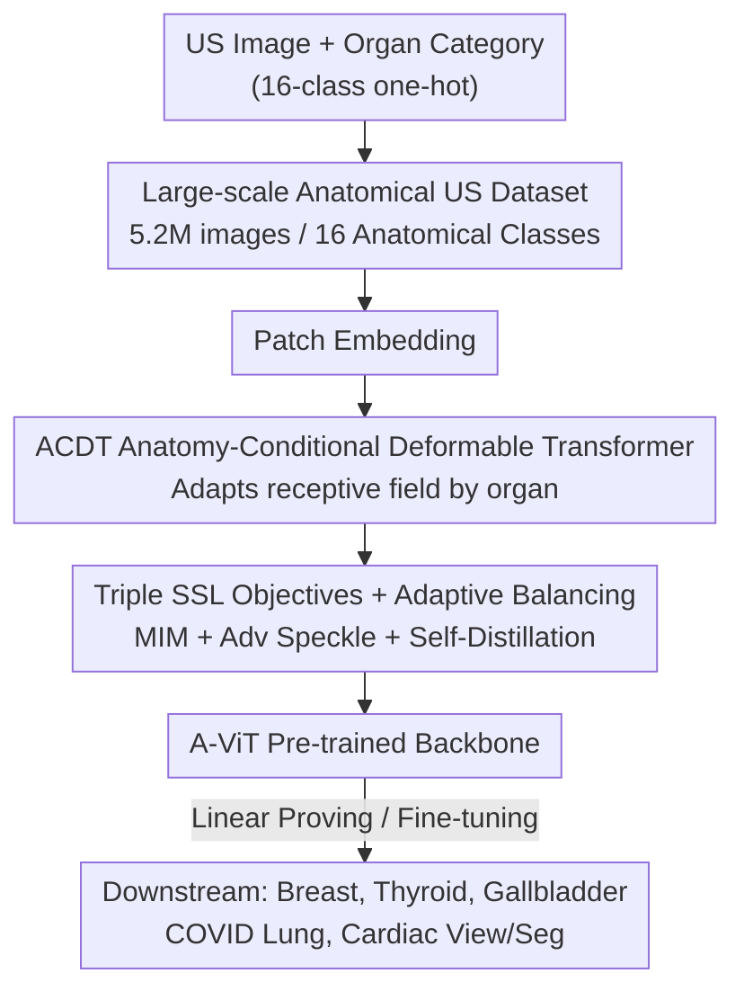

# Anatomy-aware Representation Learning for Medical Ultrasound

**Conference**: ICLR2026  
**OpenReview**: [https://openreview.net/forum?id=5ThIWuDkEf](https://openreview.net/forum?id=5ThIWuDkEf)  
**Code**: TBD  
**Area**: Medical Imaging / Self-Supervised Learning / Ultrasound  
**Keywords**: Medical Ultrasound, Self-Supervised Representation Learning, Anatomy-aware, Deformable Transformer, Speckle Preservation

## TL;DR
Addressing the three main characteristics of medical ultrasound (US)—heavy speckle texture, singular grayscale color, and organ-specific features—this paper constructs a large-scale ultrasound dataset of 5.2 million images. It proposes an anatomy-aware A-ViT (centered on "Anatomy-Conditional Deformable Transformer", ACDT) coupled with a triple self-supervised objective of "masked reconstruction + adversarial + self-distillation." The method significantly outperforms general-purpose and medical SSL baselines across multiple US diagnostic tasks, including breast, thyroid, gallbladder, COVID-19 lung, and cardiac imaging.

## Background & Motivation
**Background**: Medical ultrasound (US) is the preferred imaging modality for early screening of various diseases (breast, thyroid, gallbladder, heart, lung, etc.) due to its low cost, real-time nature, and lack of ionizing radiation. Meanwhile, self-supervised representation learning (SSL) has proven capable of learning general features from unlabeled data in natural images (NI). Pre-trained models like DINO and MAE work robustly on downstream tasks even with limited labels, naturally suggesting the migration of SSL to ultrasound to create "Ultrasound Foundation Models."

**Limitations of Prior Work**: Directly migrating SSL models pre-trained on natural images (NI) to ultrasound tasks yields poor results. The authors use PCA visualization (Fig.1b) to show that features extracted by NI models like DINOv3 on ultrasound are cluttered and lack discriminative power. The fundamental reason is the massive gap in low-level attributes: ultrasound is filled with **speckle noise** (granular textures from wave-tissue interaction) which is absent in NI; ultrasound is essentially **grayscale with narrow pixel intensity ranges**, while NI models rely heavily on rich color information. More critically, **diagnostic features in ultrasound depend strongly on the organ being imaged**—cardiac ultrasound looks at globally distributed chamber structures, while breast ultrasound focuses on locally clustered lesions. This heterogeneity, where feature distributions differ completely across organs within the same modality, does not exist in natural images.

**Key Challenge**: Ultrasound data itself is scarce (public sets for breast/thyroid often have fewer than 1,000 images and suffer from severe domain shifts due to equipment and probes); NI pre-training fails to bridge the attribute gap. Existing "anatomy-aware" medical SSL works (e.g., for fetal ultrasound) are mostly designed for a **single anatomical domain** and cannot cover the multi-organ heterogeneity found in real-world clinical practice.

**Goal**: (1) Assemble a sufficiently large, diverse, multi-organ ultrasound pre-training dataset; (2) Design an SSL framework capable of **adapting feature extraction by organ**, allowing representation learning to "tailor" itself to each anatomical structure; (3) Ensure the learned representations are generalizable across various ultrasound diagnostic tasks.

**Key Insight**: Treat the "imaged organ" as an explicit condition injected into the Transformer's feature extraction. By conditioning a deformable convolution on the anatomical category (one-hot), the receptive field adaptively deforms according to the organ. This is combined with training objectives specifically designed to preserve high-frequency speckle, learning representations that are both anatomy-specific and faithful to ultrasound physics.

## Method

### Overall Architecture
The input to ARL (Anatomy-aware Representation Learning) is a spatial ultrasound image and its corresponding anatomical category (a one-hot vector of 16 classes). The output is an anatomy-aware backbone, A-ViT, which can be frozen for linear probing or fine-tuned for downstream classification/segmentation. The pipeline consists of three stages: first, ultrasound images are partitioned into tokens via standard patch embedding; second, they are processed through a series of ACDT blocks—where organ categories are encoded into anatomical context vectors and added to patches to drive a **deformable convolution** that adjusts sampling positions by organ, followed by deformable attention to fuse anatomical features back into the backbone; finally, the entire network is trained using a triple self-supervised objective of "masked image reconstruction + adversarial + self-distillation," where the adversarial term specifically preserves ultrasound-specific high-frequency speckle. Post-training, A-ViT serves as a pre-trained backbone for tasks like breast, thyroid, and gallbladder classification, COVID-19 lung assessment, and cardiac view classification/segmentation.

### Key Designs

**1. Large-scale Anatomical Ultrasound Dataset: Overcoming data scarcity**

SSL requires large-scale data, which is precisely what ultrasound lacks, forcing others to use NI models. The authors constructed one of the largest medical ultrasound datasets to date: approximately **5.2 million images** from 11 public datasets and 15 medical institutions (USA, Korea, India). It covers **16 anatomical categories** and includes linear, convex, and phased array probes, with resolutions ranging from $64\times64$ to $1280\times960$ and depths up to 24 cm. This diversity across regions, equipment, and conditions serves as the "fuel" for anatomy-aware learning and naturally mitigates domain shift—the model encounters a wide distribution during pre-training.

**2. ACDT Anatomy-Conditional Deformable Transformer: Organ-adaptive receptive fields**

This is the core innovation addressing the organ-dependency of diagnostic features. Cardiac US discriminates based on global chamber distributions, while breast US focuses on local lesions; standard convolutions/attention with fixed receptive fields cannot optimize for both. ACDT explicitly conditions deformable convolutions on anatomical classes: flattened patch embeddings $x_f$ are rearranged into 2D blocks $x_P$, and the 16-class one-hot vector is projected into an anatomical context vector $AC$, which is added to the patch to get $x_{P,AC}=x_P+AC$. This vector then predicts the offset for each sampling point $\Delta p_k=g_\theta(x_{P,AC})$, and the deformable convolution samples according to these offsets:

$$y_P(p)=\sum_{k=1}^{K} w_k\, S\big(x_P,\, p+\Delta p_k\big)$$

where $S(\cdot,\cdot)$ is bilinear sampling. Consequently, offsets are determined by the organ, allowing receptive fields to expand for global structures (cardiac) or contract for local ones (breast). The anatomical features $y_P$ then serve as key/value pairs while the original patches $x_P$ serve as queries in a deformable attention mechanism:

$$\text{DeformAttn}(x_P,y_P)=\mathrm{Softmax}\!\left(\frac{(x_P W^Q)(y_P W^K)^\top}{\sqrt{d_k}}\right)(y_P W^V)$$

Multiple stacked ACDT blocks form the A-ViT. Unlike SSL methods serving a single organ, this unified mechanism handles multi-organ heterogeneity.

**3. Triple SSL Objectives + Adaptive Gradient Balancing: Learning high-frequency speckle**

The training objectives are tailored for ultrasound. The authors combine three complementary goals. The first is Masked Image Modeling (MIM), which reconstructs randomly masked patches. Let $\Omega$ be the set of masked indices:

$$L_{\text{MIM}}=\frac{1}{|\Omega|}\sum_{i\in\Omega}\lVert x_i-\hat{x}_i\rVert_2^2$$

However, pure $\ell_2$ reconstruction blurs high-frequency speckles (crucial for assessing tumor malignancy or cardiac function). Thus, the second objective introduces an **adversarial loss**: a discriminator $D(\cdot)$ distinguishes reconstructed patches from real ones, with the generator target $L_{\text{adv}}^{(G)}=-\mathbb{E}_{\hat{x}}[\log D(\hat{x})]$ forcing the retention of fine-grained speckle. The third is DINO-inspired **self-distillation**, compensating for the local focus of the first two by ensuring global consistency. Given student/teacher distributions $z_s, z_t$: $L_{\text{SD}}=-\sum_{i=1}^{N} z_t^{(i)}\log z_s^{(i)}$. A **gradient-adaptive weight** avoids manual tuning:

$$L=L_{\text{SD}}+\big(L_{\text{MIM}}+\lambda L_{\text{adv}}^{(G)}\big),\qquad \lambda=\frac{\lVert\nabla L_{\text{MIM}}\rVert}{\lVert\nabla L_{\text{adv}}^{(G)}\rVert+\varepsilon}$$

This dynamically balances reconstruction and adversarial terms based on their gradient magnitudes, ensuring stable training.

### Loss & Training
The final objective is $L=L_{\text{SD}}+(L_{\text{MIM}}+\lambda L_{\text{adv}}^{(G)})$, where $\lambda$ is automatically adjusted. Downstream evaluation follows standard SSL protocols: either training a linear classifier on a frozen backbone (linear probing) or end-to-end fine-tuning. Segmentation tasks use a UPerNet decoder. All comparisons use ViT-B / patch 16 backbones with matched depth and dimensions to ensure fair computational comparison.

## Key Experimental Results

### Main Results
Downstream tasks include five classification tasks (Breast Cancer, Gallbladder Tumor, COVID-19 Lung, Thyroid Cancer, Cardiac View) and one Cardiac LV Segmentation. Baselines include general CV models (MAE, MoCo v3, iBOT, SigLIP2, DINOv3), US-specific models (DMAE, USFM), and multimodal medical models (LVM-Med). Results for Breast Cancer (BUSI) are as follows:

| Setting | Metric | Ours (A-ViT) | Representative Baseline |
|------|------|-----------|-----------|
| Linear Probing | Accuracy | **86.62** | MAE 77.64 / USFM 82.39 |
| Fine-tuning | Accuracy | **93.66** | SigLIP2 89.34 / USFM 88.73 |
| Fine-tuning | AUROC | **0.9742** | USFM 0.9376 / SigLIP2 0.9351 |

Under linear probing, A-ViT outperforms the NI model MAE by nearly 9 points, confirming that "NI representations fail to capture US high-frequency speckle." Multi-task comparisons show A-ViT achieving SOTA in every category:

| Task | Metric | Ours | Strongest Baseline |
|------|------|------|----------|
| Cardiac Seg | Dice / mIoU | **92.16 / 85.67** | USFM 91.13 / 84.15 |
| Cardiac View | Top-1 | **91.80** | MoCo v3 91.08 |
| Thyroid Cancer | Acc / AUROC | **87.07 / 0.9475** | Dino v3 86.24 / 0.9428 |
| COVID Lung | Acc / AUROC | **91.44 / 0.9714** | USFM 87.67 / 0.9475 |
| Gallbladder | Acc / AUROC | **89.89 / 0.9511** | USFM 86.64 / 0.9347 |

### Ablation Study
Ablations on breast cancer classification (Table 3) clarify the contribution of each component:

| Configuration | Data | Accuracy | Note |
|------|------|----------|------|
| MIM only | Natural Image | 83.09 | NI Pre-training Baseline |
| MIM only | Ultrasound | 89.43 (+6.34) | Domain alignment to US |
| + ACDT | Ultrasound | 92.25 (+2.82) | Anatomy-conditional deformation |
| + Adv | Ultrasound | 92.95 (+0.70) | High-frequency speckle preservation |
| + Self-Distill| Ultrasound | 93.66 (+0.71) | Global semantic enhancement |

### Key Findings
- **Domain alignment is the biggest contributor**: Merely switching pre-training data from NI to US (keeping all else constant) jumps accuracy from 83.09 to 89.43 (+6.34), showing the attribute gap is the primary bottleneck.
- **ACDT provides the largest structural gain**: Adding ACDT on top of the aligned domain yields another +2.82, proving that anatomy-conditional attention truly refines features by organ.
- **Adversarial and Distillation address specific weaknesses**: The adversarial term (+0.70) targets high-frequency diagnostic cues like calcifications, while distillation (+0.71) strengthens global semantics.
- **Robustness to small data**: When training data is reduced to 1% (approx. 0.4K images) for Cardiac View classification, A-ViT maintains a significant lead over baselines, demonstrating the value of anatomy-aware pre-training in low-resource clinical settings.

## Highlights & Insights
- **Organ as a first-class variable**: Unlike previous SSL which served single organs, this work uses 16-class one-hot encoding + deformable offsets to handle both global (heart) and local (breast) feature distributions simultaneously.
- **Effective use of Adversarial Loss**: US speckle is both noise and signal; while $\ell_2$ blurs it, the GAN discriminator forces the model to preserve it—a design grounded in the modality's physics.
- **Gradient-adaptive Multi-objective Balancing**: The automatic $\lambda$ calculation eliminates the need for grid-searching weights in multi-loss setups, a trick applicable to any "reconstruction + adversarial" combination.
- **Data engineering as a contribution**: The 5.2M image dataset across diverse devices is the foundation for this method, serving as a reminder that data scale and diversity often dictate the upper bound in medical foundation models.

## Limitations & Future Work
- **Dependency on anatomical labels**: ACDT requires organ one-hot labels. If labels are missing or incorrect during inference, adaptive offsets might be detrimental.
- **Fixed 16 categories**: The paper does not provide a strategy for zero-shot generalization or smooth expansion to new organs outside the pre-defined 16.
- **Data Availability**: Thyroid and Cardiac View data are private and not open-sourced, making full reproduction difficult. Some downstream public sets (like BUSI) are small.
- **Cross-task comparison caveat**: Task difficulties and sizes vary significantly; "best" results within tables shouldn't be compared directly across tasks.
- **Future Directions**: Exploring soft anatomical embeddings or automatic organ recognition for label-free inference at the terminal, and validating on open-set generalization for more probes/diseases.

## Related Work & Insights
- **vs. MAE / DINOv3 (NI SSL)**: These learn general representations on natural images but degrade on US due to the speckle/grayscale/heterogeneity gaps. A-ViT bridges these by pre-training in the US domain with anatomical conditioning.
- **vs. USFM / DMAE (US-specific SSL)**: While these use medical data, they lack organ-adaptive mechanisms. ACDT's deformable attention refines organ-specific features, allowing A-ViT to outperform USFM.
- **vs. Single-organ SSL (Jiao 2020 / Fu 2022)**: These tie anatomical priors to a single domain. Ours uses a unified 16-class mechanism to handle multi-organ heterogeneity in one model, a key step toward a general US foundation model.

## Rating
- Novelty: ⭐⭐⭐⭐ Successfully conditions deformable Transformers on anatomy to handle multi-organ heterogeneity.
- Experimental Thoroughness: ⭐⭐⭐⭐⭐ Six downstream tasks, multiple baselines, detailed ablations, and data scaling studies.
- Writing Quality: ⭐⭐⭐⭐ Clear chain of logic from motivation to method and results; good use of equations and figures.
- Value: ⭐⭐⭐⭐ Provides a robust foundation and dataset for ultrasound-specific foundation models.

<!-- RELATED:START -->

## Related Papers

- [\[ICLR 2026\] MedGMAE: Gaussian Masked Autoencoders for Medical Volumetric Representation Learning](medgmae_gaussian_masked_autoencoders_for_medical_volumetric_representation_learn.md)
- [\[ICLR 2026\] CortiLife: A Unified Framework for Cortical Representation Learning across the Lifespan](cortilife_a_unified_framework_for_cortical_representation_learning_across_the_li.md)
- [\[CVPR 2026\] Ultrasound-CLIP: Semantic-Aware Contrastive Pre-training for Ultrasound Image-Text Understanding](../../CVPR2026/medical_imaging/ultrasound-clip_semantic-aware_contrastive_pre-training_for_ultrasound_image-tex.md)
- [\[ICML 2026\] Which Anatomy Matters Under Limited Labels? A Data-Efficient Anatomy-Aware Benchmark for Cardiac Pathology Prediction](../../ICML2026/medical_imaging/which_anatomy_matters_under_limited_labels_a_data-efficient_anatomy-aware_benchm.md)
- [\[AAAI 2026\] Multivariate Gaussian Representation Learning for Medical Action Evaluation](../../AAAI2026/medical_imaging/multivariate_gaussian_representation_learning_for_medical_action_evaluation.md)

<!-- RELATED:END -->
