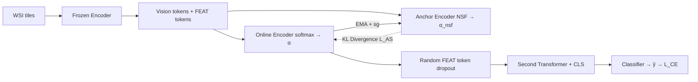

# ASMIL: Attention-Stabilized Multiple Instance Learning for Whole-Slide Imaging

**Conference**: ICLR 2026  
**OpenReview**: [https://openreview.net/forum?id=CYmjrbQRyM](https://openreview.net/forum?id=CYmjrbQRyM)  
**Code**: [https://github.com/Linfeng-Ye/ASMIL](https://github.com/Linfeng-Ye/ASMIL)  
**Area**: Medical Imaging / Computational Pathology / Multiple Instance Learning  
**Keywords**: Whole-Slide Imaging, Multiple Instance Learning, Attention Stabilization, Anchor Model, EMA, Normalized Sigmoid  

## TL;DR
This paper identifies for the first time a failure mode called "Attention Dynamic Instability" in Attention-based MIL for Whole-Slide Imaging (WSI). It proposes ASMIL: a unified framework that stabilizes attention using an EMA-updated anchor model distillation, suppresses attention over-concentration with a normalized sigmoid, and mitigates overfitting via token random dropout, achieving up to 6.49% F1 improvement across multiple pathological datasets.

## Background & Motivation

**Background**: Whole-slide images (WSIs) are gigapixel-level pathological images where tumor regions often occupy a tiny fraction of the slide. Since pixel-level annotation is impractical, slide-level weak labels are used for Multiple Instance Learning (MIL). Attention-based MIL (ABMIL, TransMIL, etc.) treats each tile as an instance and aggregates them using attention weights into a bag-level representation. This has become the de facto standard for WSI classification and provides clinical interpretability through attention heatmaps.

**Limitations of Prior Work**: Attention MIL is known for two persistent issues: (PII) Attention over-concentration, where the model assigns weights almost exclusively to a few tiles, harming generalization and interpretability; and (PIII) Overfitting, as WSI datasets typically contain only a few hundred slides per category despite high tile redundancy. This paper conducts experiments on four representative attention MIL models across two public datasets and discovers a third, previously unreported failure mode.

**Key Challenge**: (PI) Attention dynamic instability—the attention distribution for the same WSI fluctuates violently across different epochs rather than converging to a stable pattern. The authors quantify this using the Jensen-Shannon divergence (JSD) between attention distributions of adjacent epochs, finding that models like TransMIL experience continuous large JSD fluctuations, corresponding to higher cross-entropy and poorer performance. Unstable attention implies that the tissue regions the model focuses on change every epoch, which degrades both performance and interpretability.

**Goal**: To address PI, PII, and PIII simultaneously within a unified framework.

**Key Insight**: Introduce an **anchor model** that is isomorphic to the online model but updated via Exponential Moving Average (EMA) without backpropagation. The online attention is stabilized by aligning with the anchor attention; the anchor branch uses **normalized sigmoid** instead of softmax to naturally suppress over-concentration; and **token random dropout** is applied as a regularizer.

## Method

### Overall Architecture
Each WSI is tiled and passed through a frozen pre-trained encoder to generate vision tokens. These, alongside trainable FEAT tokens, are fed into two branches: an online encoder and an anchor encoder. The online branch uses softmax to obtain attention $\alpha$, while the anchor branch uses a normalized sigmoid to obtain $\alpha^{nsf}$. The KL divergence between them acts as a stabilization loss $L_{AS}$ to pull the online attention toward the anchor. The anchor is updated from the online model using stop-gradient and EMA. During training, a portion of FEAT tokens is randomly dropped; the remaining tokens plus a [CLS] token are fed into a second transformer for bag representation and classification. The total loss is $L = L_{CE} + \beta L_{AS}$. Only the online model is used during inference, incurring no additional overhead.

### Key Designs

**1. EMA Anchor Model for Stability: Replacing scalar penalties with data-dependent functional regularization.** To address PI, the authors replicate the online model's attention module as an anchor, updating its parameters via $\theta'_t \leftarrow m\theta'_{t-1} + (1-m)\theta_t$. As EMA naturally smooths high-frequency parameter jitters, the anchor provides a more stable attention distribution. Aligning the online attention $\alpha$ to the anchor distribution transfers this stability. The authors argue that EMA anchors provide functional regularization conditioned on the entire bag, capturing inter-instance relationships that content-independent scalar penalties (like entropy or $\ell_2$ norms) cannot.

**2. Normalized Sigmoid (NSF) in the Anchor Branch: Provable "Selective Flattening".** To address PII, the authors attribute over-concentration to the exponential nature of softmax, where a few high scores swallow the weights of all other tokens. NSF is defined as $\alpha^{nsf}_i(z) = \sigma(z_i) / \sum_j \sigma(z_j)$, where $\sigma$ is the sigmoid function. Since sigmoid saturates at 1 for large positive values and approaches 0 for negative values, NSF can flatten "high-score" informative tokens to near-equality while suppressing "low-score" tokens. Theorem 1 provides a rigorous bound: for tokens in the high-score set, the NSF weight ratio is $\le 1 + e^{-\tau}$, while low-score tokens are $\le e^{-\tau}/h$. The proof shows that softmax with a single temperature cannot simultaneously "suppress low scores" and "flatten high scores." NSF is only used in the anchor branch to avoid vanishing gradients during online learning.

**3. FEAT Token Random Dropout: Token-level regularization designed for ASMIL.** To address PIII, $N$ trainable FEAT tokens (where $N \ll M$, the number of tiles) are randomly dropped during training based on a Bernoulli mask with ratio $B \in [0,1)$. This prevents co-adaptation between FEAT tokens and ensures the model does not over-rely on specific tokens. Ablations show peak performance around $B \approx 0.5$. Since ASMIL's attention alignment assumes a one-to-one correspondence between online and anchor tokens, standard instance dropout (like MIL-Dropout) cannot be directly applied, necessitating this FEAT token-specific design.

## Key Experimental Results

Datasets: CAMELYON-16, CAMELYON-17, and BRACS; Backbones: ImageNet pre-trained ResNet-18 and in-domain SSL pre-trained ViT-S; Baselines: 11 representative attention MIL models.

### Main Results (ViT-S SSL backbone, F1 / AUC)

| Method | CAM-16 F1 | CAM-17 F1 | BRACS F1 | BRACS AUC |
|------|-----------|-----------|----------|-----------|
| ABMIL (ICML18) | 0.914 | 0.522 | 0.680 | 0.866 |
| TransMIL (NeurIPS21) | 0.922 | 0.554 | 0.631 | 0.841 |
| DTFD-MIL (CVPR22) | 0.948 | 0.627 | 0.612 | 0.870 |
| ACMIL (ECCV24) | 0.954 | 0.562 | 0.722 | 0.888 |
| AEM (MICCAI25) | 0.947 | 0.647 | 0.742 | 0.905 |
| HDMIL (CVPR25) | 0.958 | 0.571 | 0.717 | 0.874 |
| **Ours (ASMIL)** | **0.965** | **0.689** | **0.781** | **0.914** |

ASMIL achieves SOTA across all datasets using the ViT-SSL backbone. The F1 gain is particularly significant in sparse tumor scenarios like CAMELYON-17 (+6.49%) and BRACS (+3.9% over the second best).

### Ablation Study

Component Ablation (BRACS):

| Anchor | NSF | rd | F1 | AUC |
|--------|-----|-----|------|------|
| ✓ | ✓ | ✓ | **0.781** | **0.914** |
| ✓ | ✓ | ✗ | 0.765 | 0.903 |
| ✓ | ✗ | ✓ | 0.759 | 0.895 |
| ✓ | ✗ | ✗ | 0.747 | 0.887 |
| ✗ | ✗ | ✓ | 0.728 | 0.868 |
| ✗ | ✗ | ✗ | 0.712 | 0.860 |

All three components are essential, with the **anchor model contributing the most** (increasing F1 from 0.712 to 0.747).

Plug-and-play Ablation: Adding Anchor + NSF to existing methods consistently improves performance. ABMIL on BRACS saw an F1 gain of up to **10.73%**.

### Key Findings
- Attention instability is a real and pervasive failure mode; JSD oscillation correlates with high cross-entropy. ASMIL enables attention to converge stably and highlight cancerous regions consistently.
- Anchor + NSF functions as a transferable universal plugin, enhancing older methods.
- On localization tasks (FROC / Dice), ASMIL heatmaps cover cancerous regions more completely than baselines, thanks to NSF mitigating over-concentration.

## Highlights & Insights
- **Identifying a new problem is a contribution**: The systematic identification and quantification of "Attention Dynamic Instability" using JSD turns a vague intuition into a measurable metric.
- **Teacher-Student Synergy**: The combination of EMA anchors and attention KL alignment effectively transfers momentum-based self-supervised ideas to stabilize MIL attention.
- **Theoretical Grounding of NSF**: Theorem 1 provides a mathematical rationale for "selective flattening," showing it is unattainable with single-temperature softmax.
- **Practical Efficiency**: By discarding the anchor during inference, the model maintains **zero extra inference overhead**.

## Limitations & Future Work
- ASMIL's attention alignment assumes one-to-one token correspondence, preventing the direct use of generic instance dropout (e.g., MIL-Dropout), thus limiting regularization flexibility to the specific token design.
- The framework introduces several hyperparameters (EMA factor $m$, loss weight $\beta$, FEAT token count, dropout rate $B$), which may increase the tuning burden across diverse datasets.
- Slight performance drops when adding the anchor to certain architectures (e.g., DSMIL on CAMELYON-16) indicate that the plugin may not benefit every model equally.
- Validation on larger-scale, multi-cancer WSI datasets is still needed.

## Related Work & Insights
- **Attention MIL Lineage**: Evolution from ABMIL (instance weighting) to TransMIL (inter-instance relations) and CLAM (clustering supervision).
- **Combating Over-concentration**: Unlike ACMIL (masking top-K) or AEM (entropy regularization), ASMIL adopts a "Modified Activation + Anchor Distillation" approach.
- **Combating Overfitting**: ASMIL's token dropout complements methods like DTFD-MIL (pseudo-bags) and MHIM-MIL (hard negative mining).
- **Insight**: Treating "training dynamic stability" as an explicit optimization objective is a valuable perspective that can be reused in other weak-supervision or few-shot tasks.

## Rating
- **Novelty**: ⭐⭐⭐⭐ Identifies a new failure mode; the combination of Anchor + NSF + token dropout has clear motivation and theoretical backing.
- **Experimental Thoroughness**: ⭐⭐⭐⭐ Covers 11 baselines across 3 datasets and 2 backbones, including localization tasks and survival prediction.
- **Writing Quality**: ⭐⭐⭐⭐ Clear classification of problems (PI/PII/PIII) and rigorous theoretical derivation.
- **Value**: ⭐⭐⭐⭐ Serves as a transferable plugin that improves existing methods (up to +10.73%) with zero inference overhead.

<!-- RELATED:START -->

## Related Papers

- [\[CVPR 2026\] Contrastive Cross-Bag Augmentation for Multiple Instance Learning-based Whole Slide Image Classification](../../CVPR2026/medical_imaging/contrastive_cross-bag_augmentation_for_multiple_instance_learning-based_whole_sl.md)
- [\[CVPR 2026\] Universal-to-Specific: Dynamic Knowledge-Guided Multiple Instance Learning for Few-Shot Whole Slide Image Classification](../../CVPR2026/medical_imaging/universal-to-specific_dynamic_knowledge-guided_multiple_instance_learning_for_fe.md)
- [\[ICLR 2026\] Mixture of Mini Experts: Overcoming the Linear Layer Bottleneck in Multiple Instance Learning](mixture_of_mini_experts_overcoming_the_linear_layer_bottleneck_in_multiple_insta.md)
- [\[ICML 2025\] Do Multiple Instance Learning Models Transfer?](../../ICML2025/medical_imaging/do_multiple_instance_learning_models_transfer.md)
- [\[ECCV 2024\] Pathology-knowledge Enhanced Multi-instance Prompt Learning for Few-shot Whole Slide Image Classification](../../ECCV2024/medical_imaging/pathology-knowledge_enhanced_multi-instance_prompt_learning_for_few-shot_whole_s.md)

<!-- RELATED:END -->
## Related Papers

- [\[CVPR 2026\] Contrastive Cross-Bag Augmentation for Multiple Instance Learning-based Whole Slide Image Classification](../../CVPR2026/medical_imaging/contrastive_cross-bag_augmentation_for_multiple_instance_learning-based_whole_sl.md)
- [\[CVPR 2026\] Universal-to-Specific: Dynamic Knowledge-Guided Multiple Instance Learning for Few-Shot Whole Slide Image Classification](../../CVPR2026/medical_imaging/universal-to-specific_dynamic_knowledge-guided_multiple_instance_learning_for_fe.md)
- [\[ICLR 2026\] Mixture of Mini Experts: Overcoming the Linear Layer Bottleneck in Multiple Instance Learning](mixture_of_mini_experts_overcoming_the_linear_layer_bottleneck_in_multiple_insta.md)
- [\[CVPR 2026\] TopoSlide: Topologically-Informed Histopathology Whole Slide Image Representation Learning](../../CVPR2026/medical_imaging/toposlide_topologically-informed_histopathology_whole_slide_image_representation.md)
- [\[AAAI 2026\] Towards Effective and Efficient Context-aware Nucleus Detection in Histopathology Whole Slide Images](../../AAAI2026/medical_imaging/towards_effective_and_efficient_context-aware_nucleus_detection_in_histopatholog.md)

<!-- RELATED:END -->
