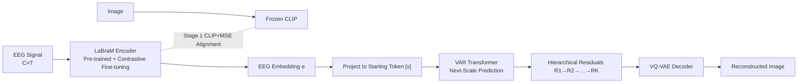

# Autoregressive Visual Decoding from EEG Signals

**Conference**: ICLR 2026  
**OpenReview**: [https://openreview.net/forum?id=TKjfzuVLX4](https://openreview.net/forum?id=TKjfzuVLX4)  
**Code**: [https://github.com/ddicee/avde](https://github.com/ddicee/avde)  
**Area**: Brain-Computer Interface / EEG Visual Decoding / Autoregressive Image Generation  
**Keywords**: EEG-to-Image, Visual Decoding, LaBraM, Next-Scale Prediction (VAR), Contrastive Learning, BCI  

## TL;DR
AVDE reformulates "decoding EEG signals into images" into a **two-stage, autoregressive** lightweight pipeline: first, it aligns EEG to the CLIP image space using the pre-trained EEG foundation model LaBraM combined with contrastive learning; then, it uses "Next-Scale Prediction" from the VAR framework to generate images progressively from EEG embeddings. With only 10% of the parameters, it outperforms previous SOTA models that rely on large diffusion models in both retrieval and reconstruction tasks.

## Background & Motivation
- **Background**: Decoding visual content from non-invasive brain signals is at the intersection of cognitive science and generative AI. While fMRI offers high precision, it is slow, expensive, and hardware-constrained. EEG, with its millisecond temporal resolution, portability, and low cost, has become a more deployable alternative. Recent works (ATM, NICE, etc.) have demonstrated potential in image retrieval and reconstruction.
- **Limitations of Prior Work**: Mainstream EEG visual decoding follows the unCLIP paradigm—a **multi-stage pipeline** (Figure 1 shows five stages) consisting of an EEG encoder → diffusion prior → Stable Diffusion. This has three major flaws: ① Serial multi-stage processes **accumulate errors at each step**, damaging reconstruction fidelity; ② EEG encoders are often **trained from scratch**, making it difficult to extract good features from noisy signals with limited image-EEG pairs; ③ Diffusion models often exceed 3 billion parameters, making the **computational/memory overhead** impractical for real-time BCI.
- **Key Challenge**: EEG is a noisy, low-information-density 1D time-series signal, while images are structured high-dimensional visual content. The distribution gap is massive. Bridging it usually requires complex multi-stage pipelines, but increased complexity leads to lower controllability and deployability—a trade-off between **fidelity vs. simplicity/deployability**.
- **Goal**: Replace the multi-stage diffusion pipeline with a direct, coherent, and lightweight framework that maintains a direct mapping between EEG and images while reducing parameters and inference costs to deployable levels.
- **Core Idea**: **[Transfer Pre-trained EEG Representations]** Replace encoders trained from scratch with LaBraM, pre-trained on 2000+ hours of EEG data. **[Autoregressive Next-Scale Prediction instead of Diffusion]** Use the VAR framework to treat EEG embeddings as the "coarsest scale" of an image, using a transformer to generate images from coarse to fine, naturally aligning the generation process with the hierarchical visual perception of the human brain.

## Method

### Overall Architecture
AVDE is a clear **two-stage** process. Stage one is "Alignment": encode EEG using pre-trained LaBraM, freeze CLIP to encode images, and pull EEG into the image representation space using a joint contrastive + regression objective to obtain information-rich EEG embeddings. Stage two is "Generation": treat the EEG embedding as the starting token `[s]` for the coarsest scale, feed it into a decoder-only transformer to autoregressively predict VQ-VAE multi-scale residual maps via "next-scale prediction," accumulate them from coarse to fine into a complete feature map, and finally reconstruct the image via the VQ-VAE decoder.

### Key Designs
**1. Replacing random-initialized encoders with pre-trained LaBraM: Standing on the shoulders of giants.** EEG visual decoding has long been hindered by "limited paired data and noisy signals." Encoders trained from scratch struggle to converge. AVDE utilizes LaBraM, a model pre-trained on 2000+ hours of multi-subject, multi-condition EEG data. The encoding process involves: partitioning $X \in \mathbb{R}^{C\times T}$ into patches along the time dimension using non-overlapping windows $w$; extracting local temporal features $e_{c_j,k}\in\mathbb{R}^d$ via 1D convolution, group normalization, and GELU; injecting spatio-temporal context with trainable temporal embeddings $te_k$ and spatial embeddings $se_j$; and integrating dependencies using a Transformer encoder. This transfer learning allows the encoder to generalize across subjects and extract semantically meaningful features.

**2. Combined Contrastive + Regression Alignment: Structural alignment plus point-to-point precision.** Since LaBraM was pre-trained on clinical EEG rather than visual stimuli, it must be fine-tuned. Given paired EEG-images, LaBraM encodes EEG into $e$ and frozen CLIP encodes images into $z$. A bi-directional contrastive loss pulls matching pairs together: $L_{CLIP} = -\frac{1}{B}\sum_i \big(\log\frac{\exp(s(e_i,z_i)/\tau)}{\sum_j \exp(s(e_i,z_j)/\tau)} + \log\frac{\exp(s(e_i,z_i)/\tau)}{\sum_k \exp(s(e_k,z_i)/\tau)}\big)$, where $s$ is cosine similarity and $\tau$ is a learnable temperature. To ensure absolute positioning in the embedding space beyond just relative ranking, a regression term is added: $L_{Combined} = \lambda L_{CLIP} + (1-\lambda) L_{MSE}$ ($\lambda=0.8$). Contrastive loss places brain signals structurally within the image manifold, while MSE pins them near the corresponding image embeddings.

**3. Autoregressive Generation with Next-Scale Prediction: VAR as a natural metaphor for brain vision.** Moving away from diffusion, AVDE leverages the VAR approach: a pre-trained VQ-VAE quantizes images into $K$ multi-scale residual maps $(R_1,\dots,R_K)$ with increasing resolution. Feature maps are reconstructed via cumulative upsampling: $F_k = \sum_{i=1}^k \mathrm{up}(R_i,(h,w))$. A decoder-only transformer predicts these residuals conditioned on the EEG embedding $e$: $p(R_1,\dots,R_K)=\prod_{k=1}^K p(R_k\mid R_1,\dots,R_{k-1},e)$. Specifically, $e$ is projected to a starting token `[s]` to initiate generation. For each scale $k$, a downsampled version of the previous cumulative map $\tilde F_{k-1}=\mathrm{down}(F_{k-1},(h_k,w_k))$ acts as input. Training uses a block-wise causal attention mask and cross-entropy supervision. The EEG embedding acts as the "coarsest layer," ensuring the generation chain is **directly linked** to the input, mirroring the human brain's hierarchical perception from V1 (edges/colors) → V2/V4 (contours/structure) → IT (global objects).

## Key Experimental Results
Datasets: THINGS-EEG (10 subjects, 1654 concepts training / 200 concepts test, RSVP paradigm, 63 channels) as primary, EEG-ImageNet as supplementary. Tasks: 200-way zero-shot retrieval + image reconstruction.

### Main Results (200-way Zero-shot Retrieval, Average Top-1/Top-5)

| Method | Within-Subject Top-1 | Within-Subject Top-5 | Cross-Subject Top-1 | Cross-Subject Top-5 |
|------|------|------|------|------|
| EEGNetV4 | 0.186 | 0.441 | 0.089 | 0.224 |
| NICE | 0.242 | 0.512 | 0.113 | 0.273 |
| ATM (Li et al. 2024) | 0.269 | 0.548 | 0.115 | 0.280 |
| **AVDE (Ours)** | **0.300** | **0.582** | **0.143** | **0.329** |

Reconstruction Quality (Subject-08):

| Method | PixCorr↑ | SSIM↑ | AlexNet(5)↑ | Inception↑ | CLIP↑ | SwAV↓ |
|------|------|------|------|------|------|------|
| Li et al. 2024 | 0.160 | 0.345 | 0.866 | 0.734 | 0.786 | 0.582 |
| CognitionCapturer | 0.175 | 0.366 | 0.610 | 0.721 | 0.744 | 0.577 |
| **AVDE** | **0.188** | **0.396** | **0.889** | **0.765** | **0.795** | **0.557** |

Efficiency Comparison (Single A100, batch=1):

| Method | Params(M) | FLOPs(G) | Inference(ms) | Memory(MB) |
|------|------|------|------|------|
| Li et al. 2024 | 3818.1 | 8738.6 | 310.4 | 4826.7 |
| **AVDE** | **425.3** | **1350.5** | **91.2** | **1809.6** |

### Ablation Study (Average Reconstruction Across Subjects)

| Configuration | PixCorr↑ | SSIM↑ | CLIP↑ | SwAV↓ |
|------|------|------|------|------|
| **LaBraM+VAR (Full)** | **0.147** | **0.366** | **0.747** | **0.586** |
| ATM+VAR (Encoder swap) | 0.141 | 0.351 | 0.731 | 0.601 |
| EEGNet+VAR (Encoder swap) | 0.132 | 0.323 | 0.712 | 0.627 |
| LaBraM+Li et al. (unCLIP swap) | 0.138 | 0.346 | 0.726 | 0.606 |
| LaBraM+LDM-4 (Diffusion swap) | 0.139 | 0.343 | 0.731 | 0.609 |
| LaBraM+DiT-XL/2 (Diffusion swap) | 0.143 | 0.354 | 0.735 | 0.594 |

### Key Findings
- **90% parameter reduction, 3.4x faster inference, and 2.7x memory savings** while exceeding SOTA in retrieval and reconstruction, proving the value of lightweight autoregressive routes for BCI.
- Ablations show that **both the encoder and generation framework are critical**: swapping LaBraM or reverting to unCLIP/Diffusion causes performance drops, indicating that the "pre-trained encoder + autoregressive generation" strategy is synergistic.
- **Interpretability**: Visualization of intermediate reconstructions across 10 scales shows edges/colors in early stages (V1), structural contours in middle stages (V2/V4), and semantically complete objects in late stages (IT). Region-scale correlation analysis further supports this correspondence with human hierarchical visual perception.

## Highlights & Insights
- **The shift from "multi-stage diffusion" to "single-chain autoregression"** is the core insight: treating EEG embeddings as the coarsest scale keeps brain signals directly linked to the generation process, eliminating cross-stage error accumulation.
- **The alignment between "Next-Scale Prediction" and neuroscience is intrinsic**: the coarse-to-fine generation naturally maps to visual pathways (V1→V2/V4→IT), providing both efficiency and neural interpretability.
- **Leveraging foundation models** (LaBraM + VAR with pre-trained initializations) is key to handling small-data, high-noise scenarios, offering a replicable solution for EEG data scarcity.

## Limitations & Future Work
- Evaluation primarily focuses on Subject-08 (following convention); absolute metrics for **cross-subject generalization** remain a challenge.
- Dependence on VQ-VAE discrete tokens and external components like CLIP/CFG means **generation diversity and detail limits** are constrained by these modules; parameters like top-k=900 and CFG=4.0 require tuning.
- The focus is on object concept images; applicability to complex scenes, dynamic visuals, or real-time online BCI decoding still needs verification.

## Related Work & Insights
- **EEG Visual Decoding (unCLIP family)**: ATM, NICE, CognitionCapturer, and GeoCap typically use EEG encoder → diffusion prior → Stable Diffusion. AVDE targets the computational and multi-stage overhead of these methods.
- **Pre-trained EEG Models**: LaBraM provides universal EEG representations, serving as the foundation for feature extraction, echoing the trend of using large-scale pre-training in vision and language.
- **Visual Autoregression (VAR)**: AVDE extends the VAR paradigm from pure image generation to conditional brain signal decoding, providing an interesting expansion of VAR's applications.
- **Insight**: When a task is dominated by multi-stage pipelines with heavy error accumulation, returning to an "end-to-end chain + strong pre-training" often yields simultaneous improvements in performance and efficiency.

## Rating
- **Novelty**: ⭐⭐⭐⭐ First use of VAR "Next-Scale Prediction" for EEG visual decoding, treating EEG as the coarsest scale; elegant paradigm shift aligned with brain science.
- **Experimental Thoroughness**: ⭐⭐⭐⭐ Multiple datasets, dual tasks (retrieval/reconstruction), dual ablations (encoder/framework), and interpretability analysis are comprehensive; slight deduction for focus on a single best subject for reconstruction.
- **Writing Quality**: ⭐⭐⭐⭐ Clear logic from motivation to experiment; formulas and diagrams are well-placed.
- **Value**: ⭐⭐⭐⭐ Significant reduction in parameter/inference costs with superior results; highly relevant for deployable BCI and cognitive science tools.

<!-- RELATED:START -->

## Related Papers

- [\[ICLR 2026\] A Cognitive Process-Inspired Architecture for Subject-Agnostic Brain Visual Decoding](a_cognitive_process-inspired_architecture_for_subject-agnostic_brain_visual_deco.md)
- [\[ICLR 2026\] Towards Interpretable Visual Decoding with Attention to Brain Representations](towards_interpretable_visual_decoding_with_attention_to_brain_representations.md)
- [\[NeurIPS 2025\] MEGState: Phoneme Decoding from Magnetoencephalography Signals](../../NeurIPS2025/medical_imaging/megstate_phoneme_decoding_from_magnetoencephalography_signals.md)
- [\[ICLR 2026\] SEED: Towards More Accurate Semantic Evaluation for Visual Brain Decoding](seed_towards_more_accurate_semantic_evaluation_for_visual_brain_decoding.md)
- [\[ICLR 2026\] HEEGNet: Hyperbolic Embeddings for EEG](heegnet_hyperbolic_embeddings_for_eeg.md)

<!-- RELATED:END -->
