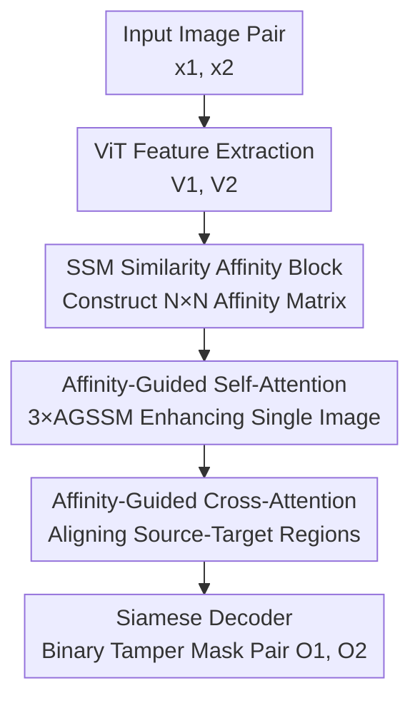

# BioTamperNet: Affinity-Guided State-Space Model Detecting Tampered Biomedical Images

**Conference**: ICLR2026  
**OpenReview**: [https://openreview.net/forum?id=TB0Pdvxpm8](https://openreview.net/forum?id=TB0Pdvxpm8)  
**Code**: https://github.com/SoumyaroopNandi/BioTamperNet  
**Area**: Medical Images  
**Keywords**: Biomedical Image Forensics, Duplicate Region Detection, State-Space Models, Affinity-Guided Attention, Siamese Networks

## TL;DR
BioTamperNet constructs a Siamese network using "Affinity-Guided Attention" approximated by State-Space Models (SSM) to jointly localize tampered duplicate regions (source and copied target regions) in biomedical papers. It improves the MCC from the previous best of approximately 0.43 to 0.70 on the BioFors real retracted paper dataset, utilizing only 36.7M parameters and 29.6 GFLOPs.

## Background & Motivation
**Background**: Scientific image forgery (especially copy-pasting the same cells or gel bands elsewhere) is a major area of academic misconduct and the "reproducibility crisis." Manual inspections are slow and prone to overlooking subtle duplications. Existing image forensics models (ManTra-Net, TruFor, SparseViT, etc.) are almost entirely trained on natural images, primarily targeting low-level artifacts left by "splicing."

**Limitations of Prior Work**: Biomedical images differ significantly from natural images—comprising four distinct modalities (microscopy, Western blot, FACS scatter plots, and macro scans) with highly repetitive textures, low contrast, and a lack of semantic boundaries. On such data, natural image originators either misidentify normal repetitive structures (cell clusters, gel bands) as tampering or focus solely on low-level noise traces while failing to capture structural-level "copy-paste" operations. Crucially, the training set of the authoritative BioFors benchmark **contains only clean images without any tampered annotations**, making supervised training impossible.

**Key Challenge**: Tampering detection requires "identifying two regions that are semantically highly similar but distributed in different locations," which is essentially a global similarity matching problem. However, biomedical images are filled with naturally occurring repetitive structures, and naive similarity matching is overwhelmed by these structures. Furthermore, ViT/CNN models are prone to overfitting or catastrophic forgetting under small-data and multi-modal switching scenarios.

**Goal**: (1) Train a detector capable of simultaneously localizing the "source region" and "target region" without real tampered training samples; (2) Use a unified architecture to cover three types of tasks: External Duplicate Detection (EDD), Internal Duplicate Detection (IDD), and Cut-Shift-Transform Detection (CSTD); (3) Control computational costs.

**Key Insight**: The authors noted that the "readout" formula of SSM (the selective scan in Mamba/VMamba), $y_k=\bar{C}h_k$, naturally serves as a similarity aggregation with global context after normalization. They transformed this into an explicit "affinity matrix" to guide attention, achieving global matching capability while maintaining linear complexity.

**Core Idea**: Use an "affinity map" approximated by SSM to guide the self-attention and cross-attention of a Siamese network. This allows the model to explicitly align source-target duplicate regions based on "which two pieces are most similar" rather than relying on low-level artifacts.

## Method

### Overall Architecture
BioTamperNet adopts a **Siamese architecture**: it takes a pair of images $x_1,x_2\in\mathbb{R}^{B\times H\times W\times3}$ as input and outputs a pair of binary tampering masks $O_1,O_2$, marking the source and target duplicated regions in each image. The pipeline consists of "ViT feature extraction $\rightarrow$ Siamese duplicate detector (Affinity Block + Affinity-Guided Self-Attention + Affinity-Guided Cross-Attention) $\rightarrow$ Lightweight decoder."

First, a ViT pre-trained on four types of BioFors images extracts hierarchical features $V_1,V_2\in\mathbb{R}^{B\times N\times C}$ ($N=H\times W$, $C=384$). These dual-path features are sent to the Siamese duplicate detector. Inside each path, an SSM calculates an affinity map showing "which positions are similar to each other," which guides **self-attention** to reinforce duplicate cues within a single image. Subsequently, **cross-attention** is used to align the two images, linking the target region of one image with the source region of the other. Finally, two shared-structure decoders decode the enhanced features $V_1',V_2'$ into single-channel probability maps, which are bilinearly upsampled to the original resolution.

### Key Designs

**1. SSM Similarity Affinity Block: Readout as a Global Similarity Operator**

This block addresses the issue that natural repetitive structures in biomedical images overwhelm standard dot-product attention, and $N\times N$ full attention is computationally expensive. The authors contextualize spatial tokens using selective scan SSM and construct an affinity matrix using the SSM readout formula. Specifically, normalizing the readout yields a global context similarity:

$$y_k=\frac{\bar{C}h_k}{\bar{C}n_k}+\bar{D}v_k,\qquad h_k=\bar{A}h_{k-1}+\bar{B}v_k,\quad n_k=\sum_{j\le k}B_j$$

Where $\bar{A}$ aggregates historical context for $j\le k$, and the denominator $\bar{C}n_k$ ensures normalized attention weights (sum to 1). For stable estimation, $\bar{C}_k,\bar{B}_k$ use ELU with a positive offset $\mathrm{ELU}(V_k)+1$, followed by the injection of Rotary Positional Embeddings (RoPE) and normalization. Finally, the dot product produces an explicit affinity matrix $\mathit{Aff}_k=\bar{C}_k\bar{B}_k^\top\in\mathbb{R}^{B\times N\times N}$.

As the diagonal of the affinity matrix is naturally larger (each position is most similar to itself), a **spatial suppression kernel** is introduced:

$$K(i,j,i',j')=\frac{(i-i')^2+(j-j')^2}{(i-i')^2+(j-j')^2+\sigma^2}$$

It assigns small values to nearby positions and values close to 1 for distant ones. Element-wise multiplication $\mathit{Aff}'_k=\mathit{Aff}_k\odot K$ weakens the artificially high "self-to-self" similarity. **Bidirectional softmax** (multiplying row-wise $\mathit{Aff}^{row}$ and column-wise $\mathit{Aff}^{col}$ with temperature $\alpha=5$) ensures that only "mutual most similarity" counts. This is refined via four convolutional layers into an affinity map, highlighting the top-k most similar regions for each position. Thus, the model looks for structural-level "mutual similarity" rather than low-level noise.

**2. Affinity-Guided Self-Attention (AGSSM): Modulating Intra-image Attention**

The flattened affinity map $\mathit{Affinity\_Map}^{flat}_k\in\mathbb{R}^N$ is fed into the AGSSM block. It passes through depthwise separable convolution and fully connected layers to produce a gate $a=\mathrm{SiLU}(\mathrm{FC}(\mathrm{Norm}(\cdot)))$, followed by **linear attention** (rather than quadratic softmax attention) weighted by the affinity map, and finally a residual connection + MLP. To capture diverse local interactions, three parallel AGSSM blocks are averaged:

$$\mathrm{AGSSM\_Self\_Attn}_k=\frac{1}{3}\sum_{i=1}^{3}\mathrm{AGSSM}_i(\cdot)$$

This is projected via $1\times1$ convolution and added residually to $V_k$. The effectiveness lies in self-attention being directed by the affinity map, focusing the model on intra-image duplicate regions (corresponding to IDD), while linear attention maintains low overhead (affinity calculations occur on a $40\times40$ token grid, with $N\times N$ operations adding only ~1.0 GFLOPs, less than 4% of the total).

**3. Affinity-Guided Cross-Attention: Explicitly Aligning "Source in A, Target in B"**

Cross-image matching is the core of EDD (where a patch in Image 1 is copied from Image 2). After self-attention enhancement, multi-head cross-attention is used for mutual querying, with $Q=\mathrm{Flatten}(\mathrm{Self\_Attn}_1)$ and $K$ from the other path:

$$V_1'=\mathrm{Self\_Attn}_1+\mathrm{CrossAttn}(\mathrm{Self\_Attn}_1,\,\mathrm{Conv}_{1\times1}(\mathrm{Self\_Attn}_2))$$

An **Affinity-Guided term** $\Lambda$ derived from AGSSM similarity is added to the attention scores: $A=(W_QV_1)(W_KV_2)^\top+\Lambda$. Proposition 1 provides theoretical support: if patch $i$ has a duplicate $j$ in the other image satisfying the gap condition $A_{ij}\ge A_{ik}+\delta$, the cross-attention update is dominated by $j$, satisfying the bound:

$$\big\|V_1'(i)-(V_1(i)+W_VV_2(j))\big\|\le\epsilon,\quad \epsilon=\sum_{k\ne j}\alpha_{ik}\|W_VV_2(k)-W_VV_2(j)\|$$

Intuitively, a larger affinity gap $\delta$ leads to $\alpha_{ij}\ge e^{\delta}\alpha_{ik}$, making the softmax sharper and aligning the "target region" more accurately to the "source region." This distinguishes BioTamperNet from most forensic tools—it outputs both source and target regions.

**4. Unified Pseudo-Pair Training Paradigm: Task Supervision on Unlabeled Data**

Since the BioFors training set lacks tampered samples, the authors synthesize data by inserting duplicate patches into clean images with geometric augmentations (scale, rotation, flip, crop) and noise perturbations. GAN-generated patches are fused for realism. A key unification trick: while EDD requires "image pairs + mask pairs," IDD/CSTD provide single images and masks. The authors **split each IDD/CSTD image into two halves to create pseudo-pairs**, allowing all three tasks to fit into the same EDD-style training framework. During cross-modal deployment, **Domain Adaptive Batch Normalization** is used to stabilize learning and prevent catastrophic forgetting when migrating (e.g., from microscopy to gel images, where naive fine-tuning drops source domain MCC by 17.2%).

### Loss & Training
The training target is a weighted sum of Binary Cross Entropy (BCE) losses across three stages:

$$\mathcal{L}=w_{self}\mathcal{L}^{self}_{BCE}+w_{cross}\mathcal{L}^{cross}_{BCE}+w_{fused}\mathcal{L}^{fused}_{BCE}$$

Supervision is applied to self-attention output, cross-attention output, and fused output. The encoder is initialized with ImageNet-1k pre-trained ViT-Base. AdamW is used (learning rate $1\times10^{-4}$), with pre-training on synthetic tripartite patches for 74 epochs and fine-tuning on BioFors for 100 epochs, utilizing early stopping and cosine learning rate decay. Inputs are resized to $224\times224$, and feature resolution is reduced from $4096\times4096$ to $40\times40$.

## Key Experimental Results

### Main Results
Evaluated on BioFors (30,536 training images, 17,269 testing images from real retracted papers) using Matthews Correlation Coefficient (MCC) for EDD and IDD (image/pixel levels). Combined results across four modalities:

| Task | Metric | BioTamperNet | Prev. SOTA | Gain |
|------|------|------|----------|------|
| EDD Combined | Image MCC | **0.701** | MONet 0.438 | +0.263 |
| EDD Combined | Pixel MCC | **0.526** | MONet 0.410 | +0.116 |
| IDD Combined | Image MCC | **0.701** | SparseViT 0.343 | +0.358 |
| IDD Combined | Pixel MCC | **0.534** | DF-ZM 0.364 | +0.170 |

On CSTD, BioTamperNet achieved image/pixel MCC of 0.514/0.346, far exceeding TruFor's 0.173/0.092. On synthetic integrity benchmarks, pixel-level MCC also led: RSIID 0.965 (SparseViT 0.842), Western Blots 0.913 (0.739).

### Ablation Study
MCC across various modalities on EDD:

| Configuration | Microscopy | Blot/Gel | Macroscopy | Notes |
|------|-----------|----------|-----------|------|
| BioTamperNet (Full) | **0.487** | **0.589** | 0.577 | Full Model |
| w/o Affinity | 0.421 | 0.489 | 0.462 | Removed Affinity Guidance |
| w/o SSM (CNN) | 0.393 | 0.453 | 0.437 | SSM replaced by 4-layer CNN (largest drop) |
| w/o SSM (ViT-MHA) | 0.407 | 0.466 | 0.445 | SSM replaced by 4-layer ViT |
| w/o Self-Attn | 0.451 | 0.509 | 0.492 | Removed Self-Attention |
| w/o Cross-Attn | 0.444 | 0.497 | 0.481 | Removed Cross-Attention |
| + Global SSM | 0.467 | 0.539 | 0.580 | Global SSM added little gain |

### Key Findings
- **SSM is the most critical component**: Replacing it with CNN caused the most severe performance drop (e.g., Microscopy 0.487 $\rightarrow$ 0.393), indicating the irreplaceable global context and convergence capability of SSM on small data.
- **Affinity guidance is the second largest contributor**: Its removal generally caused a 0.06–0.10 drop across modalities. Both self-attention and cross-attention are necessary.
- **Global modeling is unnecessary**: Adding a Global SSM layer yielded almost no improvement, as biomedical duplication typically involves local/small displacements where long-range reasoning is less beneficial.
- **Robustness to perturbations**: The model consistently leads across brightness changes, JPEG compression, contrast adjustments, and noise.
- **Efficiency**: With 36.7M parameters and 29.6 GFLOPs (512×512), it is smaller and more accurate than TruFor (68.7M/236.5G) and SparseViT (50.3M/46.2G).

## Highlights & Insights
- **Inverting the SSM readout formula as a similarity operator**: The observation that $y_k=\bar{C}h_k/ \bar{C} n_k$ aligns with global context attention weights allowed the model to achieve full-attention level matching with linear complexity. This is the most ingenious step, transferable to any task requiring global similarity matching (retrieval, registration, co-segmentation).
- **Simultaneous source and target output**: Most forensic tools only mark "what was changed." BioTamperNet localizes both the "duplicated target" and "original source" via cross-attention, which is more useful for tracing forgery.
- **Pseudo-pairs for task unification**: Splitting single-image tasks to create pseudo-pairs for an EDD framework is a low-cost, practical engineering trick that avoids designing separate heads for different tasks.
- **Spatial suppression kernel**: This simple design of "suppressing the diagonal by distance" effectively solved artificially high self-correlation from repetitive textures.

## Limitations & Future Work
- The authors identified three failure modes: (i) detection failure when source and target overlap completely, causing boundary disappearance; (ii) false positives on highly repetitive or dense biological structures; (iii) low boundary contrast in dense gel images for CSTD.
- Proposed remedies (overlap-aware post-processing, auxiliary boundary heads, cycle-consistency regularization, entropy-driven hard negative mining, etc.) remain theoretical and are not validated in the main text.
- Evaluation is limited to BioFors and two synthetic benchmarks; coverage of real-world forgery diverse techniques (e.g., AI generative tampering) is limited. Proposition 1 relies on the strong assumption of a clear gap $\delta$.
- Future work: Extending the model to video-level forgery detection and introducing temporal attention with spatio-temporal consistency constraints.

## Related Work & Insights
- **vs MONet (ICIP 2022)**: MONet only performs EDD and matches early baselines; BioTamperNet covers EDD/IDD/CSTD and leads across the board. The key difference is the use of SSM affinity over pure patch comparison.
- **vs TruFor / SparseViT (CVPR 2023 / AAAI 2025)**: Based on noiseprints/low-level artifacts, these are good for splicing detection but misidentify normal biological structures as tampering. BioTamperNet avoids this through structural affinity matching with lower cost.
- **vs ManTra-Net (CVPR 2019)**: ManTra-Net captures low-level operation traces without contextual understanding; Ours explicitly models source-target relationships.
- **vs Mamba / VMamba**: Instead of using SSM solely as a backbone, this work repurposes the SSM readout into an explicit affinity map to guide attention.

## Rating
- Novelty: ⭐⭐⭐⭐⭐ Inverting SSM readout as an affinity operator and localizing source-target pairs is highly novel.
- Experimental Thoroughness: ⭐⭐⭐⭐ Extensive testing on BioFors and synthetic benchmarks, though failure remedies are unverified.
- Writing Quality: ⭐⭐⭐⭐ Clear structure and complete formulas; some notations are dense.
- Value: ⭐⭐⭐⭐⭐ Scientific integrity is a high-value, underserved scenario; the method is lightweight and outperforms SOTA on real data.

<!-- RELATED:START -->

## Related Papers

- [\[CVPR 2026\] GeoSemba: Reconstructing State Space Model for Cross Paradigm Representation in Medical Image Segmentation](../../CVPR2026/medical_imaging/geosemba_reconstructing_state_space_model_for_cross_paradigm_representation_in_m.md)
- [\[ICLR 2026\] Detecting Invariant Manifolds in ReLU-Based RNNs](detecting_invariant_manifolds_in_relu-based_rnns.md)
- [\[NeurIPS 2025\] Generalizable, Real-Time Neural Decoding with Hybrid State-Space Models](../../NeurIPS2025/medical_imaging/generalizable_real-time_neural_decoding_with_hybrid_state-space_models.md)
- [\[ICLR 2026\] K-Prism: A Knowledge-Guided and Prompt Integrated Universal Medical Image Segmentation Model](k-prism_a_knowledge-guided_and_prompt_integrated_universal_medical_image_segment.md)
- [\[NeurIPS 2025\] DyG-Mamba: Continuous State Space Modeling on Dynamic Graphs](../../NeurIPS2025/medical_imaging/dyg-mamba_continuous_state_space_modeling_on_dynamic_graphs.md)

<!-- RELATED:END -->
