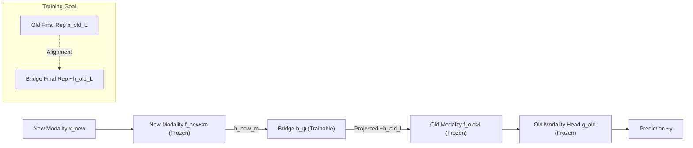

# BioX-Bridge: Model Bridging for Unsupervised Cross-Modal Knowledge Transfer across Biosignals

**Conference**: ICLR 2026  
**OpenReview**: [https://openreview.net/forum?id=1448q0s3zZ](https://openreview.net/forum?id=1448q0s3zZ)  
**Code**: [https://github.com/chenqi-li/BioX-Bridge](https://github.com/chenqi-li/BioX-Bridge)  
**Area**: Biosignals / Cross-modal Knowledge Transfer / Parameter-Efficient Transfer  
**Keywords**: biosignal, cross-modal transfer, model bridging, foundation model, ECG/EEG/PPG/EMG, low-rank, prototype network  

## TL;DR
Instead of training a full student model for distillation, this work freezes two biosignal foundation models and trains only a lightweight "bridge network" to project intermediate representations of a new modality into the space of an old modality. This achieves unsupervised cross-modal knowledge transfer across ECG↔EEG↔PPG↔EMG with only 1%–12% of trainable parameters.

## Background & Motivation
- **Background**: Various biosignals such as ECG, EEG, PPG, and EMG differ in functionality, fidelity, comfort, and cost, yet remain interrelated as they reflect the same underlying physiological states. This allows for substituting expensive "gold standard" modalities with cheaper or more comfortable ones for the same task (e.g., using wrist-worn PPG to replace 12-lead ECG). Simultaneously, biosignal foundation models (LaBraM, HuBERT-ECG, PaPaGei, NormWear, etc.) are evolving rapidly, showing strong downstream performance after single-modality pre-training.
- **Limitations of Prior Work**: New modalities often lack large-scale labeled data. Current unsupervised cross-modal transfer approaches follow two paths: **Data Translation** (using GANs to translate raw signals, which is difficult to generalize beyond PPG↔ECG pairs) and **Knowledge Distillation** (training a full student model to mimic a teacher). Distillation requires simultaneous teacher/student forward passes and student backpropagation, incurring massive memory and compute overhead, exacerbated by the growing size of foundation models. For instance, distilling the PPG foundation model PaPaGei into an ECG-FM student requires >32GB VRAM at batch size 8.
- **Key Challenge**: The representation capabilities and task knowledge inherent in foundation models are valuable. However, "retraining a full-sized student model" wastes existing knowledge and is infeasible in privacy-sensitive or resource-constrained local scenarios where data cannot be exported.
- **Goal**: Without **training any full model**, reuse the capabilities of two frozen foundation models to transfer "task knowledge from an old modality model" to "new modality inputs" with minimal trainable parameters.
- **Key Insight**: **Model Bridging**—Reformulate the transfer problem as "bridging two specific layers of two frozen models." The bridge projects the intermediate representation of layer $m$ from the new modality into the representation of layer $l$ of the old modality. Consequently, the new modality data "borrows" the latter half and the task head of the old modality model for prediction, requiring only the bridge to be trained.

## Method

### Overall Architecture
Given labeled data for the old modality, a frozen old encoder $f^{(old)}_\theta$ and task head $g^{(old)}_\omega$, unlabeled data for the new modality, and a **paired but unlabelled** dataset $D^{(pair)}=\{(x^{(old)}_i, x^{(new)}_i)\}$ (signals captured simultaneously), the goal is a model for new modality prediction. BioX-Bridge chains the first $m$ layers of the new model $f^{(new)}_{\phi\le m}$, the bridge $b_\psi$, the layers after $l$ of the old model $f^{(old)}_{\theta>l}$, and the task head $g^{(old)}_\omega$ into an inference chain: $\tilde{y}=g^{(old)}_\omega\circ f^{(old)}_{\theta>l}\circ b_\psi\circ f^{(new)}_{\phi\le m}(x^{(new)})$. The process involves three steps: selecting bridge positions $(m,l)$, designing and training the bridge $b_\psi$, and performing inference—**only bridge parameters $\psi$ are updated**.

### Key Designs

**1. Model Bridging: Replacing "Student Training" with "Bridge Training"**. This is a paradigm shift. The paper proves an intuitive equality: if the bridge ensures $\tilde{h}^{(old)}_l=h^{(old)}_l$ (projected representation equals the ground truth layer $l$ representation of the old modality), then the frozen subsequent network ensures $\tilde{h}^{(old)}_L=h^{(old)}_L$, and finally $\tilde{y}=\hat{y}$. Bridge predictions will match the pseudo-labels generated by the old model. Thus, the transfer goal is aligning intermediate representations of frozen models rather than fitting human labels. By freezing large models and only passing gradients through the bridge, overhead is significantly reduced while task knowledge is reused "as-is."

**2. Two-stage Position Selection: Selecting input $m$ then output $l$**. A bridge could connect $L\times M$ possible layer pairs. Brute-force searching is expensive, yet position is critical. A decoupled strategy is used: **Input $m$** follows "garbage in, garbage out"—the layer in the new modality most discriminative for pseudo-labels is selected via linear probing. Specifically, $\arg\min_m \frac{1}{|D^{(pair)}|}\sum_i L_{probe}(g_\eta(h^{(new)}_{m,i}),\hat{y}_i)$, where $\hat{y}_i$ is the pseudo-label. **Output $l$** aims to make the projection task easiest by selecting the old modality layer most "similar" to the chosen $m$, measured via linear Centered Kernel Alignment (CKA): $\arg\max_l \text{CKA}_{linear}(H^{(new)}_m, H^{(old)}_l)$. Both stages require only forward passes and lightweight probing, with costs scaling linearly with layers.

**3. Prototype Network as Bridge Architecture: Low-rank approximation + learnable prototypes**. To handle the high-dimensional projection between modalities without parameter explosion, the bridge uses two modules: **Prototype Set** $P\in\mathbb{R}^{N_p\times d^{(old)}_l}$ (learnable vectors initialized from real old modality features to inject priors) and a **Low-rank Approximation module** $A\in\mathbb{R}^{d^{(new)}_m\times r},\ B\in\mathbb{R}^{r\times N^{(old)}_l N_p}$ to calculate aggregation weights. The output is $\tilde{h}^{(old)}_l=\text{Reshape}\big(\text{Pool}(h^{(new)}_m)\otimes A\otimes B\big)\otimes P$. This reduces parameters from billions to sub-millions while maintaining flexibility.

**4. Final Layer Alignment: Loss calculation at the last layer**. While alignment could occur at layer $l$, the authors find that **aligning only at the final layer $L$** works best: $\arg\min_\psi L_{align}(f^{(old)}_\theta(x^{(old)}),\ f^{(old)}_{\theta>l}\circ b_\psi\circ f^{(new)}_{\phi\le m}(x^{(new)}))$. This forces the bridge to account for error propagation through the frozen downstream network, leading to better downstream performance.

## Key Experimental Results

### Main Results
Evaluation across three datasets (ISRUC, FOG, WESAD), four modalities, and six transfer directions. Metrics include Balanced Accuracy (BAcc), F1-Macro, F1-Weighted, and trainable parameters. Oracle represents the supervised upper bound of the old modality (teacher).

| Dataset / Direction | Method | BAcc↑ | F1-M↑ | F1-W↑ | Params↓ |
|---|---|---|---|---|---|
| ISRUC EEG→ECG | KD | 60.24 | 61.01 | 72.96 | 30.4M |
| | BioX-Bridge | 60.11 | **61.20** | **74.02** | **1.8M** |
| ISRUC ECG→EEG | KD-Contrast | 65.92 | 62.91 | 70.27 | 5.8M |
| | BioX-Bridge | 62.55 | **64.37** | **76.42** | **0.2M** |
| FOG EEG→EMG | KD-Contrast | 72.21 | 71.95 | 71.95 | 136.1M |
| | BioX-Bridge | **72.24** | **72.12** | **72.16** | **1.2M** |
| WESAD PPG→ECG | KD-Contrast | 50.85 | 49.31 | 63.72 | 30.4M |
| | BioX-Bridge | **52.02** | **52.62** | **65.12** | **0.4M** |

Trainable parameters are reduced by **87.9%–99.1%** while maintaining or exceeding transfer performance.

### Ablation Study
Ablation on WESAD (PPG→ECG):

| Ablation | Setting | BAcc↑ | F1-M↑ | F1-W↑ |
|---|---|---|---|---|
| Position Selection | Fixed (Mean of 9 positions) | 48.34 | 46.83 | 58.37 |
| | BioX-Bridge (Two-stage) | **52.02** | **52.62** | **65.12** |
| Foundation Model | KD (ECG-FM, 90.8M) | 48.44 | 45.84 | 54.18 |
| | BioX-Bridge (ECG-FM, 0.11M) | **58.80** | **57.11** | **72.12** |

- **Data Volume**: Performance degrades by only ~2% when paired data is reduced to 20%, showing robustness.

### Key Findings
- **Efficiency scales with model size**: When using larger foundation models like ECG-FM (90M), distillation methods are constrained by VRAM, whereas BioX-Bridge is significantly faster (1.9h vs 6.5h) and outperforms distillation by 10%–17%.
- **Teacher Constraint**: Transfer performance is inherently limited by the teacher's ceiling in the old modality.
- BioX-Bridge can closely approach the supervised oracle of the source modality even without labels (e.g., 60.11% vs 63.54% on ISRUC EEG→ECG).

## Highlights & Insights
- **Paradigm Shift**: Reformulating "cross-modal transfer" as a "model stitching/bridging" problem avoids retraining large models and natively preserves foundation model knowledge.
- **Decoupled Selection**: The two-stage position selection (discriminative power for input, similarity for output) converts an $L \times M$ search into two linear scans with clear physical intuition.
- **Engineering Efficiency**: The combination of prototype networks and low-rank approximation is the key enabler for "near-zero parameter" training.
- **End-layer Alignment**: The argument for absorbing error propagation via final layer alignment is a subtle but effective implementation detail.

## Limitations & Future Work
- **Teacher Bottleneck**: Performance cannot exceed the teacher's capability; weak teacher modalities limit the transfer quality.
- **Dependency on Paired Data**: Requires synchronized signals for bridge training, which may be difficult to obtain in certain scenarios.
- **Model Scale**: Currently tested on models up to 136M; though theoretically better for larger models, testing on billion-parameter biosignal models is pending.
- **Heuristic Selection**: The two-stage strategy is effective but might not be globally optimal compared to joint search.

## Related Work & Insights
- **Cross-modal Knowledge Distillation**: Differs from prior work (Brant-X, PPG-to-Accel) by avoiding full-size student training.
- **Model Stitching & CKA**: The used of CKA and linear probing for bridge positioning is an excellent application of "representation interpretability tools" as "architecture search criteria."

## Rating
- **Novelty**: ⭐⭐⭐⭐
- **Experimental Thoroughness**: ⭐⭐⭐⭐
- **Writing Quality**: ⭐⭐⭐⭐
- **Value**: ⭐⭐⭐⭐

<!-- RELATED:START -->

<!-- RELATED:END -->

## Related Papers

- [\[ICLR 2026\] sleep2vec: Unified Cross-Modal Alignment for Heterogeneous Nocturnal Biosignals](sleep2vec_unified_cross-modal_alignment_for_heterogeneous_nocturnal_biosignals.md)
- [\[ICLR 2026\] CodeBrain: Bridging Decoupled Tokenizer and Multi-Scale Architecture for EEG Foundation Model](codebrain_bridging_decoupled_tokenizer_and_multi-scale_architecture_for_eeg_foun.md)
- [\[CVPR 2026\] Any2Any 3D Diffusion Models with Knowledge Transfer: A Radiotherapy Planning Study](../../CVPR2026/medical_imaging/any2any_3d_diffusion_models_with_knowledge_transfer_a_radiotherapy_planning_stud.md)
- [\[ICLR 2026\] ProstaTD: Bridging Surgical Triplet from Classification to Fully Supervised Detection](prostatd_bridging_surgical_triplet_from_classification_to_fully_supervised_detec.md)
- [\[ICLR 2026\] Joint Adaptation of Uni-modal Foundation Models for Multi-modal Alzheimer's Disease Diagnosis](joint_adaptation_of_uni-modal_foundation_models_for_multi-modal_alzheimers_disea.md)

<!-- RELATED:END -->
