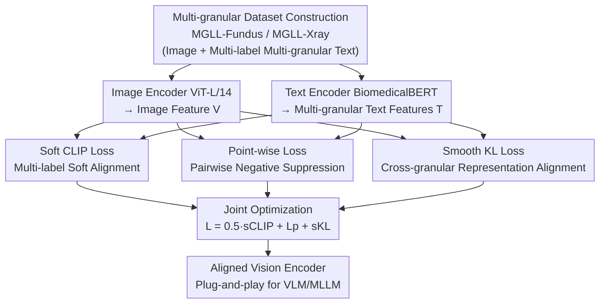

# Boosting Medical Visual Understanding From Multi-Granular Language Learning

**Conference**: ICLR 2026  
**arXiv**: [2511.15943](https://arxiv.org/abs/2511.15943)  
**Code**: [https://github.com/HUANGLIZI/MGLL](https://github.com/HUANGLIZI/MGLL)  
**Area**: Medical Imaging / Multimodal VLM  
**Keywords**: Medical Image Pre-training, Multi-label Contrastive Learning, Multi-granular Alignment, CLIP Improvement, Vision-Language Pre-training

## TL;DR
This paper proposes Multi-Granular Language Learning (MGLL), a plug-and-play contrastive learning framework. By jointly optimizing soft CLIP loss, point-wise loss, and smooth KL divergence, MGLL aligns medical images with multi-label, multi-granular textual descriptions. It consistently outperforms SOTA methods on fundus and X-ray datasets and can be embedded into multimodal large language models (MLLMs) as a vision encoder, improving diagnostic accuracy by up to 34.1%.

## Background & Motivation

**Background**: Contrastive learning methods like CLIP have achieved significant success in general computer vision by learning cross-modal aligned representations through image-text pair matching. Many medical vision foundation models have adopted CLIP for pre-training.

**Limitations of Prior Work**: Standard CLIP employs a single-label, single-granular image-text pairing strategy. However, medical images inherently possess **multi-label** and **multi-granular** characteristics. For instance, a single fundus image may contain both "diabetic macular edema" and "diabetic retinopathy" (multi-label), with each disease having coarse-grained (disease category) and fine-grained (severity, clinical description) distinctions (multi-granular). Current multi-label contrastive methods focus on instance-label associations but neglect cross-granular semantics.

**Key Challenge**: Medical images encode information that is more complex and hierarchical than natural images, yet data is scarcer due to privacy and annotation costs. Single-granular, single-label supervision wastes rich hierarchical annotation information, while directly mixing multi-granular information leads to interference between features at different semantic levels.

**Goal**: How to achieve both multi-label alignment (one image to multiple labels) and cross-granular alignment (consistency across different annotation levels) within a unified framework?

**Key Insight**: Construct a multi-granular textual description dataset and design three complementary loss functions to optimize multi-label alignment and cross-granular consistency respectively.

**Core Idea**: Utilize soft CLIP loss for multi-label soft alignment, point-wise loss for fine-grained pairwise alignment, and smooth KL divergence for cross-granular feature consistency constraints. Joint optimization of these three components achieves comprehensive vision-language alignment for medical images.

## Method

### Overall Architecture
MGLL addresses the inherent multi-label and multi-granular structure of medical images (e.g., a fundus image showing both "diabetic macular edema" and "diabetic retinopathy," each with coarse-grained categories and fine-grained clinical descriptions). CLIP-style pre-training uses only single-label, single-granular hard matching, wasting these hierarchical annotations. MGLL retains the dual-tower structure of CLIP—using ViT-L/14 as the image encoder and BiomedicalBERT as the text encoder—without introducing extra granularity-sensitive encoders. Instead, it modifies the contrastive objective: an image is softly aligned with its multiple labels, and representations of the same image under different textual granularities are forced to converge in a consistent feature space. Since only the loss is changed while the architecture remains static, it incurs zero additional computational cost and can be used as a plug-and-play replacement for contrastive objectives in any VLM.

To support this multi-granular supervision, the authors constructed two datasets. **MGLL-Fundus** contains 246,389 fundus image-text pairs from 49 public datasets covering 50+ diseases, with granularities including normal/abnormal labels, specific disease categories, and clinical interpretations. **MGLL-Xray** includes 190,882 X-ray images from the MIDRC database, with granularities covering imaging modality (CR/DX), study description, and series description. These datasets implement the "one image, multi-level text" concept necessary for the three losses to function.

The pipeline follows a "dual-tower encoding $\rightarrow$ three-way parallel loss constraints $\rightarrow$ joint optimization" structure. Features from image and multi-granular text encoders are fed into three complementary losses. Soft CLIP and point-wise losses facilitate multi-label alignment, while smooth KL divergence aligns granularities horizontally.

### Key Designs

**1. Soft CLIP Loss $\mathcal{L}_{\text{sCLIP}}$: Replacing Hard Matching with Multi-label Soft Alignment**

Standard CLIP forces each image to align with only one label. In medical imaging, one image often contains multiple pathologies. Hard matching forces the model to choose only one correct label, leading to biased representations. Soft CLIP loss allows the image feature $V_i$ to align simultaneously with multiple text labels $\{T_{i1}, T_{i2}, ..., T_{iM_i}\}$. Each pair is assigned a soft weight $w_{ik}$ derived from the normalized label co-occurrence matrix: $w_{ik} = \frac{\text{cooccurrence}(V_i, T_{ik})}{\sum_k \text{cooccurrence}(V_i, T_{ik})}$. Through optimization, image features converge to the weighted center of all associated text features rather than being dominated by a single label.

**2. Point-wise Loss $\mathcal{L}_P$: Fine-grained Pairwise Negative Suppression**

While soft CLIP handles the soft distribution among positive samples, it does not explicitly manage negative samples. Multi-label discrimination requires suppressing mismatched pairs. Point-wise loss uses binary cross-entropy where $y_{ij} \in \{0, 1\}$ denotes whether image $V_i$ and text $T_j$ match. Probabilities are normalized via sigmoid to calculate the loss:

$$\mathcal{L}_P = -\sum_{i,j} \frac{y_{ij} \log \sigma(x_{ij}) + (1-y_{ij}) \log(1-\sigma(x_{ij}))}{N}$$

When $y_{ij}=0$, this term explicitly minimizes $\sigma(x_{ij})$ to suppress the similarity of irrelevant pairs. It complements soft CLIP loss to bolster multi-label discriminative power; ablation studies show it provides the largest individual contribution.

**3. Smooth KL Divergence $\mathcal{L}_{\text{sKL}}$: Consistent Cross-granular Representations**

The previous losses ensure image-text alignment, but if different granularities (e.g., categories vs. clinical descriptions) are optimized independently, features might scatter into separate subspaces, hindering cross-granular generalization. Smooth KL divergence imposes a consistency constraint. For prediction distributions $\{P_1, ..., P_m\}$ across $m$ granular levels, the mean distribution is defined as $M = \frac{1}{m}\sum_i P_i$. The loss minimizes the KL divergence from each granularity's distribution to this mean:

$$\mathcal{L}_{\text{sKL}} = \sum_{i=1}^m D_{\text{KL}}(P_i \| M)$$

This forces representations across all granularities to converge ($P_1 = P_2 = ... = P_m$ optimally), ensuring that semantics learned at coarse and fine levels are mutually consistent.

### Loss & Training
The final objective is a weighted sum where point-wise and smooth KL losses dominate: $\mathcal{L}_{\text{MGLL}} = 0.5 \cdot \mathcal{L}_{\text{sCLIP}} + 1.0 \cdot \mathcal{L}_P + 1.0 \cdot \mathcal{L}_{\text{sKL}}$.

## Key Experimental Results

### Main Results
MGLL was compared against SOTA methods (CLIP, CheXzero, MRM, UniChest) on 9 fundus and 3 X-ray datasets:

| Method | MIDRC-XR AUC (LP/FT) | MIDRC-Portable AUC (LP/FT) | ChestX-ray14 AUC (LP/FT) |
|------|---------------------|--------------------------|-------------------------|
| CLIP | 54.72 / 88.52 | 71.43 / 91.83 | 69.75 / 82.05 |
| UniChest | 59.02 / 92.51 | 78.49 / 95.44 | 76.15 / 85.84 |
| FG-CLIP | 58.31 / 93.29 | 80.31 / 96.93 | 76.62 / 85.10 |
| **MGLL** | **61.25 / 99.08** | **83.86 / 99.75** | **82.94 / 87.37** |

MGLL achieves the best results across all datasets in both linear probe (LP) and fine-tuning (FT) settings. On the multi-label dataset RFMiD, MGLL's linear probe outperforms the runner-up by 16.6%, and fine-tuning by 6.7%.

Efficiency of embedding into MLLMs (replacing vision encoders for 7 MLLMs):

| MLLM | Original Acc | +MGLL Acc | Gain |
|------|-----------|-------------|------|
| InstructBLIP | 47.29% | 61.99% | +14.7% |
| LLaVA | 72.73% | 79.98% | +7.3% |
| LLaVA-Med | 24.28% | 58.37% | +34.1% |
| Med-Flamingo | 26.97% | 58.70% | +31.7% |
| InternVL | 77.35% | 81.96% | +4.6% |
| Janus-Pro | 68.92% | 79.80% | +10.9% |

Improvements are most significant for medical-specific models (LLaVA-Med, Med-Flamingo), while general-purpose models also show noticeable gains.

### Ablation Study
Loss function ablation on the RFMiD dataset:

| Config | LP AUC | FT AUC | Description |
|------|--------|--------|------|
| CLIP baseline | 44.66 | 65.10 | Single-label single-granular |
| $\mathcal{L}_P$ only | 70.34 | 88.25 | Point-wise provides max contribution |
| $\mathcal{L}_{\text{sCLIP}}$ only | 67.86 | 85.13 | Soft CLIP shows significant gain |
| $\mathcal{L}_{\text{sCLIP}} + \mathcal{L}_P$ | 75.73 | 90.31 | Complementary effects |
| Full MGLL | **79.62** | **92.83** | Further gain with sKL |

Granularity quantity ablation (MIDRC-XR-Portable): As granularities increase from 1 to 3, AUC increases monotonically (LP: 80.54 $\rightarrow$ 82.92 $\rightarrow$ 83.86), validating the importance of preserving hierarchical information.

### Key Findings
- Point-wise loss contributes the most (25.68% AUC increase) by optimizing both positive and negative pairs.
- Smooth KL divergence provides an additional ~4% AUC boost as a cross-granular constraint.
- For encoders, ViT-L/14 outperforms ViT-H/14 (suggesting larger is not always better due to overfitting), and BERT outperforms CLIP text encoders or LLaMA.
- MGLL remains robust and significantly outperforms CLIP even under low resolution or noisy text conditions.

## Highlights & Insights
- **Plug-and-play Design**: Achieves multi-label and multi-granular alignment solely through loss function modifications without adding encoder parameters.
- **Elegant Theoretical Analysis**: Derives that soft CLIP forces image features to converge to the weighted center of text features (Eq. 10).
- **Engineering Value**: The creation of MGLL-Fundus (246K pairs, 49 datasets, 50+ diseases) and MGLL-Xray (190K images) fills a gap in multi-granular medical pre-training data.
- **MLLM Evaluation Paradigm**: Replacing vision encoders in 7 different MLLMs provides a solid framework for evaluating domain-specific vision encoders.

## Limitations & Future Work
- **Domain Knowledge Dependency**: Defining granularities and collecting corresponding texts relies on clinical domain knowledge, limiting immediate universality.
- **Classification Focus**: The framework lacks validation on segmentation or detection tasks, which are equally vital in medical imaging.
- **Modality Bias**: Primarily validated on fundus and chest X-ray; generalizability to CT, MRI, or pathology slides remains unproven.
- **Coarse Cross-granular Modeling**: Smooth KL aligns distributions to a mean but does not explicitly model hierarchical/inclusion relationships (e.g., "disease category" as an ancestor of "severity").
- **Future Improvements**: Exploring automated multi-granular label extraction from medical reports and encoding tree structures directly into the loss function.

## Related Work & Insights
- **vs. CLIP**: CLIP uses single-label hard matching; MGLL uses multi-label soft matching and cross-granular consistency, yielding massive gains in medical scenarios (RFMiD LP AUC: 44.66 $\rightarrow$ 79.62).
- **vs. MedCLIP**: MedCLIP addresses false negatives via semantic matching but remains single-granular; MGLL restructures the supervision signal itself.
- **vs. UniChest**: UniChest adapts to chest X-rays; MGLL provides a more generic multi-granular framework effective across both X-ray and fundus imaging.
- **vs. SupCon**: Supervised contrastive learning uses label structures but is limited to fixed label spaces; MGLL achieves open semantics via text encoders.

## Rating
- Novelty: ⭐⭐⭐⭐ The combination of multi-label and multi-granular alignment is novel, though individual losses are standard.
- Experimental Thoroughness: ⭐⭐⭐⭐⭐ Comprehensive evaluation across 11 datasets and 7 MLLMs with detailed ablations.
- Writing Quality: ⭐⭐⭐⭐ Clear theoretical analysis and experimental presentation, though related work is somewhat crowded.
- Value: ⭐⭐⭐⭐ Highly relevant for medical vision pre-training; both the dataset and method are directly reusable.

<!-- RELATED:START -->

## Related Papers

- [\[AAAI 2026\] Sim4Seg: Boosting Multimodal Multi-disease Medical Diagnosis Segmentation with Region-Aware Vision-Language Similarity Masks](../../AAAI2026/medical_imaging/sim4seg_boosting_multimodal_multi-disease_medical_diagnosis_segmentation_with_re.md)
- [\[CVPR 2026\] MedGRPO: Multi-Task Reinforcement Learning for Heterogeneous Medical Video Understanding](../../CVPR2026/medical_imaging/medgrpo_multi-task_reinforcement_learning_for_heterogeneous_medical_video_unders.md)
- [\[ICLR 2026\] U2-BENCH: Benchmarking Large Vision-Language Models on Ultrasound Understanding](u2-bench_benchmarking_large_vision-language_models_on_ultrasound_understanding.md)
- [\[ICLR 2026\] M3CoTBench: Benchmark Chain-of-Thought of MLLMs in Medical Image Understanding](m3cotbench_benchmark_chain-of-thought_of_mllms_in_medical_image_understanding.md)
- [\[CVPR 2026\] MedMO: Grounding and Understanding Multimodal Large Language Model for Medical Images](../../CVPR2026/medical_imaging/medmo_grounding_and_understanding_multimodal_large_language_model_for_medical_im.md)

<!-- RELATED:END -->
