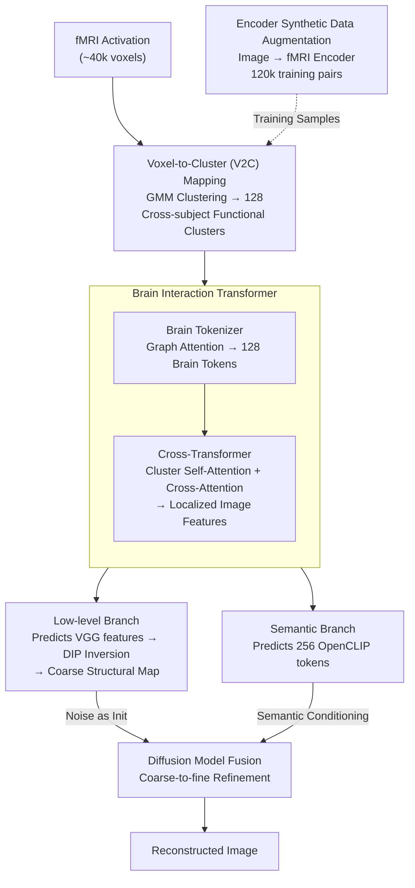

# Brain-IT: Image Reconstruction from fMRI via Brain-Interaction Transformer

**Conference**: ICLR 2026  
**arXiv**: [2510.25976](https://arxiv.org/abs/2510.25976)  
**Code**: [Project Page](https://amitzalcher.github.io/Brain-IT/)  
**Area**: 3D Vision  
**Keywords**: fMRI Brain Decoding, Image Reconstruction, Brain-Interaction Transformer, Cross-subject Transfer, Diffusion Models, Deep Image Prior

## TL;DR

The Brain-IT framework is proposed, which utilizes a brain-inspired Brain Interaction Transformer (BIT) to cluster functionally similar brain voxels into cross-subject shared Brain Tokens. It predicts localized semantic and structural image features to achieve high-fidelity reconstruction from fMRI, matching the performance of prior methods using 40 hours of data with only 1 hour of data.

## Background & Motivation

Reconstructing visual experiences from fMRI brain signals is a core challenge in neuroscience and brain-computer interfaces. Despite significant progress with diffusion models, existing methods still suffer from a lack of **fidelity**—the generated images may look realistic but often deviate from the actual perceived image in terms of:

- **Structural Bias**: Incorrect positioning, color, and spatial layout.
- **Semantic Distortion**: Missing or distorted semantic content.
- **Root Cause**: Over-reliance on the generative prior of diffusion models, which can produce "realistic" images even when brain activity guidance is insufficient.

The authors attribute these issues to three levels: (1) Inadequate fMRI representation extraction—existing methods compress all voxels into a single global embedding, losing the distributed information of the visual cortex; (2) Inappropriate mapping to image features—fully connected layers fail to exploit the distributed nature of brain regions; (3) Feature integration in generative models—a lack of structural guidance.

Furthermore, fMRI data acquisition is expensive and time-consuming (scanning one subject takes 40 hours). Transferring to new subjects with minimal data is a vital practical requirement.

## Method

### Overall Architecture

Brain-IT decouples "reconstruction from fMRI" into two sequential stages: first, using the brain-inspired Brain Interaction Transformer (BIT) to translate brain signals into **localized image features**, and then reconstructing the image using semantic and structural branches. Specifically, tens of thousands of voxels are first compressed into 128 cross-subject shared functional clusters via Voxel-to-Cluster (V2C) mapping. BIT consists of a Brain Tokenizer (producing 128 Brain Tokens) and a Cross-Transformer (modeling cluster interactions and writing localized image features). Subsequently, the semantic branch predicts CLIP tokens as generative conditions, while the low-level branch recovers a coarse structural map via Deep Image Prior inversion. During inference, these are fused within a diffusion model. The key to the pipeline is maintaining the distributed information of the visual cortex throughout the image space rather than compressing it into a global vector, ensuring both fidelity to the actual structure and the inclusion of fine details from the diffusion model.

### Key Designs

**1. Voxel-to-Cluster Mapping (V2C): Compressing voxels into shared functional units**

Directly performing attention on ~40,000 voxels is computationally expensive and difficult to align across subjects. Brain-IT uses a brain encoder (Beliy et al., 2024) to extract embeddings capturing the functional role of each voxel. A Gaussian Mixture Model (GMM) is applied to the joint embeddings of all subjects to map voxels to **128 functional clusters**. Since clustering is performed in functional embedding space rather than anatomical space, it maps functionally similar regions across different individuals to the same clusters. This acts as an "information bottleneck" that reduces complexity and provides a basis for cross-subject transfer.

**2. Brain Interaction Transformer: Translating fMRI into Brain Tokens and localized image features**

BIT operates in two steps. The Brain Tokenizer generates Brain Tokens: a set of learnable per-voxel embeddings (512-D) is multiplied by the fMRI activation for modulation. Then, per-cluster embeddings (512-D) serve as Queries, while modulated activations act as Keys/Values in a single-head graph attention layer. Attention range is limited by the V2C mapping, aggregating only relevant voxels into 128 tokens. The subsequent Cross-Transformer uses self-attention to model interactions and cross-attention to map Brain Tokens to localized image features. This direct path from functional clusters to localized features preserves spatial layouts, as evidenced by cross-attention maps showing clear contralateral organization and semantic selectivity.

**3. Dual-branch Reconstruction: Semantic branch for "what" and Low-level branch for "where"**

The semantic branch handles high-level content: BIT predicts 256 spatial OpenCLIP ViT-bigG/14 tokens. Training involves $L_2$ feature alignment followed by joint training with the diffusion model (diffusion loss). This allows BIT outputs to deviate from original CLIP representations to better suit fMRI-conditioned generation. The low-level branch handles structure: BIT predicts multi-layer VGG features using InfoNCE loss, which are then inverted via Deep Image Prior (DIP). By optimizing a randomly initialized CNN to match BIT's VGG predictions, the convolutional inductive bias of DIP acts as a strong image prior, producing coarse but spatially and chromatically correct layouts without requiring structural training. During inference, the coarse image provides a global structure via noisy initialization, while the semantic branch guides the diffusion process for coarse-to-fine refinement.

**4. Encoder Synthetic Data Augmentation: Expanding to 120k pairs**

Real fMRI training pairs are scarce. Brain-IT utilizes an image-to-fMRI encoder to predict fMRI responses for ~120,000 unlabeled COCO images. This is crucial for few-shot transfer scenarios, providing sufficient samples to fit BIT when only 1 hour of real scanning data is available.

## Key Experimental Results

**Dataset**: NSD dataset (7T fMRI), 4 subjects (S1/2/5/7), approx. 9,000 images per subject, 1,000 shared test images.

**Main Results (40h Full Data)** (Table 1, Average of 4 subjects):

| Metric | MindEye2 | MindTuner | **Brain-IT** |
|------|----------|-----------|-------------|
| PixCorr ↑ | 0.322 | 0.322 | **0.386** |
| SSIM ↑ | 0.431 | 0.421 | **0.486** |
| Alex(2) ↑ | 96.1% | 95.8% | **98.4%** |
| Alex(5) ↑ | 98.6% | 98.8% | **99.5%** |
| Incep ↑ | 95.4% | 95.6% | **97.3%** |
| CLIP ↑ | 93.0% | 93.8% | **96.4%** |
| Eff ↓ | 0.619 | 0.612 | **0.564** |
| SwAV ↓ | 0.344 | 0.340 | **0.320** |

→ **SOTA in 7 out of 8 metrics**, with significant Leads in low-level metrics (PixCorr, SSIM).

**Main Results (1h Transfer Learning)**:

| Metric | MindEye2 (1h) | MindTuner (1h) | **Brain-IT (1h)** |
|------|---------------|----------------|------------------|
| PixCorr | 0.195 | 0.224 | **0.331** |
| SSIM | 0.419 | 0.420 | **0.473** |
| Alex(2) | 84.2% | 87.8% | **97.1%** |

→ **Brain-IT with 1 hour of data matches the performance of previous methods with 40 hours.**
→ Meaningful reconstruction results are achieved with only 15 minutes of data.

**Ablation Study**:
- Low-level branch: SSIM=0.505 (optimal structural fidelity), CLIP=85.8% (weak semantics).
- Semantic branch: SSIM=0.431, CLIP=95.2% (strong semantics).
- Dual-branch fusion: SSIM=0.486, CLIP=96.4% (complementary enhancement).

## Highlights & Insights

1. **Brain-inspired Design**: The functional clustering and Brain Token design directly correspond to the distributed organization and retinotopic structure of the visual cortex, proving more effective than global compression.
2. **Localized Feature Prediction**: Predicting localized image features directly from Brain Tokens preserves spatial information. Cross-attention maps exhibit clear contralateral organization and semantic selectivity.
3. **DIP Low-level Branch Innovation**: Inverting VGG features using Deep Image Prior is a novel signal-to-image approach that leverages CNN inductive biases without training, effectively capturing color, contours, and structure.
4. **Efficient Transfer Learning**: By freezing network weights and only fine-tuning voxel embeddings, 1 hour of data yields results comparable to prior 40-hour benchmarks. This is enabled by the shared cluster and weight design.
5. **Interpretability**: Different Brain Tokens correspond to specific spatial locations and semantic concepts (faces, limbs, text), providing valuable neuroscientific insights.

## Limitations & Future Work

1. **Imperfect Reconstruction**: Semantic and fine-grained details are occasionally inaccurate, potentially limited by the resolution of the fMRI signal itself.
2. **Dependency on Pre-trained Encoders**: V2C mapping relies on the quality of external brain encoders; cluster quality impacts the entire pipeline.
3. **DIP Inference Overhead**: Low-level reconstruction for each image requires independent optimization of the DIP network, leading to longer inference times.
4. **Dataset Specificity**: Primarily validated on the NSD dataset. Although OOD tests were conducted on NSD Synthetic, other fMRI datasets were not tested.
5. **Limited Subject Count**: Testing was limited to 4 subjects. Generalization across broader individual differences requires larger-scale validation.

## Related Work & Insights

- **Global Embedding Methods**: MindEye/MindEye2 (Scotti et al.) — Uses linear/MLP mapping to CLIP global embeddings, losing spatial information.
- **Cross-subject Methods**: MindTuner (Gong et al.), MindBridge (Wang et al.) — Focuses on scan-level alignment, utilizing only shared representations.
- **Voxel Grouping**: NeuroPictor (Huo et al.), NeuroVLA (Shen et al.) — Voxel grouping in anatomical space, yet still predicts global representations.
- **Brain-IT Advantage**: Functional clustering + localized prediction + dual-branch fusion maintains spatiality from voxels to image features.

## Rating

- Novelty: ⭐⭐⭐⭐⭐ (Brain-inspired functional clustering, localized feature prediction, and DIP low-level branch are pioneering.)
- Experimental Thoroughness: ⭐⭐⭐⭐ (Comprehensive metrics and transfer analysis, though limited to one dataset.)
- Writing Quality: ⭐⭐⭐⭐⭐ (Clear structure, excellent diagrams, and intuitive methodology.)
- Value: ⭐⭐⭐⭐⭐ (Significantly advances fMRI image reconstruction SOTA; 1-hour transfer is clinically significant.)

<!-- RELATED:START -->

## Related Papers

- [\[CVPR 2026\] Bridging Brain and Semantics: A Hierarchical Framework for Semantically Enhanced fMRI-to-Video Reconstruction](../../CVPR2026/medical_imaging/bridging_brain_and_semantics_a_hierarchical_framework_for_semantically_enhanced_.md)
- [\[ICLR 2026\] Moving Beyond Diffusion: Hierarchy-to-Hierarchy Autoregression for fMRI-to-Image Reconstruction](moving_beyond_diffusion_hierarchy-to-hierarchy_autoregression_for_fmri-to-image_.md)
- [\[ICLR 2026\] Spike-based Digital Brain: A Novel Fundamental Model for Brain Activity Analysis](spike-based_digital_brain_a_novel_fundamental_model_for_brain_activity_analysis.md)
- [\[ICLR 2026\] Unified Brain Surface and Volume Registration](unified_brain_surface_and_volume_registration.md)
- [\[CVPR 2026\] Modeling the Brain's Grammar: ROI-Guided fMRI Pretraining for Transferable and Interpretable Vision Decoding](../../CVPR2026/medical_imaging/modeling_the_brains_grammar_roi-guided_fmri_pretraining_for_transferable_and_int.md)

<!-- RELATED:END -->
