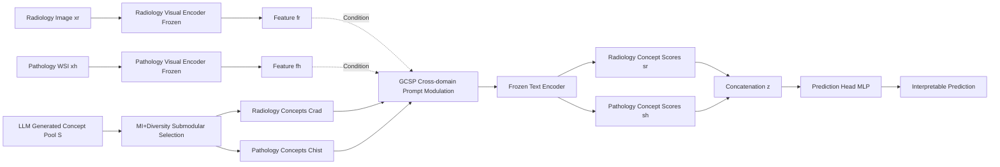

# Bridging Radiology and Pathology Foundation Models via Concept-Based Multimodal Co-Adaptation

**Conference**: ICLR 2026  
**OpenReview**: [https://openreview.net/forum?id=oxgcPoDkNv](https://openreview.net/forum?id=oxgcPoDkNv)  
**Code**: [https://github.com/HKU-MedAI/CTF](https://github.com/HKU-MedAI/CTF)  
**Area**: Medical Imaging / Multimodal Fusion / Parameter-Efficient Fine-Tuning  
**Keywords**: Medical Foundation Models, Radiology-Pathology Fusion, Concept Bottleneck, Prompt Tuning, Interpretability, Survival Analysis  

## TL;DR
This paper proposes the CTF (Concept Tuning and Fusing) framework, which utilizes a set of clinical concepts as a "shared semantic interface" between radiology and pathology foundation models. It enables cross-domain co-adaptation of concept representations before fusion by conditioning them on each other. By training only 0.15% additional parameters, it surpasses various latent space fusion baselines in survival analysis and cancer grading while providing interpretable predictions.

## Background & Motivation
**Background**: Medical Foundation Models (FMs) have demonstrated strong generalization in unimodal tasks such as radiological disease classification and pathological tumor grading. Parameter-Efficient Fine-Tuning (PEFT) allows these models to be adapted to downstream tasks at a low cost. However, real-world clinical diagnosis often relies on joint judgments across heterogeneous domains—CT/MRI provide macroscopic structural information, while pathology slides reveal microscopic cellular details. Combining both is essential to fully characterize disease progression and accurately predict outcomes like survival and grading.

**Limitations of Prior Work**: Current approaches to combining radiology and pathology FMs generally follow a "process separately, then concatenate" paradigm. The dominant framework treats each domain's FM as a **frozen feature extractor** and performs simple fusion (e.g., concatenation, co-attention) on static latent features. This suffers from two major drawbacks: first, static features cannot be adjusted for downstream tasks or inter-modality interactions, limiting fusion depth; second, the results are "black boxes" with opaque reasoning processes, failing the transparency requirements of high-stakes medical decisions. Furthermore, full fine-tuning of large VLMs is expensive and prone to becoming trapped in the pre-training domain, weakening cross-domain knowledge transfer.

**Key Challenge**: To achieve "deep collaborative understanding" between experts from different domains, the key is not simply concatenating their outputs but building an **interpretable semantic bridge** between them. Clinical concepts (e.g., "tumor necrosis," "cellular atypia") naturally serve as this bridge. However, treating concepts as fixed definitions is fragile: the prognostic significance of a concept in one domain often depends on the context of the other. For instance, "irregular tumor margins" in radiology become far more significant when accompanied by pathological evidence of "lymphovascular invasion."

**Goal**: To transform concepts from static bottlenecks into a **collaborative medium dynamically modulated by the other modality**, forcing each modality to "perceive" the other during the feature extraction stage before fusion occurs.

**Core Idea**: **Using clinical concepts as a shared semantic interface + cross-domain conditional prompting.** While keeping the visual encoders of both FMs frozen, a Global-Context-Shared Prompt (GCSP) mechanism is introduced. This allows the semantic interpretation of a concept in one domain (e.g., radiology) to be modulated by the visual features of the other domain (e.g., pathology), completing cross-domain concept co-adaptation before fusion. Final predictions are made based on explainable alignment scores.

## Method

### Overall Architecture
CTF consists of three sequential stages: ① **Prognostic Concept Selection**—generating a large pool of candidate concepts for each domain and using submodular optimization to select a compact subset that is both prognostically relevant and semantically diverse; ② **Cross-Domain Concept Co-Adaptation** (Core)—using the GCSP mechanism to dynamically generate a case-specific prefix for each concept, allowing textual embeddings to perceive both the downstream task and the patient context from the opposite domain; ③ **Fusion and Interpretable Prediction**—concatenating the co-adapted concept alignment scores and feeding them into a prediction head. Only the lightweight prompt modules and the prediction head are trainable, enabling end-to-end optimization.

### Key Designs

**1. Prognostic Concept Selection: Balancing Relevance and Diversity with Submodular Optimization.** An effective concept bridge requires concepts to be "prognostically useful" and "mutually non-redundant" (avoiding synonyms like "irregular margins" and "ill-defined borders"). This is formalized by maximizing a submodular objective $F(C)=\sum_{c\in C} d(c) + \lambda \sum_{c\in C}\min_{c'\in C\setminus\{c\}}(1-\sigma(t_c,t_{c'}))$, where $d(c)$ represents prognostic relevance and $\sigma$ is the cosine similarity of concept text embeddings. Since exact optimization is NP-hard, a two-stage greedy approach is used: first, **Mutual Information (MI)** is used to score relevance—calculating alignment scores $a(x_i,c)=(t_c^\top f_i)/(\|t_c\|\|f_i\|)$ for each image and estimating the MI between these scores and patient labels $Y$ as $d(c)=I(\hat A_c;Y)$; then, starting from the highest-ranking concept, concepts that are **least semantically similar** to the already selected set are greedily added until $k$ concepts are chosen. This is performed offline once with frozen encoders to obtain $C_{rad}$ and $C_{hist}$.

**2. GCSP: Dynamic Concept Modulation via Three-Part Prompting.** This is the core contribution. Static concept representations fail to capture how "the meaning of a finding changes with complementary information." Thus, a dynamic prefix $P^{tuned}=\text{Concat}(P_G, P_C(f_h), P_S(f_r,f_h))$ is prepended to each concept before passing it through the frozen text encoder. **Global Prompt $P_G$**: Learned intra-domain shared vectors that adapt the pre-trained meaning of a concept to the downstream task, independent of specific patients. **Context Prompt $P_C$**: The key to cross-domain guidance, implemented in an MoE-style. For a radiology concept, a gating network $g_r$ processes **pathology features** $f_h$ to generate mixing weights $\alpha=\text{softmax}(g_r(f_h))$ for a set of learnable basis prompts, $P_C(f_h)=\sum_i \alpha_i P_{C,i}^{basis}$. This injects patient-specific cross-domain conditions into the concept semantics (pathology concepts are symmetrically modulated by radiology features). **Shared Prompt $P_S$**: Captures overall patient-level synergy by compressing concatenated features into a shared latent vector $f_S=\phi_S(\text{Concat}(f_r,f_h))$ and projecting it back to both VLMs. Together, these prompts make each concept aware of the task, the opposite domain, and the overall patient profile.

**3. Concept Score Fusion and Prediction.** The $P^{tuned}$ prefix is prepended to concept tokens to produce modulated embeddings $\tilde t_c$. Cosine alignment scores between images and their corresponding concepts are calculated, yielding $s_r\in\mathbb{R}^{|C_{rad}|}$ and $s_h\in\mathbb{R}^{|C_{hist}|}$. These vectors serve as interpretable representations of "patient intensity across concepts." These are concatenated into $z=\text{Concat}(s_r,s_h)$ and fed into $\text{MLP}_{pred}$. All FM encoders are frozen; only the prompt modules and prediction head are trained, totaling 0.5M parameters (0.15% of the 307M parameters in both FMs). Survival analysis uses Cox partial likelihood loss, and grading tasks use cross-entropy. MI ranking is only used offline during selection; inference only requires alignment scores.

## Key Experimental Results

### Main Results Table

Survival Prediction (C-index ↑, mean of 10-fold stratified split):

| Model | TCGA-LGG | TCGA-GBM | Center1-GC |
|---|---|---|---|
| Radiology-Only | 0.598 | 0.477 | 0.614 |
| CLAM (Pathology-Only) | 0.689 | 0.497 | 0.631 |
| Cross-Attention (Latent Fusion) | 0.685 | 0.527 | 0.631 |
| PIBD (Prev. SOTA Latent Fusion) | 0.687 | 0.531 | 0.638 |
| M4Survive (Adaptive Fusion) | 0.709 | 0.545 | 0.642 |
| **CTF (Ours)** | **0.713** | **0.579** | **0.665** |

Cancer Grading (AUC ↑):

| Model | TCGA-GBMLGG (3-way) | Center2-CHS (5-way) | Center1-GC (5-way) |
|---|---|---|---|
| MOTCAT (Prev. SOTA Latent Fusion) | 0.865 | 0.826 | 0.641 |
| M4Survive | 0.861 | 0.830 | 0.649 |
| **CTF (Ours)** | **0.903** | **0.854** | **0.660** |

CTF achieved SOTA results across all three survival cohorts and three grading cohorts. On TCGA-LGG, the C-index is 3.8% higher than the strongest baseline; on grading tasks, the average AUC is 3.6% higher than the strongest fusion baseline (MOTCAT), while only adding 0.15% parameters.

### Ablation Study Table

Ablation on Center1-GC (Δ indicates absolute change relative to full CTF):

| Category | Variant | C-index | Δ | AUC | Δ |
|---|---|---|---|---|---|
| Full | CTF (Full) | 0.665 | — | 0.660 | — |
| Prompt | w/o Context $P_C$ | 0.629 | -0.036 | 0.635 | -0.025 |
| Prompt | w/o Global $P_G$ | 0.642 | -0.023 | 0.640 | -0.020 |
| Prompt | w/o Shared $P_S$ | 0.653 | -0.012 | 0.651 | -0.009 |
| Modulation | Static Concepts (CBM) | 0.586 | -0.079 | 0.622 | -0.038 |
| Modulation | Static + Prompt Tuning | 0.638 | -0.027 | 0.635 | -0.025 |
| Selection | Random Selection | 0.622 | -0.043 | 0.654 | -0.006 |
| Selection | Top-MI only | 0.646 | -0.019 | 0.642 | -0.018 |
| Backbone | Expert (BiomedCLIP+MUSK) | 0.680 | +0.015 | 0.658 | -0.002 |

### Key Findings
- **Cross-domain dialogue is the core driver**: Removing the Context Prompt led to the largest performance drop (C-index -0.036), proving that letting each modality perceive the other when interpreting concepts is the primary reason for CTF's success.
- **Dynamic modulation >> Static concepts**: Reverting to a standard CBM (static concepts without prompt tuning) caused the C-index to plummet by 0.079, showing that treating concepts as fixed bottlenecks is a significant performance inhibitor. Even with prompt tuning, a lack of cross-domain conditioning results in a clear gap.
- **Concept selection strategy is effective**: Random selection dropped performance by 0.043, and using only relevance (Top-MI) dropped it by 0.019, validating the necessity of the "relevance + diversity" submodular objective.
- **Robustness and benefit from expert backbones**: Switching to a stronger pathology expert backbone (MUSK) yielded an additional 0.015 gain, indicating CTF is a general framework that scales with FM upgrades.

## Highlights & Insights
- **Paradigm Shift: "Co-adaptation before fusion" rather than "Concatenation after processing"**: Unlike prior works that perform complex fusion on fixed latent features or fine-tune individual backbones, CTF introduces "cross-domain conditioning" at the semantic level of concepts **before** fusion. This suggests that the depth of fusion depends on whether features already "know" about each other before being merged.
- **No trade-off between interpretability and performance**: By grounding predictions explicitly on concept alignment scores, CTF maintains CBM-level transparency (identifying the contribution of each clinical concept) while breaking the performance ceiling of rigid CBMs through dynamic prompting.
- **Extreme parameter efficiency**: With 0.15% trainable parameters and entirely frozen FMs, the framework is highly suitable for real clinical deployment where computational resources are limited and specialized pre-trained models must be reused.
- **Elegant MoE-style Context Prompt design**: Using opposite-domain features as gates to weight a set of shared basis prompts effectively achieves patient-specific cross-domain conditioning while keeping parameter counts low.

## Limitations & Future Work
- **Concept pool dependence on LLMs**: Candidate concepts are generated by LLMs per domain. Their quality, coverage, and clinical accuracy directly impact the performance ceiling. The risks associated with LLM hallucinations in concept generation were not analyzed in depth.
- **Limited to two domains and paired data**: The framework assumes paired radiological and pathological images for the same patient. Robustness in missing-modality scenarios or extension to more domains (e.g., genomics) remains to be verified.
- **High proportion of private datasets**: Center1-GC and Center2-CHS are in-house cohorts, limiting external reproducibility. Large-scale validation of multi-center generalization is still needed.
- **Clinical credibility of concept scores**: Interpretability relies on the "reasonableness" of alignment scores. Whether these scores truly align with clinical logic requires a closed-loop expert evaluation.

## Related Work & Insights
- **Multimodal Clinical Fusion**: Compared to latent space fusion methods like MOTCAT or PIBD (which focus on co-attention and information-theoretic decoupling), CTF emphasizes "dynamic dialogue" rather than "combining fixed features." Compared to adaptive fusion like M4Survive, CTF replaces backbone fine-tuning with concept semantic co-adaptation.
- **FM Adaptation / PEFT**: This work follows the prompt tuning and adapter trajectory but innovates by upgrading prompts from "task adaptation" to "cross-domain conditioning"—letting one domain dynamically influence semantic interpretation within another.
- **Concept Bottlenecks & Interpretable Multimodal Learning**: Inspired by CBM and ConceptCLIP, the key distinction is that concepts are used as media for cross-domain guidance rather than static bottlenecks, achieving both cross-domain synergy and concept transparency.
- **Insight**: This paradigm—replacing black-box latent fusion with interpretable intermediate representations and cross-modal conditional prompts—can theoretically be generalized to any high-stakes field requiring collaboration between heterogeneous expert models (e.g., multi-omics diagnosis, industrial multi-sensor quality control).

## Rating
- **Novelty**: ⭐⭐⭐⭐ — "Concepts as dynamic collaborative media" is a distinct perspective. The three-part GCSP (global/context/shared) with MoE gating is well-implemented and moves beyond the limitations of both latent fusion and rigid CBMs.
- **Experimental Thoroughness**: ⭐⭐⭐⭐ — Covers survival analysis and cancer grading across four datasets (including private ones) with 10-fold stratified splits and paired t-tests. Ablations verify each prompt component and selection strategy. Points deducted for the reliance on private data.
- **Writing Quality**: ⭐⭐⭐⭐ — The motivation is clear (using clinical examples like "irregular margins + lymphovascular invasion" to explain cross-domain conditioning), and the methodology is well-structured.
- **Value**: ⭐⭐⭐⭐ — Provides a practical and scalable solution at the intersection of radiology-pathology joint diagnosis, interpretability, and low-cost deployment.

<!-- RELATED:START -->

## Related Papers

- [\[ICLR 2026\] Joint Adaptation of Uni-modal Foundation Models for Multi-modal Alzheimer's Disease Diagnosis](joint_adaptation_of_uni-modal_foundation_models_for_multi-modal_alzheimers_disea.md)
- [\[ICLR 2026\] CodeBrain: Bridging Decoupled Tokenizer and Multi-Scale Architecture for EEG Foundation Model](codebrain_bridging_decoupled_tokenizer_and_multi-scale_architecture_for_eeg_foun.md)
- [\[AAAI 2026\] G2L: From Giga-Scale to Cancer-Specific Large-Scale Pathology Foundation Models via Efficient Fine-Tuning](../../AAAI2026/medical_imaging/g2lfrom_giga-scale_to_cancer-specific_large-scale_pathology_foundation_models_vi.md)
- [\[ICLR 2026\] You Point, I Learn: Online Adaptation of Interactive Segmentation Models for Handling Distribution Shifts in Medical Imaging](you_point_i_learn_online_adaptation_of_interactive_segmentation_models_for_handl.md)
- [\[CVPR 2026\] CoFiDA-M: Concept-Aware Feature Modulation for Cross-Domain Adaptation with Image-Only Inference](../../CVPR2026/medical_imaging/cofida-m_concept-aware_feature_modulation_for_cross-domain_adaptation_with_image.md)

<!-- RELATED:END -->
