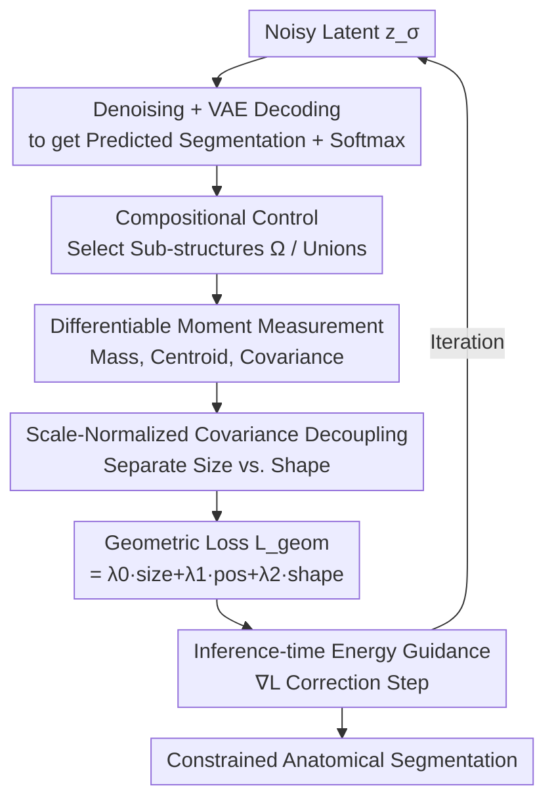

# CardioComposer: Leveraging Differentiable Geometry for Compositional Control of Anatomical Diffusion Models

**Conference**: ICLR2026  
**OpenReview**: [https://openreview.net/forum?id=JyboUMeEUi](https://openreview.net/forum?id=JyboUMeEUi)  
**Code**: https://github.com/kkadry/CardioComposer  
**Area**: Medical Imaging / Diffusion Models  
**Keywords**: Anatomical Generation, Geometric Guidance, Differentiable Geometric Moments, Energy Guidance, Compositional Control

## TL;DR
CardioComposer formulates "size, position, and shape" as differentiable losses based on voxel-based geometric moments. It applies energy guidance (gradient correction) during the sampling process of an unconditional 3D anatomical diffusion model to achieve decoupled and compositional geometric control of various anatomical sub-structures (e.g., in the heart) without retraining.

## Background & Motivation

**Background**: 3D anatomical segmentations (label maps) are essential for physical simulation platforms—virtual clinical trials, computational physiology, and medical device evaluation rely on them. Consequently, there is a push to use generative models to produce anatomical variants in bulk, either through conditional diffusion for rare variants or inpainting for creating "digital twins."

**Limitations of Prior Work**: Generating anatomy for simulation differs significantly from artistic shape generation. Simulation imposes several hard constraints: ① **Scale sensitivity**—millimeter-level geometric changes can cause dramatic fluctuations in physiological behavior; ② **Attribute specificity**—size and position affect biomechanical outcomes through different mechanisms and must be adjustable independently; ③ **Compositionality**—the geometry of multiple sub-structures (ventricles, vessels, valves) is coupled, and simulation results depend on their collective arrangement; ④ **Interpretability**—control primitives must be physiological quantities understandable by clinicians and engineers. Existing methods often force a choice between "controllability" and "realism": simple geometric primitives are controllable but unrealistic; autoencoders using global shape vectors are realistic but uninterpretable; while conditional training supports attributes, it **requires retraining** and usually only handles size-related variables.

**Key Challenge**: Controllability typically stems from "baking constraints into training," which leads to rigidity (limited to attributes seen during training, requires retraining for new constraints). Flexibility comes from "inference-time guidance," but existing energy guidance is often limited to coarse localization and lacks precise geometric control, especially for multi-class segmentations.

**Goal**: To develop a geometric control framework that operates at inference time, requires no retraining, is interpretable, can decouple individual attributes, and supports compositional constraints across any number of sub-structures.

**Key Insight**: The authors observe that an unconditional diffusion model inherently learns the prior of "what constitutes a realistic anatomy." Therefore, geometric constraints do not need to be baked into the network weights. Instead, a **differentiable geometric metric** can be used during sampling to calculate the geometric attributes of the current prediction, compare them with targets, and use the resulting gradient as a "force" to guide the sampling trajectory. Since these metrics are calculated per sub-structure, compositional and decoupled control emerges naturally.

**Core Idea**: By representing size, position, and shape through voxel-based geometric moments (zero-order mass, first-order centroid, and second-order covariance), the authors construct a differentiable moment loss. This loss is used for DPS-style gradient correction at each step of unconditional latent diffusion sampling, enabling a single unconditional model to achieve decoupled and compositional geometric control.

## Method

### Overall Architecture

CardioComposer performs inference-time guidance on a **pre-trained unconditional 3D anatomical latent diffusion model** without modifying the training process. Given a set of target geometric attributes (size, position, and shape for each sub-structure, represented by interpretable ellipsoidal primitives), the framework inserts a geometric correction into **every denoising step** of the reverse diffusion process. First, the current noisy latent is denoised and decoded into a voxel segmentation prediction, followed by a class-wise softmax to obtain probability volumes. Specific sub-structures are then selected to calculate their geometric moments. These measured moments are compared against target moments to compute a geometric loss. Finally, the gradient of this loss with respect to the noisy latent is used to correct the denoising direction.

Formally, the segmentation volume is denoted as $x \in \mathbb{R}^{C\times H\times W\times D}$ ($C$ tissue channels), with a VAE encoding to latent space $z=\mathcal{E}(x)$ and decoding to $\tilde{x}=\mathcal{D}(z)$. Diffusion follows the EDM formulation by Karras et al., where the denoiser $D_\theta$ estimates the clean prediction. Guidance is implemented by adding a geometric gradient term to the unconditional denoising result:

$$\underbrace{D^w_\theta(z_\sigma;\sigma)}_{\text{Guided Denoising}}=\underbrace{D_\theta(z_\sigma;\sigma)}_{\text{Unconditional Denoising}}-\sigma^2\cdot w\cdot\nabla_{z_\sigma}\mathcal{L}_{\text{geom}}$$

where $w$ is the guidance weight and $\mathcal{L}_{\text{geom}}$ is the composite geometric loss defined below.

### Key Designs

**1. Differentiable Geometric Moment Measurement: Scalarizing Attributes for Gradients**

While traditional morphometry can measure length, volume, and position, such measures are often non-differentiable or describe isolated features. This work utilizes **voxel geometric moments** to represent the geometry of each sub-structure $\Omega_k$ in a fully differentiable manner. For the $k$-th sub-structure (with a flattened voxel grid $\Omega_k$ and normalized coordinates $p\in[0,1]^3$), the three moments are:

$$M_k=\mathbf{1}^T\Omega_k,\qquad C_k=\frac{\Omega_k^T p}{M_k},\qquad S_k=\frac{1}{M_k}p^T\,\mathrm{diag}(\Omega_k)\,p-C_k^T C_k$$

The zero-order moment $M_k$ provides volume/mass (size), the first-order moment $C_k$ provides the centroid (position), and the second-order central moment $S_k$ provides the covariance (shape—aspect ratio and orientation). These are differentiable with respect to the latent variables, allowing intentions like "make the right ventricle larger" to be transformed into back-propagatable losses.

**2. Scale-Normalized Covariance Decoupling: Separating Shape from Size**

Using the covariance $S_k$ directly as a shape constraint is problematic because it encodes both orientation/aspect ratio and absolute scale. Consequently, constraining shape would inadvertently affect volume. The authors decouple scale by normalizing the eigenvalues: $S^n_k=S_k/\mathrm{tr}(\Lambda)$, where $\Lambda$ is the eigenvalue matrix of $S_k$. By dividing by the trace (the "total scale"), $S^n_k$ retains only information about aspect ratio and orientation. This step allows size and shape to be adjusted independently.

**3. Compositional Multi-Structure Control: Weighted Composite Losses**

Simulations require specific collective arrangements of multiple structures. The framework maps the segmentation to a set of sub-structure voxel maps $\Omega\in\mathbb{R}^{E\times H\times W\times D}$, where each sub-structure can be a single tissue channel or a **union** of several channels (e.g., combining both vena cavae or all cardiac chambers). MSE losses are calculated for selected attributes: $\mathcal{L}_{\text{size}}=\mathcal{L}_{\text{MSE}}(M,\bar M)$, $\mathcal{L}_{\text{pos}}=\mathcal{L}_{\text{MSE}}(C,\bar C)$, and $\mathcal{L}_{\text{shape}}=\mathcal{L}_{\text{MSE}}(S^n,\bar S^n)$, which are then combined into $\mathcal{L}_{\text{geom}}=\lambda_0\mathcal{L}_{\text{size}}+\lambda_1\mathcal{L}_{\text{pos}}+\lambda_2\mathcal{L}_{\text{shape}}$. This allows for flexible control—setting $\lambda_i$ to zero removes a specific constraint, and increasing $E$ adds more sub-structures without retraining.

**4. Inference-time Energy Guidance: DPS-style Gradient Correction**

Using the Diffusion Posterior Sampling (DPS) approach, at each step, the unconditional model provides a clean prediction $\hat z_0=D_\theta(z_\sigma;\sigma)$, which is decoded into $\hat x_0$ to compute $\mathcal{L}_{\text{geom}}$. The gradient of this loss with respect to $z_\sigma$ then corrects the current step. This design decouples realism (handled by the unconditional prior) from constraints (handled by the energy gradient).

### Loss & Training

The unconditional diffusion model is trained on TotalSegmentator heart labels (11 channels, 2mm isotropic, 596 high-quality cases, 80/20 split) using the EDM clean prediction objective: $\mathcal{L}=\mathbb{E}_{\sigma,z,n}[\lambda(\sigma)\|D_\theta(z_\sigma;\sigma)-z\|^2_2]$. No training occurs during the guidance phase; $\mathcal{L}_{\text{geom}}$ is simply added during sampling. The weights $w$ and $\lambda_i$ are tuned empirically and shown to generalize across different anatomical systems like the aorta, spine, and knee.

## Key Experimental Results

### Main Results: Compositional Multi-Structure Generation

The table compares Ours with the strongest conditional baseline (Implicit dropout) across different numbers of constrained sub-structures (MMD ×10³):

| Num. Sub-structures | Method | FD (↓) | Pr. (↑) | Re. (↑) | MMD (↓) | COV (↑) | 1-NNA |
|------|------|------|------|------|------|------|------|
| 0 | Implicit | 1622 | 0.00 | 0.99 | 55.7 | 0.288 | 0.915 |
| 0 | **Ours** | **34.6** | **0.70** | 0.87 | **9.40** | **0.53** | **0.55** |
| 1 | Implicit | 227 | 0.00 | 0.87 | 17.1 | 0.40 | 0.79 |
| 1 | **Ours** | **38.5** | **0.60** | 0.83 | **9.39** | **0.52** | **0.57** |
| 3 | Implicit | 29.8 | 0.80 | 0.81 | 9.21 | 0.48 | 0.58 |
| 3 | **Ours** | **32.7** | 0.78 | **0.94** | **8.60** | **0.58** | **0.52** |
| 6 | Implicit | 31.1 | 0.82 | 0.95 | 8.11 | 0.56 | 0.50 |
| 6 | **Ours** | 35.5 | 0.80 | 0.94 | 8.50 | 0.58 | 0.50 |

Key Finding: When fewer constraints are applied (0-1 sub-structures), the implicit conditional baseline collapses (high FD, zero Precision). This is because the conditional model is mostly trained on "full conditioning," making low-constraint scenarios rare during training. In contrast, Ours uses an unconditional prior with selective guidance, remaining stable regardless of the number of constraints.

### Ablation Study: Geometric Decoupling

Using 100 target moments for myocardium labels:
- **Uncond.** Wide marginal distributions for all attributes.
- **Mass only**: Mass distribution converges to a sharp peak at the target, while others remain wide.
- **Centroid only**: Significant improvement in position fidelity; others nearly unchanged. Decoupling is effective.
- **Shape only**: Shape converges, but mass also shows slight improvement. This reveals a minor residual coupling inherited from the dataset's size-shape correlation.

### Key Findings
- **Effective Decoupling**: Individual losses primarily affect their corresponding attributes. The weak shape-to-mass coupling is a reflection of natural anatomical correlations.
- **Robustness in Low-Constraint Scenarios**: While conditional baselines fail when few constraints are given, inference-time guidance maintains high quality.
- **Anatomical Generalization**: The same loss weights generalize to the aorta, spine, and knee.
- **Downstream Utility**: Geometric inpainting (e.g., halving RV mass) was used for biventricular pressure simulations, where volume changes directly modulated wall displacement, validating the "anatomy-to-simulation" loop.

## Highlights & Insights
- Formulating geometric attributes as differentiable moments for DPS guidance provides a clean **separation of prior and constraints**. The unconditional model ensures realism, while the energy gradient ensures controllability.
- **Scale-Normalized Covariance** is a clever technical detail that makes size and shape decoupling possible.
- The experiment highlighting "rare configuration decay" in conditional training provides strong evidence for the robustness of inference-time guidance.
- **Ellipsoidal primitives** serve as an interpretable interface for clinical and engineering use cases.

## Limitations & Future Work
- Relative weights for geometric moments still require empirical tuning (though they transfer well across systems).
- Sub-structures are currently limited to label classes and cannot represent local features like cross-sections.
- Diffusion models can still produce topological errors (e.g., disconnected aorta), requiring post-hoc filtering for simulations.
- Future work could include differentiable topological constraints (e.g., connectivity or genus penalties) directly in the guidance loop.

## Related Work & Insights
- **vs. Conditional Training**: Those methods bake geometry into weights, requiring retraining for new tasks. Ours is retraining-free and supports specific size/position/shape attributes without the degradation seen in conditional dropout.
- **vs. Geometric Primitives**: Methods using cylinders or spheres are controllable but unrealistic. Ours uses primitives only as an interface, relying on the diffusion prior for realism.
- **vs. Existing Energy Guidance**: Prior guidance methods were often coarse; this work expands precise geometric control to 3D multi-class voxel maps.

## Rating
- **Novelty**: ⭐⭐⭐⭐⭐ Using differentiable moments for DPS guidance in anatomical diffusion is a clean and rare paradigm.
- **Experimental Thoroughness**: ⭐⭐⭐⭐ Covers decoupling, composition, and downstream simulation, though conditional baseline comparisons could be broader.
- **Writing Quality**: ⭐⭐⭐⭐⭐ The derivation of simulation constraints and the alignment between formulas and text are clear.
- **Value**: ⭐⭐⭐⭐⭐ Provides a plug-and-play, interpretable, retraining-free tool for computational medicine and device simulation.

<!-- RELATED:START -->

## Related Papers

- [\[CVPR 2026\] Anatomica: Localized Control over Geometric and Topological Properties for Anatomical Diffusion Models](../../CVPR2026/medical_imaging/anatomica_localized_control_over_geometric_and_topological_properties_for_anatom.md)
- [\[ICLR 2026\] DM4CT: Benchmarking Diffusion Models for Computed Tomography Reconstruction](dm4ct_benchmarking_diffusion_models_for_computed_tomography_reconstruction.md)
- [\[ICLR 2026\] Adaptive Domain Shift in Diffusion Models for Cross-Modality Image Translation](adaptive_domain_shift_in_diffusion_models_for_cross-modality_image_translation.md)
- [\[ICLR 2026\] Improving 2D Diffusion Models for 3D Medical Imaging with Inter-Slice Consistent Stochasticity](improving_2d_diffusion_models_for_3d_medical_imaging_with_inter-slice_consistent.md)
- [\[ICLR 2026\] Are EEG Foundation Models Worth It? Comparative Evaluation with Traditional Decoders in Diverse BCI Tasks](are_eeg_foundation_models_worth_it_comparative_evaluation_with_traditional_decod.md)

<!-- RELATED:END -->
