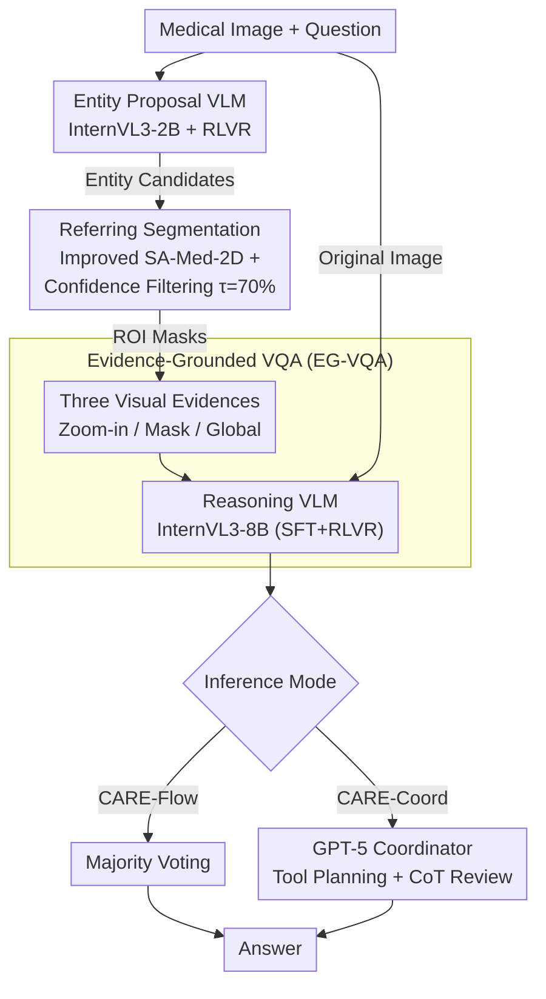

# CARE: Towards Clinical Accountability in Multi-Modal Medical Reasoning with an Evidence-Grounded Agentic Framework

**Conference**: ICLR 2026  
**arXiv**: [2603.01607](https://arxiv.org/abs/2603.01607)  
**Code**: [https://xypb.github.io/CARE-Project-Page/](https://xypb.github.io/CARE-Project-Page/)  
**Area**: Medical Imaging / Multi-modal VLM / Agent  
**Keywords**: Medical VQA, Evidence-grounded reasoning, Agent framework, Referring segmentation, Clinical accountability

## TL;DR
The CARE framework is proposed to decompose Medical VQA into a three-stage expert pipeline: "entity proposal → referring segmentation → evidence-grounded QA." By fine-tuning VLMs with RLVR and utilizing GPT-5 as a dynamic coordinator for tool planning and CoT review, CARE achieves a 77.54% average accuracy with 10B parameters, outperforming 32B end-to-end SOTA models (72.29%) across four medical VQA benchmarks.

## Background & Motivation

**Background**: Multi-modal large models (Lingshu, HuatuoGPT-Vision, MedGemma, etc.) continuously set new records in medical VQA. However, nearly all existing methods rely on end-to-end single-pass inference—inputting an image and a question to generate an answer directly. This "black box" mode fails to inform clinicians about which regions the model examined or the evidence behind its decision.

**Limitations of Prior Work**: Three primary levels of issues exist. (1) **Unauditable**: The reasoning process of end-to-end VLMs is opaque, preventing clinicians from verifying if the model focused on the correct anatomical structures or lesions, which is critical in healthcare where the chain of accountability must remain intact. (2) **Decoupled Grounding and Reasoning**: Although some works (MedPLIB, UniBiomed) add visual grounding heads to VLMs, the localization results are not fed back into the reasoning process; they serve only as auxiliary multi-task outputs without substantially improving answer quality. (3) **Fragility of Single-Model Coupling**: Approaches in the general domain (DeepEyes, Fan et al.) attempt to alternate between grounding and reasoning within a single generative model. However, this requires massive paired data and multi-round RL, and early localization errors directly amplify downstream hallucinations—missing a small but critical lesion can lead the entire CoT to build upon a false premise.

**Key Challenge**: The tension between accuracy and accountability. Larger end-to-end models (e.g., Lingshu-32B, InternVL3-38B) achieve higher accuracy but operate entirely within a black box; smaller models may offer interpretable reasoning but lack sufficient capability. Coupling localization and reasoning in a single VLM is difficult to train and prone to cascading hallucinations due to single-point failures.

**Goal**: (1) How can each step of medical VQA reasoning be supported by pixel-level visual evidence? (2) How can this accountability be achieved without sacrificing accuracy? (3) How can a combination of small models outperform a single large model?

**Key Insight**: The authors observe that a clinician's diagnostic workflow is inherently "staged"—hypothesizing potential anatomical structures/lesions (entity candidates), precisely locating these regions on images (visual grounding), and finally making a judgment based on local details and global context. This human workflow is naturally auditable, with clear inputs, outputs, and inspectable intermediate results for each step.

**Core Idea**: Simulating the staged clinical diagnostic process using three lightweight expert models (Entity Proposal VLM + Referring Segmentation Model + Evidence-Grounded VQA VLM) coordinated by a powerful VLM for dynamic planning and answer review, achieving "small model toolchain > large model single-pass inference."

## Method

### Overall Architecture
CARE addresses medical VQA by refusing end-to-end "one-glance" answering. Instead, it decomposes the process into three inspectable stages, mimicking a doctor's workflow of "hypothesize, locate, and evidence-based judgment." The first stage is **Medical Entity Proposal**: an InternVL3-2B fine-tuned via RLVR reads the image and question to propose relevant medical entities (anatomy, lesions, instruments). The second stage is **Referring Segmentation**: an improved expert segmentation model based on SA-Med-2D generates ROI masks at the pixel level and assigns confidence scores to filter unreliable localizations. The third stage is **Evidence-Grounded VQA (EG-VQA)**: an InternVL3-8B fine-tuned via SFT + RLVR performs final reasoning using the original image and visual evidence derived from the masks. Intermediate products—entity lists, masks, and evidence types—are observable and auditable.

Two execution modes are supported: **CARE-Flow**, a static pipeline using majority voting across three types of visual evidence, and **CARE-Coord**, where GPT-5 acts as a dynamic coordinator to decide tool orchestration and review the consistency between CoT and the final answer.

### Key Designs

**1. RLVR Training for Entity Proposal VLM: Framing entity detection as a trainable generation task**

Open-ended entity proposal lacks a fixed answer space, making traditional binary rewards (exact match) prone to gradient vanishing. The authors first synthesized a dataset of 10k training and 1k testing (Image, Question, Entity) pairs from SA-Med-20M. Training utilizes the DAPO algorithm with a four-part reward: **Similarity Reward** $R_{\text{sim}}$ uses MiniLM-L6-v2 to encode predicted/GT entities and the Kuhn-Munkres (KM) algorithm for optimal bipartite matching; **Count Reward** $R_{\text{count}}$ rewards outputs with 1-5 entities; **Repetition Penalty** $R_{\text{rep}} = 1/(r+1)$ suppresses duplicates; and **Format Reward** $R_{\text{format}}$ ensures standard `<think>`/`<answer>` tags. Continuous rewards avoid zero gradients, and KM matching is more stable than greedy matching. Ablations show the KM + Sim combination achieves 85.2% entity accuracy, significantly higher than Greedy + Binary (72.8%).

**2. Referring Segmentation Model: Pixel-level ROI localization from text descriptions**

Instead of using internal VLM grounding heads, a specialized expert segmentation model is employed to ensure precision for small, clinically critical lesions. SA-Med-2D (a 600M parameter medical SAM) is enhanced with text understanding: a frozen Bio-ClinicalBERT encodes entity names into tokens, which are concatenated with image tokens and a binary modal embedding (image=0, text=1). During decoding, text tokens serve as queries for the SAM mask decoder. Fine-tuning only updates reformers and the image encoder. To prevent poor masks from contaminating downstream tasks, a confidence score $C(M_p) = 1 - \text{Entropy}(M_p) / \log(2)$ is calculated, discarding masks below $\tau_C = 70\%$. This expert model achieves an 81.9% average Dice on the MeCo-G benchmark, far exceeding LISA-7B (62.7%) and BiomedParse (30.1%).

**3. Evidence-Grounded VQA (EG-VQA): Translating ROIs into complementary visual evidence**

ROIs are translated into three types of complementary evidence rather than simple overlays, preserving the physical meaning of pixels (e.g., HU values in CT): **Zoom-in crop** provides high-resolution local details; **Binary Mask** serves as a spatial attention prior via an additional channel; **Global** provides the full view for questions regarding scan modality or orientation. These are mixed during training to teach the model to select appropriate cues based on the question. EG-VQA training involves SFT for medical knowledge injection followed by DAPO-RFT for reasoning optimization, using a CoT length reward $R_{\text{length}} = 0.25 \cdot \min(1, |\hat{y}|/L)$ to encourage thorough reasoning.

### Loss & Training
The overall RLVR framework uses DAPO (Decoupled Asymmetric PPO). For the Entity Proposal VLM, the total reward is $R_{\text{Entity}} = R_{\text{sim}} + R_{\text{count}} + R_{\text{rep}} + R_{\text{format}}$. For the EG-VQA VLM, it is $R_{\text{EG-VQA}} = R_{\text{acc}} + R_{\text{format}} + R_{\text{length}}$. The two-stage "SFT → RFT" approach ensures that SFT injects medical facts while RFT shifts the distribution toward reasonable CoT. Ablations confirm that SFT + DAPO + $R_{\text{length}}$ is optimal (+2.4% over SFT, +3.6% over pure DAPO).

## Key Experimental Results

### Main Results (4 Medical VQA Benchmarks, Accuracy %)

| Method | Params | OMVQA-3k | VQA-RAD | SLAKE | VQA-Med-2019 (OOD) | Average |
|------|--------|----------|---------|-------|---------------------|------|
| GPT-4o | - | 64.07 | 58.54 | 63.55 | 59.60 | 61.44 |
| GPT-5 | - | 74.73 | 63.19 | 67.75 | 62.20 | 66.97 |
| InternVL3-8B | 8B | 75.97 | 61.86 | 66.13 | 57.40 | 65.34 |
| HuatuoGPT-Vision-34B | 34B | 76.80 | 60.75 | 64.12 | 60.60 | 65.57 |
| Lingshu-32B | 32B | 83.97 | 64.75 | 82.25 | 58.20 | 72.29 |
| CARE-Flow-S | 4B | 94.53 | 56.32 | 78.44 | 53.60 | 70.72 |
| CARE-Flow-B | 10B | 96.17 | 63.64 | 83.21 | 56.60 | 74.91 |
| **CARE-Coord-B** | **10B** | **97.97** | **68.29** | **83.11** | **60.80** | **77.54** |

Ours (CARE-Flow-B, 10B) achieves a +10.9% gain over baselines of similar scale and +2.6% over Lingshu-32B. With the coordinator, CARE-Coord-B outperforms Lingshu-32B by +5.2%.

### Ablation Study — Effect of Visual Evidence and Coordinator

| Visual Cues (Train) | Coordinator | ID Average | OOD | Total | vs Baseline |
|------------------|--------|---------|-----|------|---------|
| No Evidence | None | 77.9 | 56.0 | 72.4 | +0.0 |
| Mask | None | 79.6 | 54.0 | 73.2 | +0.8 |
| Zoom | None | 79.5 | 56.8 | 73.8 | +1.4 |
| Mask + Zoom | None | 80.2 | 55.6 | 74.1 | +1.7 |
| All Three (CARE-Flow) | None | 81.0 | 56.6 | 74.9 | +2.5 |
| All Three | Planning | 80.8 | 53.4 | 74.8 | +2.4 |
| All Three (CARE-Coord) | Planning + Review | 83.1 | 60.8 | **77.5** | **+5.1** |

### Ablation of Training Strategy

| Training Strategy | ID Average | OOD | Total | vs Baseline |
|----------|---------|-----|------|---------|
| Baseline (InternVL3-8B) | 67.9 | 57.4 | 65.3 | +0.0 |
| + SFT | 77.8 | 56.6 | 72.5 | +7.2 |
| + GRPO | 75.2 | 54.0 | 69.9 | +4.6 |
| + DAPO | 77.0 | 54.2 | 71.3 | +6.0 |
| + SFT + DAPO | 79.3 | 56.2 | 73.5 | +8.2 |
| + SFT + DAPO + $R_{\text{length}}$ (CARE-Flow) | 81.0 | 56.6 | **74.9** | **+9.6** |

### Key Findings
- **Value of Visual Evidence Combination**: Using all three types of evidence yields a +2.5% gain over the baseline. While zoom-in alone is effective (+1.4%), the combination is more robust.
- **Review is the Main Source of Gain**: Adding Planning alone showed no significant gain. However, adding CoT-Answer Review resulted in a jump to +5.1%, indicating that iterative review, rather than just planning, is the core value of the coordinator.
- **SFT + DAPO Complementarity**: Pure SFT (+7.2%) outperforms pure DAPO (+6.0%), but the combination (+8.2%) is better, with the length reward (+9.6%) being optimal.
- **Coordinator Behavior**: GPT-5 modified 7.89% of samples, with 4.84% being corrections (✗→✓) and 3.05% being incorrect changes (✓→✗), resulting in a net gain of +1.79%.
- **Expert vs. General Segmentation**: Replacing the improved SA-Med-2D with BiomedParse resulted in a 3.4% accuracy drop for VQA, highlighting the necessity of expert models.
- **GPT-5 vs Other Coordinators**: GPT-5 (77.5%) significantly outperformed GPT-4o (73.3%) and InternVL3-38B (74.0%), as weaker coordinators struggled with evidence selection or over-editing expert answers.

## Highlights & Insights
- **Biomimetic System Design Philosophy**: Rather than simply scaling up VLMs, the system mimics the clinician's "hypothesis → localization → evidence-based diagnosis" workflow. This results in inspectable intermediate steps, naturally satisfying the traceability requirements of medical scenarios.
- **Ingenious RLVR for Open Concept Proposal**: The authors use embedding similarity + Kuhn-Munkres matching as a continuous reward signal, maintaining semantic flexibility while providing stable gradients. This reward-shaping scheme is applicable to any RL task requiring soft matching between generated and reference sets.
- **Parameter Efficiency of Toolchains**: A 10B modular pipeline outperforms 32B end-to-end models. This proves that in specialized domains, well-designed agents and expert tool strategies are more effective than blind scaling.

## Limitations & Future Work
- **Reliance on Strong Coordinators**: Performance drops by 4.2% when switching from GPT-5 to GPT-4o. Training a compact, reliable coordinator remains an open challenge.
- **Error Cascades**: The sequential pipeline makes upstream errors in entity proposal or segmentation unrecoverable downstream.
- **Synthetic Data Constraints**: Training data for entity proposal may not fully cover the diversity of real-world clinical questions.
- **Deployment Costs**: High latency and API costs for repetitive GPT-5 calls may hinder real-world clinical deployment.
- **OOD Generalization Gap**: Performance on VQA-Med-2019 (60.8%) still lags significantly behind ID benchmarks (83.1%).

## Related Work & Insights
- **vs Lingshu-32B**: Lingshu is strong in-domain but lacks intermediate evidence. Ours (CARE-Coord-B) outperforms it with 1/3 the parameters via modularity.
- **vs DeepEyes-7B**: DeepEyes alternates grounding and reasoning in one model through complex RL. CARE decouples these tasks, avoiding error amplification within the model.
- **vs MedVLM-R1-2B**: MedVLM-R1 focuses on pure reasoning without grounding. CARE demonstrates that "reasoning + localization" is far more effective.
- **vs BiomedParse**: The expert segmentation quality in CARE is superior and essential for VQA accuracy.

## Rating
- Novelty: ⭐⭐⭐⭐ Formalizing clinical workflows into an agentic pipeline is inspiring; the KM-matching reward design is clever.
- Experimental Thoroughness: ⭐⭐⭐⭐⭐ Comprehensive cross-benchmark evaluation and high-dimensional ablation studies provide clear conclusions.
- Writing Quality: ⭐⭐⭐⭐ Clear structure and informative charts, though some implementation details require cross-referencing with the appendix.
- Value: ⭐⭐⭐⭐⭐ Provides a concrete technical path for "accountable" medical AI, demonstrating the efficiency of modular expert systems.

<!-- RELATED:START -->

## Related Papers

- [\[AAAI 2026\] PulseMind: A Multi-Modal Medical Model for Real-World Clinical Diagnosis](../../AAAI2026/medical_imaging/pulsemind_a_multi-modal_medical_model_for_real-world_clinical_diagnosis.md)
- [\[CVPR 2026\] Med-CMR: A Fine-Grained Benchmark Integrating Visual Evidence and Clinical Logic for Medical Complex Multimodal Reasoning](../../CVPR2026/medical_imaging/med-cmr_a_fine-grained_benchmark_integrating_visual_evidence_and_clinical_logic_.md)
- [\[CVPR 2026\] Clinically-Grounded Counterfactual Reasoning for Medical Video Diagnosis](../../CVPR2026/medical_imaging/clinically-grounded_counterfactual_reasoning_for_medical_video_diagnosis.md)
- [\[CVPR 2026\] EMAD: Evidence-Centric Grounded Multimodal Diagnosis for Alzheimer's Disease](../../CVPR2026/medical_imaging/emad_evidence-centric_grounded_multimodal_diagnosis_for_alzheimers_disease.md)
- [\[ICLR 2026\] Joint Adaptation of Uni-modal Foundation Models for Multi-modal Alzheimer's Disease Diagnosis](joint_adaptation_of_uni-modal_foundation_models_for_multi-modal_alzheimers_disea.md)

<!-- RELATED:END -->
