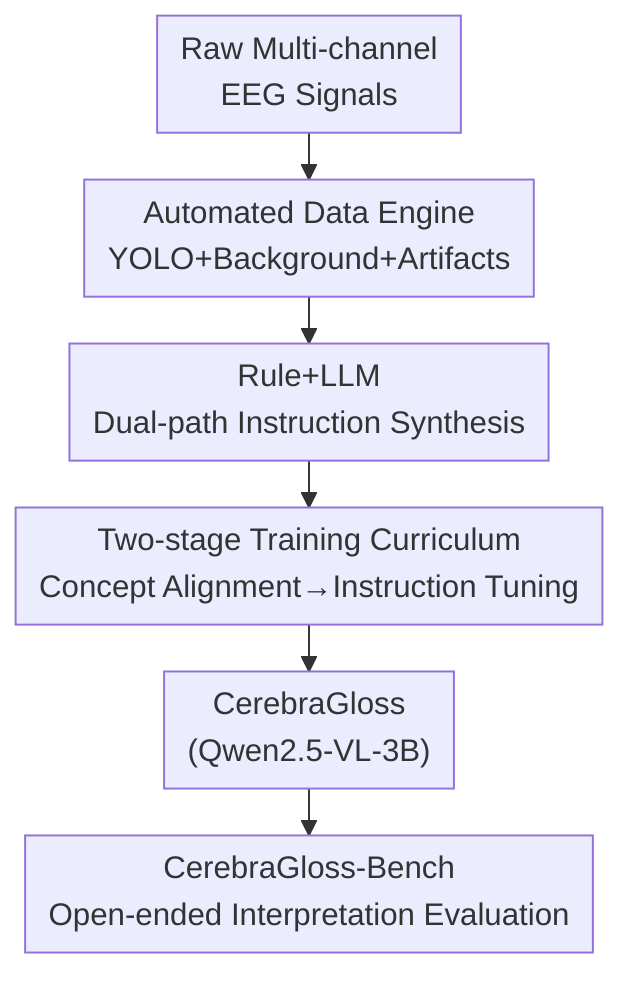

# CerebraGloss: Instruction-Tuning a Large Vision-Language Model for Fine-Grained Clinical EEG Interpretation

**Conference**: ICLR2026  
**OpenReview**: [https://openreview.net/forum?id=Xi1jkajWi9](https://openreview.net/forum?id=Xi1jkajWi9)  
**Code**: https://github.com/iewug/CerebraGloss  
**Area**: Medical Imaging / Multimodal VLM  
**Keywords**: Clinical EEG Interpretation, Vision-Language Models, Instruction Tuning, Automated Data Engine, Waveform Detection

## TL;DR
This paper treats clinical electroencephalogram (EEG) waveforms as a "specialized visual language." By utilizing an automated data engine (including a custom YOLO waveform detector) to synthesize 94,000 EEG image-text instruction pairs, the authors perform two-stage instruction tuning on Qwen2.5-VL-3B. This results in CerebraGloss, the first generative EEG interpretation model capable of "description + multiple-choice questions + multi-turn dialogue." It outperforms GPT-5 on the self-developed open-ended benchmark CerebraGloss-Bench and achieves new SOTA results in seizure detection on TUSZ.

## Background & Motivation
**Background**: Clinical EEG is a fundamental diagnostic tool in neurology, but its value is released only through trained experts manually reviewing raw waveforms. Computational methods have evolved from traditional machine learning (handcrafted features + SVM) to CNN/RNN, and recently to BERT/GPT-style self-supervised EEG foundation models (e.g., LaBraM).

**Limitations of Prior Work**: Manual review faces three major issues: labor-intensiveness (hours per record), subjectivity (high variability between doctors), and incompleteness (only key findings are labeled, ignoring vast signals). Existing computational models are almost exclusively "specialized classifiers" focusing on isolated closed-set tasks like seizure detection or sleep staging, failing to synthesize multiple findings into a holistic, interpretative analysis. Essentially, the field has "built classifiers but not a doctor capable of interpretation."

**Key Challenge**: Large Vision-Language Models (LVLMs) could potentially "read" waveforms as visual language, shifting the paradigm from "narrow classification" to "comprehensive interpretation." The fundamental bottleneck is **data**—the lack of large-scale instruction datasets pairing visualized EEG images with fine-grained, expert-level interpretations. Manual annotation at this scale is prohibitively expensive.

**Goal**: (1) Generate large-scale EEG image-text instruction data without existing datasets; (2) Train a generative interpretation model capable of unified description/QA/dialogue; (3) Build a benchmark to evaluate "open-ended interpretation capability" rather than single classification metrics.

**Key Insight**: Instead of expensive manual labeling, use a programmatic "data engine" to encode domain knowledge into detectors and rules. This automatically generates structured labels from raw signals, which are then refined into natural instruction dialogues by a strong LLM (Gemini 2.5 Flash).

**Core Idea**: Replace "expensive manual labeling + specialized classifiers" with an "automated data engine for synthesized instruction data + two-stage tuning of general LVLMs," upgrading EEG interpretation from classification to generative dialogue.

## Method

### Overall Architecture
The core of CerebraGloss is not a modification of the model architecture, but a complete "data-driven" pipeline: **Raw multi-channel EEG signals → Automated data engine producing structured annotations → Dual-path instruction synthesis via rules and LLM → Two-stage curriculum training transforming a general LVLM into an EEG expert → Evaluation of open-ended interpretation using a custom benchmark**. The model follows the Qwen2.5-VL-3B architecture (vision encoder + LLM decoder + cross-modal projector). Inputs are 10-second EEG segments rendered as images; outputs are free-text clinical interpretations.

### Key Designs

**1. Automated Data Engine: Decomposing expert review into three programmable modules**

To overcome the cost of manual labeling, the authors designed a "data engine" that programmatically outputs structured clinical annotations from raw signals through three modules. The first is key waveform event detection: **CerebraGloss-YOLO**, a specialized object detection model trained to treat multi-channel signals as images to locate nine clinical waveforms (spikes, sharp waves, complexes, K-complexes, sleep spindles, etc.). The team spent months annotating 2,849 segments (46,258 bounding boxes) from DREAMS, TUH EEG, and private data. The second is background rhythm characterization: defining amplitude as half peak-to-peak voltage and identifying the dominant frequency within standard bands ($\delta/\theta/\alpha/\beta/\gamma$). The third is artifact identification: using statistical and morphological features to label biological artifacts (EMG, EOG, breathing) and non-biological artifacts (electrode noise, flatlines).

**2. Dual-path Instruction Synthesis: Rules for facts, LLM for dialogue**

To transform structured labels into "User Question—Model Answer" pairs, the authors processed 1.4 million segments (3,889 hours total). **Rule-based path**: Templates synthesize detailed captions covering montage, artifacts, sleep events, epileptiform activity (including dipole estimation), and background features, alongside multi-choice/binary QA. Cleaning strategies like event priority masking and spatial pruning were used to mitigate automatic labeling errors. **LLM-based path**: Captions and detection coordinates were fed into Gemini 2.5 Flash as a teacher model. With one-shot prompting and constraints to prevent hallucination, 94,000 high-quality samples were generated, balanced 1:1:1 across: Detailed Description, Complex MCQ (requiring deeper reasoning), and multi-turn clinical Conversation. Notably, the synthesis process does not use the EEG images themselves; images are only used during final model training.

**3. Two-stage Training Curriculum: Aligning EEG visual concepts then instruction tuning**

Stage 1 (EEG Concept Alignment): Freeze the vision encoder and LLM decoder, **tuning only the projector**. 1.4 million EEG pairs are mixed with 558,000 LLaVA general pairs to align waveform features with language space. A key detail is **early stopping** (at ~0.05 epoch) before convergence to prevent the model from developing a "description bias" from template-heavy captions, which could hurt open-ended reasoning. Stage 2 (EEG Instruction Tuning): Freeze the vision encoder while full-parameter tuning the LLM decoder and projector for 1 epoch. The data includes the 94,000 Gemini samples, 100,000 rule MCQs, and 50,000 rule captions, mixed with 50,000 general samples to preserve general instruction-following. Training utilized 8×A800 GPUs, AdamW optimizer, effective batch size 256, and peak learning rate of $1\times10^{-5}$.

**4. CerebraGloss-Bench: First benchmark for open-ended EEG interpretation and multi-class detection**

Existing benchmarks (TUSZ for seizures, HMC for sleep) are closed-set and suffer from label-granularity mismatch and oversimplification. The authors introduced CerebraGloss-Bench: 90 challenging 10-second segments (full 19-channel 10-20 system). Each segment includes: free-text descriptions, complex MCQs, conversational QA, and channel-level bounding boxes for nine waveform types. All data comes from a private hospital collection with **zero subject overlap** with the training set, covering 17 sub-categories across background, artifacts, sleep, and epileptiform activity.

### Loss & Training
Both stages use standard language modeling (auto-regressive generation) objectives. The distinction lies in the unfreezing scope and early stopping: Stage 1 tunes only the projector with early stopping to learn "visual vocabulary" without overwriting reasoning, while Stage 2 tunes the LLM and projector for a full epoch with general data regularization.

## Key Experimental Results

### Main Results
On CerebraGloss-Bench, MCQs were evaluated by Accuracy, Descriptions by ROUGE-1, and QA by GPT-5 as a judge (1-10 scale). CerebraGloss-3B outperformed all models, including proprietary ones like GPT-5. Biomedical LVLMs like LLaVA-Med and BioMedGPT failed to interpret waveforms due to the lack of EEG-text pairs in their training.

| Model | MCQ (Acc%) | Description (ROUGE-1%) | QA (GPT-5 Score) |
|------|------|------|------|
| LLaVA-Med | / | 8.87 | 2.83 |
| BioMedGPT | / | 11.82 | 1.29 |
| Qwen2.5-VL-32B | 37.78 | 36.90 | 3.57 |
| Gemini 2.5 Pro | 52.22 | 37.95 | 3.86 |
| GPT-5 | 70.00 | 37.07 | 4.58 |
| **CerebraGloss-3B** | **80.00** | **44.19** | **4.76** |

On standard clinical classification (balanced accuracy), CerebraGloss set a new SOTA on TUSZ. On HMC sleep staging, it remained competitive but slightly behind specialized EEG foundation models. CerebraGloss-YOLO achieved mAP@0.5 = 40.95%.

| Model | Type | TUSZ | HMC |
|------|------|------|------|
| CNN-Transformer | DL | 75.53 | 68.35 |
| LaBraM | LEM | 77.48 | 68.92 |
| Gram | LEM | 78.29 | **69.97** |
| Qwen2.5-VL-3B (Base) | LVLM | 55.02 | 25.00 |
| **CerebraGloss-3B** | LVLM | **79.21** | 62.02 |

### Ablation Study

| Configuration | TUSZ | HMC | MCQ | Desc | QA | Notes |
|------|------|------|------|------|------|------|
| Stage1=0.05, Stage2=1 (Full) | 79.21 | 62.02 | 80.00 | 44.19 | 4.76 | Optimal |
| Stage1=0.20 | 79.23 | 61.16 | 74.44 | 41.69 | 4.30 | Over-trained Stage 1, generation drops |
| Stage2=0 (No Instruct) | 54.36 | 24.09 | 37.78 | 22.08 | 2.67 | Base level |
| Stage2 w/o aug (No Gemini) | 78.39 | 61.29 | 47.78 | 9.02 | 2.34 | Lost generative capability |
| Stage2 w/o cap (No rules) | 78.73 | 61.80 | 78.89 | 51.09 | 4.58 | Tasks drop except description style |

### Key Findings
- **Stage 1 must be early-stopped**: The "underfitted" 0.05 epoch point provided the best generation results. Further training injects "description bias" that limits reasoning.
- **Gemini-augmented data is the lifeline of generative capability**: Without the 94,000 samples, the model loses the ability to generate freely and defaults to MCQ formats or gibberish.
- **Rule captions act as regularization**: They anchor the model in a more basic feature space, preventing overfitting to specific LLM writing styles.
- **Performance on HMC**: Sleep staging requires minutes of context; the model's 10-segment window lacks the temporal context compared to specialized models.

## Highlights & Insights
- **"Waveform as Visual Language" paradigm**: The authors solve a domain problem by transforming it into an unsupervised data generation problem, allowing a general LVLM to reuse its visual representations. This is applicable to any field where experts interpret visualized temporal signals (e.g., ECG, seismic waves).
- **Data engine is image-agnostic**: The labels and LLM augmentation are based solely on structured metadata, decoupling annotation quality from rendering style.
- **Early stopping as regularization**: Intentionally underfitting the alignment stage to preserve the pre-trained reasoning capabilities is an effective counter-intuitive trick.
- **Small models beating larger ones**: A 3B model outperforming GPT-5 on a specialized benchmark confirms the leverage of high-quality, domain-specific synthetic data.

## Limitations & Future Work
- The model still exhibits **hallucinations of non-existent waveforms** (false positives) due to noise in the automated data pipeline.
- Modeling is based on **rendered images** rather than raw signals. While this fits clinical practice, direct signal-to-text modeling is a more ambitious future direction.
- Sleep staging is limited by the 10-second window; temporal reasoning needs expansion.
- The model is an **academic research prototype only** and must not be used for clinical diagnosis; outputs require review by qualified experts.

## Related Work & Insights
- **vs EEG-CLIP / ELM-MIL**: These focus on coarse-grained alignment for classification. CerebraGloss focuses on **grounding text to specific waveform events** for fine-grained generation.
- **vs NeuroLM**: NeuroLM treats tasks as MCQ formats (essentially non-generative), whereas CerebraGloss supports free-form clinical dialogue.
- **vs Brain-to-Text Decoding**: That field reconstructs intent/speech (BCI); this work interprets the clinical significance of EEG signals.
- **vs LLaVA-Med**: General medical LVLMs lack EEG-specific training, highlighting the necessity of domain-specific instruction tuning for waveforms.

## Rating
- Novelty: ⭐⭐⭐⭐⭐ First generative/conversational clinical EEG LVLM with an end-to-end data engine and benchmark.
- Experimental Thoroughness: ⭐⭐⭐⭐ Covers open-ended benchmarks, standard tasks, and detection; though HMC results are slightly lower.
- Writing Quality: ⭐⭐⭐⭐ Clear logic from motivation to evaluation.
- Value: ⭐⭐⭐⭐⭐ Open-source models/benchmarks provide a reusable paradigm for LVLMs in medical time-series visualization.

<!-- RELATED:START -->

## Related Papers

- [\[ICLR 2026\] U2-BENCH: Benchmarking Large Vision-Language Models on Ultrasound Understanding](u2-bench_benchmarking_large_vision-language_models_on_ultrasound_understanding.md)
- [\[AAAI 2026\] G2L: From Giga-Scale to Cancer-Specific Large-Scale Pathology Foundation Models via Efficient Fine-Tuning](../../AAAI2026/medical_imaging/g2lfrom_giga-scale_to_cancer-specific_large-scale_pathology_foundation_models_vi.md)
- [\[AAAI 2026\] Small but Mighty: Dynamic Wavelet Expert-Guided Fine-Tuning of Large-Scale Models for Optical Remote Sensing Object Segmentation](../../AAAI2026/medical_imaging/small_but_mighty_dynamic_wavelet_expert-guided_fine-tuning_of_large-scale_models.md)
- [\[CVPR 2026\] Instruction-Guided Lesion Segmentation for Chest X-rays with Automatically Generated Large-Scale Dataset](../../CVPR2026/medical_imaging/instruction-guided_lesion_segmentation_for_chest_x-rays_with_automatically_gener.md)
- [\[AAAI 2026\] Coarse-to-Fine Open-Set Graph Node Classification with Large Language Models](../../AAAI2026/medical_imaging/coarse-to-fine_open-set_graph_node_classification_with_large_language_models.md)

<!-- RELATED:END -->
