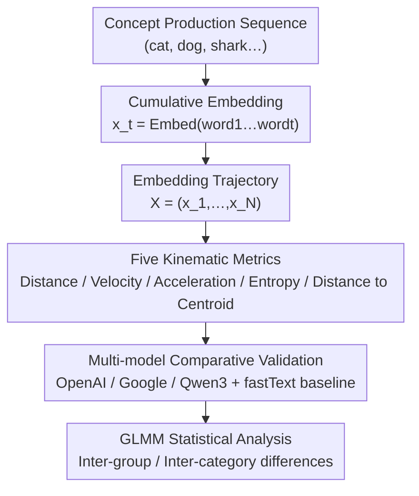

# Characterizing Human Semantic Navigation in Concept Production as Trajectories in Embedding Space

**Conference**: ICLR2026  
**arXiv**: [2602.05971](https://arxiv.org/abs/2602.05971)  
**Code**: [https://github.com/jesuinovieira/semtraj-iclr2026](https://github.com/jesuinovieira/semtraj-iclr2026)  
**Area**: Medical Imaging  
**Keywords**: semantic navigation, embedding trajectory, cognitive modeling, verbal fluency, neurodegenerative disease

## TL;DR
The authors propose modeling human concept production as cumulative trajectories in Transformer embedding spaces, defining five kinematic metrics (distance, velocity, acceleration, entropy, and distance to centroid). This framework successfully distinguishes clinical groups and concept categories across four datasets (three languages; covering neurodegenerative diseases, swear word fluency, and property listing), with results showing high consistency across different embedding models.

## Background & Motivation

**Background**: Human semantic retrieval is modeled in cognitive science as a "foraging" process in semantic space, balancing exploitation (clustering) and exploration (switching). Traditional methods use a clustering/switching dichotomy to analyze data from verbal fluency tasks.

**Limitations of Prior Work**: (a) Clustering/switching analysis relies on time-consuming manual annotation and heterogeneous processing pipelines, making it incomparable across studies; (b) Static word embeddings (e.g., fastText) ignore the cumulative nature of semantic retrieval—the semantics of each word are influenced by preceding words; (c) Traditional analyses only provide coarse-grained classifications (clustering vs. switching), lacking quantitative step-by-step dynamics.

**Key Challenge**: Semantic retrieval is a history-dependent dynamic process (requiring working memory to inhibit previously mentioned words), but existing NLP analysis methods embed each word independently, losing sequential dependencies.

**Goal**: Establish a trajectory analysis framework based on cumulative embeddings to quantify the step-by-step dynamics of human semantic navigation using physical kinematic metrics.

**Key Insight**: Treat concept production sequences as trajectories in embedding space, where the embedding at each step is a cumulative encoding of all previously mentioned words. Characteristics of trajectories are represented using concepts borrowed from physics, such as distance, velocity, and acceleration.

**Core Idea**: Use cumulative Transformer embeddings to model semantic retrieval as motion trajectories in high-dimensional space, enabling automated, cross-lingual semantic navigation analysis through kinematic metrics.

## Method

### Overall Architecture
The objective is to transform the "word-by-word" semantic retrieval process in verbal fluency tasks into a quantifiable, cross-linguistically comparable trajectory to automatically distinguish clinical groups and concept categories. The pipeline operates as follows: after obtaining a participant’s concept production sequence (e.g., "cat, dog, shark…"), **cumulative encoding** is performed using a Transformer text embedding model—the embedding $x_t$ at step $t$ encodes the "concatenation of words 1 to $t$" rather than a single word. Consequently, the embedding sequence $X=(x_1,\ldots,x_N)$ naturally incorporates history, forming a trajectory in semantic space. **Five kinematic metrics** (distance, velocity, acceleration, entropy, and distance to centroid) are calculated on this trajectory to upgrade the coarse "clustering vs. switching" labels to continuous dynamic features. The same set of metrics is calculated in parallel across **multiple embedding models for consistency comparison** to confirm that the captured features represent cognitive structures rather than model-specific geometric artifacts. Finally, a GLMM statistical model is used to analyze differences in these metrics between groups and categories.

### Key Designs

**1. Cumulative Embeddings: Encoding sequential dependency into each step**

Static word embeddings (e.g., fastText) encode each word independently, losing the cumulative nature of semantic retrieval. Cognitive science has long recognized that words already spoken influence subsequent retrieval through working memory and inhibitory control. Cumulative embeddings replicate this mechanism: the embedding $x_t$ at step $t$ is not an independent vector for the $t$-th word, but an overall embedding of the entire concatenation "word 1 word 2 … word t". For instance, if a participant says "cat dog", $x_2$ encodes the phrase "cat dog" rather than "dog" alone. Thus, every step naturally carries its prefix history, and sequential dependency is embedded within the vector itself, restoring the "history-dependent retrieval" cognitive fact without additional modeling.

**2. Five Kinematic Metrics: Quantifying step-by-step dynamics as readable physical quantities**

With the cumulative embedding sequence $X=(x_1,\ldots,x_N)$ serving as a trajectory in semantic space, the paper borrows five quantities from physical kinematics to characterize it, ranging from local jumps to global dispersion:

- **Distance to Next**: The cosine distance between adjacent embeddings, quantifying the magnitude of each "semantic jump."
- **Velocity** $\mathbf{v}_t = \mathbf{x}_{t+1} - \mathbf{x}_t$: The vector difference retaining direction, indicating not only how far the jump is but also the direction.
- **Acceleration** $\mathbf{a}_t = \mathbf{v}_{t+1} - \mathbf{v}_t$: The change in velocity, reflecting the stability of the search strategy; low acceleration corresponds to stable clustering, while high acceleration indicates frequent switching.
- **Entropy**: Calculated by binarizing the distance sequence by the median (1 if above median, 0 if below) and computing the Shannon entropy to measure the predictability of the search process.
- **Distance to Centroid**: The distance of each embedding to the centroid of all embeddings of the participant, measuring the global dispersion of the search.

The first three metrics capture local step-by-step dynamics (distance, direction, stability), while the latter two complement them from the perspectives of predictability and global spread. Together, they upgrade the traditional "clustering vs. switching" binary labels into continuous, quantifiable trajectory features.

**3. Multi-model Comparative Validation: Confirming features are cognitive phenomena, not model artifacts**

Trajectories calculated using a single embedding model cannot rule out the possibility that conclusions are merely byproducts of that model’s geometric bias. Therefore, the paper runs OpenAI `text-embedding-3-large`, Google `text-embedding-004`, and `Qwen3-Embedding-0.6B` Transformer models in parallel, with fastText as a static baseline, comparing the correlation of trajectory metrics across models. The logic is straightforward: if models with different training pipelines (causal vs. bidirectional attention) exhibit high consistency in trajectory metrics, then they are capturing real cognitive structures rather than model-specific artifacts. Conversely, if a metric is inconsistent across models, it reveals a dependence on model geometry (as seen later with distance to centroid).

### Statistical Analysis
Generalized Linear Mixed Models (GLMM) were utilized, with participants and concepts as random effects and Tukey HSD correction for multiple comparisons. Distance, entropy, velocity, and acceleration were fitted to log-normal distributions, while distance to centroid was fitted to a Gaussian distribution.

## Key Experimental Results

### Main Results (Inter-group/category differences across 4 datasets)

| Dataset | Comparison | Distance to Next | Velocity | Entropy | Distance to Centroid |
|---------|------------|------------------|----------|---------|----------------------|
| **Neurodegenerative** | HC vs PD/bvFTD | HC **Lower** | HC **Lower** | HC **Lower** | HC **Higher** |
| **Swear Word Fluency** | Animals vs Swear | Swear **Highest** | Swear **Highest** | Swear **Highest** | Swear **Lowest** |
| **Italian** | Bird vs Other Categories | Bird **Highest** | Bird **Highest** | Selective differences | Partially Higher/Lower |
| **German** | Bird vs Other Categories | Bird **Highest** | Bird **Highest** | Selective differences | Different from Italian |

### Ablation Study (Cross-model consistency - Pearson Correlation)

| Metric | OpenAI vs Google | OpenAI vs Qwen3 | Description |
|--------|------------------|-----------------|-------------|
| Velocity | >0.9 | >0.9 | High consistency in local dynamics |
| Acceleration | >0.9 | >0.9 | High consistency in local dynamics |
| Entropy | ~1.0 | ~1.0 | Most stable based on ranking |
| Distance to Centroid | 0.3-0.6 | 0.3-0.6 | Least consistent; dependent on model geometry |

### Key Findings
- **Kinematic Signatures of Neurodegenerative Diseases**: PD and bvFTD patients exhibit higher velocity, acceleration, and entropy (disordered, unpredictable search) but lower distance to centroid (restricted search space)—consistent with "disordered searching within a smaller space" caused by executive dysfunction.
- **Unique Semantic Topology of Swear Words**: Swear words form compact but highly variable clusters in embedding space—distance to centroid is minimal (compact space) while distance, velocity, acceleration, and entropy are highest (irregular retrieval path).
- **Cross-linguistic Differences Reveal Cultural Encoding**: Italian and German use the same protocols but show different category effect sizes, suggesting that semantic organization is influenced by language/culture, and these differences can be captured by trajectory metrics.
- **High Consistency Across Embedding Models**: Models with different training pipelines (causal/bidirectional attention) exhibit high consistency in local trajectory dynamics ($r > 0.9$), but vary in global geometry (distance to centroid). This suggests that local semantic structures are shared across models.

## Highlights & Insights
- **Physics-Inspired Cognitive Metrics**: Mapping physical kinematics (velocity, acceleration) directly to semantic navigation is conceptually elegant, allowing cognitive scientists to describe semantic search using intuitive physical metaphors.
- **Complementarity of Cumulative vs. Non-cumulative Embeddings**: Cumulative embeddings perform better on long sequences (capturing historical dependencies), whereas non-cumulative might be superior for short sequences (insufficient context), providing a practical selection guide.
- **Model Sensitivity of Distance to Centroid**: The distance to centroid showed the lowest consistency across models. This can be exploited to investigate how different models organize global semantic structures, serving as a tool for comparing LLM semantic spaces.
- **Extensibility to LLM Evaluation**: The framework can be directly applied to analyze semantic navigation patterns in LLM-generated text, offering a quantitative comparison between human and AI semantic search.

## Limitations & Future Work
- **Euclidean Dynamics Assumption**: Using Euclidean distance/derivatives in high-dimensional, anisotropic embedding spaces is a simplification. Non-Euclidean geometries (e.g., hyperbolic space) might be more suitable.
- **Lack of Timestamps**: The datasets lacks the time of production for each word; all steps are assumed to be at equal intervals. Data with timestamps could allow for the calculation of true velocity/acceleration.
- **Limited to Fluency/Property Listing Tasks**: The scope of scenarios is limited. More complex language production tasks like free narration or dialogue require further validation.
- **Potential Training Data Overlap**: Training data for Transformer models might include similar semantic association knowledge, which could artificially enhance the discriminative power of cumulative embeddings.

## Related Work & Insights
- **vs. Traditional Clustering/Switching Analysis**: Traditional methods require manual annotation of sub-category boundaries. This framework is fully automated and provides continuous step-by-step dynamics rather than binary classification.
- **vs. Linz et al. (2017) Word Embedding Analysis**: They used static word2vec to analyze verbal fluency. This paper upgrades to cumulative Transformer embeddings plus kinematic metrics, significantly increasing information density.
- **vs. Nour et al. Schizophrenia Language Analysis**: They also used embedding trajectories to analyze mental disorders. This work systematizes the metric system and verifies robustness across models and languages.

## Rating
- Novelty: ⭐⭐⭐⭐ The cumulative embedding + kinematic metric framework is novel; the physics-cognitive analogy is elegant.
- Experimental Thoroughness: ⭐⭐⭐⭐ 4 datasets × 3 languages × 3 embedding models + 1 baseline, with rigorous statistics (GLMM + Tukey), though predictive task validation is missing.
- Writing Quality: ⭐⭐⭐⭐ The narrative bridging cognitive science and NLP is clear, though some results are presented at length.
- Value: ⭐⭐⭐⭐ Provides an automated analysis tool for cognitive science with potential value for clinical diagnostics.

<!-- RELATED:START -->

## Related Papers

- [\[CVPR 2026\] Diffusion MRI Transformer with a Diffusion Space Rotary Positional Embedding (D-RoPE)](../../CVPR2026/medical_imaging/diffusion_mri_transformer_with_a_diffusion_space_rotary_positional_embedding_d-r.md)
- [\[ICLR 2026\] BioTamperNet: Affinity-Guided State-Space Model Detecting Tampered Biomedical Images](biotampernet_affinity-guided_state-space_model_detecting_tampered_biomedical_ima.md)
- [\[ICLR 2026\] SEED: Towards More Accurate Semantic Evaluation for Visual Brain Decoding](seed_towards_more_accurate_semantic_evaluation_for_visual_brain_decoding.md)
- [\[ICLR 2026\] Bridging Radiology and Pathology Foundation Models via Concept-Based Multimodal Co-Adaptation](bridging_radiology_and_pathology_foundation_models_via_concept-based_multimodal_.md)
- [\[AAAI 2026\] Human-in-the-Loop Interactive Report Generation for Chronic Disease Adherence](../../AAAI2026/medical_imaging/human-in-the-loop_interactive_report_generation_for_chronic_disease_adherence.md)

<!-- RELATED:END -->
