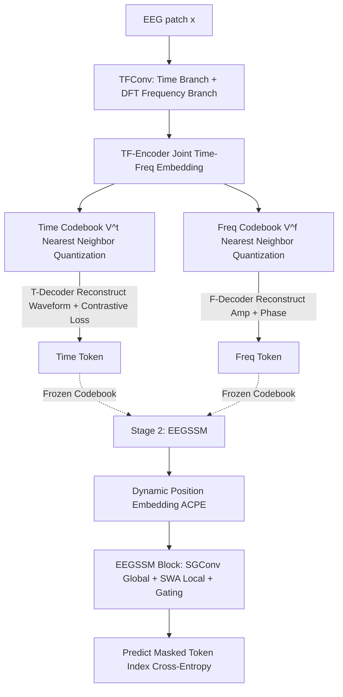

# CodeBrain: Bridging Decoupled Tokenizer and Multi-Scale Architecture for EEG Foundation Model

**Conference**: ICLR 2026  
**OpenReview**: [https://openreview.net/forum?id=msJgEkjwh5](https://openreview.net/forum?id=msJgEkjwh5)  
**Code**: [https://github.com/jingyingma01/CodeBrain](https://github.com/jingyingma01/CodeBrain)  
**Area**: EEG Foundation Model / Neuroscience and Cognition / Time-series Representation Learning  
**Keywords**: EEG foundation model, decoupled tokenizer, time-frequency discretization, state space model, small-world topology, self-supervised pre-training  

## TL;DR
CodeBrain develops an EEG foundation model using a "time-frequency dual-codebook decoupled tokenizer + multi-scale architecture with parallel global structural convolutional SSM and sliding window attention." After pre-training on the largest public EEG corpus, it consistently outperforms existing EEG foundation models across 10 datasets in 8 task categories and provides codebook-level interpretability.

## Background & Motivation
- **Background**: Electroencephalogram (EEG) offers high temporal resolution, covering applications such as sleep staging, emotion recognition, and motor imagery. To move beyond the inefficient paradigm of "training small models from scratch for every task," EEG Foundation Models (EFMs) have emerged, generally following the masked self-supervised paradigm of NLP: segmenting signals into patches, encoding them, and reconstructing masked parts. Due to high noise in raw signals, recent works introduce codebook quantization (VQ-VAE style) to abstract low-level fluctuations into robust discrete representations.
- **Limitations of Prior Work 1 (Tokenizer does not decouple heterogeneous signals)**: Existing EFMs directly adopt single-codebook VQ-VAEs designed for images. However, EEG is **time-frequency heterogeneous**—the time domain reflects transient neural events, while the frequency domain reflects rhythms. A patch aligned in one domain may diverge in another. Mixed codebooks conflate domain-specific patterns, weakening representation capability and making tokens difficult to align with clinically interpretable neural events or spectral rhythms.
- **Limitations of Prior Work 2 (Inefficient global dependency modeling)**: The brain follows a **small-world topology**—sparse global connections combined with strong local correlations. Most EFMs use Transformers with fully connected self-attention. This "over-connectivity" is inconsistent with the brain's sparse structure and fails to capture global dependencies efficiently due to quadratic complexity relative to sequence length.
- **Limitations of Prior Work 3 (Ignoring intra-patch local dependencies)**: EEG contains rich local waveforms (e.g., sleep transients) within short windows, but most EFMs compress each patch into a single token and perform attention only at the patch level, losing intra-patch local dynamics.
- **Goal**: Construct an EEG foundation model featuring **domain-specific interpretability** and **brain-inspired multi-scale efficient modeling**.
- **Core Idea**: A **"Decoupling + Multi-scale" dual strategy**—using time-frequency dual codebooks to split heterogeneous signals into two sets of discrete tokens (quadratic expansion of representation space + interpretability), combined with an architecture of "global structural convolutional SSM + local sliding window attention" to match the brain's sparse global/strong local topology.

## Method

### Overall Architecture
CodeBrain is a two-stage pre-training framework. **Stage 1 (TFDual-Tokenizer)**: Discretizes each normalized EEG patch into time-domain and frequency-domain tokens, using two independent codebooks to learn domain-specific discrete representations. **Stage 2 (EEGSSM)**: Conducts masked self-supervision in the token space—randomly masking patches and using a multi-scale backbone of structural convolutional SSM (global) and sliding window attention (local) to predict the indices of masked patches in the Stage 1 codebooks.

### Key Designs

**1. TFDual-Tokenizer: Time-Frequency Decoupled Dual-Codebook Discretization** Splitting heterogeneous EEG into two token streams is the starting point. A shared neural encoder performs DFT on patches for frequency representation. Time-domain $x_i$ and frequency-domain $x_i[k]$ pass through parallel TFConv (Conv+BN+ReLU) and are concatenated into time-frequency embeddings $e_i^p = \text{Concat}\{e_i^t, e_i^f\}$. These enter a Transformer encoder after adding position embeddings to obtain $\tilde{e}_i$. Two independent codebooks then perform nearest neighbor quantization: $p_{ti}=\arg\min_j\|\tilde{e}_i - v_{tj}\|_2$ and $p_{fi}=\arg\min_j\|\tilde{e}_i - v_{fj}\|_2$. Proposition 2.1 argues that "decoupled codebooks are not weaker than joint codebooks," and with $K$ codewords each, the representation space expands quadratically to approximately $K^2$, enhancing discriminative power while allowing tokens to align with neural events or spectral rhythms.

**2. Domain-Specific Reconstruction Supervision**: The two codebooks are trained with different objectives matching their physical meanings. The frequency branch predicts amplitude $A_i$ and phase $\phi_i$ (calculated from DFT real/imaginary parts, z-score normalized) from code embeddings using MSE: $\mathcal{L}_i^f = \|y_i^A - A_i\|_2^2 + \|y_i^P - \phi_i\|_2^2$. For the time branch, direct reconstruction often fails to converge; thus, a SimCLR contrastive loss is introduced: splitting a signal segment into halves and encouraging similarity between representations of the same segment while penalizing similarity between different segments $\mathcal{L}_m^{CL} = -\log\frac{\exp(\text{sim}(e_{m1}^h,e_{m2}^h)/\tau)}{\sum_k \mathbb{1}_{[k\neq i]}\exp(\text{sim}(e_{mi}^h,e_{sk}^h)/\tau)}$, combined with raw waveform reconstruction. The total tokenizer loss includes contrastive, time-frequency reconstruction, and codebook/commitment losses (with stop-gradient).

**3. EEGSSM Multi-Scale Backbone: Global SGConv + Local SWA + Gating**: Stage 2 uses structural convolutional SSM to match the brain's "sparse global" structure. SGConv expresses the SSM as a convolution in DFT form $y = F_N^{-1} D_k F_N u$, calculated in $O(N\log N)$ via FFT. It uses sparse parameterization + kernel decay (decay coefficient $\alpha=0.5$) to decompose the convolution kernel into multiple upsampled sub-kernels $k_i = \alpha^i \,\text{Upsample}(w_i)$, achieving a global receptive field more efficiently than S4. In parallel, Sliding Window Attention (SWA) performs attention within fixed small windows to capture intra-patch transient events, reducing the quadratic complexity of global self-attention to linear. Both outputs are fused via WaveNet-style gating $z = \tanh(W_f \cdot \text{Concat}(y_{sg}, y_{swa})) \odot \sigma(W_g \cdot \text{Concat}(y_{sg}, y_{swa}))$ to suppress irrelevant features and stabilize deep training.

**4. Dynamic Position Embedding + Masked Token Prediction**: To adapt to different electrode layouts, dynamic position embeddings are learned via a depthwise separable 2D convolution with an asymmetric kernel (ACPE design), enabling the model to learn relative channel structures and generalize to heterogeneous channels. Pre-training follows the MAE pattern: masking patches with a Bernoulli distribution at ratio $r$ (0.5), where the model predicts indices in the TFDual-Tokenizer codebooks using cross-entropy $\mathcal{L}_p = -\sum_j \sum_{n\in\{m_i=1\}} p(v_{nj}|x_{nj})$, injecting interpretable discrete semantics into representation learning.

## Key Experimental Results

### Main Results
Pre-trained on TUH EEG Corpus (~9,246 hours, 1.1 million samples). Results report Cohen's Kappa / Weighted F1 / Balanced Acc for multi-class tasks, and AUROC / PRAUC / Balanced Acc for binary tasks, averaged over 5 seeds.

| Dataset (Task) | Metric | Prev. SOTA (CBraMod) | CodeBrain |
|---|---|---|---|
| FACED (9-class Emotion) | Kappa | 0.5041 | **0.5406** |
| SEED-V (5-class Emotion) | Kappa | 0.2569 | **0.2735** |
| ISRUC S3 (5-class Sleep) | Weighted F1 | 0.8056 | **0.8202** |
| BCIC2020-T3 (5-class Imagery) | Kappa | 0.4216 | **0.5127** |
| Mental Arithmetic (2-class) | AUROC | 0.7905 | **0.8707** |
| CHB-MIT (2-class Seizure) | PRAUC | 0.3689 | **0.4377** |

Improvements are particularly significant in imagined speech (Kappa 0.42→0.51) and mental stress detection (AUROC 0.79→0.87).

### Ablation Study
Based on Cohen's Kappa for FACED (9-class):

| Variant | Kappa |
|---|---|
| Full CodeBrain (Dual Codebook) | **0.5406** |
| Time-only Codebook | 0.4618 |
| Freq-only Codebook | 0.5006 |
| Mixed (Single Codebook) | 0.4676 |
| w/o Contrastive Loss (CL) | 0.5222 |
| w/o SWA (Local Attention) | 0.5192 |
| w/o SGConv (Global) | 0.1936 |
| w/o Gate | 0.2578 |

### Key Findings
- **Decoupled Codebook > Mixed Codebook**: Dual (0.5406) is significantly higher than Mixed (0.4676), confirming time-frequency decoupling gains. Neither single domain matches the dual setup.
- **Global SGConv is Essential**: Removing SGConv causes performance to collapse to 0.1936 with massive variance, indicating structural convolutional SSMs provide indispensable global modeling. Gating is similarly critical (dropping to 0.2578).
- **Local SWA and CL provide Incremental Gains**: Each contributes ~2 percentage points to Kappa, validating the design motives of capturing intra-patch local dependencies and stabilizing time-domain training.
- The paper also includes scaling-law analysis and qualitative/quantitative validation of codebook interpretability (mapping tokens to neural events/spectral rhythms).

## Highlights & Insights
- **Heterogeneity as an Architectural Principle**: Rather than simply stacking modules, the authors identify EEG time-frequency heterogeneity and brain small-world topology, mapping them directly to the tokenizer (decoupling) and backbone (sparse global + strong local).
- **Token-Level Interpretability**: Dual codebooks allow discrete tokens to be associated with clinical neural events or rhythms, a rare form of "representation-level interpretability" in EFMs.
- **Efficient SSM Alternative to Full Attention**: The combination of SGConv ($O(N\log N)$) and linear SWA provides a backbone better suited to sparse topologies than pure Transformers for long-sequence physiological signals.

## Limitations & Future Work
- Domain-specific interpretability relies on qualitative visualization and propositional proof; mappings between tokens and specific clinical events remain somewhat heuristic and lack large-scale annotated validation.
- The cost of two-stage training (10h for tokenizer + 24h for backbone on multiple A100s) is high; end-to-end single-stage training is a potential direction.
- Downstream tasks use a three-layer MLP for channel aggregation with full fine-tuning; representation quality under few-shot or linear probing is not fully explored.
- Evaluation is limited to scalp 19-channel, 200Hz-downsampled settings; generalization to high-density/intracranial EEG or non-standard layouts remains to be verified.

## Related Work & Insights
- **EFM Lineage**: BENDR (contrastive), BIOT (continuous patch tokens), LaBraM (VQ discrete neural tokens), EEGPT/CBraMod (masked reconstruction). CodeBrain evolves the "discrete tokenization" path from a single codebook to time-frequency dual codebooks.
- **State Space Models**: Structural SSMs like SGConv/S4 provide quasi-linear global modeling; this work introduces them to EEG and fuses them with local attention.
- **Insight**: For other **heterogeneous multi-modal physiological signals** (e.g., those containing both time-frequency and multi-lead structures), the paradigm of "decoupling codebooks by physical domain + selecting backbones based on domain topology priors" is a transferable design pattern.

## Rating
- **Novelty**: ⭐⭐⭐⭐ The combination of time-frequency decoupled dual codebooks and SSM/SWA multi-scale backbone is a novel, well-motivated design in the EFM space, providing representation-level interpretability for the first time.
- **Experimental Thoroughness**: ⭐⭐⭐⭐ Covers 10 datasets across 8 tasks with 5 seeds, detailed ablations, scaling-law, and interpretability analysis. Linear probing/few-shot results are less comprehensive.
- **Writing Quality**: ⭐⭐⭐⭐ Clear mapping between the three pain points and three designs, with complete formulas and diagrams.
- **Value**: ⭐⭐⭐⭐ achieves stable SOTA on the largest public EEG corpus and open-sources weights, providing high utility to the EEG foundation model community.

<!-- RELATED:START -->

## Related Papers

- [\[ICLR 2026\] Bridging Radiology and Pathology Foundation Models via Concept-Based Multimodal Co-Adaptation](bridging_radiology_and_pathology_foundation_models_via_concept-based_multimodal_.md)
- [\[ICLR 2026\] BioX-Bridge: Model Bridging for Unsupervised Cross-Modal Knowledge Transfer across Biosignals](biox-bridge_model_bridging_for_unsupervised_cross-modal_knowledge_transfer_acros.md)
- [\[NeurIPS 2025\] NeurIPT: Foundation Model for Neural Interfaces](../../NeurIPS2025/medical_imaging/neuript_foundation_model_for_neural_interfaces.md)
- [\[NeurIPS 2025\] BrainOmni: A Brain Foundation Model for Unified EEG and MEG Signals](../../NeurIPS2025/medical_imaging/brainomni_a_brain_foundation_model_for_unified_eeg_and_meg_signals.md)
- [\[ICLR 2026\] MindMix: A Multimodal Foundation Model for Auditory Perception Decoding via Deep Neural-Acoustic Alignment](mindmix_a_multimodal_foundation_model_for_auditory_perception_decoding_via_deep_.md)

<!-- RELATED:END -->
