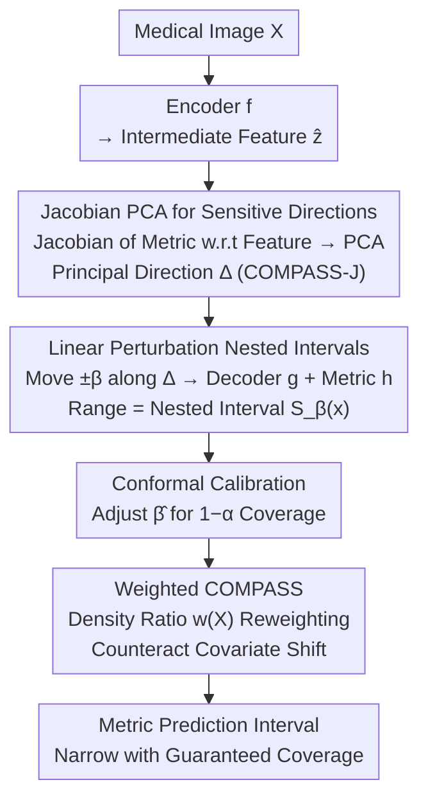

# COMPASS: Robust Feature Conformal Prediction for Medical Segmentation Metrics

- **Conference**: ICLR2026
- **arXiv**: [2509.22240](https://arxiv.org/abs/2509.22240)
- **Code**: [GitHub](https://github.com/matthewyccheung/compass)
- **Area**: Medical Image Segmentation / Uncertainty Quantification
- **Keywords**: conformal prediction, medical segmentation, uncertainty quantification, feature perturbation, covariate shift

## TL;DR

COMPASS constructs conformal prediction intervals by applying linear perturbations in the intermediate feature space of segmentation networks along **low-dimensional subspaces most sensitive to the target metric**. It achieves significantly narrower prediction intervals than traditional CP methods across four medical segmentation tasks while maintaining valid coverage.

## Background & Motivation

**Background**: In medical image segmentation, clinical value often resides not in pixel-level accuracy, but in **downstream metrics** derived from segmentation (e.g., radiomic indicators such as organ area/volume). Conformal Prediction (CP) is a distribution-free uncertainty quantification framework that provides statistical guarantees for predictions.

**Limitations of Prior Work**: (1) Pixel-level CP methods (e.g., generating pixel-level confidence sets) provide guarantees that are misaligned with actual clinical scalar metrics; (2) Treating the segmentation-metric pipeline as a black box for direct Split CP on output scalars results in **low efficiency** (excessively wide intervals) as it fails to leverage the inductive biases of neural networks.

**Key Challenge**: Feature CP (FCP) has demonstrated that working in the semantic feature space can generate tighter intervals. However, FCP requires solving complex adversarial optimization problems in high-dimensional feature spaces, which is **computationally infeasible** for the feature dimensions of typical CNNs/Transformers.

**Goal**: Design a computationally feasible Feature CP method that utilizes intermediate representations of segmentation networks to generate **efficient** (narrow) and **effective** (guaranteed coverage) prediction intervals for downstream clinical metrics.

**Key Insight**: Instead of searching the full-dimensional feature space, one can utilize the **Jacobian gradient of the target metric with respect to the features** to identify a low-dimensional sensitive subspace and perturb only along that direction.

**Core Idea**: Compute the Jacobian of the target metric with respect to the intermediate layer features of the segmentation network. Extract principal directions via PCA to serve as perturbation directions. Linear perturbation of features along these directions monotonically changes the metric—thus, only two forward passes (positive/negative endpoints) are required to efficiently construct nested prediction intervals.

## Method

### Overall Architecture

COMPASS addresses the following problem: given a medical image and a trained segmentation network, the true clinical concern is the scalar metric derived from the segmentation (e.g., organ area). How can one provide a prediction interval for this metric that is both **narrow and provides coverage guarantees**? It treats the segmentation network as three concatenated stages: an encoder $f: \mathcal{X} \to \mathcal{Z}$ mapping the image to intermediate features, a decoder $g: \mathcal{Z} \to \mathcal{S}$ recovering the segmentation, and a metric function $h: \mathcal{S} \to \mathbb{R}$ calculating the scalar. The core mechanism is "perturbing the feature slightly in the feature space and observing how the metric changes": first, calculate the perturbation direction $\Delta$ to which the metric is most sensitive for the intermediate feature $\hat{z}$; then, shift the feature along this direction by $\pm\beta$, propagate through $g$ and $h$, and the resulting range of the metric forms the prediction interval $S_\beta(x) = [\min_{b \in [-\beta, \beta]} m_x(b),\, \max_{b \in [-\beta, \beta]} m_x(b)]$. Finally, use conformal calibration to tune $\beta$ to the target coverage, applying density ratio weighting if calibration and test distributions shift.

### Key Designs

**1. Jacobian PCA for Sensitive Directions: Compressing Full-Dimensional Search to a Single Line (COMPASS-J)**

FCP is often infeasible due to adversarial optimization in high-dimensional feature spaces. COMPASS shifts this perspective: instead of searching in all directions, it focuses only on the direction with the maximum impact on the target metric. Specifically, for each sample $i$ in the training set, the Jacobian $J_i = \frac{d\, h(g(\hat{z}_i))}{d\hat{z}_i}$ of the target metric $\hat{y}$ with respect to the feature $\hat{z}_i$ is computed and summed over spatial dimensions to form a channel-level vector $\mathcal{J}_i$. PCA is performed on these $\mathcal{J}_i$ across the training set to identify the top $L$ principal components $V_L$. The perturbation direction for any new sample is the projection of its Jacobian onto these principal directions, normalized:

$$\mathbf{d}_i = V_L V_L^T \mathcal{J}_i, \quad \Delta_i = \mathbf{d}_i / \|\mathbf{d}_i\|_2$$

Restricting to principal directions is justified because the first principal component typically explains $>90\%$ of the metric variance (verified experimentally). Crucially, perturbations along this principal direction exhibit **monotonic metric changes** across four datasets—the metric either only increases or only decreases with the perturbation magnitude. Monotonicity implies that the prediction interval does not require scanning the entire range $[-\beta, \beta]$; evaluating only the two endpoints yields the extrema, simplifying high-dimensional optimization to two forward passes.

**2. Natural Nesting of Linear Perturbations: Statistical Guarantees Inherited**

For CP to provide statistical guarantees, the prediction sets must satisfy nestedness—as the interval parameter increases, the old interval must be contained within the new one. In non-linear deep feature spaces, nestedness is not trivially satisfied. COMPASS bypasses this via a conservative envelope construction: the prediction set is defined as the range of the metric over the perturbation interval $S_\beta(x) = [\min m_x(b), \max m_x(b)]_{b \in [-\beta, \beta]}$. Since $\beta_1 \leq \beta_2 \Rightarrow [-\beta_1, \beta_1] \subseteq [-\beta_2, \beta_2]$, taking the extrema over a larger perturbation range can only widen the interval, ensuring $S_{\beta_1} \subseteq S_{\beta_2}$ by definition. With nestedness and the exchangeability condition of standard CP, marginal coverage is directly guaranteed:

$$\mathbb{P}(Y_{n+1} \in S_{\hat{\beta}}(X_{n+1}) | D_{\text{tr}}) \geq 1 - \alpha$$

**3. Weighted COMPASS: Counteracting Distribution Shift with Density Ratios**

When calibration and test distributions differ (covariate shift), equal-weighted quantiles become biased, and coverage fails. COMPASS trains an auxiliary classifier to distinguish calibration samples from test samples, estimating the density ratio $w(X_i) = p_{\text{test}}(X_i) / p_{\text{cal}}(X_i)$. Weighted conformity quantiles then replace equal-weighted ones to recover target coverage. The key lies in the input to the classifier: using deep features or Jacobians rather than class labels or logits—the former carry richer metric-sensitive signals and are more sensitive to shifts, thereby stabilizing coverage across different shift directions in experiments.

### Loss & Training

COMPASS does not modify the training of the segmentation model. The area metric is obtained by summing soft sigmoid outputs of the logits (rendering it differentiable), which makes Jacobian computation feasible.

## Key Experimental Results

### Main Results: Interval Sizes for Different CP Methods (Pixels², Mean±Std, α=0.10)

| Dataset | COMPASS-J | COMPASS-L | E2E-CQR | Local CP | Output-CQR | SCP |
|--------|----------|----------|---------|----------|-----------|-----|
| H&E | **3160±336** | 3139±375 | 3433±293 | 4223±558 | 3879±369 | 3509±333 |
| Skin Lesion | **1179±53** | 1208±58 | 1351±75 | 2433±101 | 4581±36 | 1813±127 |
| Nodule | **2444±174** | 2510±180 | 2788±154 | 3311±133 | 5603±57 | 3076±200 |
| PolyP | **4056±293** | 4397±469 | 6184±616 | 5965±1011 | 4981±675 | 6237±564 |

> COMPASS-J produces the narrowest intervals across all datasets and $\alpha$ levels. Compared to SCP, the interval is reduced by **35%** on Skin Lesion and **35%** on PolyP.

### Ablation Study: Weighted CP Performance Under Distribution Shift (α=0.10)

| Method | H&E (hard shift) Coverage | Skin Lesion (easy shift) Coverage |
|------|----------------------|---------------------------|
| Unweighted SCP | ❌ Under-coverage | ✅ Over-coverage |
| Class-weighted SCP | ✅ | ❌ Under-coverage |
| COMPASS-L + Feature Weighting | ❌ Under-coverage | ✅ |
| COMPASS-J + Feature Weighting | ✅ **Narrowest** | ✅ **Narrowest** |
| COMPASS-J + Jacobian Weighting | ✅ **Narrowest** | ✅ **Narrowest** |

> Only COMPASS-J (with deep feature or Jacobian weighting) maintains target coverage across **both shift directions** while providing the narrowest intervals.

### Key Findings

1. **Universality of Monotonicity**: Perturbations along the COMPASS-J direction result in monotonic metric changes across all four datasets, validating the efficient endpoint algorithm.
2. **Compression Power-Law Relationship**: A sub-linear scaling (log-log slope <1) exists between the feature space score $R_{\text{COMPASS}}$ and the output space error $R_{\text{SCP}}$, systematically compressing tail distributions—the fundamental mechanism for tighter intervals.
3. **Deep Representations > Shallow**: COMPASS-J (deep features) consistently outperforms COMPASS-L (logits), as deep features provide richer signals sensitive to the metric.

## Highlights & Insights

- The core idea of "perturbing along sensitive subspaces" is elegantly simple: Jacobian → PCA → single line → two endpoints, reducing the infeasible optimization of FCP to just two forward passes.
- Empirical validation of monotonicity is critical—it is the prerequisite for the efficient algorithm and can be predicted by the variance explained by the first principal component of the Jacobian.
- The discovery of the compression power-law provides a deep explanation for the efficiency of COMPASS beyond mere empirical observation.
- The robustness of Weighted COMPASS under distribution shift has high practical value for clinical applications.

## Limitations & Future Work

- COMPASS performance depends on the quality of pre-trained model representations—if the feature-metric relationship is non-monotonic, it must revert to a full-scan algorithm.
- Weighted CP may suffer from inaccurate density ratio estimation under large distribution shifts where feature space overlap between calibration and test sets is insufficient.
- Only area metrics were validated; the applicability to more complex metrics like texture or shape remains to be explored.
- Validation was based on the U-Net architecture; optimal layer selection for Transformer-based architectures may differ.

## Related Work & Insights

- **Feature CP** (Teng et al., 2022): First showed that feature space CP yields tighter intervals, but adversarial search is infeasible.
- **Lambert et al. (2024)**: End-to-end CQR uses Tversky loss to train pixel-level bounds, optimizing a proxy objective rather than the target metric.
- **Split CP / CQR**: Standard output space methods, simple but produce wide intervals.
- **Insight**: The "Jacobian → PCA → Principal Direction Perturbation" paradigm of COMPASS can be generalized to uncertainty quantification for any differentiable metric (3D volume, shape indices, etc.).

## Rating

⭐⭐⭐⭐⭐ (5/5)

- **Novelty**: ⭐⭐⭐⭐⭐ — Elegantly solves the computational bottleneck of FCP through Jacobian PCA dimensionality reduction with solid theoretical and empirical grounding.
- **Experimental Thoroughness**: ⭐⭐⭐⭐⭐ — 4 datasets × 3 α levels × 6 baselines × 100 random splits, covering standard, distribution shift, and ablation settings.
- **Value**: ⭐⭐⭐⭐⭐ — Open-source code, plug-and-play, and direct value for clinical metric uncertainty quantification.
- **Writing Quality**: ⭐⭐⭐⭐ — Clear theoretical and experimental structure with intuitive illustrations.

<!-- RELATED:START -->

## Related Papers

- [\[AAAI 2026\] Small but Mighty: Dynamic Wavelet Expert-Guided Fine-Tuning of Large-Scale Models for Optical Remote Sensing Object Segmentation](../../AAAI2026/medical_imaging/small_but_mighty_dynamic_wavelet_expert-guided_fine-tuning_of_large-scale_models.md)
- [\[ICLR 2026\] SEED: Towards More Accurate Semantic Evaluation for Visual Brain Decoding](seed_towards_more_accurate_semantic_evaluation_for_visual_brain_decoding.md)
- [\[AAAI 2026\] GuideGen: A Text-Guided Framework for Paired Full-Torso Anatomy and CT Volume Generation](../../AAAI2026/medical_imaging/guidegen_a_text-guided_framework_for_paired_full-torso_anatomy_and_ct_volume_gen.md)
- [\[AAAI 2026\] FaNe: Towards Fine-Grained Cross-Modal Contrast with False-Negative Reduction and Text-Conditioned Sparse Attention](../../AAAI2026/medical_imaging/fane_towards_fine-grained_cross-modal_contrast_with_false-negative_reduction_and.md)
- [\[CVPR 2025\] Multi-Resolution Pathology-Language Pre-training Model with Text-Guided Visual Representation](../../CVPR2025/medical_imaging/multi-resolution_pathology-language_pre-training_model_with_text-guided_visual_r.md)

<!-- RELATED:END -->
