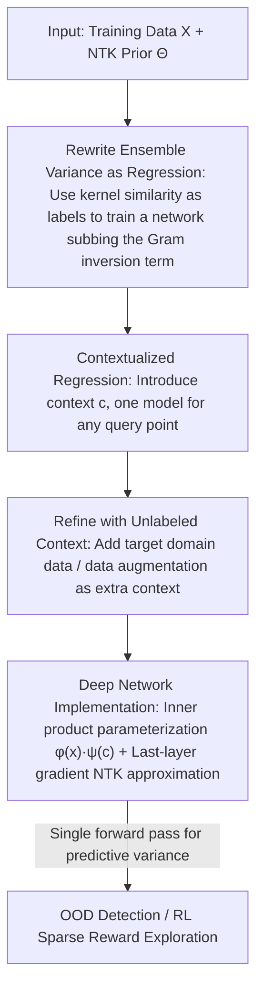

# Contextual Similarity Distillation: Ensemble Uncertainties with a Single Model

**Conference**: ICLR 2026  
**OpenReview**: [https://openreview.net/forum?id=arms7s9dDK](https://openreview.net/forum?id=arms7s9dDK)  
**Code**: https://github.com/anyboby/contextual-similarity-distillation (Available, includes VizDoom reproduction repository)  
**Area**: Reinforcement Learning / Uncertainty Quantization  
**Keywords**: Epistemic Uncertainty, Deep Ensembles, Neural Tangent Kernel, Single-model Estimation, Sparse Reward Exploration

## TL;DR
Estimates the predictive variance of an "infinite randomly initialized ensemble" using a single model and a single forward pass. By reformulating the ensemble variance as a supervised regression problem with kernel similarity labels, the method avoids training actual ensembles or inverting the Gram matrix. It provides uncertainty estimates comparable to or better than Deep Ensembles, validated on OOD detection and sparse reward RL exploration.

## Background & Motivation
**Background**: Uncertainty quantization is a core requirement for deep learning, particularly reinforcement learning. It drives "optimism toward uncertain actions" during exploration, suppresses overestimation in offline RL, and enables outlier detection in safety/medical diagnosis. Currently, the most reliable practical solution is **deep ensembles**: training multiple networks with independent random initializations and using their predictive variance on the same input as epistemic uncertainty. Full Bayesian inference is theoretically superior but suffers from coarse approximations or expensive sampling.

**Limitations of Prior Work**: While deep ensembles are cheaper than full Bayesian methods, they still require **training and storing multiple networks**. This overhead becomes unsustainable as model parameters increase. Theoretically, the variance of wide network ensembles has an analytical expression (NTK GP), but that expression requires inverting the training Gram matrix $\Theta(X,X)$—an operation infeasible for RL scenarios where sample sizes often reach hundreds of millions.

**Key Challenge**: There is a tension between reliable uncertainty (derived from ensemble diversity) and computational scalability (single model, single forward pass). Existing "single-model uncertainty" methods (e.g., RND or prediction error types) mostly lack a clear theoretical explanation equating them to ensemble/posterior variance and are used primarily empirically.

**Goal**: To directly estimate the predictive variance of an infinite randomly initialized ensemble using a single model, without actually training or evaluating any ensemble, while allowing the use of unlabeled data or data augmentation to further refine this estimate.

**Key Insight**: The authors start from the predictable training dynamics of wide networks. Neural Tangent Kernel (NTK) theory indicates that the training trajectory of an infinitely wide network under gradient descent can be analytically characterized by the NTK. An ensemble corresponds to an **NTK Gaussian Process (NTK GP)**, whose predictive variance has a closed-form solution. The key observation is that the "computationally difficult inversion term" in the closed-form variance can be reinterpreted as **the output of another supervised regression task trained to convergence**.

**Core Idea**: Reformulate "estimating ensemble variance" as "a regression problem using kernel similarity as labels." By training a single network to fit the "kernel similarity between training points and query points," its output upon convergence equals the difficult inversion term. Thus, Variance = Kernel Prior − Regression Output, obtainable in a single forward pass.

## Method

### Overall Architecture
The method is termed **Contextual Similarity Distillation (CSD)**. Its goal is to approximate the predictive variance of an infinite ensemble. Theoretical anchor: under the NTK regime, the predictive variance of an infinitely wide ensemble at test point $x$ is given by:

$$\mathbb{V}[f(x,\theta_\infty)] = \Theta(x,x) - \Theta(x,X)\Theta(X,X)^{-1}\Theta(X,x)$$

where $\Theta(\cdot,\cdot)$ is the NTK (representable as input similarity based on gradients) and $X$ is the training set. The first term $\Theta(x,x)$ is the "kernel prior uncertainty," while the second term involves the inverse Gram matrix $\Theta(X,X)^{-1}$, which is computationally prohibitive for large datasets.

The logic chain of CSD is: **①** First, in a simplified setting where the "query point is known," rewrite the inversion term as the output of a single network regression (Single-query version); **②** Introduce a context variable $c$ to upgrade "one model per query" to a "contextualized model for any query"; **③** This contextualized formulation naturally allows incorporating unlabeled context data (target domain data/augmentation) to refine variance estimation; **④** Finally, provide an efficient implementation on deep networks (inner-product parameterization + last-layer gradient approximation of NTK). At inference, input $x$ yields variance in a single forward pass for OOD detection or RL intrinsic rewards.

### Key Designs

**1. Rewriting Ensemble Variance as a Regression Problem**
The pain point is calculating $\Theta(X,X)^{-1}$. The key insight is as follows: if a test query point $x_t$ is known, one can construct a network $g$ (same architecture and initialization distribution as $f$) and solve a standard supervised regression. The **label function is the kernel similarity** $Y_{x_t}(X)=\Theta(X,x_t)$, representing how similar each training point $x_i$ is to the query point $x_t$. Under small initialization ($g(x,\tilde\theta_0)\approx 0$), the convergent output of $g$ is exactly:

$$g_{x_t}(x,\tilde\theta_\infty) = \Theta(x,X)\Theta(X,X)^{-1}\Theta(X,x_t)$$

This corresponds perfectly to the inversion term. Thus, ensemble variance is $\mathbb{V}[f(x_t)] = \Theta(x_t,x_t) - g_{x_t}(x_t,\tilde\theta_\infty)$. The brilliance lies in $g$ being trained via standard gradient descent without **explicit inversion or training ensembles**. This converts uncertainty estimation into a "regression problem predicting kernel similarity." The limitation is that $g$ depends on a specific $x_t$.

**2. Contextualized Regression: One Model for Any Query**
To make Design 1 practical, $g$ is upgraded to a **regression model with context variables** $g(x,c,\tilde\theta_t)$. The context $c$ determines which label function to use during training, constructing a family of label functions $Y_c(X)=\Theta(X,c)$ parameterized by $c$. For a set of context data $C=\{c_i\}$, the model is optimized to solve regression tasks for all contexts simultaneously. This effectively "stitches" together individual $g_{x_t}$ models along the $c$ dimension. For any query point $x$, evaluating with $c=x$ yields:

$$\mathbb{V}[f(x,\theta_\infty)] \approx \Theta(x,x) - g(x,x,\tilde\theta_\infty)$$

Here $g(x,x)$ reflects the "confidence" the ensemble gains by observing training data weighted by similarity to $x$. The cost is the requirement for $g$ to generalize to unseen contexts $c \notin C$.

**3. Refining Uncertainty with Unlabeled Context Data**
The contextualized formulation allows for the inclusion of **unlabeled context data** $C$ during training. Theoretically, if query points are known in advance, exact variance is obtainable. By including unlabeled target domain data as contexts during training, one obtains better uncertainty estimates for the domain of interest. This can be extended to use **data augmentation** to generate contexts. Unlike contrastive learning, CSD's augmentation **does not need to preserve semantic labels**. This leads to three variants: CSD (training set as context), CSD-Aug. (with augmentation), and CSD-OOD (using unlabeled data from the evaluation distribution).

**4. Efficient Implementation: Inner-product Parameterization + Last-layer Approximation**
For efficiency, the authors use two approximations. First, the contextualized model is **parameterized as an inner product** $g(x,c,\tilde\theta_\infty)=\phi(x,\tilde\theta_{\text{feat}})^\top\psi(c,\tilde\theta_{\text{ctxt}})$, effectively adding a "context-dependent last layer weight" $\psi(c)$. This allows the $N_D \times N_C$ matrix $g(X,C)$ to be computed in bulk. Second, they **approximate the NTK prior using only last-layer gradients**. For a dense last layer where $f(x,\theta_0)=\varphi(x)^\top\theta_0^L$, the kernel becomes $\Theta_L(x,x')=\varphi(x)^\top\varphi(x')$, using the inner product of second-to-last layer features.

### Loss & Training
The core training objective is a standard supervised squared loss regression:

$$\mathcal{L}(\tilde\theta_t) = \frac{1}{N}\sum_i^N \frac{1}{2}\big(g(x_i,c_i,\tilde\theta_t) - \Theta_L(x_i,c_i)\big)^2$$

where $(x_i,c_i)$ are sampled from the training set $X$ and context set $C$. Labels $\Theta_L$ are provided by the last-layer NTK approximation. The process fits standard gradient descent pipelines without multiple models or random forward sampling.

## Key Experimental Results

### Main Results: Out-of-Distribution (OOD) Detection
Evaluated across MNIST, FashionMNIST, KMNIST, and NotMNIST (one as ID, others as OOD). Metrics include AUROC, AUPR-IN, and AUPR-OUT averaged across 10 seeds.

| Method | Acc. | AUROC | AUPR-IN | AUPR-OUT |
|------|------|-------|---------|----------|
| MC dropout | 94.39 | 85.67 | 81.73 | 86.44 |
| BNN-MCMC | 87.70 | 83.17 | 82.65 | 82.28 |
| BNN-Laplace | 90.86 | 81.38 | 79.43 | 81.84 |
| RND | 96.18 | 94.40 | 94.17 | 94.01 |
| ENS(3) | 96.91 | 92.30 | 92.83 | 91.37 |
| ENS(15) | 97.18 | 94.00 | 94.70 | 92.99 |
| **CSD** | 96.29 | **96.63** | **96.94** | **96.19** |
| **CSD-Aug.** | 96.28 | **98.22** | **98.51** | **97.80** |
| **CSD-OOD** | 96.30 | **98.57** | **98.86** | **98.19** |

Single-model CSD **outperforms 15-member Deep Ensembles ENS(15)** and other baselines. Adding augmentation or unlabeled target context further improves AUROC by ~2 points. Note that CSD's accuracy is slightly lower than pure ensembles, indicating its focus on "uncertainty calibration" over discriminative performance.

### Key Findings
- **Beating 15-member ensembles with one model**: CSD provides the most direct evidence of "scalability + reliability."
- **Unlabeled data utility**: CSD-OOD > CSD-Aug. > CSD proves that the contextualized formulation effectively leverages unlabeled data to refine uncertainty.
- **Superiority in sparse reward exploration**: In VizDoom navigation, **only CSD solved the objective across all seeds and difficulty levels**, while RND followed.
- **Precision traded for calibration**: CSD classification accuracy is slightly lower than ensembles, suggesting its capacity is allocated more toward uncertainty estimation.

## Highlights & Insights
- **Perspective Shift**: Reformulating "ensemble variance estimation" as "supervised regression of kernel similarities" allows the problem to be solved via standard gradient descent instead of matrix inversion.
- **Contextual Pivot**: The context variable $c$ acts as a hub to transform per-query optimization into a general-purpose single-model evaluation.
- **Unlabeled Data Interface**: CSD provides an interface to incorporate self-supervised signals (unlabeled data/augmentation) into uncertainty quantification, which is difficult for traditional ensembles.
- **Pragmatic Implementation**: Inner-product parameterization and last-layer gradient approximations make the theoretical NTK framework practically viable for high-dimensional RL.

## Limitations & Future Work
- **Approximation Decay**: The theoretical equivalence holds strictly only in the NTK regime. Contextualization and last-layer approximations introduce empirical gaps that lack strong theoretical bounds in this work.
- **Epistemic Only**: The current method does not explicitly separate aleatoric (data noise) from epistemic uncertainty.
- **Experiment Scale**: OOD detection is limited to MNIST-sized datasets, and RL tasks are limited to VizDoom, lacking verification on large-scale vision or offline RL.
- **Heuristic Context Design**: The choice of augmentations relies on empirical contrastive learning standards rather than being specifically designed for uncertainty.

## Related Work & Insights
- **vs Deep Ensembles (Lakshminarayanan 2017)**: Ensembles are reliable but expensive. CSD estimates the "infinite ensemble" variance with a single model.
- **vs RND (Burda 2019)**: RND uses prediction error for uncertainty but **lacks a theoretical link to ensemble/posterior variance**. CSD provides this link and outperforms RND.
- **vs NTK GP Solutions (He 2020)**: Prior work required inverting large Gram matrices. CSD sidesteps this via gradient regression.
- **vs Recent NTK-based Sampling**: Unlike sampling-based methods, CSD uses a single contextualized regression model, aligning better with standard training pipelines.

## Rating
- Novelty: ⭐⭐⭐⭐⭐ 
- Experimental Thoroughness: ⭐⭐⭐ 
- Writing Quality: ⭐⭐⭐⭐ 
- Value: ⭐⭐⭐⭐ 

<!-- RELATED:START -->

## Related Papers

- [\[ICLR 2026\] CUPID: A Plug-in Framework for Joint Aleatoric and Epistemic Uncertainty Estimation with a Single Model](cupid_a_plug-in_framework_for_joint_aleatoric_and_epistemic_uncertainty_estimati.md)
- [\[CVPR 2026\] From Infusion to Assimilation Distillation for Medical Image Segmentation](../../CVPR2026/medical_imaging/from_infusion_to_assimilation_distillation_for_medical_image_segmentation.md)
- [\[CVPR 2026\] Momentum Memory for Knowledge Distillation in Computational Pathology](../../CVPR2026/medical_imaging/momentum_memory_for_knowledge_distillation_in_computational_pathology.md)
- [\[CVPR 2026\] PDD: Manifold-Prior Diverse Distillation for Medical Anomaly Detection](../../CVPR2026/medical_imaging/pdd_manifold-prior_diverse_distillation_for_medical_anomaly_detection.md)
- [\[ICLR 2026\] Spike-based Digital Brain: A Novel Fundamental Model for Brain Activity Analysis](spike-based_digital_brain_a_novel_fundamental_model_for_brain_activity_analysis.md)

<!-- RELATED:END -->
