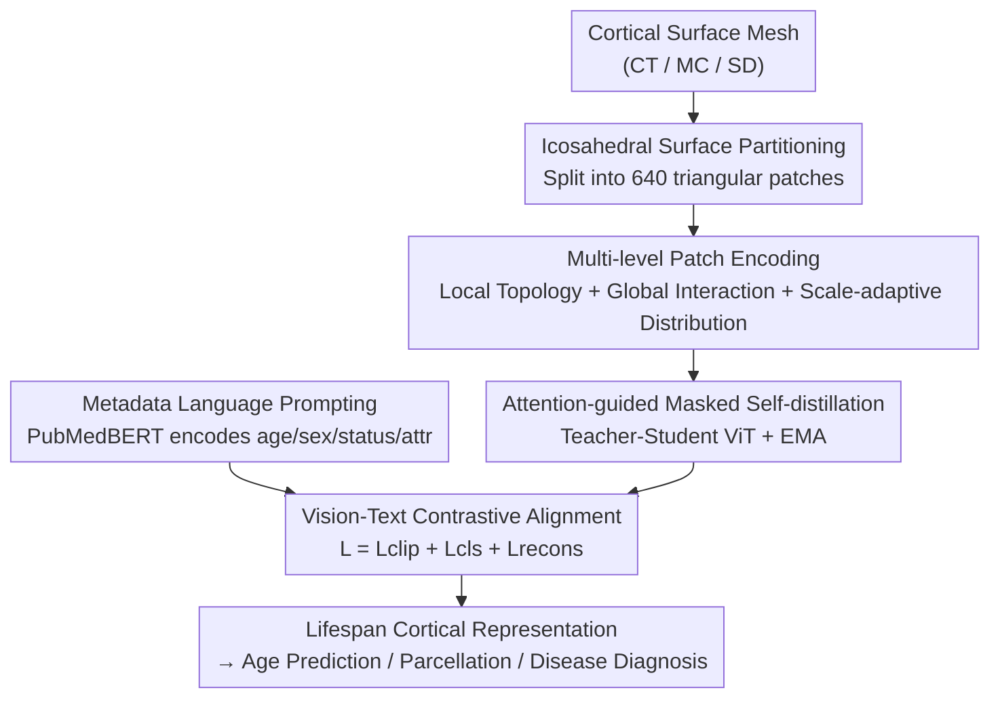

# CortiLife: A Unified Framework for Cortical Representation Learning across the Lifespan

**Conference**: ICLR2026  
**OpenReview**: [https://openreview.net/forum?id=aHFqIC86Ya](https://openreview.net/forum?id=aHFqIC86Ya)  
**Code**: TBD  
**Area**: Medical Imaging / Cortical Representation Learning / Vision-Language Pre-training  
**Keywords**: Cortical Surface, Lifespan, Icosahedral Patching, Masked Self-distillation, Metadata Prompting

## TL;DR
CortiLife introduces CLIP-style vision-language pre-training to non-Euclidean cortical surfaces for the first time. By combining "icosahedral patching + tri-stream multi-level encoding + attention-guided masked self-distillation + metadata language prompting," it constructs a unified cortical representation spanning from infancy to old age, outperforming SOTA models like CLIP, ACLIP, and DetailCLIP in age prediction, cortical parcellation, and four types of brain disease diagnosis.

## Background & Motivation
**Background**: Morphological indices such as cortical thickness (CT), surface area, mean curvature (MC), and sulcal depth (SD) are crucial biomarkers for studying brain development, aging, and disease. To perform representation learning on this "spherical topology," mainstream approaches utilize Spherical CNNs / Spherical U-Nets (performing spherical convolution and pooling on resampled cortical meshes) and Surface Vision Transformers (applying self-attention to cortical patches).

**Limitations of Prior Work**: Existing models are almost exclusively trained on **single-age-group cohorts** (either infants or the elderly), failing to capture the dramatic structural changes occurring across the entire lifespan and exhibiting poor generalization. While CLIP-style vision-language models have succeeded in 2D natural images and medical imaging (X-ray, MRI, CT), directly migrating them to cortical surfaces faces significant obstacles.

**Key Challenge**: Applying the CLIP paradigm to cortical surfaces requires solving three entangled problems: (1) The cortex is a highly folded **non-Euclidean manifold** where standard square/cubic patches are inapplicable; (2) To ensure inter-subject comparability, preprocessing registers each subject to a common template, which flattens individual gyri-sulci folding differences and leads to highly similar patches across subjects, thereby **homogenizing individualized information**; (3) Cortical feature **distribution shifts** across different age groups and modalities (CT/MC/SD) are severe, making unified modeling difficult.

**Goal**: Construct a unified cortical representation framework applicable across the entire lifespan and multiple modalities, addressing the aforementioned challenges.

**Key Insight**: The authors observe that cortical data is naturally suited for "tokenization followed by vision-language alignment." The key lies in designing the tokenization stage to preserve local topology while resisting homogenization and distribution shifts. Meanwhile, subject metadata (age, sex, health status, feature type) carries "developmental semantics" that can serve as the text branch to guide the vision encoder.

**Core Idea**: A "manifold-oriented surface tokenizer + metadata-prompted vision-language alignment" framework is proposed to enable a single set of representations with both **age-awareness** and **modality-awareness**.

## Method

### Overall Architecture
The input to CortiLife is a single morphological cortical surface mesh $x_c \in \mathbb{R}^{N_v \times 1}$ (each vertex stores a CT/MC/SD value, with 81,924 vertices for the whole brain). The output is a general cortical representation usable for both frozen-encoder applications and downstream fine-tuning. The pipeline consists of three segments: a **surface tokenizer** compresses the non-Euclidean cortical manifold into compact tokens (via partitioning and tri-stream multi-level encoding); **masked self-distillation** performs visual representation learning (using a teacher-student network and attention-guided masking); and **metadata language prompting** encodes age/sex/status/attribute information into text for CLIP-style contrastive alignment with visual representations. Three losses (reconstruction + alignment + image-text contrastive) are optimized jointly.

### Key Designs

**1. Icosahedral Surface Partitioning: Partitioning Non-Euclidean Cortex into Equal-Vertex Triangular Patches**

The first barrier is the non-Euclidean manifold structure of the cortex. The authors adopt an icosahedron subdivision strategy: the cortex is subdivided into local triangular facets and then aggregated into regular triangular patches such that **each patch contains the same number of vertices**. Given a cortical graph $x_c \in \mathbb{R}^{N_v \times 1}$ with $N_v$ vertices, the reorganized triangular patch set is $x_p \in \mathbb{R}^{P \times N_p}$, where $P=640$ (320 patches per hemisphere) and $N_p$ is the vertex count per patch. This step safely migrates the ViT "image patching" paradigm to spherical topology without destroying cortical geometric continuity.

**2. Tri-stream Multi-level Patch Encoding: Resisting Homogenization and Distribution Shift**

The authors designed **three complementary encoding streams** for each patch to handle registration-induced homogenization and cross-age distribution shifts:

- **Local Topology Encoding**: A Spherical ResBlock (1 stem + 4 BN layers + 4 residual spherical convolutions) captures fine-grained geometric/morphological cues within patches, encoding $x_p \in \mathbb{R}^{1\times N_p}$ into $e^L_p \in \mathbb{R}^{1\times M_v}$. These features are fundamental for distinguishing individuals and resisting homogenization.
- **Global Interaction Encoding**: 4 layers of self-attention + 4 layers of feed-forward networks establish long-range dependencies across patches, yielding $e^G_p \in \mathbb{R}^{1\times M_p}$, providing a holistic view of structural changes.
- **Patch-level Distribution Encoding (Scale-adaptive Encoder)**: Specifically addresses distribution shifts by computing the mean $x_{pm}$ and standard deviation $x_{ps}$ within each patch, then projecting them into $n$ scale spaces:

$$z_i(x_m) = \mathrm{LN}(x_m \cdot w_i + k_i \cdot b_i),\quad i\in[1,\dots,n],\ x_m\in[x_{pm}, x_{ps}]$$

where $k_i$ is a preset scale value, and $k_i \cdot b_i$ acts as a "scale-dependent bias." Multi-scale representations are aggregated using gated weights:

$$y(x_m)=\sum_{i=1}^{n}\alpha_i(x_m)\cdot z_i(x_m),\quad \alpha_i(x_m)=\frac{\log^{-1}\!\big(\tfrac{|x_m|}{k_i}+\epsilon\big)}{\sum_{j=1}^{n}\log^{-1}\!\big(\tfrac{|x_m|}{k_j}+\epsilon\big)}$$

This approach **unifies distribution hierarchies across ages** while **retaining age-specific features**, outputting $e^S_p \in \mathbb{R}^{P\times M_s}$. The three streams are concatenated and passed through a linear layer to produce the patch token $e_{tokenizer}\in\mathbb{R}^{1\times(M_v+M_p+2M_s)}$.

**3. Attention-guided Masked Self-distillation: Aligning Developmental Semantics during Reconstruction**

The authors utilize **teacher-student self-distillation** where a teacher network (updated via EMA) processes all patch tokens and a student network processes a masked subset. Instead of random masking, **patch masking is determined by the teacher's self-attention scores**:

$$\mathrm{AttScore}_j=\frac{1}{H}\sum_{i=1}^{H}\mathrm{Softmax}\!\Big(\frac{Q_i\cdot K_i(j)}{\sqrt{d}}\Big)$$

$Q_i$ is the query of the development-aware [CLS] token. The top 25% most attended regions are preserved, forcing the student to focus on the most informative cortical areas. The training uses a reconstruction loss $L_{recons}$ and a KL-divergence-based alignment loss $L_{cls}$.

**4. Metadata Language Prompting + Contrastive Alignment: Age-Aware and Modality-Aware Representations**

Metadata (age, gender, health status, feature type) is passed to a text branch to guide the vision encoder. **PubMedBERT** is used as the text encoder. The prompt template is: "The age of the subject is [age]. The gender of the subject is [gender]. Health status: [status]. Attribute: [feature type]." Visual embeddings $E^i_{student}$ and text embeddings $T_j$ are aligned via a standard CLIP contrastive loss $L_{clip}$. The total loss is $L=L_{clip}+L_{cls}+L_{recons}$.

### Loss & Training
Pre-training: AdamW (lr=5e-4, weight decay=1e-4), batch size 64, 10 epochs, 4x NVIDIA 3090. Downstream fine-tuning: SGD (lr=0.001), batch size 40, 200 epochs.

## Key Experimental Results

The dataset includes 9 datasets with 13,928 samples spanning from 26 weeks (fetal/infant) to 95 years old. Evaluations cover CT, MC, and SD modalities.

### Main Results

Under the frozen-encoder setting, CortiLife leads in age prediction (MAE) and cortical parcellation (DICE):

| Task | Metric | Modality | CortiLife | Best Baseline |
|------|------|------|-----------|--------------|
| Age Prediction | MAE↓ | CT / MC / SD | 3.124 / 2.990 / 3.006 | DetailCLIP 3.156 / 3.112 / 3.137 |
| Cortical Parcellation | DICE↑ | CT / MC / SD | 0.905 / 0.925 / 0.957 | DetailCLIP 0.785 / 0.804 / 0.832 |

For brain disease diagnosis (finetuned):

| Modality | Dataset | Metric | CortiLife | Gain vs. Best Baseline |
|------|--------|------|-----------|------|
| CT | CHD / ADHD / AD | ACC | 0.806 / 0.697 / 0.928 | +1.4% / 1.6% / 0.2% |
| MC | CHD / ADHD / AD | ACC | 0.667 / 0.632 / 0.939 | All SOTA |
| SD | CHD / ADHD / AD | AUC | 0.799 / 0.657 / 0.991 | ACC +1.8% / 0.7% / 1.6% |

### Ablation Study

Tri-stream encoding is essential (Disease diagnosis, ✓/✗ indicates retention/removal):

| local | global | statistical | CHD-ACC(CT) | CHD-AUC(MC) | Description |
|:---:|:---:|:---:|:---:|:---:|------|
| ✗ | ✓ | ✓ | 0.738 | 0.677 | No local topology |
| ✓ | ✗ | ✓ | 0.740 | 0.610 | No global interaction |
| ✓ | ✓ | ✗ | 0.792 | 0.718 | No scale-adaptive distribution |
| ✓ | ✓ | ✓ | **0.806** | **0.776** | Full Model |

### Key Findings
- **Global interaction is most sensitive**: Removing the global interaction stream caused the largest performance drop in MC AUC (0.776 to 0.610).
- **Distribution shift suppression**: Maximum Mean Discrepancy (MMD) results show that the scale-adaptive encoder significantly unifies distribution hierarchies across ages (e.g., 1-3y vs. 6-66y dropped from 0.852 to 0.473).
- **Visualization**: t-SNE reveals that embeddings exhibit smooth gradients along the age dimension and capture both gender heterogeneity and disease status.

## Highlights & Insights
- **First CLIP paradigm for non-Euclidean cortical surfaces**: The primary innovation is the "tokenization" designed for manifolds, resisting homogenization and distribution shifts.
- **Scale-adaptive encoder utility**: This module acts as a domain-shift friendly normalization, useful for any medical/temporal scenario where indices vary across subgroups.
- **Attention-guided masking**: Using the teacher's [CLS] attention to select the top 25% informative regions allows reconstruction and alignment objectives to coexist effectively.

## Limitations & Future Work
- Currently limited to CT/MC/SD morphological modalities; integration with functional MRI or diffusion MRI is a natural extension.
- Heavily dependent on **registered** standard cortical templates; sensitivity to registration quality remains a factor.
- Relies on complete metadata (age/gender/diagnosis); robustness to missing or noisy metadata was not extensively discussed.
- Clinical multi-classification or sub-typing scenarios require further validation.

## Related Work & Insights
- **vs. Spherical CNNs / Surface ViT**: While previous models respect spherical topology, they are limited to specific cohorts. CortiLife achieves lifespan generalization.
- **vs. CLIP / DetailCLIP**: These are designed for 2D or voxel data. CortiLife fills the gap for non-Euclidean cortical surfaces.

## Rating
- Novelty: ⭐⭐⭐⭐⭐ 
- Experimental Thoroughness: ⭐⭐⭐⭐⭐ 
- Writing Quality: ⭐⭐⭐⭐ 
- Value: ⭐⭐⭐⭐⭐ 

<!-- RELATED:START -->

## Related Papers

- [\[ICLR 2026\] Anatomy-aware Representation Learning for Medical Ultrasound](anatomy-aware_representation_learning_for_medical_ultrasound.md)
- [\[CVPR 2026\] Focus-to-Perceive Representation Learning: A Cognition-Inspired Hierarchical Framework for Endoscopic Video Analysis](../../CVPR2026/medical_imaging/focus-to-perceive_representation_learning_a_cognition-inspired_hierarchical_fram.md)
- [\[CVPR 2025\] CycleULM: A Unified Label-Free Deep Learning Framework for Ultrasound Localisation Microscopy](../../CVPR2025/medical_imaging/cycleulm_a_unified_label-free_deep_learning_framework_for_ultrasound_localisatio.md)
- [\[CVPR 2026\] GaussianPile: A Unified Sparse Gaussian Splatting Framework for Slice-based Volumetric Reconstruction](../../CVPR2026/medical_imaging/gaussianpile_a_unified_sparse_gaussian_splatting_framework_for_slice-based_volum.md)
- [\[CVPR 2026\] MuViT: Multi-Resolution Vision Transformers for Learning Across Scales in Microscopy](../../CVPR2026/medical_imaging/muvit_multi-resolution_vision_transformers_for_learning_across_scales_in_microsc.md)

<!-- RELATED:END -->
