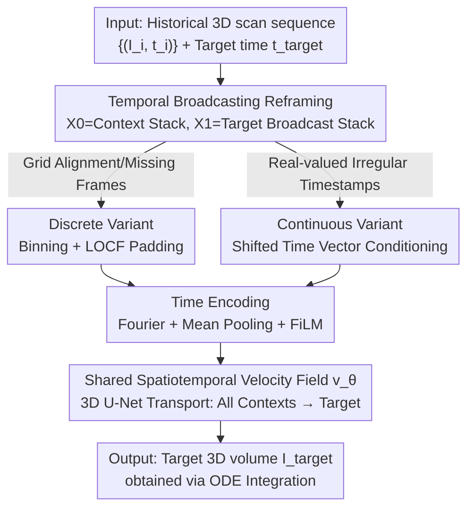

# CRONOS: Continuous time reconstruction for 4D medical longitudinal series

**Conference**: ICLR2026  
**OpenReview**: [https://openreview.net/forum?id=XxqdbYD74l](https://openreview.net/forum?id=XxqdbYD74l)  
**Code**: https://github.com/MIC-DKFZ/Longitudinal4DMed (To be released)  
**Area**: Medical Imaging / Spatiotemporal Prediction / Flow Matching  
**Keywords**: 4D Medical Imaging, Longitudinal Series, Continuous Time, Flow Matching, Sequence-to-Image Prediction

## TL;DR
CRONOS reframes Flow Matching (FM) as a "sequence-to-image" transport problem. By utilizing a shared spatiotemporal velocity field to simultaneously transport multiple historical 3D scans toward a target volume, it supports both discrete grid-aligned and continuous real-valued timestamp voxel-level 4D medical image prediction within a single model. It outperforms existing spatiotemporal baselines and the strong LCI heuristic across three datasets: Cine-MRI, perfusion CT, and longitudinal glioma MRI.

## Background & Motivation
**Background**: Longitudinal medical imaging (multiple scans of the same patient over months to years, or natural spatiotemporal modalities like ultrasound/cine-MRI/perfusion CT) is essential for monitoring disease progression, evaluating treatment efficacy, and assessing development. However, most spatiotemporal learning in medical imaging currently focuses on single-time-point (image-to-image) analysis.

**Limitations of Prior Work**: Existing methods face rigid constraints; none satisfy "multi-input + high-fidelity + 3D + continuous-time" simultaneously. Generative medical methods (BrLP, ImageFlowNet, etc.) often accept only a single prior scan, are tied to specific diseases (like Alzheimer's), or target global labels. Natural video prediction methods (ConvLSTM, SimVP, ViViT, video diffusion) are designed for large-scale 2D dense videos and perform poorly when transferred to 3D medical images characterized by small data volumes and sparse sequences. Interpolation methods are limited to filling intermediate frames between two acquisitions and cannot perform future extrapolation.

**Key Challenge**: Real-world clinical acquisitions are **irregular**—a patient may only be scanned a few times over several years, with timestamps being continuous real values rather than a neat grid. Quantizing these to a grid creates a dilemma: a coarse grid loses temporal precision, while a fine grid (e.g., daily resolution over years) causes sequence lengths to explode into the thousands, with most slots remaining empty, leading to computational explosion. Thus, the "fixed grid" assumption conflicts with the sparse, irregular nature of clinical data.

**Goal**: To create a unified framework for many-to-one prediction $\{I_i, t_i\}_{i=1}^{T}, t_{\text{target}} \mapsto I_{\text{target}}$ from **multiple** past scans. The model should handle both discrete grids and arbitrary real-valued timestamps directly, without specific disease assumptions, operating entirely in 3D voxel space.

**Key Insight**: The authors observe that Flow Matching (FM) essentially learns an ODE to transport a distribution $p$ along a straight path to another equal-dimensional distribution $q$. By treating the "context image sequence" as the starting distribution and the "target image (broadcast into a stack of the same shape)" as the ending distribution, FM naturally transforms into "sequence-to-image transport."

**Core Idea**: Use a shared velocity field $v_\theta$ to **simultaneously** transport $T$ context volumes toward the target (temporal broadcasting). Real acquisition timestamps are injected as conditions into the flow equation, transforming flow matching from "noise-to-image" into "historical scan sequence to target scan at any time."

## Method

### Overall Architecture
CRONOS aims to predict a target 3D volume $I_{\text{target}}$ at time $t_{\text{target}}$ given a set of historical 3D scans with timestamps $\{(I_i, t_i)\}_{i=1}^{T}$. Its core mechanism **reframes this prediction as a Flow Matching transport problem**: whereas classic FM learns a velocity field from noise $X_0 \sim p$ to sample $X_1 \sim q$, CRONOS sets the starting point $X_0 = [I_1, \dots, I_T]$ as the context sequence and the ending point $X_1 = [I_{\text{target}}, \dots, I_{\text{target}}]$ as a stack of the target image broadcasted $T$ times. Consequently, a single velocity field $v_\theta$ transports all $T$ context volumes along their respective paths toward the target simultaneously, which is equivalent to $T$ frame-wise transports under shared parameters.

Based on this reframing, CRONOS provides two complementary variants sharing a 3D U-Net backbone: The **discrete variant** bins irregular sequences into a fixed grid and uses "Last-Observation-Carry-Forward" (LOCF) to fill missing frames, implicitly encoding time into the flow step $\tau$ and frame index. The **continuous variant** skips grid quantization and feeds real-valued timestamps directly as conditions into the network, allowing the flow step $\tau$ to carry actual temporal information. Time (flow step and real timestamps) is injected into each residual layer via Fourier encoding, cross-sequence average pooling, and FiLM. During training, the velocity field is learned to approximate the constant ground-truth velocity $X_1 - X_0$. During inference, a numerical ODE solver integrates from $X_0$ to $X_1$ to obtain the prediction.

### Key Designs

**1. Temporal Broadcasting: Reframing Flow Matching as Sequence-to-Image Transport**

The design motivation stems directly from a limitation: classic flow matching only learns transport between two **equal-dimensional** distributions (noise $\to$ image), while "multiple historical scans $\to$ single target" is unequal in dimension. CRONOS **broadcasts** the target image into a stack with the same shape as the context sequence: let $X_0 = [I_1, \dots, I_T]$ and $X_1 = [I_{\text{target}}, \dots, I_{\text{target}}]$. With dimensions aligned, the FM linear coupling $X_\tau = (1-\tau)X_0 + \tau X_1 + \sigma(\tau)\epsilon$ becomes valid. Along this straight path, the ground-truth velocity is the constant $u_\tau(X_\tau) = X_1 - X_0$, reducing the training objective to a clean regression loss:

$$\mathcal{L}_{\text{CFM}} = \mathbb{E}_{X_0, X_1, \tau} \, \lVert v_\theta(X_\tau, \tau) - (X_1 - X_0) \rVert_2^2.$$

The novelty lies in the fact that a single shared velocity field $v_\theta$ transports all $T$ context images toward the target in one forward pass. This is equivalent to $T$ parallel frame-wise transports with shared parameters, leveraging multiple inputs for higher precision while neatly expressing many-to-one prediction as a single flow transport without complex sequence modeling architectures.

**2. Discrete Variant: Binning Grid + LOCF for Missing Frames**

When acquisitions roughly fall on a regular grid but have missing frames, CRONOS first uses a binning operator $E^{\text{grid}}_g$ to assign each $I_i$ to the nearest grid index based on $t_i$. Then, a "Last-Observation-Carry-Forward" (LOCF) operator $F_{\text{LOCF}}$ fills empty slots with the most recent available scan:

$$X_0 = \big(F_{\text{LOCF}} \circ E^{\text{grid}}_g\big)\big(\{(I_i, t_i)\}_{i=1}^{T}\big) = [\hat I_1, \dots, \hat I_K].$$

Empty frames are zero-initialized before being replaced by the last observation. This ensures $X_0$ is well-defined on a uniform grid, where temporal order is captured **implicitly** through the flow step $\tau$ and frame index. The authors set noise $\sigma = 0$ for this variant (both in training and inference). This design stabilizes optimization and preserves frame order, though forcing a grid onto irregular time points can be computationally wasteful.

**3. Continuous Variant: Direct Conditioning on Real-valued Timestamps**

This is where CRONOS truly differs from baselines and enables "continuous time." It skips binning and LOCF, injecting real-valued timestamps directly as conditions. Specifically, it constructs a **shifted time vector** along the flow step $\tau$, interpolating context timestamps toward the target time:

$$T_\tau = (1-\tau) \, t_{\text{ctx}} + \tau \, t_{\text{target}},$$

and uses this to condition the velocity field, resulting in the trajectory $X_1 = X_0 + \int_0^1 v_\theta(X_\tau, T_\tau) \, d\tau$. Here, the flow step $\tau$ carries **actual** temporal geometric information, allowing predictions (interpolation or extrapolation) at any target time without zero-padding or artificial frames. Computational complexity only grows with the number of context images rather than the grid range $K \cdot \Delta$, making the continuous variant more memory-efficient and faster to train—perfectly matching the "few acquisitions, irregular intervals" characteristic of clinical data.

**4. Time Encoding: Fourier Embedding + Mean Pooling + FiLM Injection**

Both flow steps and continuous time must be fed into the network and handle variable-length sequences. CRONOS encodes time using Fourier features $\gamma(t) = [\sin(2\pi f_k t), \cos(2\pi f_k t)]_{k=1}^{K}$. To maintain dimensional consistency across variable-length inputs, context time embeddings are **mean-pooled** $\text{Enc}(t) = \frac{1}{T}\sum_{i=1}^{T}\gamma(t_i)$ in the continuous setting and then added to each residual layer via FiLM. This practical engineering trick allows a single 3D U-Net backbone to handle context sequences of varying lengths.

### Loss & Training
The loss function is the velocity regression for flow matching: $\mathcal{L} = \lVert v_\theta(T'_\tau, X_\tau) - (I_{\text{target}} - I) \rVert^2$. According to Algorithm 1: for each training step, sample a patient sequence, a random flow step $\tau \sim U(0,1)$, repeat the target $T$ times, interpolate timestamps $T'_\tau = (1-\tau)[t_1, \dots, t_n] + \tau \, t_{\text{target}}$, and linearly interpolate $X_\tau = (1-\tau)I + \tau I_{\text{target}} + \sigma(\tau)\epsilon$. Use AdamW for updates. During inference, initialize $X_0 \leftarrow I$ and use numerical ODE integration on the grid $\{\tau_0=0, \dots, \tau_N=1\}$ to find $\hat X_N$. The discrete variant uses $\sigma=0$.

## Key Experimental Results

### Main Results
Three public datasets: ACDC (Cardiac cine-MRI), ISLES (Stroke perfusion CT), and Lumiere (Longitudinal glioma MRI). Metrics used: NRMSE↓, SSIM↑, PSNR↑. LCI (Last Context Image, which uses the last available scan) serves as a surprisingly strong heuristic baseline.

| Dataset | Method | NRMSE [$10^{-2}$]↓ | SSIM [%]↑ | PSNR [dB]↑ |
|:---|:---|:---|:---|:---|
| ACDC | LCI | 4.48 | 92.79 | 28.918 |
| ACDC | SimVP | 9.27 | 49.08 | 20.715 |
| ACDC | ViViT | 13.90 | 17.06 | 17.252 |
| ACDC | **CRONOS discrete** | 3.97 | **94.51** | **30.510** |
| ACDC | **CRONOS cont.** | **3.74** | 94.34 | 29.750 |
| ISLES | LCI | 5.25 | 96.29 | 29.002 |
| ISLES | SimVP | 13.06 | 48.82 | 20.799 |
| ISLES | **CRONOS discrete** | 4.50 | **97.33** | 30.542 |
| ISLES | **CRONOS cont.** | **4.38** | 97.31 | **30.809** |
| Lumiere | LCI | 8.38 | 88.35 | 21.631 |
| Lumiere | NODE+LSTM | 13.07 | 48.66 | 17.742 |
| Lumiere | **CRONOS discrete** | 7.92 | **91.43** | 22.427 |
| Lumiere | **CRONOS cont.** | **7.55** | 89.32 | **22.551** |

**Key Findings**: Standard spatiotemporal baselines (ConvLSTM / SimVP / ViViT / NODE+LSTM) all **fail to outperform** the simple LCI heuristic on these small-sample 3D datasets (as medical images change slowly, "copying the last frame" is very effective). CRONOS is the only method that consistently outperforms LCI.

### Ablation Study
On a modified ACDC dataset (resampled to simulate irregular acquisition), the discrete and continuous variants were compared to test the value of explicit timestamp conditioning:

| Configuration | SSIM↑ | PSNR↑ | NRMSE↓ | Description |
|:---|:---|:---|:---|:---|
| LCI | 93.27 | 29.77 | 0.0349 | Heuristic lower bound |
| NODE+LSTM | 57.50 | 22.87 | 0.0728 | Continuous-time baseline |
| CRONOS discr. | 93.27 | 29.77 | 0.0348 | No explicit timestamps; only matches LCI |
| **CRONOS cont.** | **93.86** | **30.09** | **0.0330** | Explicit timestamp conditioning; exceeds LCI |

Under irregular sampling, the discrete variant without explicit timestamps only matches LCI; consistent improvement is only achieved with the continuous variant's real-valued time conditioning.

### Key Findings
- **Explicit timestamps are the deciding factor**: While the discrete variant is strong for regular grids, real-valued time conditioning in the continuous variant is necessary to beat LCI in irregular scenarios.
- **Continuous variant is more efficient**: Its computation scales with the number of context images rather than the grid size, leading to lower VRAM usage and faster training than the discrete variant.
- **Wins even with extreme scarcity**: On the sparse Lumiere dataset with heterogeneous tumor trajectories, CRONOS still outperforms LCI, highlighting the value of explicit continuous-time conditioning.
- **Robust to hyperparameters**: Performance differences across feature dimensions, training noise, and integration settings were not significant.

## Highlights & Insights
- **Reframing prediction as flow transport**: The "temporal broadcasting" trick is brilliant—expressing many-to-one prediction as a shared velocity field transport by broadcasting the target to align dimensions. This technique is transferable to any task converting multiple inputs to a single output using FM/Diffusion.
- **One model, two time systems**: The same 3D U-Net backbone handles both grid-aligned (implicit time) and real-valued timestamps (explicit conditioning) through a unified representation of the flow step $\tau$ and the shifted time vector $T_\tau$.
- **Mean pooling for variable-length sequences**: Using $\frac{1}{T}\sum\gamma(t_i)$ with FiLM to allow variable-length context sequences to share a backbone is a simple yet effective engineering trick.
- **Honest baseline comparison**: The paper acknowledges that LCI (copying the last frame) is a formidable baseline that most spatiotemporal models fail to beat, using it as the primary competitor.

## Limitations & Future Work
- **Voxel-level metrics vs Clinical relevance**: Voxel-based metrics like PSNR do not necessarily align with the clinical modeling of disease trajectories.
- **Simulated continuous setting**: Since dense continuous acquisition protocols are unavailable, the "continuous" experiments used resampled ACDC data rather than real irregular clinical sequences.
- **Observed limitations**: Evaluation is limited to three relatively small datasets. The linear transport assumption may not hold for abrupt pathological events (acute events).
- **Future directions**: Introduce clinically relevant spatiotemporal metrics, expand to larger multi-center longitudinal cohorts, and explore pre-training as a spatiotemporal medical foundation model.

## Related Work & Insights
- **vs. Single-context Medical Generation (BrLP / ImageFlowNet / NODER)**: These are image-to-image methods that cannot capture longitudinal evolution from multiple observations; CRONOS supports many-to-one prediction with continuous-time extrapolation.
- **vs. Natural Video Prediction (ConvLSTM / SimVP / ViViT / Video Diffusion)**: Designed for dense 2D video, these fail on sparse 3D medical sequences; CRONOS is optimized for 3D voxels and sparse sequences.
- **vs. Classic Flow Matching (Lipman et al.)**: Standard FM learns "noise-to-image." CRONOS extends this to "sequence-to-image" transport with real-world timestamp conditioning.
- **vs. Interpolation Methods**: Interpolation is restricted to internal frames; CRONOS handles both interpolation and future extrapolation.

## Rating
- Novelty: ⭐⭐⭐⭐⭐ (First to implement continuous sequence-to-image prediction on 3D medical data with a clever FM reframing)
- Experimental Thoroughness: ⭐⭐⭐⭐ (Three modalities/datasets, multiple baselines, and ablations, though continuous data was simulated)
- Writing Quality: ⭐⭐⭐⭐ (Clear motivation and methods, though notation is dense)
- Value: ⭐⭐⭐⭐⭐ (Establishes a unified framework and reproducible benchmark for 4D longitudinal medical prediction with open-source commitment)

<!-- RELATED:START -->

## Related Papers

- [\[ICLR 2026\] Stochastic Optimal Control for Continuous-Time fMRI Representation Learning](stochastic_optimal_control_for_continuous-time_fmri_representation_learning.md)
- [\[ICLR 2026\] ODEBRAIN: Continuous-Time EEG Graph for Modeling Dynamic Brain Networks](odebrain_continuous-time_eeg_graph_for_modeling_dynamic_brain_networks.md)
- [\[ICLR 2026\] Functional MRI Time Series Generation via Wavelet-Based Image Transform and Spectral Flow Matching for Brain Disorder Identification](functional_mri_time_series_generation_via_wavelet-based_image_transform_and_spec.md)
- [\[NeurIPS 2025\] Self-Supervised Learning via Flow-Guided Neural Operator on Time-Series Data](../../NeurIPS2025/medical_imaging/self-supervised_learning_via_flow-guided_neural_operator_on_time-series_data.md)
- [\[ICLR 2026\] Learning Patient-Specific Disease Dynamics with Latent Flow Matching for Longitudinal Imaging Generation](learning_patient-specific_disease_dynamics_with_latent_flow_matching_for_longitu.md)

<!-- RELATED:END -->
