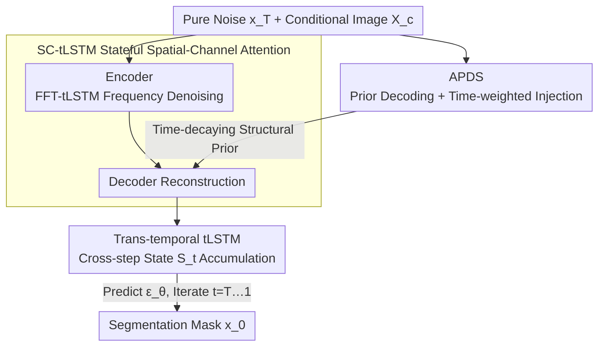

# Cross-Timestep: 3D Diffusion Model with Trans-temporal Memory LSTM and Adaptive Priori Decoding Strategy for Medical Segmentation

**Conference**: ICLR2026  
**OpenReview**: [https://openreview.net/forum?id=TE3asYO8PQ](https://openreview.net/forum?id=TE3asYO8PQ)  
**Code**: https://github.com/Wushangqian404/Cross-Timestep  
**Area**: Medical Imaging / Diffusion Models / 3D Segmentation  
**Keywords**: 3D Medical Segmentation, Diffusion Models, Initial-stage Collapse, Cross-timestep Memory, Time-weighted Prior

## TL;DR
To address the two major issues of "initial-stage collapse" at high-noise starting points and isolated timesteps when applying diffusion models to 3D medical segmentation, this paper proposes Cross-Timestep. It utilizes an "Adaptive Priori Decoding Strategy (APDS)" to inject time-decaying structural priors from conditional images to stabilize the initial stages of reverse diffusion, and a "Trans-temporal Memory LSTM (tLSTM)" to explicitly pass low-frequency structures and uncertainty saliency across timesteps. It comprehensively outperforms existing SOTA on two multi-center nasopharyngeal carcinoma datasets.

## Background & Motivation
**Background**: Medical image segmentation requires precise delineation of anatomical structures. Training robust models typically involves aggregating images from different hospitals and scanners, which introduces significant stylistic variations (imaging styles, intensity distributions, and contrasts). Traditional segmentation networks suffer from significant performance degradation under such domain shifts. Denoising Diffusion Probabilistic Models (DDPM) are attractive alternatives as their "coarse-to-fine" denoising process restores global structures before filling in details, making them naturally more robust to stylistic changes.

**Limitations of Prior Work**: The success of diffusion models has been almost entirely confined to 2D segmentation tasks. The authors observe a distinct failure mode: when standard 2D diffusion segmentation is directly applied to 3D volume data, the model produces completely amorphous results—failing to recover target structures—whenever the reverse sampling starts from a high-noise timestep (near pure Gaussian noise). The authors label this phenomenon "initial-stage collapse." While sampling from low-to-medium timesteps works normally, the high-noise starting point leads to total failure.

**Key Challenge**: The manifold of 3D volumetric data is much larger than in 2D, while available structural cues at extreme noise levels are minimal. In standard diffusion samplers, each denoising step is isolated and non-communicative—there is no mechanism to pass accumulated evidence across timesteps. Consequently, during the critical initial phase, the model can neither "see clearly" nor "remember," leading to divergent outputs.

**Goal**: To simultaneously solve two issues: (i) enabling reverse diffusion to "start" reliably even from extreme noise levels, and (ii) ensuring that adjacent timesteps operate coherently by passing accumulated structural evidence forward.

**Key Insight**: If the initial stage is unclear, the model should not be forced to guess blindly in pure noise—extract a "rough sketch" from the clean conditional image as a scaffold. Additionally, treat the stepwise denoising of diffusion as a stateful trajectory and use memory units of a recurrent network to explicitly carry the state along this trajectory.

**Core Idea**: An adaptive prior decoder, watching only the conditional branch, provides a "time-decaying structural prior" to prevent initial collapse. Concurrently, LSTM memory units are redesigned as "cross-timestep memory carriers," ensuring subsequent steps refine existing structures rather than rediscovering them.

## Method

### Overall Architecture
Cross-Timestep is a 3D conditional diffusion segmentation framework. The forward process gradually adds Gaussian noise to the ground truth mask $x_0$ until it becomes pure noise $x_T$. The reverse process uses a network $M_\theta$ conditioned on a clean medical image $X_c$ to iteratively denoise from $x_T$ to generate $x_0$. Training follows the simplified DDPM objective to predict noise $\epsilon$: $L_{simple}=\mathbb{E}_{t,x_0,\epsilon}\big[\,\lVert\epsilon-M_\theta(x_t,X_c,t)\rVert^2\,\big]$.

Within this framework, two innovative components are integrated. First, **APDS** is attached to the conditional branch to decode a prior mask from $X_c$, which is injected into the main branch with time-decaying weights to prevent "initial-stage collapse." Second, **tLSTM** embeds recurrent memory units into the denoiser, allowing a "cross-timestep state" $S_t$ to persist along the denoising path. The tLSTM includes two base implementations (Conv-tLSTM, Linear-tGRU) and two extensions (SC-tLSTM, FFT-tLSTM) for stateful spatial-channel attention and frequency-domain denoising, respectively.

### Key Designs

**1. APDS (Adaptive Priori Decoding Strategy): Stabilizing Initial Reverse Diffusion**

Directly targeting "initial-stage collapse," this module addresses the issue where the main branch input is nearly pure noise at $t \approx T$. APDS attaches an additional Prior Decoder (PD) **only to the conditional branch**. This PD processes the conditional image $X_c$ (which includes time embedding) through bottleneck layers and multi-scale skip connections to decode an initial mask $F_{prior}$—a rough but stable approximation of $x_0$.

This prior is injected into main branch features $F_{main}$ via "Reverse Addition (RA)": $F_{refined}=F_{main}\odot(1-\sigma(F_{prior}))$, using the prior background to suppress noise. Crucially, a time-weighted fusion is applied: $F_{fused}=(1-\omega_t)\odot F_{refined}+\omega_t\odot F_{prior}$. The weight $\omega_t$ is large when $t$ is high (unstable start) and decays as $t \to 0$. This ensures the prior provides maximum support when needed most and exits gracefully as the model becomes self-reliant.

**2. tLSTM (Trans-temporal Memory LSTM): Transforming Isolated Denoising into Coherent Trajectories**

Standard diffusion treats timesteps as isolated; tLSTM upgrades LSTM units into "cross-timestep memory carriers." Conv-tLSTM replaces matrix multiplications with 3D convolutions, preserving voxel-wise spatial correlations in the hidden state $h_t$ and cell state $C_t$. Time-aware modulation uses embedding $E_t$ to adjust $h_{t-1}$ into $h'_t$, informing the unit of its current denoising phase. The cell $C_t$ explicitly retains: low-frequency structural sketches, residual noise statistics, and uncertainty cues, allowing each step to refine rather than rediscover.

A lightweight version, Linear-tGRU, merges the cell/hidden states and uses linear layers for efficiency, making it suitable for long-range denoising by tracking structural importance over time.

**3. SC-tLSTM: Stateful, Time-Evolving Spatial-Channel Attention**

Standard attention is memoryless. SC-tLSTM makes it stateful across timesteps. The spatial branch pools features along X/Y/Z axes to create spatial summaries $P_{xyz}$, processed by a Conv-tLSTM block to generate a spatial map $M_s$, remembering "where to focus." The channel branch uses Linear-tGRU on $P_{channel}$ to track "what to focus on" across time. These are applied sequentially, ensuring attention evolves along the reconstruction trajectory.

**4. FFT-tLSTM: Frequency-Domain Denoising for Structure-Noise Separation**

Structures and noise are often more separable in the frequency domain. FFT-tLSTM applies 3D FFT to $X_t$ and $X_c$. The resulting spectra $F_t, F_c$ are fused and passed through a stateful recurrent block, which uses timestep memory to better distinguish noise frequencies. The output is gated by $F_c$ to amplify relevant structural frequencies before inverse FFT. This provides frequency-level noise resistance complementary to SC-tLSTM.

### Loss & Training
The training target follows the standard DDPM noise prediction loss: $L_{simple}=\mathbb{E}_{t,x_0,\epsilon}[\lVert\epsilon-M_\theta(x_t,X_c,t)\rVert^2]$, where $x_t=\sqrt{\bar\alpha_t}x_0+\sqrt{1-\bar\alpha_t}\epsilon$. During inference, starting from $x_T$, $x_{t-1}$ is iteratively computed for $t=T,\dots,1$. Each step simultaneously updates the cross-timestep state $S_t=\mathrm{tLSTM}(S_{t+1},\phi(x_t,X_c,t))$ and denoises conditioned on $S_t$.

## Key Experimental Results

### Main Results
Evaluated on two multi-center Nasopharyngeal Carcinoma (NPC) datasets: LNCTVSeg (CT, 4 centers, Lymph Node CTV) and OAseg (MRI, 3 centers, GTV). Comparison includes TransBTS, SwinUNETR, UNETR, 3DUXNET, nnFormer, Perspective+, and Diff-UNet.

| Method | LNCTVSeg Dice↑ | LNCTVSeg IoU↑ | LNCTVSeg HD95↓ | OASeg Dice↑ | OASeg IoU↑ | OASeg HD95↓ |
|------|------|------|------|------|------|------|
| nnFormer | 80.3 | 71.5 | 4.31 | 68.4 | 62.4 | 7.76 |
| Perspective+ | 82.4 | 73.6 | 3.27 | 69.6 | 62.8 | 7.09 |
| Diff-UNet | 81.7 | 72.2 | 3.91 | 71.5 | 64.2 | 6.88 |
| **Ours** | **83.7** | **74.2** | **2.44** | **72.8** | **65.4** | **6.24** |

Ours leads across all metrics, showing particular strength in HD95 (boundary accuracy) and robustness under domain shifts.

### Ablation Study
Ablation of tLSTM components (Table 1) and APDS/SC/FFT modules (Table 3):

| Configuration | LNCTVSeg Dice | LNCTVSeg HD95 | Description |
|------|------|------|------|
| LSTM only | 79.5 | 6.93 | Standard LSTM temporal module |
| + Conv-LSTM | 81.1 | 5.48 | 3D convolutional gating |
| + Conv-LSTM + Linear-GRU | 82.5 | 3.81 | Combination of recurrent units |
| + t-cell (Full tLSTM) | **83.7** | **2.44** | Addition of cross-step memory unit |
| APDS only (No SC/FFT) | 77.3 | 8.51 | Prior decoding only |
| APDS + SC | 82.1 | 4.32 | Add stateful spatial-channel attention |
| APDS + FFT | 81.8 | 4.85 | Add frequency denoising |
| APDS + SC + FFT (Full) | **83.7** | **2.44** | All modules |

### Key Findings
- **"Initial-stage Collapse" Validated and Solved**: Average Dice curves show that without APDS, models fail completely at $t > 700$. With APDS, performance remains stable across all noise levels.
- **Scaffold, Not Crutch**: Tracking Dice for the main branch vs. prior output reveals that while the main branch relies on APDS initially, it quickly surpasses the prior output as $t$ decreases, preserving diffusion's refinement capabilities.
- **t-cell Contribution**: Adding the t-cell memory unit significantly improved HD95 from 3.81 to 2.44, proving that explicit temporal awareness is the primary driver of performance.
- **Balanced Efficiency**: Training time (33.4h) and GPU memory (15152 MiB) are lower than heavy Transformers like SwinUNETR, while accuracy is significantly higher, making it viable for clinical transition.

## Highlights & Insights
- **Formalizing "Initial-stage Collapse"**: The authors accurately pinpointed high-noise sampling collapse in 3D diffusion and quantified it through Dice-vs-starting-timestep curves.
- **Time-weighted Prior Injection**: The strategy of providing strong support during high noise and exiting as the model stabilizes prevents collapse without degrading the diffusion process into a simple U-Net.
- **LSTM as Evidence Accumulator**: Reinterpreting $C_t$ as a carrier for structures and uncertainty saliency connects isolated timesteps into a coherent reasoning path.
- **Modular tLSTM Family**: The Conv/Linear/SC/FFT variants provide a flexible framework for stateful feature extraction across different domains (spatial, channel, frequency).

## Limitations & Future Work
- **Task Specificity**: Evaluation was limited to nasopharyngeal carcinoma (NPC); generalizability to other organs or modalities (e.g., Ultrasound, Pathology) remains untested.
- **Inference Latency**: Like all diffusion models, iterative sampling is slower (0.17s) than one-step networks (nnFormer: 0.03s), which may pose challenges for real-time clinical workflows.
- **Variant Selection**: While offering flexibility, the paper does not provide a definitive guide for choosing between tLSTM variants for different tasks.
- **Future Directions**: Exploring time-weighted priors in other high-dimensional generation tasks and using distillation/consistency models to reduce sampling steps.

## Related Work & Insights
- **vs. 2D Diffusion**: While prior works focused on boundary refinement in 2D, this work systematically tackles the 3D diffusion problem and its specific failure mode (initial collapse).
- **vs. Diff-UNet**: Diff-UNet performs post-hoc fusion of independent step predictions. Contrastingly, tLSTM accumulates state during sampling, ensuring coherent evidence transfer rather than just averaging results.
- **vs. 3D Generative Diffusion**: Most 3D diffusion work focuses on computational feasibility (tensor handling). This paper uniquely addresses "reliable initialization (APDS)" and "explicit temporal accumulation (tLSTM)."

## Rating
- Novelty: ⭐⭐⭐⭐ First to formalize "initial-stage collapse" in 3D medical diffusion and solve it via APDS and tLSTM.
- Experimental Thoroughness: ⭐⭐⭐⭐ Solid multi-center data and focused ablations; cross-organ generalizability is the only major omission.
- Writing Quality: ⭐⭐⭐⭐ Clear problem definition and excellent visualizations.
- Value: ⭐⭐⭐⭐ Provides reusable infrastructure (APDS) for any 3D diffusion model requiring stability.

<!-- RELATED:START -->

## Related Papers

- [\[ICLR 2026\] Adaptive Domain Shift in Diffusion Models for Cross-Modality Image Translation](adaptive_domain_shift_in_diffusion_models_for_cross-modality_image_translation.md)
- [\[ICLR 2026\] Johnson-Lindenstrauss Lemma Guided Network for Efficient 3D Medical Segmentation](johnson-lindenstrauss_lemma_guided_network_for_efficient_3d_medical_segmentation.md)
- [\[CVPR 2026\] GeoSemba: Reconstructing State Space Model for Cross Paradigm Representation in Medical Image Segmentation](../../CVPR2026/medical_imaging/geosemba_reconstructing_state_space_model_for_cross_paradigm_representation_in_m.md)
- [\[CVPR 2025\] VISTA3D: A Unified Segmentation Foundation Model For 3D Medical Imaging](../../CVPR2025/medical_imaging/vista3d_a_unified_segmentation_foundation_model_for_3d_medical_imaging.md)
- [\[ICLR 2026\] Improving 2D Diffusion Models for 3D Medical Imaging with Inter-Slice Consistent Stochasticity](improving_2d_diffusion_models_for_3d_medical_imaging_with_inter-slice_consistent.md)

<!-- RELATED:END -->
