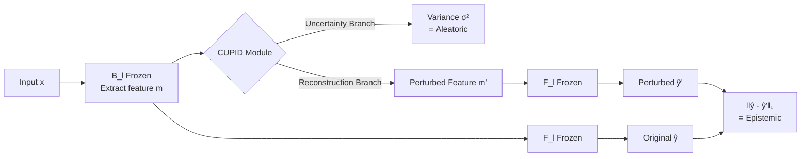

# CUPID: A Plug-in Framework for Joint Aleatoric and Epistemic Uncertainty Estimation with a Single Model

**Conference**: ICLR 2026  
**OpenReview**: [https://openreview.net/forum?id=nF81AkEzXg](https://openreview.net/forum?id=nF81AkEzXg)  
**Code**: [https://github.com/a-Fomalhaut-a/CUPID](https://github.com/a-Fomalhaut-a/CUPID)  
**Area**: Uncertainty Estimation / Trustworthy Deep Learning (Medical Imaging, OOD Detection)  
**Keywords**: aleatoric uncertainty, epistemic uncertainty, plug-in module, OOD detection, misclassification detection  

## TL;DR
CUPID is a plug-and-play module that can be inserted into any intermediate layer of a pre-trained network without structural changes or retraining. It jointly estimates both aleatoric (data noise) and epistemic (model ignorance) uncertainties in a single forward pass.

## Background & Motivation
**Background**: In high-risk scenarios such as medical diagnosis and automated decision-making, overconfidence in deep models can lead to severe consequences, making reliable uncertainty estimation a prerequisite for deployment. Academia generally decomposes uncertainty into two types: aleatoric (stemming from inherent data noise/ambiguity, irreducible) and epistemic (stemming from the model's ignorance of its parameters or insufficient training data coverage, reducible with more data). In diabetic retinopathy or glaucoma screening, high aleatoric uncertainty often implies blurred or noisy images requiring a reshoot, while high epistemic uncertainty suggests a pathological pattern unseen by the model that requires expert review—distinguishing the two directly determines the required action.

**Limitations of Prior Work**: Most existing methods suffer from one of two major flaws. They either estimate only one type of uncertainty or fail to distinguish between them, or they follow a "model-redefining" route—BNNs treating weights as distributions, Evidential Deep Learning using Dirichlet distributions, or Deep Ensembles training multiple models. These require architectural changes or retraining from scratch, are computationally expensive, and are incompatible with legacy systems. Even lightweight "model-preserving" approaches (e.g., MC Dropout, test-time augmentation, gradient norm proxies) often cover only a single type or require multiple forward passes during inference.

**Key Challenge**: Jointly and distinguishably estimating both types of uncertainty while remaining "non-intrusive, zero-retraining, and plug-and-play" are objectives that have been nearly mutually exclusive in prior work.

**Goal**: To develop a truly plug-and-play, model-agnostic general module that outputs both aleatoric and epistemic estimates via a single model and a single forward pass, while allowing insertion at different depths to observe how uncertainty evolves within the network.

**Core Idea**: **[Plug-and-play Trio]** A CUPID module (feature extractor + reconstruction branch + uncertainty branch) is placed at a selected intermediate layer. Aleatoric uncertainty is modeled via a learned "Bayesian Identity Mapping" that outputs input-dependent variance. Epistemic uncertainty is measured by "how much the output changes after structured perturbations to internal features"—turning uncertainty estimation into an interpretable, modular bypass decoupled from the backbone.

## Method

### Overall Architecture
The pre-trained model $M$ is decomposed into $M(x)=F_l(B_l(x))$, where $B_l$ extracts the $l$-th layer intermediate feature $m_{l,n}$, and $F_l$ maps it to the output. The CUPID module $C$ operates on $m_{l,n}$, outputting a perturbed reconstructed feature $m'_{l,n}$ and an aleatoric variance estimate $\hat\sigma_n$. The reconstructed feature is fed back into the remaining part of the network to obtain a perturbed prediction $\hat y' = F_l(m'_{l,n})$. The gap between the original prediction $\hat y$ and the perturbed prediction $\hat y'$ serves as the epistemic estimate. Only the CUPID module is trained during this process ($F_l$ and $B_l$ remain frozen).

### Key Designs

**1. Bayesian Identity Mapping for Aleatoric Estimation: Letting the network emit input-dependent variance.** CUPID assumes the output is corrupted by heteroscedastic Gaussian noise, i.e., $p(y_n\mid x_n,\theta,\omega)=\mathcal N(\hat y'_n,\hat\sigma_n^2)$, where $\hat\sigma_n^2$ is predicted by the uncertainty branch based on the input. By maximizing the log-likelihood, the loss collapses into a familiar heteroscedastic regression objective—predicting log-variance $s_n=\log\hat\sigma_n^2$ for numerical stability:

$$\mathcal L_{alea}=\frac1N\sum_n\Big[\tfrac12\exp(-s_n)\lVert y_n-\hat y'_n\rVert_2^2+\tfrac12 s_n\Big]$$

The predicted variance $\hat\sigma_n^2$ is used directly as the aleatoric estimate $U_{alea}(x_n)$. This likelihood principle also applies to classification: by treating Softmax probabilities and one-hot labels as continuous distributions, a Brier-style heteroscedastic objective can be defined.

**2. Structured Perturbation for Epistemic Estimation: Pushing features as far as possible under the constraint of "minimal output change."** The reconstruction branch is trained to find $m'_{l,n}$ that is as far as possible from the original feature in feature space but maintains a consistent prediction when fed back. The loss balances "maximizing feature change" against "maintaining prediction consistency":

$$\mathcal L_{epis}=\frac1N\sum_n\Big(\lVert\hat y_n-\hat y'_n\rVert_1-\lambda_1\lVert m'_{l,n}-m_{l,n}\rVert_1\Big)$$

To avoid trivial solutions where perturbations blow up infinitely, CUPID is initialized near the identity mapping. Epistemic uncertainty is quantified as $U_{epis}(x)=\lVert F_l(m_{l,n})-F_l(m'_{l,n})\rVert_1$.

**3. First-order Taylor Interpretation: Epistemic $\propto$ Sensitivity $\times$ Deviation, unifying two failure modes.** A first-order Taylor expansion of $F_l$ at $m_{l,n}$ yields:

$$U_{epis}(x)\approx\lVert\nabla_{m_{l,n}}F_l(m_{l,n})\cdot(m'_{l,n}-m_{l,n})\rVert_1\;\propto\;\text{Sensitivity}\times\text{Deviation}$$

The Jacobian reflects the local sensitivity of the output to feature perturbations, and the perturbation magnitude $\lVert m'-m\rVert_1$ reflects the degree to which the sample deviates from the training manifold. In-distribution misclassified samples often exhibit high sensitivity, while OOD samples show abnormally large deviations. CUPID responds to both failure modes with the same metric, which is the fundamental reason it works for both misclassification and OOD detection.

**4. Unified Loss and Joint Optimization.** The total loss is $\mathcal L_{CUPID}=\mathcal L_{epis}+\lambda_2 \mathcal L_{alea}$, where both types of uncertainty are learned simultaneously within a single model, with $\lambda_2$ balancing the two terms.

## Key Experimental Results

### Main Results

Misclassification detection in medical imaging (misclassified samples as positive cases):

| Method | GLV2 AUC↑ | GLV2 AURC↓ | HAM10000 AUC↑ | HAM10000 Spearman↑ |
|------|-----------|------------|---------------|--------------------|
| **CUPID Alea.** | **0.870** | **0.018** | 0.769 | 0.722 |
| **CUPID Epis.** | 0.769 | 0.034 | **0.855** | 0.907 |
| MC Dropout | 0.768 | 0.027 | 0.829 | 0.861 |
| Rate-in | 0.815 | 0.024 | 0.846 | 0.915 |
| BNN | 0.829 | 0.025 | 0.793 | 0.821 |

Aleatoric uncertainty dominates on GLV2 (CUPID Alea. is best), while epistemic uncertainty dominates on HAM10000 (CUPID Epis. is best)—the same framework automatically reveals the dominant source of uncertainty across different datasets.

OOD Detection (OOD samples as positive cases, ID=GLV2):

| Method | PAPILA AUC↑ | ACRIMA AUC↑ | CIFAR10 AUC↑ |
|------|-------------|-------------|--------------|
| **CUPID Alea.** | 0.379 | 0.717 | **0.983** |
| ****CUPID Epis.** | **0.877** | **0.978** | 0.898 |
| MC Dropout | 0.733 | 0.869 | 0.887 |
| IGRUE | 0.636 | 0.941 | 0.978 |

Subtle distribution shifts within the same task (PAPILA/ACRIMA are glaucoma datasets) are captured most accurately by epistemic uncertainty; extreme domain differences (CIFAR-10) are captured best by aleatoric uncertainty (AUC 0.983), as it assigns high variance to inputs that are both rare and unpredictable.

Super-resolution regression (Pearson correlation↑, higher is better):

| Method | Set5 | BSDS100 | IXI(MRI) |
|------|------|---------|----------|
| **CUPID Alea.** | **0.528** | **0.536** | 0.677 |
| ****CUPID Epis.** | 0.416 | 0.464 | **0.734** |
| BayesCap | 0.485 | 0.427 | 0.447 |
| in-rotate | 0.493 | 0.465 | 0.598 |

Aleatoric uncertainty dominates on natural images; however, epistemic uncertainty takes the lead on IXI brain MRI (large shift from DIV2K training distribution), confirming that epistemic uncertainty is more informative under domain shift.

### Ablation Study

Impact of differential feature loss ("No max" = removing the $-\lambda_1\lVert m'-m\rVert_1$ term) on OOD detection:

| Configuration | PAPILA AUC↑ | ACRIMA AUC↑ | CIFAR10 AUC↑ |
|------|-------------|-------------|--------------|
| Max (Epis.) | **0.877** | 0.978 | 0.898 |
| No max (Epis.) | 0.839 | 0.977 | — |

Removing the "push features away" term significantly degrades epistemic performance (especially for subtle shifts like PAPILA), indicating that "maximizing deviation" through structured perturbation is key to epistemic estimation.

### Key Findings
- **Insertion position determines uncertainty type**: As CUPID moves closer to the output layer, aleatoric estimation becomes more accurate; closer to the input or shallower layers, epistemic estimation improves. This aligns with the concept that aleatoric uncertainty is more prominent in high-level semantic features, while epistemic uncertainty reflects how representations propagate and accumulate, primarily in the final layers.
- **Estimating aleatoric uncertainty directly from input features is insufficient**; deeper activations are required for reliable signals.
- **Complementarity**: Across various types of shifts (cross-task/cross-domain), at least one of the two branches remains robust.

## Highlights & Insights
- **Truly non-intrusive**: The backbone remains frozen throughout, with only a bypass module being trained. This provides native compatibility with deployed systems and saves retraining costs, a major engineering advantage over BNN/Deep Ensemble/EDL.
- **Theoretical decomposition**: By decomposing epistemic uncertainty into "Sensitivity $\times$ Deviation" via Taylor expansion, the paper provides a clear theoretical explanation for why a single metric captures both misclassification and OOD detection, rather than relying on empirical heuristic alone.
- **Insertion as an analytical tool**: By inserting modules at different layers, the authors provide an interpretable conclusion that "epistemic accumulates in deep layers, while aleatoric emerges at high-level semantic stages," offering independent value for understanding internal model uncertainty.
- **Broad applicability**: Covers classification/regression across medical, natural, and MRI domains, while automatically revealing the dominant uncertainty type for each dataset, which directly guides risk-aware decisions (e.g., reshoot vs. review vs. data augmentation).

## Limitations & Future Work
- The dominant branch (aleatoric vs. epistemic) is highly dataset-dependent, requiring both branches to run simultaneously. How to automatically select or fuse them in practical deployment remains a manual judgment.
- "Maximizing feature deviation" for epistemic estimation relies on identity mapping initialization to avoid trivial solutions, and hyperparameters like $\lambda_1, \lambda_2$ are sensitive without adaptive settings.
- Evaluations are based on medium-scale models like ResNet18 and ESRGAN; scalability and overhead for Large Language Models (LLMs), Transformers, and multi-modal scenarios have not yet been verified.
- Epistemic estimation requires two $F_l$ forward passes (original and perturbed), incurring additional computation compared to a pure aleatoric single-branch approach.

## Related Work & Insights
- **Model-redefining**: BNNs (weights as distributions), Evidential Deep Learning (Dirichlet framework), Deep Ensembles, HyperDM (Bayesian Hypernet + Conditional Diffusion)—powerful but require architecture modification or retraining.
- **Model-preserving**: MC Dropout, test-time augmentation, gradient norm proxies, BayesCap (uncertainty on frozen outputs), Rate-In (adaptive dropout), RUE (reconstruction error for distribution shift)—CUPID belongs to this category but uniquely estimates both types jointly and allows insertion at any layer.
- **Insights**: The "Bayesian Identity Mapping" from BayesCap is adapted for the aleatoric branch; the adversarial reconstruction idea of "maximizing feature perturbation under an output-invariant constraint" can be transferred to representation robustness analysis and OOD scoring function design.

## Rating
- **Novelty**: ⭐⭐⭐⭐ — The combination of "plug-and-play" with "single-model joint estimation" is rare in model-preserving methods. The "Sensitivity $\times$ Deviation" explanation provides clear intuition.
- **Experimental Thoroughness**: ⭐⭐⭐⭐ — Covers three tasks (Misclassification/OOD/SR), multiple domains (Medical/Natural/MRI), and multiple baselines, including ablation of insertion points and differential losses; however, limited to medium-scale backbones.
- **Writing Quality**: ⭐⭐⭐⭐ — Clear derivations, intuitive diagrams (1D toy, pipeline, layer-wise trends), and the "Cupid's arrow" metaphor for revealing hidden sentiments is apt.
- **Value**: ⭐⭐⭐⭐ — High engineering value for high-risk deployment scenarios like medical imaging: zero retraining, interpretable, and capable of guiding specific actions like reshooting or expert review.

<!-- RELATED:START -->

## Related Papers

- [\[ICLR 2026\] Contextual Similarity Distillation: Ensemble Uncertainties with a Single Model](contextual_similarity_distillation_ensemble_uncertainties_with_a_single_model.md)
- [\[CVPR 2026\] Delving Aleatoric Uncertainty in Medical Image Segmentation via Vision Foundation Models](../../CVPR2026/medical_imaging/delving_aleatoric_uncertainty_in_medical_image_segmentation_via_vision_foundatio.md)
- [\[ICLR 2026\] Joint Adaptation of Uni-modal Foundation Models for Multi-modal Alzheimer's Disease Diagnosis](joint_adaptation_of_uni-modal_foundation_models_for_multi-modal_alzheimers_disea.md)
- [\[CVPR 2026\] A Supervised Multi-task Framework for Joint cryo-ET Restoration Enabled by Generative Physical Simulation](../../CVPR2026/medical_imaging/a_supervised_multi-task_framework_for_joint_cryo-et_restoration_enabled_by_gener.md)
- [\[ICLR 2026\] CARE: Towards Clinical Accountability in Multi-Modal Medical Reasoning with an Evidence-Grounded Agentic Framework](care_towards_clinical_accountability_in_multi-modal_medical_reasoning_with_an_ev.md)

<!-- RELATED:END -->
