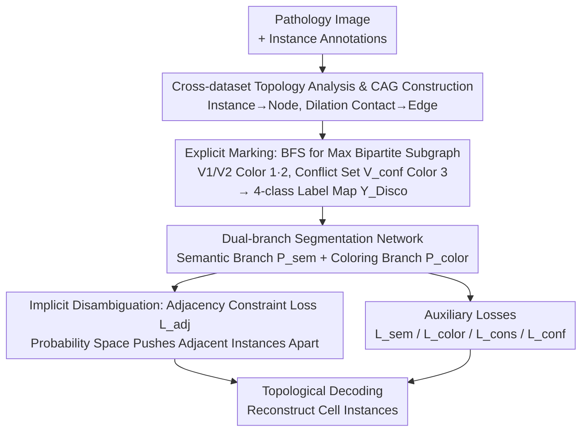

# DISCO: Densely-overlapping Cell Instance Segmentation via Adjacency-aware Collaborative Coloring

**Conference**: ICLR 2026  
**arXiv**: [2602.05420](https://arxiv.org/abs/2602.05420)  
**Code**: [https://github.com/SR0920/Disco](https://github.com/SR0920/Disco)   
**Area**: Medical Imaging / Segmentation  
**Keywords**: Cell Instance Segmentation, Graph Coloring, Dense Overlapping, Adjacency Constraints, Pathological Images

## TL;DR

Ours models densely-overlapping cell instance segmentation as a graph coloring problem and proposes a divide-and-conquer framework, Disco, featuring "explicit marking of conflict nodes + implicit adjacency constraint disambiguation." By decomposing the cell adjacency graph via BFS and introducing five collaborative loss functions, Ours achieves a 7.08% PQ improvement on the high-density pathological dataset GBC-FS 2025 and attains SOTA results across four heterogeneous datasets.

## Background & Motivation

**Background**: Cell instance segmentation is a core task in digital pathology analysis, crucial for cell counting, morphological analysis, and cancer grading. Current mainstream methods can be categorized into four types: detection-based (Mask R-CNN) relying on bounding boxes and NMS, contour-based (DCAN) sensitive to binarization thresholds, distance/orientation map-based (HoverNet, StarDist) requiring complex post-processing, and graph coloring-based (FCIS) modeling from a topological perspective. A common weakness of the first three types is the reliance on local pixel-level or geometric information for instance attribution, which leads to systematic errors in dense cell clusters.

**Limitations of Prior Work**: Graph coloring methods provide a new global-aware paradigm for dense segmentation, yet their core assumptions have significant flaws. The simplest 2-coloring model assumes the cell adjacency graph is bipartite (containing no odd cycles). However, this paper's first systematic analysis across four datasets reveals that real-world cell adjacency graphs are largely non-bipartite. In CryoNuSeg, 56.67% of images contain non-bipartite graphs, and in high-density GBC-FS 2025, up to 30.49% of nodes are conflict nodes. Conversely, the 4-coloring used by FCIS, while complete, introduces unnecessary representation redundancy and optimization difficulties, as most regions only require 2 colors.

**Key Challenge**: This is a "Goldilocks problem": 2-coloring is too simple to handle odd-cycle topological conflicts, while 4-coloring is too complex, imposing a learning burden on simple regions. A solution is needed that efficiently handles the primary bipartite structure while dynamically addressing sparse conflict regions.

**Goal**: (1) How to systematically characterize the topological properties of real cell adjacency graphs? (2) How to design an adaptive coloring framework that degrades to efficient 2-coloring for simple topologies and dynamically handles conflicts in complex ones? (3) How to enable the network to implicitly learn distinctions in a continuous feature space when the label system cannot perfectly encode secondary conflicts?

**Key Insight**: The authors first performed a rigorous topological analysis by constructing Cell Adjacency Graphs (CAG) for four datasets and statistics on node degree distribution, odd cycle distribution, and conflict node ratios. Key findings: (1) Over 90% of odd cycles in all non-bipartite graphs are 3-cycles (triangles); (2) Conflict nodes are often not isolated but form dense "conflict clusters" with numerous "secondary conflicts" (adjacent conflict nodes). This analysis directly guided the framework design: use BFS to efficiently extract the maximum bipartite subgraph for the majority of cells, then use specialized mechanisms for the remaining conflicts.

**Core Idea**: Divide and conquer the graph coloring problem—use BFS to separate the bipartite subgraph for 2-coloring, mark the remaining conflict nodes as a 3rd color, and then use an adjacency constraint loss for implicit disambiguation in the continuous probability space, achieving a collaborative "explicit marking + implicit disambiguation" framework.

## Method

### Overall Architecture

Given a pathological image and its instance annotations, the overall workflow of Disco consists of three stages: (1) **Topology Analysis & Label Generation**: Construct a Cell Adjacency Graph (CAG) from instance masks, define 8-connectivity adjacency via morphological dilation (3×3 kernel), extract the maximum bipartite subgraph via BFS, and partition nodes into two independent sets $V_1, V_2$ (colors 1, 2) and a conflict set $V_{conf}$ (color 3), generating a 4-class annotation map $Y_{Disco} \in \{0,1,2,3\}^{H \times W}$ including background; (2) **Dual-branch Segmentation Network**: A semantic branch predicts the foreground/background semantic map $P_{sem}$, and a coloring branch predicts the 4-class coloring map $P_{color}$; (3) **Decoupled Constraint Loss System**: Five losses optimize collaboratively—semantic loss $\mathcal{L}_{sem}$, coloring loss $\mathcal{L}_{color}$, consistency loss $\mathcal{L}_{cons}$, conflict loss $\mathcal{L}_{conf}$, and the critical adjacency constraint loss $\mathcal{L}_{adj}$. During inference, instances are reconstructed via topological decoding of the coloring map.

### Key Designs

**1. Cross-dataset Topology Analysis and CAG Construction**

The premise of the methodology is verifying whether the graph coloring paradigm fits real cell graphs. The authors converted instance masks into a CAG $G=(V,E)$, where node $v_i$ corresponds to instance $s_i$, and edges are defined by contact after dilation: $E = \{(v_i, v_j) \mid \mathcal{N}(s_i) \cap s_j \neq \emptyset\}$, where $\mathcal{N}(s_i)$ is the pixel set of $s_i$ after 3×3 dilation. Statistics across four datasets showed: PanNuke is 100% bipartite (0% conflict), DSB2018 has a 1.99% conflict rate, CryoNuSeg 5.64%, and high-density GBC-FS 2025 reaches 30.49%. Two structural findings are critical: in all non-bipartite datasets, 3-cycles (triangles) account for over 90% of odd cycles, and in GBC-FS, 24.64% of nodes have "secondary conflicts." This data dictates the framework: conflicts are real but highly localized and mostly triangular, so instead of upgrading to a high-chromatic model, the bipartite majority should be solved minimally while handling conflict residuals separately.

**2. Explicit Marking**

Optimal graph coloring is NP-hard and impractical to solve exactly. Disco runs BFS on the CAG to extract the maximum bipartite subgraph, partitioning nodes into $V_1$ (Color 1), $V_2$ (Color 2), and the conflict set $V_{conf}$ (Color 3). Although one could recursively decompose the residual graph $G_{rem}$, the authors made a key engineering trade-off: all conflict nodes are unified as the 3rd color. The rationale is that conflict nodes are few but topologically complex; further recursive coloring offers diminishing returns with increasing computational cost. This results in a 4-value label map $Y_{Disco} \in \{0,1,2,3\}^{H \times W}$. BFS covers most nodes correctly with minimal cost, cleanly separating the "solved bipartite subgraph" from the "pending conflict set," leaving a clear learning target for implicit disambiguation.

**3. Implicit Disambiguation**

Explicit marking leaves a gap—all conflict nodes share "Color 3," and a discrete label system cannot distinguish two adjacent conflict nodes (secondary conflicts). The adjacency constraint loss $\mathcal{L}_{adj}$ fills this gap. It calculates the average color probability vector $\bar{P}(s_i)$ for each instance $s_i$ and minimizes the cosine similarity between endpoints for all edges $(v_i, v_j) \in E$ in the adjacency graph:

$$\mathcal{L}_{adj} = \frac{1}{|E|} \sum_{(v_i,v_j) \in E} \frac{\bar{P}(s_i) \cdot \bar{P}(s_j)}{\|\bar{P}(s_i)\| \|\bar{P}(s_j)\|}$$

This can be viewed as a supervised contrastive loss: pixels within the same instance are positive samples (aggregated by $\mathcal{L}_{color}$), while adjacent instances are explicit negative samples (pushed apart by $\mathcal{L}_{adj}$). Its elegance lies in reinforcing the orthogonal 2-color coding in bipartite regions while forcing the network to learn separable representations in secondary conflict regions. Since the constraint is applied in the probability space rather than the feature space, backpropagation pushes nodes with the same label but different topologies toward distinct probability distributions. Ablation studies confirm that $\mathcal{L}_{adj}$ alone contributes +5.69% to PQ, the largest contribution among the five losses.

### Loss & Training

The total loss is a linear combination of five components: $\mathcal{L}_{total} = \mathcal{L}_{sem} + \mathcal{L}_{color} + \mathcal{L}_{cons} + \mathcal{L}_{conf} + \mathcal{L}_{adj}$

- $\mathcal{L}_{sem}$: Binary cross-entropy loss for foreground/background semantic segmentation.
- $\mathcal{L}_{color}$: Weighted cross-entropy loss for the 4 coloring classes, with class balancing for the conflict category.
- $\mathcal{L}_{cons}$ (Consistency Loss): Suppresses pixels in bipartite regions from being predicted as the conflict color, $\mathcal{L}_{cons} = \mathbb{E}_{i \in M_{bip}}[(\sigma(P_{color}(i))_t)^2]$—driving conflict color probability toward 0 for bipartite nodes.
- $\mathcal{L}_{conf}$ (Conflict Loss): Encourages conflict regions to accurately predict the conflict color, $\mathcal{L}_{conf} = \mathbb{E}_{i \in M_{conf}}[(1 - \sigma(P_{color}(i))_t)^2]$—driving conflict color probability toward 1 for conflict nodes.
- $\mathcal{L}_{adj}$ (Adjacency Constraint Loss): Pushes apart feature representations of adjacent instances in the probability space (as described above).

$\mathcal{L}_{cons}$ and $\mathcal{L}_{conf}$ form a "push-pull" mechanism. Training utilizes the Adam optimizer with an initial learning rate of $1 \times 10^{-4}$, weight decay of $5 \times 10^{-4}$, 10x decay at epoch 70, linear warmup for the first 100 iterations, and total 200 epochs on 8 × RTX 4090.

## Key Experimental Results

### Main Results

Comprehensive comparison with 8 mainstream methods across four datasets (showing AJI and PQ):

| Dataset | Method | AJI (↑) | PQ (↑) | Note |
|:---|:---|:---:|:---:|:---|
| PanNuke | CellPose | 0.6262 | 0.5918 | Dist/Orient Map |
| PanNuke | FCIS | 0.6394 | 0.6109 | 4-Coloring |
| PanNuke | **Disco** | **0.6566** | **0.6271** | Gain +1.62% PQ |
| DSB2018 | CellPose | 0.8247 | 0.7647 | Dist/Orient Map |
| DSB2018 | FCIS | 0.8287 | 0.7739 | 4-Coloring |
| DSB2018 | **Disco** | **0.8426** | **0.7781** | Gain +0.42% PQ |
| CryoNuSeg | CellPose | 0.5876 | 0.5724 | Dist/Orient Map |
| CryoNuSeg | FCIS | 0.5944 | 0.5793 | 4-Coloring |
| CryoNuSeg | **Disco** | **0.6134** | **0.5970** | Gain +1.77% PQ |
| GBC-FS 2025 | CellPose | 0.4376 | 0.4218 | Dist/Orient Map |
| GBC-FS 2025 | FCIS | 0.4518 | 0.4379 | 4-Coloring |
| GBC-FS 2025 | **Disco** | **0.5209** | **0.5087** | **Gain +7.08% PQ** |

### Ablation Study

Framework-level comparison (GBC-FS 2025):

| Method | Coloring Scheme | Adj. Constraint | DICE | AJI | PQ |
|:---|:---:|:---:|:---:|:---:|:---:|
| Baseline | 2-Color | None | 0.727 | 0.379 | 0.338 |
| FCIS | 4-Color | Orthogonal Cons. | 0.779 | 0.452 | 0.438 |
| **Disco** | **Explicit Marking** | **Prob. Space $\mathcal{L}_{adj}$** | **0.814** | **0.521** | **0.509** |

Loss component ablation (GBC-FS 2025):

| Configuration | $\mathcal{L}_{cons}$ | $\mathcal{L}_{conf}$ | $\mathcal{L}_{adj}$ | AJI | PQ |
|:---|:---:|:---:|:---:|:---:|:---:|
| Explicit Marking Only | ✗ | ✗ | ✗ | 0.449 | 0.426 |
| + Consist. + Conflict | ✓ | ✓ | ✗ | 0.471 | 0.458 |
| + Adj. Constraint | ✗ | ✗ | ✓ | 0.506 | 0.483 |
| **Disco (Full)** | **✓** | **✓** | **✓** | **0.521** | **0.509** |

### Key Findings

- **Higher conflict rates lead to greater advantages for Disco**: In GBC-FS 2025 (30.49% conflict), Disco improves PQ by 7.08% (absolute) / 16.2% (relative) over FCIS. In PanNuke (0% conflict), Disco improves by only 1.62%, indicating adaptive degradation to efficient 2-coloring.
- **$\mathcal{L}_{adj}$ is the core engine**: Adding $\mathcal{L}_{adj}$ alone (without $\mathcal{L}_{cons}$/$\mathcal{L}_{conf}$) boosts PQ from 0.426 to 0.483 (+5.69%), far exceeding the contribution of consistency + conflict losses (+3.26%).
- **Disco vs 4-Coloring**: Disco (dynamic 2+1 coloring) consistently outperforms FCIS (fixed 4-coloring), proving that a divide-and-conquer strategy is superior to brute-force color increases—fewer colors provide clearer learning targets, leaving conflict handling to the loss function.
- **SQ Dimension Advantage**: On DSB2018, while FCIS is slightly better in DQ, Disco leads significantly in SQ, suggesting more precise cell contour generation.

## Highlights & Insights

- **"Analysis-before-design" paradigm**: The paper performs a systematic topological analysis before proposing the method, revealing the failure modes of 2-coloring. This data-driven methodology avoids arbitrary design.
- **Elegant divide-and-conquer**: Instead of pursuing a theoretically complete high-chromatic model (4-coloring), Ours utilizes the empirical finding that "most graphs are bipartite." Handling the majority with 2-coloring and exceptions with a 3rd color plus continuous constraints is a robust "coarse label + fine constraint" approach.
- **Clever adjacency constraint loss**: Applying cosine similarity constraints in the probability space (rather than feature space) directly targets the classification decision boundary. The definition of "positive = same instance, negative = adjacent instance" naturally leverages topological information.
- **Conflict map as an interpretability tool**: The predicted conflict map can quantify tissue topological complexity, offering new perspectives for data-driven pathology—beyond segmentation, it indicates regions of complex cell arrangement.

## Limitations & Future Work

- **Non-uniqueness of BFS decomposition**: BFS results depend on the starting node; different random starts might produce different partitions of $V_1, V_2, V_{conf}$. The impact on training stability was not discussed.
- **Information loss in Color 3**: Tagging all conflict nodes with one label loses information when the conflict set's internal structure is complex (e.g., $\chi(G_{rem}) > 2$). Recursive decomposition of $V_{conf}$ could be considered.
- **Dataset homogeneity**: All four datasets involve H&E or fluorescence-stained nuclei. Generalization to other dense instance segmentation scenarios (e.g., remote sensing, crowds, dense text) remains unverified.
- **Inference efficiency**: The overhead of constructing CAG from predicted masks and decoding was not discussed, which could be a bottleneck in real-time pathology analysis.

## Related Work & Insights

- **vs FCIS (ICML 2025)**: The first to introduce 4-coloring with fixed mapping and feature orthogonal constraints. Disco improves this via dynamic coloring (reducing learning burden in simple regions) and probability space constraints (more direct classification targeting).
- **vs HoverNet / StarDist**: Classic distance/orientation-based methods restricted by local pixel-level info. Disco avoids error propagation in dense clusters through global topological modeling.
- **vs CellPose (Nature Methods 2025)**: A strong gradient-flow method that still struggles with local information in overlapping scenes. Disco outperforms it across all datasets.
- **Transferable logic**: This "graph-structured divide-and-conquer + continuous space constraint" framework is applicable to any dense instance segmentation task with local topological conflicts, such as stuff-thing boundary handling in panoptic segmentation.

## Rating

- Novelty: ⭐⭐⭐⭐ Combines graph coloring theory with deep learning via divide-and-conquer; solid analysis-led design.
- Experimental Thoroughness: ⭐⭐⭐⭐⭐ 4 heterogeneous datasets, 8 baselines, framework/loss ablations, and visualizations.
- Writing Quality: ⭐⭐⭐⭐ Clear logic; natural derivation from analysis to design, though some descriptions are verbose.
- Value: ⭐⭐⭐⭐ Practicalizes the graph coloring paradigm (handling non-bipartite graphs) with direct value for dense pathology segmentation.

<!-- RELATED:START -->

## Related Papers

- [\[ICML 2025\] The Four Color Theorem for Cell Instance Segmentation](../../ICML2025/medical_imaging/the_four_color_theorem_for_cell_instance_segmentation.md)
- [\[ICLR 2026\] ASMIL: Attention-Stabilized Multiple Instance Learning for Whole-Slide Imaging](asmil_attention-stabilized_multiple_instance_learning_for_whole-slide_imaging.md)
- [\[ICLR 2026\] Mixture of Mini Experts: Overcoming the Linear Layer Bottleneck in Multiple Instance Learning](mixture_of_mini_experts_overcoming_the_linear_layer_bottleneck_in_multiple_insta.md)
- [\[ICCV 2025\] COIN: Confidence Score-Guided Distillation for Annotation-Free Cell Segmentation](../../ICCV2025/medical_imaging/coin_confidence_score-guided_distillation_for_annotation-free_cell_segmentation.md)
- [\[ICLR 2026\] Prior-aware and Context-guided Group Sampling for Active Probabilistic Subsampling](prior-aware_and_context-guided_group_sampling_for_active_probabilistic_subsampli.md)

<!-- RELATED:END -->
