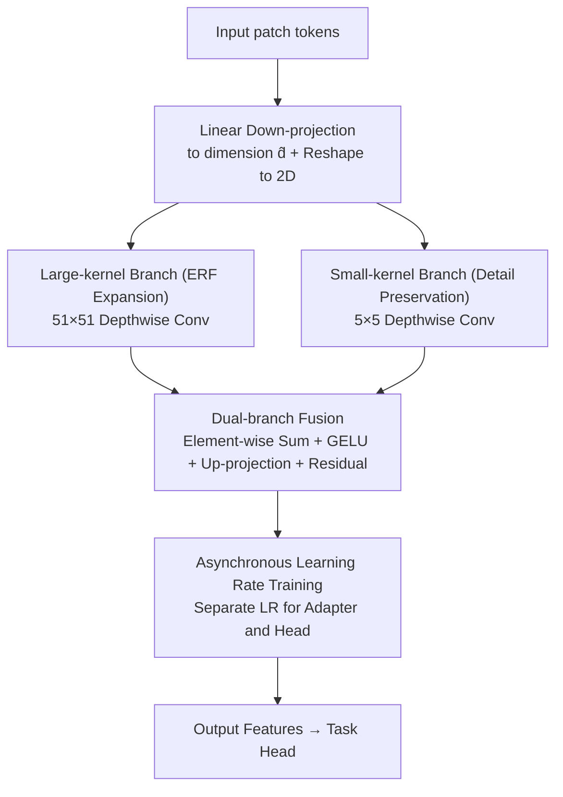

# Dual-Kernel Adapter: Expanding Spatial Horizons for Data-Constrained Medical Image Analysis

**Conference**: ICLR2026  
**OpenReview**: [https://openreview.net/forum?id=Z6KGt1veeP](https://openreview.net/forum?id=Z6KGt1veeP)  
**Code**: https://github.com/misswayguy/DKA  
**Area**: Medical Imaging / Parameter-Efficient Fine-Tuning  
**Keywords**: Adapter, Effective Receptive Field, Large Kernel Convolution, Low-data, Medical Imaging

## TL;DR
The authors first systematically demonstrate that in data-scarce medical imaging scenarios, standard Adapters are not only ineffective but can even perform worse than pure linear probing. The root cause is identified as the sharp contraction of the Effective Receptive Field (ERF) of the Adapter when training data is limited. Based on this, the Dual-Kernel Adapter (DKA) is proposed, which utilizes a parallel fusion of a large-kernel ($51 \times 51$) depthwise convolution to expand the ERF and a small-kernel ($5 \times 5$) depthwise convolution to preserve local details. DKA achieves new SOTA results across classification and segmentation tasks using both natural-image and medical-image pre-trained backbones.

## Background & Motivation
**Background**: When transferring large pre-trained models to downstream tasks, Parameter-Efficient Fine-Tuning (PEFT) methods like Adapters have become mainstream. These methods freeze the backbone and only train small inserted modules, saving both memory and annotation costs. They are particularly popular in medical imaging due to the field's inherent resource constraints.

**Limitations of Prior Work**: Annotating medical images is extremely expensive; radiologists must delineate structures on high-resolution 2D/3D scans. Coupled with privacy regulations like HIPAA and GDPR and inter-institutional data silos, available data is often fragmented. Consequently, many clinical tasks operate in extreme low-data regimes with "less than 1% of training data." However, little research has investigated whether Adapters remain effective under such data constraints.

**Key Challenge**: The authors conducted a sweep from $0.63\%$ to $100\%$ training data using ViT-B, Swin-T, and Swin-B on datasets like COVID, BUSI, and ISIC-2019. They discovered a counter-intuitive phenomenon: the less data available, the smaller the gain provided by the Adapter. When training data drops to $1\%$ or below, the Adapter's gain on medical data becomes **negative**—performing worse than freezing the backbone and training only a linear head (linear probing). Further visualization revealed that as training data decreases, the **Effective Receptive Field (ERF)** learned by the Adapter shrinks. Since medical images often feature low contrast, blurred boundaries, and small, irregular lesions, they necessitate a large receptive field to capture long-range context. Standard Adapters lack any inductive bias to "expand the ERF," failing to maintain a sufficient receptive field when supervision signals are sparse.

**Goal**: To design a new Adapter with an inherent inductive bias for "expanding the ERF," ensuring stable gains in extreme low-data scenarios without sacrificing performance on full datasets.

**Key Insight**: Since the problem stems from a small ERF, and existing research (e.g., RepLKNet, SLaK) indicates that large-kernel convolutions can significantly expand the ERF and introduce strong inductive biases for capturing wide-range context, large-kernel convolutions should be integrated into the Adapter. To prevent the loss of local details caused by pure large kernels, a parallel small-kernel branch is added as a safeguard.

**Core Idea**: Replace the bottleneck transformation within the Adapter with a dual-branch depthwise convolution ("large kernel for field of view + small kernel for detail"), equipping the Adapter with a structure that inherently favors a large ERF.

## Method

### Overall Architecture
DKA (Dual-Kernel Adapter) essentially modifies the "intermediate transformation" of a standard bottleneck Adapter. While a standard Adapter follows the "down-projection → non-linearity → up-projection + residual" structure, DKA replaces the middle section with a dual-branch depthwise convolution module. Specifically, input patch tokens are first compressed to an intermediate dimension $\hat d$ via linear down-projection and reshaped back to a 2D spatial layout. They are then fed into two parallel depthwise convolution branches: a large-kernel ($51 \times 51$) branch to expand the ERF and model long-range dependencies, and a small-kernel ($5 \times 5$) branch to preserve fine-grained local structures. The outputs of the two branches are element-wise summed, passed through a GELU activation, linearly up-projected back to the original dimension, and finally added to the input via a residual connection. These DKA modules are inserted into Transformer blocks following the strategy of Yin et al. (2024). During training, only the DKA modules and the task head are updated, while the backbone is frozen.

Formally, the DKA operation is defined as:

$$f_{\text{DKA}}(x) = x + \text{Up}\big(\sigma(\text{DWConv}_{\text{large}}(\text{Down}(x)) + \text{DWConv}_{\text{small}}(\text{Down}(x)))\big)$$

where $\text{Down}(\cdot)$ and $\text{Up}(\cdot)$ are linear projections, $\text{DWConv}_{\text{large}}$ and $\text{DWConv}_{\text{small}}$ are depthwise convolutions with kernel sizes 51 and 5 respectively, and $\sigma$ is GELU.

### Key Designs

**1. Diagnosis: Attributing Adapter Failure in Low-data Regimes to ERF Contraction**

This constitutes the foundation of the paper and the basis for subsequent design. Instead of arbitrarily creating a module, the authors conducted the "first systematic study" evaluating the net gain of Adapters as $\Delta\text{ACC} = \text{ACC}_{\text{LinearProbing+Adapter}} - \text{ACC}_{\text{LinearProbing}}$ across three backbones and five datasets, scanning training volumes from $0.63\%$ to $100\%$. The conclusions are three-fold: ① Adapter gains decrease as data decreases, with medical data (out-of-domain) showing a much sharper decline than natural images (in-domain). ② When data is $\le 1\%$, $\Delta\text{ACC}$ for medical tasks turns negative, meaning the Adapter hinders the model. ③ Visualization using the ERF definition by Araujo et al. (2019) (the non-negligible impact area of output units on input pixels) shows that ERF shrinks as training data decreases. This establishes a testable causal hypothesis: low supervision limits the Adapter's ability to learn spatially diffused features and long-range dependencies, which are critical for medical imaging.

**2. Dual-Kernel Parallelism: Large Kernel for ERF, Small Kernel for Detail**

To address the diagnosed ERF deficiency, DKA parallelizes two depthwise convolutions within the bottleneck. The large kernel ($51 \times 51$) provides a strong inductive bias to expand the receptive field and model long-range context. However, as large kernels can lose fine-grained local information like lesion boundaries, a parallel small kernel ($5 \times 5$) is included. Using depthwise convolutions ensures controllable computational overhead. Ablations (Single vs. Dual) show that neither a single $51 \times 51$ nor a single $5 \times 5$ kernel outperforms the dual-branch setup, especially in low-data regimes. Kernel size sweeps confirmed that $5 \times 5 + 51 \times 51$ is the optimal combination.

**3. Large Kernel, Not Parameter Count, Drives the Gain**

To address whether DKA's gains simply stem from increased parameters, the authors conducted a controlled experiment. Fixing the intermediate dimension $\hat d = 16$, they increased parameter counts **only by enlarging the kernel size** ($11 \times 11 \to 51 \times 51$). Simultaneously, they increased the $\hat d$ of other Adapter baselines to match DKA's parameter count. The result: DKA consistently led under the same parameter budget, and the performance slope for "increasing kernel size" was significantly steeper than for "increasing hidden dimension." This confirms that credits belong to the ERF expansion rather than pure parameter scaling.

**4. Asynchronous Learning Rate: Critical Key to Performance**

A common training detail is revealed: using the same learning rate (LR) for the Adapter and the task head is suboptimal. After scanning LR combinations on COVID + ViT-B (5e-2 to 1e-5), it was found that **asymmetric** learning rates nearly always outperform symmetric configurations. The optimal point is never on the "LR_adapter = LR_head" diagonal. Ultimately, $1e-3$ for DKA modules and $1e-4$ for the task head were chosen. The authors note that asynchronous LRs are "crucial" for DKA's gains, indicating it is a necessary condition for the dual-kernel structure to function effectively.

### Loss & Training
All pre-trained weights are frozen; only DKA modules and task heads are trained. Intermediate dimension $\hat d$ is set to 16 for classification and 192 for segmentation. LR for the head is 1e-4, and 1e-3 for DKA. Classification is trained for 100 epochs, and segmentation for 300 epochs. For data volumes below $100\%$, 5-fold cross-validation is used with a fixed test set, reporting the average.

## Key Experimental Results

### Main Results
ACC (%) for three classification datasets using ViT-B backbone, comparing low-data (0.63%, 1.25%) and full-data (100%) scenarios:

| Dataset | Data Vol. | **Ours (DKA)** | Adapter | Convpass | Linear Probing | Full FT |
| :--- | :--- | :--- | :--- | :--- | :--- | :--- |
| COVID | 0.63% | **89.01** | 83.29 | 84.72 | 86.84 | 87.43 |
| COVID | 100% | **99.21** | 98.33 | 98.45 | 94.85 | 98.43 |
| BUSI | 0.63% | **74.23** | 63.18 | 64.83 | 73.48 | 71.17 |
| ISIC-2019 | 0.63% | **60.52** | 52.77 | 54.72 | 59.15 | 60.04 |

Segmentation (mIoU %) using Segmenter-B backbone shows similar leads; e.g., on BUSI 0.63%, DKA 26.85 vs. Adapter 18.18 and Linear Probing 25.53. Conclusions hold on medical pre-trained backbones (RadImageNet-ResNet-50 for classification, MedSAM for segmentation).

**Key Observation**: In low-data regimes, most PEFT methods (BitFit, Prompt, LoRA, Adapter) fall below Linear Probing, while **Ours (DKA)** is the only one to **outperform Full Fine-tuning** at $0.63\%$ data.

### Ablation Study

| Configuration | Key Metric (BUSI, 0.63% ACC) | Description |
| :--- | :--- | :--- |
| Dual (5×5 + 51×51) | **74.23** | Full dual-kernel, optimal |
| Single (51×51) | < 74.23 | Large kernel only, loses local details |
| Single (5×5) | < 74.23 | Small kernel only, insufficient ERF |
| Kernel Combo 51×51 + 3×3 | 65.58 | Small kernel too small |
| Kernel Combo 71×71 + 5×5 | 72.41 | Large kernel too large (over-smoothing) |
| Dimension $\hat d=16$ | 74.23 | Optimal for classification |

### Key Findings
- **Large kernel is the primary driver**: Under equal parameter budgets, the performance gain from increasing kernel size is steeper than increasing dimension.
- **Dual branches are indispensable**: Neither single kernel branch beats the parallel setup, with the gap most pronounced in low-data regimes.
- **Asynchronous LR is vital**: Optimal LR combinations never lie on the "equal LR" diagonal.
- **Dimension sweet spot**: For classification, $\hat d=16$ is optimal (further increase leads to overfitting), whereas segmentation requires $\hat d=192$.

## Highlights & Insights
- **Diagnosis before Prescription**: Unlike many works that simply propose a "stronger module," DKA meticulously proves that "ERF contraction" is the root cause of low-data failure.
- **Grafting Large Kernel Inductive Bias into PEFT**: While large kernels are proven in backbone design, distilling them into a tiny Adapter module specifically for "low-data + out-of-domain" medical scenarios is a clean and effective transfer.
- **Reusable "Free Lunch"**: Asynchronous learning rates cost nothing but are proven crucial, suggesting they could be applied to other PEFT methods.

## Limitations & Future Work
- **Overhead of 51×51 Kernels**: While depthwise convolutions mitigate costs, the computation/memory performance of super-large kernels on high-resolution 3D medical volume data needs further verification (largely 2D in this paper).
- **Empirical Causal Chain**: The "low data → ERF shrinkage → performance drop" link is an observationally supported hypothesis but lacks rigorous theoretical derivation.
- **Task-dependent Tuning**: Optimal $\hat d$ varies significantly (16 vs 192) between tasks, and the fixed 51 kernel size is empirical.

## Related Work & Insights
- **vs. Standard Adapter / AdapterFormer / Convpass**: These lack the inductive bias to expand ERF; Convpass uses a tiny 3x3 kernel which is insufficient for long-range context. **Ours (DKA)** addresses ERF directly with a 51x51 kernel.
- **vs. LoRA / BitFit / Prompt**: These methods generally fall below Linear Probing in extreme low-data medical tasks because they modify attention/biases/tokens rather than addressing the spatial receptive field deficiency.
- **vs. Large-Kernel Backbones (RepLKNet / SLaK)**: While those use large kernels in full-scale training, DKA concentrates the idea into a frozen backbone + small adapter paradigm for low-data transfer.

## Rating
- Novelty: ⭐⭐⭐⭐ Precisely grafts large-kernel ERF expansion into PEFT with a solid diagnostic motivation.
- Experimental Thoroughness: ⭐⭐⭐⭐⭐ Includes classification, segmentation, multiple backbones, and exhaustive ablations on parameters, kernels, and LRs.
- Writing Quality: ⭐⭐⭐⭐ Strong logical loop from diagnosis to design to validation.
- Value: ⭐⭐⭐⭐ Highly applicable to real-world medical imaging where data is scarce; lightweight and open-source.

<!-- RELATED:START -->

## Related Papers

- [\[NeurIPS 2025\] STAMP: Spatial-Temporal Adapter with Multi-Head Pooling](../../NeurIPS2025/medical_imaging/stamp_spatial-temporal_adapter_with_multi-head_pooling.md)
- [\[AAAI 2026\] Decoding with Structured Awareness: Integrating Directional, Frequency-Spatial, and Structural Attention for Medical Image Segmentation](../../AAAI2026/medical_imaging/decoding_with_structured_awareness_integrating_directional_frequency-spatial_and.md)
- [\[CVPR 2026\] SemiGDA: Generative Dual-distribution Alignment for Semi-Supervised Medical Image Segmentation](../../CVPR2026/medical_imaging/semigda_generative_dual-distribution_alignment_for_semi-supervised_medical_image.md)
- [\[ICLR 2026\] CONSIGN: Conformal Segmentation Informed by Spatial Groupings via Decomposition](consign_conformal_segmentation_informed_by_spatial_groupings_via_decomposition.md)
- [\[CVPR 2025\] SACB-Net: Spatial-Awareness Convolutions for Medical Image Registration](../../CVPR2025/medical_imaging/sacb-net_spatial-awareness_convolutions_for_medical_image_registration.md)

<!-- RELATED:END -->
