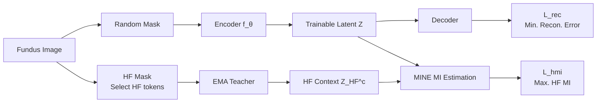

# Frequency-Balanced Retinal Representation Learning with Mutual Information Regularization

**Conference**: ICLR 2026  
**OpenReview**: [https://openreview.net/forum?id=K5tcKEQaUr](https://openreview.net/forum?id=K5tcKEQaUr)  
**Code**: TBD  
**Area**: Medical Imaging / Self-Supervised Representation Learning  
**Keywords**: Retinal fundus images, Masked Autoencoder, frequency bias, mutual information regularization, information bottleneck  

## TL;DR
The authors analyze Masked Autoencoders (MAE) from a spatial frequency perspective, discovering a preference for low-frequency backgrounds and an under-encoding of diagnostically critical high-frequency details. They propose RetMAE: a framework that, without modifying the architecture, introduces a High-Frequency Mutual Information (HighFreqMI) regularization. This allows the retinal encoder to learn "frequency-balanced" representations, surpassing existing fundus foundation models using only ~25.6k unlabeled fundus images.

## Background & Motivation
**Background**: Foundation models for fundus photography primarily follow two paths: self-supervised learning (represented by MAE / RETFound) and vision-language pre-training (represented by RET-CLIP). The latter requires expensive and scarce image-text pairs, making MAE-based methods that consume large amounts of unlabeled data more practical for open-domain applications.

**Limitations of Prior Work**: The reconstruction objective of MAE (random masking + pixel-level MSE) implicitly assumes that "information density is uniform across image regions." However, fundus images are the opposite—most areas consist of smooth low-frequency backgrounds, while diagnostic structures (microaneurysms, exudates, hemorrhages, optic discs, vascular edges) are sparsely concentrated in high-frequency bands. This "uniform information assumption" is severely misaligned with the "strong spatial heterogeneity" of diagnostic signals in fundus images.

**Key Challenge**: The authors used Centered Kernel Alignment (CKA) to quantify the alignment between MAE features and frequency-separated inputs, revealing a counter-intuitive phenomenon (Table 1): MAE representations are highly aligned with low-frequency components (CKA=0.990) but nearly unaligned with high-frequency components (CKA=0.164). Conversely, linear probing AUROC shows the opposite—retaining only 25% of high-frequency tokens yields the highest AUROC (0.727), far exceeding random masking (0.647) or low-frequency retention (0.641) under the same token budget. In other words, **MAE prioritizes encoding the least useful (low-frequency) information**, suppressing high-frequency tokens that carry primary diagnostic signals.

**Goal**: To correct the low-frequency bias of MAE without altering the backbone or introducing image-text pairs, learning "compact yet diagnostically sufficient" frequency-balanced representations.

**Core Idea**: Reformulate MAE as a Mutual Information (MI) Lagrangian and **use a high-frequency MI regularization to pull the bottleneck's attention from low-frequency redundancy toward high-frequency diagnostic cues**—a correction strictly at the objective function level.

## Method

### Overall Architecture
RetMAE attaches a parallel high-frequency mutual information regularization branch alongside the standard MAE reconstruction branch. Given an input, one path follows standard random masking → encoder $f_\theta$ → decoder for pixel reconstruction $\mathcal{L}_{rec}$. The other path applies "high-frequency masking" (high-frequency tokens only) to the same image, feeding it into an EMA teacher encoder to obtain a compact high-frequency context latent variable $Z^{HF}_c$. The trainable latent variable $Z$ is then aligned with this context using MI estimated via MINE ($\mathcal{L}_{hmi}$). Both branches share the same encoder and are optimized jointly.

### Key Designs

**1. Reformulating MAE as an MI Lagrangian.** Following the information bottleneck perspective, the MAE objective is written as $\mathcal{L}=I(X_V;Z)+\beta\,I(X_V;X_M\mid Z)$. The first term $I(X_V;Z)$ measures the complexity of $Z$ (compression/de-redundancy), and the second term $I(X_V;X_M\mid Z)$ is the "information distortion" (retaining info to predict masked parts $X_M$). Theorem 1 proves that under the assumption of an isotropic Gaussian decoder with fixed variance, minimizing reconstruction MSE is equivalent to minimizing the conditional MI $I(X_V;X_M\mid Z)$. Thus, $\mathcal{L}_{rec}$ already handles the second term. The focus shifts to the first term $I(X_V;Z)$, where MAE currently wastes capacity on low-frequency backgrounds.

**2. Tightening the marginal term $I(X_V;Z)$ via high-frequency context alignment.** Since directly constraining $I(X_V;Z)$ is intractable, the authors use alignment. Theorem 2 provides a bound: if the context representation $Z_c=g(X)$ is $\varepsilon$-compact ($I(X;Z_c)\le\varepsilon$) and $Z$ is aligned to $Z_c$ with error $\delta$, then $I(X_V;Z)\le I(X_V;Z_c)+\delta\le\varepsilon+\delta$. By choosing a **high-frequency focused context**, the model removes redundancy while directing retained information toward diagnostic cues.

**3. HighFreqMI: Aligning trainable latents to EMA HF contexts via MINE.** The high-frequency context $Z^{HF}_c$ is generated by feeding high-frequency tokens into the EMA teacher encoder. As MI is not directly computable, the Donsker–Varadhan lower bound MINE estimator is used: $\mathcal{L}_{MINE}(Z_c,Z)=-\mathbb{E}_{p(Z_c,Z)}[f_\psi(Z_c,Z)]+\log\mathbb{E}_{p(Z_c)\otimes p(Z)}[\exp f_\psi(Z_c,Z')]$. The regularization term is $\mathcal{L}_{hmi}=\mathcal{L}_{MINE}(Z,Z^{HF}_c)$. The total loss is $\mathcal{L}_{total}=\lambda_{rec}\mathcal{L}_{rec}+\lambda_{hmi}\mathcal{L}_{hmi}$. A warmup period is used for $\mathcal{L}_{hmi}$ until the EMA teacher stabilizes.

**4. HF Token Extraction and Optional Auxiliary MI.** HF tokens are selected by processing the green channel (optimized for vessel/lesion contrast) with Soft-FOV masking, Gaussian blurring to suppress low frequencies, and Butterworth high-pass filtering in the Fourier domain. The top **25%** of tokens with the highest response are selected. An auxiliary version adds $\mathcal{L}_{aux}=\mathcal{L}_{MINE}(Z,Z^{aux}_c)$ to align $Z$ with a frozen pre-trained retinal encoder (e.g., RET-CLIP). Fixed weights are $\lambda_{rec}{=}1, \lambda_{hmi}{=}0.1, \lambda_{aux}{=}0.01$.

## Key Experimental Results

Benchmarks include IDRiD, RFMiD (DR and AMD subsets), and CHAKSU, covering Diabetic Retinopathy (DR), AMD, and Glaucoma (GL). APTOS is used for Out-of-Distribution (OOD) testing. Evaluation primarily uses linear probing AUROC.

### Main Results (Linear Probing AUROC)

| Method | Aux Signal | IDRiD | RFMiD(DR) | RFMiD(AMD) | CHAKSU | APTOS† | AVG |
|------|:---:|:---:|:---:|:---:|:---:|:---:|:---:|
| MAE | ✗ | 0.726 | 0.721 | 0.793 | 0.371 | 0.812 | 0.685 |
| RETFound | ✗ | 0.736 | 0.760 | 0.784 | 0.464 | 0.706 | 0.690 |
| **RetMAE** | ✗ | 0.816 | 0.848 | 0.852 | 0.516 | 0.862 | **0.779** |
| UrFound | ✓ | 0.836 | 0.955 | 0.953 | 0.604 | 0.927 | 0.855 |
| MAE | ✓ | 0.887 | 0.949 | 0.959 | 0.912 | 0.910 | 0.923 |
| RET-CLIP | ✓ | 0.898 | 0.955 | 0.962 | 0.930 | 0.940 | 0.937 |
| **RetMAE** | ✓ | 0.910 | 0.952 | 0.980 | 0.911 | 0.952 | **0.941** |

In the image-only (no aux) setting, RetMAE (0.779) significantly outperforms MAE/RETFound. With auxiliary signals, it achieves 0.941, surpassing RET-CLIP (0.937) and reaching 0.952 on the OOD APTOS dataset.

### Ablation Study (Signal-level vs. Latent-level HF, Avg. AUROC)

| Method | AVG | + $\mathcal{L}_{hmi}$ |
|------|:---:|:---:|
| MAE | 0.685 | **0.750** |
| MAE w/ HF masking | 0.679 | 0.737 |
| MAE w/ HF input | 0.746 | 0.769 |

Adding $\mathcal{L}_{hmi}$ consistently improves performance across all MAE variants, indicating that latent-level HF regularization captures information unavailable through input-level modifications (HF masking/concatenation).

### Key Findings
- **Diagnostic Signal Inverse Effect**: Higher alignment with MAE representations (low-freq, CKA=0.990) correlates with lower AUROC (0.641); lower alignment (high-freq, CKA=0.164) yields the highest AUROC (0.727)—confirming MAE prioritizes the least diagnostically valuable bands.
- **Data Efficiency**: With only ~25.6k unlabeled images, RetMAE achieves a macro-AUROC of 0.940, while RETFound and UrFound used 904k and 187k images, respectively.
- **HF Alignment over Language Supervision**: The gains of the auxiliary version (ΔAUROC +0.018) suggest that HF alignment, rather than text supervision, is the primary driver of performance.

## Highlights & Insights
- **Empirical "Counter-intuitive" Evidence**: The use of CKA and linear probing cross-validation rigorously proves that MAE learns the least useful frequency bands best.
- **Theoretical and Engineering Loop**: Theorem 1 and 2 map reconstruction loss and context alignment to MI bounds, providing a solid Information Bottleneck foundation for the HF regularization.
- **Zero Architecture Modification**: Improvements stem entirely from the objective function, allowing it to be applied "plug-and-play" to existing MAE encoders.
- **Data Efficiency**: Outperforming vision-language models with 1/35th of the data is a compelling result for medical imaging where labels are scarce.

## Limitations & Future Work
- HF extraction relies on a manual pipeline (Green channel + Soft-FOV + Butterworth) requiring hyperparameter tuning on a small subset with vessel/lesion labels; its robustness across different devices/modalities needs verification.
- The highest performance (HF input + $\mathcal{L}_{hmi}$ at 0.769) requires architecture changes; the pure latent-level regularization is lighter but slightly less powerful.
- The approach assumes "high-frequency sparse diagnostic signals," which may not generalize to medical modalities with different information densities (e.g., CT, pathology slides).
- Evaluation is limited to AUROC; lesion-level localization and clinical interpretability metrics are missing.

## Related Work & Insights
- **Fundus Foundation Models**: RETFound (fundus MIM), UrFound (anatomy-guided masking), RET-CLIP (image-text alignment). RetMAE is orthogonal and can potentially be combined with hierarchical masking.
- **Frequency-domain MIM**: Previous methods focused on frequency-domain inputs or reconstruction targets; RetMAE regularizes "semantic latents derived from original HF regions."
- **MI Representation Learning**: RetMAE specializes the MI-MAE framework (minimizing complexity via context) for the high-frequency domain.
- **Insight**: When data exhibits "information density mismatch," calibrating the information flow of self-supervised objectives toward task-critical frequency bands is a powerful alternative to increasing supervision or model size.

## Rating
- **Novelty**: ⭐⭐⭐⭐ Frequency perspective on MAE + MI theory + HF alignment regularization is novel and original.
- **Experimental Thoroughness**: ⭐⭐⭐⭐ Five benchmarks across multiple settings, though lacks lesion-level localization.
- **Writing Quality**: ⭐⭐⭐⭐ Logical flow from phenomenon → theory → method → validation is clear.
- **Value**: ⭐⭐⭐⭐ High data efficiency and zero architecture change make it highly practical for low-resource medical imaging.

<!-- RELATED:START -->

## Related Papers

- [\[ICLR 2026\] MedGMAE: Gaussian Masked Autoencoders for Medical Volumetric Representation Learning](medgmae_gaussian_masked_autoencoders_for_medical_volumetric_representation_learn.md)
- [\[ECCV 2024\] Architecture-Agnostic Untrained Network Priors for Image Reconstruction with Frequency Regularization](../../ECCV2024/medical_imaging/architecture-agnostic_untrained_network_priors_for_image_reconstruction_with_fre.md)
- [\[ICLR 2026\] Lightweight Transformer for EEG Classification via Balanced Signed Graph Algorithm Unrolling](lightweight_transformer_for_eeg_classification_via_balanced_signed_graph_algorit.md)
- [\[ICLR 2026\] Anatomy-aware Representation Learning for Medical Ultrasound](anatomy-aware_representation_learning_for_medical_ultrasound.md)
- [\[ICLR 2026\] Histopathology-Genomics Multi-modal Structural Representation Learning for Data-Efficient Precision Oncology](histopathology-genomics_multi-modal_structural_representation_learning_for_data-.md)

<!-- RELATED:END -->
