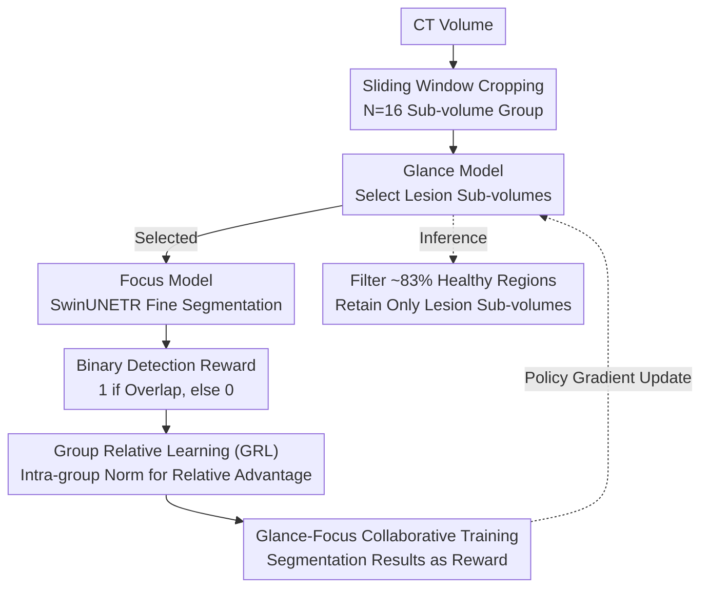

# Glance and Focus Reinforcement for Pan-cancer Screening

**Conference**: ICLR 2026  
**arXiv**: [2601.19103](https://arxiv.org/abs/2601.19103)  
**Code**: [GitHub](https://github.com/Luffy03/GF-Screen)  
**Area**: Medical Imaging/Pan-cancer Screening  
**Keywords**: Pan-cancer Screening, Reinforcement Learning, GRPO, CT Segmentation, Foreground-Background Imbalance

## TL;DR

This paper proposes GF-Screen, a two-stage framework: a lightweight Glance model uses reinforcement learning to rapidly locate CT sub-volumes containing lesions, while the Focus model performs detailed segmentation only on the selected regions. By migrating the "intra-group relative comparison" concept of GRPO from NLP to visual sub-volume groups, this work achieves RL optimization without a value network for the first time in pure vision tasks. It significantly leads the champion solution in the FLARE25 pan-cancer challenge with a $+25.6\%$ DSC and is $5.7\times$ faster in inference.

## Background & Motivation

**Background**: Pan-cancer screening aims to detect and segment multiple types of lesions from large-scale CT scans using a universal model. Existing methods such as nnUNet, SwinUNETR, and CancerUniT adopt a sliding window approach to traverse the entire CT volume for patch-wise segmentation, achieving reasonable results on single lesion types.

**Limitations of Prior Work**: Lesions typically occupy only about $0.085\%$ of the total CT volume area, leading to extreme foreground-background imbalance. Traversal-based inference causes two severe issues: first, it wastes computational resources on vast healthy regions, leading to low inference efficiency (over 100 seconds per scan), which hinders large-scale deployment; second, redundant attention to healthy regions increases false positives and reduces screening accuracy.

**Key Challenge**: Accuracy and efficiency appear to be contradictory—improving detection rates requires dense scanning, but dense scanning introduces significant false positives and computational waste. The root cause is that existing methods treat all regions equally, lacking a "selective attention" mechanism.

**Goal**: (1) How to enable the model to perform a global coarse scan followed by local fine inspection like a radiologist, skipping irrelevant regions? (2) How to train "selective" behavior using RL without introducing an additional value network? (3) How to prevent the selection strategy from being overwhelmed by foreground-background imbalance?

**Key Insight**: Radiologists adopt a "glance-and-focus" strategy when reading CTs—quickly scanning the whole volume to exclude normal areas, then carefully examining suspicious locations. The authors observed that a group of sub-volumes cropped from the same CT naturally constitutes the "candidate group" required by GRPO, allowing for direct intra-group relative comparison without requiring an LLM to generate candidate answers.

**Core Idea**: A lightweight classification network is used for "Glance" selection, and a segmentation network for "Focus" inspection. Segmentation results serve as RL reward signals to optimize the sub-volume selection through group relative learning, simultaneously addressing both efficiency and accuracy.

## Method

### Overall Architecture

GF-Screen consists of two collaborative models: the Glance model (lightweight 3D ResNet-18, ~32M parameters), responsible for classifying sub-volumes cropped from the CT as "lesion-present" or "lesion-absent"; and the Focus model (SwinUNETR), which performs pixel-level segmentation on selected sub-volumes. During training, $N=16$ randomly cropped sub-volumes are simultaneously fed into both models—the Focus model is trained using Dice-CE loss for supervised segmentation, and its segmentation performance serves as a reward signal backpropagated to the Glance model via RL. During inference, the CT volume is cropped into sub-volume groups via a sliding window; the Glance model quickly filters out approximately $83.3\%$ of healthy regions, retaining only the $16.7\%$ of lesion-containing sub-volumes for the Focus model to segment.

The key to the entire pipeline is: the selection action is non-differentiable, so the two stages are linked through an "segmentation result $\rightarrow$ reward" RL chain. Three core designs (binary detection reward, group relative learning, and collaborative training) are implemented to enable this link.

### Key Designs

**1. Binary Detection Reward: Asking "whether a lesion is detected" rather than "how well it is segmented"**

Each selection action by the Glance model requires an RL reward for evaluation. The most direct idea would be to use the Focus model's segmentation DSC as the reward, but the authors deliberately avoided this. The reward is defined as $r_i = \mathbb{1}(s_i \cap m_i \neq \emptyset)$—as long as the Focus model's segmentation prediction $s_i$ on sub-volume $i$ has any overlap with the ground truth $m_i$, a reward of $1$ is given; otherwise $0$. This binary reward is used because DSC would push the model toward "easy-to-segment" views (clear boundaries, standard angles), while sub-volumes that partially contain lesions or have difficult angles, though yielding low DSC, are often the most clinically critical regions. Binary rewards narrow the Glance model's responsibility to pure detection judgment, preventing it from skipping difficult but important cases to achieve a higher score.

**2. Group Relative Learning (GRL): Comparing sub-volumes from the same CT to eliminate the value network**

Traditional PPO requires an additional critic network to estimate the advantage value of each action, which is unstable and expensive in visual sub-volume selection scenarios. GRL adopts the logic of GRPO: $N$ sub-volumes cropped from the same CT naturally form a comparison group. Intra-group normalization yields the relative advantage $A_i = (r_i - \text{mean}(r_{1..N})) / \text{std}(r_{1..N})$. Sub-volumes with positive advantage are encouraged for selection, while those with negative advantage are discouraged. The optimization objective $\mathcal{J}_{GRL}$ utilizes a PPO-style clipped ratio multiplied by the advantage value, plus a KL regularization term ($\beta=0.01$) to constrain policy shift, and a small-weight cross-entropy loss ($\alpha=0.1$) for basic supervision. The key insight is: while GRPO in NLP requires an LLM to generate multiple candidate responses to form a group, the "ordinary" data augmentation of CT sub-volume cropping inherently provides this structure—allowing pure visual perception tasks to apply GRPO directly, saving the value network and stabilizing convergence.

**3. Glance-Focus Collaborative Training: Using segmentation results as rewards to bridge non-differentiable stages**

The decision of "which sub-volumes to select" is discrete, meaning gradients from the segmentation loss cannot be directly backpropagated to the Glance model; this necessitates the introduction of RL. The two models are trained end-to-end with a total loss $L = L_{GRL} + L_{seg}$, where $L_{seg}$ is the standard Dice-CE segmentation loss. Transforming the Focus model's segmentation results into reward signals is the link between the two. To stabilize training, the Glance model maintains a frozen reference model $G_{ref}$, updated once per epoch. The entire process uses a single A800 80G GPU, batch size of 4, with 4 volumes per batch and 16 sub-volumes per group.

### Loss & Training

The Focus model is trained using standard Dice-CE segmentation loss. The GRL loss for the Glance model consists of three terms: (1) a clipped policy gradient term—the core optimization signal; (2) a KL divergence regularization term ($\beta=0.01$)—preventing the policy from deviating too far; and (3) a cross-entropy classification term ($\alpha=0.1$)—providing weak supervision, where a small $\alpha$ avoids model collapse into predicting all negative classes due to foreground-background imbalance. The optimizer is AdamW with a learning rate of 3e-4 and cosine decay scheduling. Sub-volume size is $96 \times 96 \times 64$.

## Key Experimental Results

### Main Results: Pan-cancer Segmentation and Detection (9 lesion types, 16 internal + 7 external datasets)

| Method | Segmentation DSC (%) | Detection F1 (%) | False Positive Rate (%) | Inference Time (s/scan) |
|--------|----------------------|------------------|-------------------------|-------------------------|
| nnUNet | 53.3 | 90.2 | 30.4 | 136 |
| SwinUNETR | 48.6 | 92.5 | 47.5 | 114 |
| VoCo | 56.1 | 92.2 | 41.8 | 114 |
| SuPreM | 54.4 | 90.4 | 38.7 | 114 |
| PASTA | 52.8 | 88.6 | 42.6 | 197 |
| **GF-Screen** | **60.8** | **95.9** | **15.6** | **28** |

GF-Screen outperforms the second-best method, VoCo, by 4.7 points in segmentation DSC, achieves 95.9% detection F1 (+3.4%), and reduces the false positive rate from 30.4% to 15.6% (-14.8%) while being 4-7 times faster in inference. It also leads on external datasets (average DSC 54.1% vs. the second-best 49.0%). On the FLARE25 public validation leaderboard, GF-Screen significantly outperformed the FLARE24 champion with 58.6% DSC / 52.2% NSD (gains of $+25.6\%$ and $+28.2\%$ respectively).

### Ablation Study: RL Training Strategy Comparison (FLARE23 Dataset)

| Training Strategy | DSC (%) | Selection Ratio (%) | Description |
|-------------------|---------|---------------------|-------------|
| SwinUNETR Baseline| 41.5 | 100 | No Glance, full segmentation |
| Cross-Entropy (CE)| 37.6 | 3.1 | Collapses to negative class |
| Balanced CE | 37.8 | 5.3 | Slightly better but still collapses |
| Focal Loss | 36.5 | 4.0 | Imbalance remains unsolved |
| OHEM | 39.5 | 7.2 | Limited help from hard mining |
| PPO + Value Net | 24.5 | 51.6 | Unstable training, severe crash |
| GRL + DSC Reward | 43.2 | 21.3 | Biased toward "easy" views |
| GRL + Binary Reward| 53.1 | 23.0 | Detection reward significantly better |
| **GRL + Binary + αCE** | **56.7** | **16.7** | **Full solution, optimal** |

### Key Findings

- **Direct training with classification loss inevitably fails**: Extreme foreground-background imbalance leads CE/Focal/OHEM to collapse into negative classes (selection ratios of 3-7%), indicating the pure classification paradigm cannot solve this issue.
- **PPO is unstable**: Introducing an additional value network caused severe training oscillations (DSC only 24.5%), confirming the unsuitability of traditional RL methods for visual sub-volume selection.
- **Binary Reward >> DSC Reward**: A 10-point gap (53.1% vs 43.2%) shows that the Glance model should focus on "presence" rather than "segmentation quality."
- **Small-weight CE auxiliary is effective**: Adding $\alpha=0.1$ CE improved DSC from 53.1% to 56.7%, providing beneficial weak supervision without the risk of collapse.
- **Group size sensitivity**: $N=16$ is optimal (56.5% DSC), while $N=4$ shows a significant drop (45.9%), indicating that sufficient intra-group comparison candidates are crucial for GRL.
- **Glance model high sensitivity**: Achieves 97.7% sensitivity (minimal missed diagnoses) and 75.9% specificity (effective filtering of healthy regions).

## Highlights & Insights

- **Key Insight for Migrating GRPO to Vision**: Sub-volume cropping naturally creates candidate groups, enabling intra-group relative comparison without needing an LLM's generative capability. This insight is clever—reinterpreting "random cropping," a common data augmentation in medical imaging, as "candidate generation" in RL allows pure vision tasks to leverage the advantages of GRPO for the first time, saving the value network and stabilizing convergence.
- **Positive Coupling of Efficiency and Accuracy**: Traditionally, "looking at more" implies higher accuracy. However, this paper proves that "selectively looking at less" is actually more accurate—discarding healthy regions not only saves compute but also actively eliminates sources of false positives. This "subtraction for accuracy" mindset deserves promotion in other sparse foreground tasks.
- **Design Insight of Binary Rewards**: Eschewing fine-grained DSC rewards for coarse binary detection rewards highlights the role of the Glance model as a "gatekeeper," not a "doctor"—it only needs to judge "is there something suspicious," not evaluate segmentation quality. This clarity in role division is key to the system design.

## Limitations & Future Work

- **Glance Model Missed Diagnosis Risk**: Although sensitivity reaches 97.7%, lesions that are extremely small or span sub-volume boundaries might still be missed, which is costly in clinical settings.
- **Fixed Sub-volume Dimensions**: The fixed $96 \times 96 \times 64$ size might not be optimal for lesions of different scales; large lesions could be split across multiple volumes.
- **CT Modality Only**: Not yet tested on MRI, Ultrasound, or PET; whether the GRL paradigm transfers to foreground-sparse scenarios in other modalities remains to be verified.
- **Group Comparison Dependency**: If a CT has extremely dense lesions (all positive) or is entirely healthy (all negative), the gradient signal from intra-group comparison may degrade.
- Future work could consider adaptive sub-volume sizes or multi-scale cropping strategies to handle lesions of varying sizes.

## Related Work & Insights

- **vs. CancerUniT**: CancerUniT uses a query-based Mask-Transformer for unified detection and segmentation across eight lesion types but still uses full-volume inference. GF-Screen leads significantly in segmentation accuracy (+7.5% DSC) while being multiple times faster, proving "select-then-segment" is superior to "full-volume inference."
- **vs. Visual RL (Wang et al. 2020)**: Prior work used PPO to drop redundant patches in classification, but needed value networks and couldn't handle dense prediction tasks like segmentation. GF-Screen replaces PPO with GRL, eliminating the value network and performing more stably (PPO's DSC was only 24.5%).
- **vs. GRPO (Shao et al. 2024)**: In LLMs, GRPO generates multiple outputs to form a group. GF-Screen identifies that CT sub-volume cropping naturally provides candidate groups, representing the first successful migration of GRPO to non-language tasks.
- **vs. PASTA**: PASTA uses tumor synthesis for pre-training but does not address inference efficiency (197s/scan, slowest among all methods). GF-Screen improves both accuracy and efficiency using a fundamentally different approach.

## Rating

- Novelty: ⭐⭐⭐⭐ The insight of migrating GRPO to vision is clever, though the overall framework (coarse-to-fine) is a mature paradigm.
- Experimental Thoroughness: ⭐⭐⭐⭐⭐ 9 lesion types, 23 datasets, internal/external validation + FLARE25 leaderboard; ablation studies are highly systematic.
- Writing Quality: ⭐⭐⭐⭐ Clear logic chain and well-designed visuals, though some paragraphs are repetitive.
- Value: ⭐⭐⭐⭐⭐ Significantly outperforming the FLARE25 champion (+25.6% DSC) while being 5.7x faster makes this highly valuable for actual deployment.

<!-- RELATED:START -->

## Related Papers

- [\[AAAI 2026\] PanFoMa: A Lightweight Foundation Model and Benchmark for Pan-Cancer Pathology Image Analysis](../../AAAI2026/medical_imaging/panfoma_a_lightweight_foundation_model_and_benchmark_for_pan-cancer.md)
- [\[AAAI 2026\] MedEyes: Learning Dynamic Visual Focus for Medical Progressive Diagnosis](../../AAAI2026/medical_imaging/medeyes_learning_dynamic_visual_focus_for_medical_progressive_diagnosis.md)
- [\[CVPR 2025\] Association of Radiologic PPFE Change with Mortality in Lung Cancer Screening Cohorts](../../CVPR2025/medical_imaging/association_of_radiologic_ppfe_change_with_mortality_in_lung_cancer_screening_co.md)
- [\[CVPR 2026\] OraPO: Oracle-educated Reinforcement Learning for Data-efficient and Factual Radiology Report Generation](../../CVPR2026/medical_imaging/orapo_oracle-educated_reinforcement_learning_for_data-efficient_and_factual_radi.md)
- [\[NeurIPS 2025\] FairGRPO: Fair Reinforcement Learning for Equitable Clinical Reasoning](../../NeurIPS2025/medical_imaging/fairgrpo_fair_reinforcement_learning_for_equitable_clinical_reasoning.md)

<!-- RELATED:END -->
