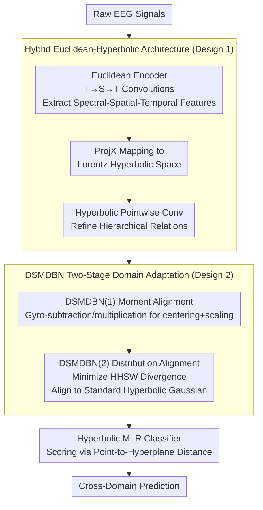

# HEEGNet: Hyperbolic Embeddings for EEG

**Conference**: ICLR 2026  
**arXiv**: [2601.03322](https://arxiv.org/abs/2601.03322)  
**Code**: [GitHub](https://github.com/fightlesliefigt/HEEGNet)  
**Area**: Brain-Computer Interface/Geometric Deep Learning  
**Keywords**: EEG, Hyperbolic Space, Domain Adaptation, Hierarchical Structure, BCI

## TL;DR
This paper provides the first systematic validation of the hyperbolic nature (hierarchical structure) of EEG data. It proposes HEEGNet, a hybrid Euclidean-hyperbolic network architecture that combines a Euclidean encoder for spatio-temporal-spectral feature extraction with a hyperbolic encoder to capture hierarchical relationships. Coupled with a novel coarse-to-fine domain adaptation strategy (DSMDBN), it achieves SOTA results across cross-domain tasks in visual evoked potentials, emotion recognition, and intracranial EEG.

## Background & Motivation

**Background**: EEG-based BCIs suffer from poor generalization due to inter-subject/inter-session distribution shifts. Domain Adaptation (DA) methods (such as moment alignment) are current SOTA but fail under large shifts. EEG decoding has been almost exclusively based on Euclidean embeddings.

**Limitations of Prior Work**: (1) Cognitive processes such as visual processing and emotion regulation in the brain possess hierarchical structures, which are difficult to represent efficiently in Euclidean space—where the circumference of a circle grows linearly while the number of tree nodes grows exponentially; (2) Moment alignment alone cannot guarantee positive transfer, especially under large domain shifts.

**Key Challenge**: The hierarchical structure of EEG features requires exponential representational capacity, which Euclidean space lacks, yet hyperbolic neural networks have not been systematically explored for EEG.

**Key Insight**: Preliminary research shows that EEG exhibits hyperbolicity (low $\delta_{rel}$). Replacing Euclidean MLR with hyperbolic MLR alone improves cross-domain performance, proving that hyperbolic embeddings indeed aid EEG generalization.

**Core Idea**: Utilizing hyperbolic space to capture the hierarchical structure of EEG combined with two-stage domain adaptation (moment alignment → distribution alignment) to achieve cross-domain generalization.

## Method

### Overall Architecture

HEEGNet addresses EEG cross-domain generalization by capturing the natural hierarchical structure of cognitive processes while mitigating distribution shifts across subjects/sessions. It decouples signal processing from geometric representation: a Euclidean encoder (temporal → spatial → temporal convolutions) extracts spectral-spatial-temporal features from raw EEG, which are then projected via ProjX into the Lorentz hyperbolic space. Hyperbolic convolutions are used to refine hierarchical relationships, with DSMDBN two-stage domain adaptation interspersed to eliminate domain shifts. Finally, a hyperbolic MLR classifier outputs predictions.

### Key Designs

**1. Hybrid Euclidean-Hyperbolic Architecture: Decoupling Signal Processing and Hierarchical Representation**

Pure hyperbolic networks discard valuable signal processing priors in EEG decoding, while pure Euclidean networks cannot represent hierarchical structures (Euclidean space cannot accommodate exponential hierarchies). HEEGNet uses a two-stage approach: the front end consists of three EEGNet-style convolutional layers for spectral-spatial-temporal feature extraction with neurophysiological interpretability; then, ProjX projects features into the Lorentz model $\mathbb{L}_K^n$ for pointwise convolutions. The front end transforms signals into meaningful features, while the back end organizes hierarchical relationships in a space with exponential representational capacity.

**2. DSMDBN: Coarse-to-Fine Two-Stage Domain Adaptation**

Moment alignment (current SOTA) fails under large domain shifts. DSMDBN adds distribution alignment atop moment alignment. Stage one, DSMDBN(1), uses Riemannian Batch Normalization for domain-specific moment alignment—centering is implemented via gyro-subtraction and scaling via gyro-multiplication in hyperbolic space, aligning the mean and scale of each domain. Stage two, DSMDBN(2), minimizes the HHSW divergence to align the distribution of each source domain to a standard hyperbolic Gaussian $\mathcal{N}(\bar{0}, 1)$. This "coarse-to-fine" approach aligns first-order/second-order statistics before providing stronger theoretical guarantees for distribution alignment.

**3. Hyperbolic Operators on the Lorentz Model: Geometric Toolbox**

Hyperbolic operations are built on the gyro-algebra of the Lorentz model: gyroaddition, gyromultiplication, and gyroinverse replace Euclidean operations. Fréchet mean and variance are redefined on the Lorentz model (supporting DSMDBN centering/scaling), and hyperbolic MLR uses hyperbolic distance from points to hyperplanes for classification. Notably, replacing only the Euclidean MLR head with a hyperbolic MLR improves cross-domain performance across all datasets, indicating this geometric toolset is inherently better suited for the hierarchical nature of EEG.

### Loss & Training

- Total Loss = Classification Loss + HHSW Distribution Alignment Loss.
- Domain-specific momentum batch normalization: Statistics are updated with decaying momentum during training and fixed during testing.
- Riemannian Adam optimizer is used for parameter updates on the manifold.

## Key Experimental Results

### Background

| Dataset | $\delta_{rel}$ Raw EEG | $\delta_{rel}$ Embedding Layer | Description |
|---------|-----------------------|------------------------------|-------------|
| Nakanishi | Low | Low | Visual |
| Wang | Low | Low | Visual |
| Seed | Low | Low | Emotional |
| Faced | Low | Low | Emotional |
| Boran | Low | Low | Intracranial |

→ All datasets exhibit low $\delta_{rel}$, confirming the hyperbolicity of EEG.

### Main Results
Cross-subject/Cross-session Adaptation:

| Method | Visual EEG | Emotional EEG | Intracranial EEG | Average |
|------|---------|---------|---------|------|
| EEGNet | Baseline | Baseline | Baseline | Baseline |
| EEGNet+HMLR | ↑ | ↑ | ↑ | Stable Gain |
| HEEGNet | **SOTA** | **SOTA** | **SOTA** | **Overall Best** |

### Key Findings
- Replacing MLR with hyperbolic MLR alone improves performance across all datasets → hyperbolic geometry is better suited for EEG.
- t-SNE visualization shows hyperbolic embeddings have significantly better class separability than Euclidean ones.
- The two-stage DSMDBN strategy significantly outperforms moment alignment alone.
- Performance gains are also observed on motor imagery datasets (where hierarchy was not explicitly reported) → suggests possible unidentified hierarchical structures.

## Highlights & Insights
- **First systematic validation of EEG hyperbolicity**: Quantitative analysis via $\delta_{rel}$ across multiple datasets provides a solid empirical foundation for this direction.
- **Rationality of Hybrid Architecture**: Instead of pure hyperbolic layers (which lose signal processing priors), HEEGNet extracts features in Euclidean space before mapping to hyperbolic space—a design philosophy applicable to other domains.
- **Coarse-to-fine DSMDBN**: Mapping moment alignment → distribution alignment is a natural two-step strategy, where the former aligns mean and scale, and the latter aligns the overall distribution shape.

## Limitations & Future Work
- Hyperbolic operations have higher computational overhead (exp/log maps) than Euclidean ones, affecting real-time BCI.
- Curvature $K$ is a hyperparameter requiring tuning; adaptive curvature learning may be better.
- HHSW might require many projection directions for accuracy in high dimensions.
- Electrode counts vary across subjects in intracranial EEG, limiting cross-subject experimental setups.

## Related Work & Insights
- **vs. EEGNet**: HEEGNet enhances EEGNet with hyperbolic layers and DSMDBN for across-the-board improvements.
- **vs. Chang et al. (Hyperbolic EEG)**: They focus on contrastive pre-training; HEEGNet designs a complete architecture and domain adaptation scheme.
- **vs. Riemannian methods like SPDNet**: SPDNet operates on covariance matrix manifolds, while HEEGNet operates in hyperbolic space, focusing on different geometric structures.

## Rating
- Novelty: ⭐⭐⭐⭐⭐ First systematic proof of EEG hyperbolicity and hybrid hyperbolic architecture.
- Experimental Thoroughness: ⭐⭐⭐⭐⭐ From background studies to multi-dataset, multi-task, and comprehensive ablation studies.
- Writing Quality: ⭐⭐⭐⭐ Sufficient background introduction and clear methodological description.
- Value: ⭐⭐⭐⭐ Introduces a new geometric perspective to EEG decoding and opens the hyperbolic EEG direction.

<!-- RELATED:START -->

## Related Papers

- [\[ICML 2026\] EEG-Based Multimodal Learning via Hyperbolic Mixture-of-Curvature Experts](../../ICML2026/medical_imaging/eeg-based_multimodal_learning_via_hyperbolic_mixture-of-curvature_experts.md)
- [\[ICLR 2026\] Autoregressive Visual Decoding from EEG Signals](autoregressive_visual_decoding_from_eeg_signals.md)
- [\[ICLR 2026\] Modeling the Density of Pixel-level Self-supervised Embeddings for Unsupervised Pathology Segmentation in Medical CT](modeling_the_density_of_pixel-level_self-supervised_embeddings_for_unsupervised_.md)
- [\[CVPR 2026\] H2-Surv: Hierarchical Hyperbolic Multimodal Representation Learning for Survival Prediction](../../CVPR2026/medical_imaging/h2-surv_hierarchical_hyperbolic_multimodal_representation_learning_for_survival_.md)
- [\[ICLR 2026\] ODEBRAIN: Continuous-Time EEG Graph for Modeling Dynamic Brain Networks](odebrain_continuous-time_eeg_graph_for_modeling_dynamic_brain_networks.md)

<!-- RELATED:END -->
