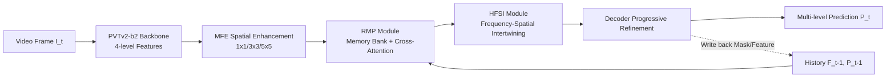

# HFSTI-Net: Hierarchical Frequency-spatial-temporal Interactions for Video Polyp Segmentation

**Conference**: ICLR 2026  
**OpenReview**: [https://openreview.net/forum?id=6I9yjRTfuT](https://openreview.net/forum?id=6I9yjRTfuT)  
**Code**: [https://github.com/Yuanqin-He/HFSTI-Net](https://github.com/Yuanqin-He/HFSTI-Net)  
**Area**: Medical Image Segmentation / Video Polyp Segmentation  
**Keywords**: Video Polyp Segmentation, Frequency Learning, Spatiotemporal Modeling, Memory Bank, Colonoscopy  

## TL;DR
HFSTI-Net integrates "frequency-spatial" dual-path interaction and "mask-guided recurrent memory propagation" into a single network. It addresses two persistent challenges in colonoscopy video polyp segmentation: **shape collapse** caused by low contrast in single frames and **episodic amnesia** due to target fluctuations in long sequences. It achieves SOTA performance on SUN-SEG and CVC-612 while maintaining real-time inference at 31 FPS.

## Background & Motivation
**Background**: Automated polyp segmentation is a critical aid for early colorectal cancer screening. Early methods focused on Image Polyp Segmentation (IPS) using CNN/Transformer for spatial features. Recently, Video Polyp Segmentation (VPS) has emerged, utilizing 2D/3D hybrid convolutions or self-attention to leverage temporal consistency for improved robustness.

**Limitations of Prior Work**: The authors attribute clinical failures to two specific phenomena. The first is **shape collapse**, where polyps and surrounding mucosa are highly similar in color and texture ("camouflage"), making single-frame static information insufficient to distinguish the target from the background, resulting in fragmented structures and blurred boundaries. The second is **episodic amnesia**, where field-of-view jitter, intestinal peristalsis, and continuous low-quality blurred frames cause drastic changes in polyp appearance. Existing temporal methods rely on pixel-level dense feature propagation, which lacks high-level semantic abstraction and leads to "memory loss" during large temporal interval jumps, causing unstable tracking.

**Key Challenge**: Spatial domain methods excel at local details but lack global context; frequency domain methods capture global semantics but are sensitive to noise. Moreover, existing frequency domain works often **separate** frequency and spatial processing without modeling cross-domain dependencies. Temporally, pure pixel-level propagation fails to capture long-range semantic continuity. Neither of these clues (frequency-spatial complementarity and long-range temporal memory) has been fully synergized.

**Goal**: To **jointly model frequency, spatial, and temporal** domains within a single network to suppress both shape collapse and episodic amnesia while maintaining real-time inference for clinical deployment.

**Core Idea**: **[Frequency-Spatial Intertwining]** Uses FFT self-attention for global spectrum and spatial self-attention for boundary details, coupled with a learnable intertwined fusion block for bidirectional entanglement. **[Mask-Guided Recurrent Memory]** Maintains a memory bank of historical high-level features and predicted masks, using cross-attention and mask affinity for temporal alignment to ensure the model "remembers" dynamic changes.

## Method

### Overall Architecture
Given a video sequence $\{I_t\}_{t=1}^{T}$, a PVTv2-b2 backbone extracts four-level features $F=\{F_i^t\}_{i=1}^{4}$. The highest-level feature $F_4^t$ is first enhanced spatially via the MFE module (parallel $1\times 1/3\times 3/5\times 5$ convolutions) and then fed into the RMP module along with historical context $F_4^{t-1}, P_{t-1}$ for temporal alignment. The aligned features are passed to the HFSI module for frequency-spatial intertwining, generating enriched representations $X=\{\chi_i\}_{i=1}^{4}$. Finally, the decoder progressively aggregates and refines these to output multi-level predictions $P=\{P_t^i\}_{i=1}^{4}$ under multi-level deep supervision. HFSI addresses shape collapse (structural integrity), while RMP addresses episodic amnesia (long-range stability).

### Key Designs

**1. HFSI Frequency-Spatial Intertwining: Global compensation via spectrum, boundary maintenance via spatial, and bidirectional entanglement.** HFSI is a dual-path structure with three serialized blocks. The **Frequency Filtering Block (FFB)** transforms normalized inputs to the frequency domain via FFT, calculates channel attention $\Lambda_f = Q_f \odot K_f$ for $1\times 1$ frequency components, reweights $V_f$, and transforms back to the spatial domain. A lightweight frequency residual branch $\sigma(\cdot)$ enhances spectral response. The fused frequency-aware feature $X_f^r = \mathrm{Cat}\big(\mathcal{F}^{-1}(\Lambda_f \odot V_f),\ \mathcal{F}^{-1}(\sigma(\mathcal{F}(\hat{X})))\big)$ captures global context and sharpens boundaries. The **Spatial Refinement Block (SRB)** operates in the spatial domain using $3\times 3$ and $5\times 5$ depthwise separable convolutions to generate multi-scale $Q_s, K_s, V_s$, calculating spatial attention $\Lambda_s=\mathrm{Softmax}(Q_s\odot K_s)$ to highlight salient structures. The crucial component is the **Intertwined Fusion Block (IFB)**: it sums frequency, spatial, and early features into $X_c$, then projects them back to frequency and spatial domains for gated multiplicative attention ($\hat{X}_f^2$ via FFT gating, $\hat{X}_s^2$ via depthwise convolution gating). Element-wise multiplication produces $\hat{X}_{fs}$ as a shared input, followed by further refinement and concatenation. This bidirectional entanglement ensures global spectral semantics and local spatial details are aligned across layers.

**2. RMP Mask-Guided Recurrent Propagation: Storing "historical features + historical masks" in a memory bank with two-step temporal alignment.** RMP maintains a memory bank of past high-level features and masks. For the current frame, the **Temporal Alignment Module (TAM)** uses the current feature $Q_T$ as the query and memory features $K_T/V_T$ as key-value pairs for cross-attention: $Z=L(\mathrm{Attention}(L_q(Q_T),L_k(K_T),L_v(V_T)))$, followed by MLP and residual normalization to get $Q_M=\mathrm{LN}(\mathrm{MLP}(Z)+Z)+Q_T$. The **Mask Affinity Module (MAM)** then fuses $Q_M$ with current spatial information into $(q_k, q_v)$ and projects memory $K_M$ into $(m_k, m_v)$. Final spatiotemporal representation is $\text{output}=q_v\oplus\mathrm{Attention}(q_k,m_k,m_v)$. Including "masks" in affinity calculations provides explicit target location priors, stabilizing polyp localization amidst occlusions.

**3. Multi-level Deep Supervision Hybrid Loss.** The decoder outputs predictions at four stages, supervised by a hybrid loss of weighted BCE and weighted IoU, with higher weights for shallower levels: $L_{all}=\sum_{i=1}^{4}\frac{1}{2^{i-1}}\big(L_{bce}^{w}(P_t^i,G)+L_{iou}^{w}(P_t^i,G)\big)$. The weighted form focuses on hard boundaries/small targets, while multi-level supervision ensures both deep and shallow features converge toward accurate segmentation.

## Key Experimental Results

### Main Results
Comparison with SOTA NVS/IPS/VPS methods on SUN-SEG-Easy/Hard and CVC-612 (**rank first in all metrics**):

| Method | Type | Easy Dice | Hard Dice | CVC-612 Dice |
|------|------|-----------|-----------|--------------|
| ZoomNext | NVS | 85.49 | 83.51 | 93.17 |
| SLTNet | NVS | 85.91 | 83.36 | 93.62 |
| PNS+ | VPS | 82.23 | 79.60 | 93.06 |
| VPSAM | VPS | 85.62 | 85.28 | 92.33 |
| SALI | VPS | 86.17 | 83.87 | 88.77 |
| **HFSTI-Net (Ours)** | VPS | **88.03** | **86.27** | **94.31** |

Efficiency comparison (SUN-SEG-Hard):

| Method | Dice | GFlops | Param.(M) | FPS |
|------|------|--------|-----------|-----|
| SALI | 83.87 | 21.19 | 26.14 | 18.07 |
| PNS+ | 79.60 | 45.99 | 9.79 | 76.08 |
| **Ours** | **86.27** | 46.77 | 28.53 | **31.27** |

FPS of 31.27 satisfies real-time clinical deployment while maintaining high accuracy.

### Ablation Study
Module-level ablation (SUN-SEG-Hard Dice):

| HFSI | RMP | Easy Dice | Hard Dice |
|:----:|:---:|-----------|-----------|
| | | 86.20 | 83.67 |
| ✓ | | 87.04 | 84.03 |
| | ✓ | 87.24 | 85.27 |
| ✓ | ✓ | **88.03** | **86.27** |

HFSI sub-component ablation (Hard Dice): Removing IFB results in the most significant drop. Frequency interaction ablation shows that FFT frequency interaction (86.27) is superior to linear $1\times 1$ convolution (84.15) or spatial attention (85.38). Increasing memory frames from 1 to 4 shows diminishing returns (Dice 86.27 $\to$ 86.66) while FPS drops from 31.27 to 26.94; single-frame memory is a practical trade-off.

### Key Findings
- HFSI and RMP both contribute to performance gains independently, with the maximum gain achieved when combined, indicating that "shape collapse" and "episodic amnesia" are complementary problems.
- The bidirectional entanglement of IFB is the soul of HFSI; simple addition/concatenation does not yield the same benefits.
- T-SNE visualizations demonstrate that the joint frequency-spatial domain better separates polyps from background compared to a single domain.

## Highlights & Insights
- Formulates clinical failure modes into two nameable problems (shape collapse / episodic amnesia), providing a clear problem-solution mapping and strong interpretability.
- IFB introduces a "gated enhancement $\to$ element-wise coupling $\to$ individual refinement" paradigm, which is a deeper cross-domain fusion than simple concatenation.
- RMP injects explicit target priors by storing **masks** in the memory bank, enhancing robustness against sudden appearance changes compared to pure feature memory.

## Limitations & Future Work
- Failure cases (Figure 9) show the model still struggles under extreme continuous low-quality frames or heavy occlusions, as memory reliability depends on historical frame quality.
- FFT self-attention and modular stacking lead to 46.77 GFlops and 28.53M parameters, heavier than ultra-lightweight VPS methods.
- The effective utilization of long-range memory still has room for improvement (selective frame updates/eviction).
- Validation is limited to colonoscopy datasets; cross-organ/modal generalization requires further study.

## Related Work & Insights
- **Polyp Segmentation**: Evolution from CNN (local) to Transformer/Hybrid (global), and then to global temporal attention (PNS+). RMP continues the explicit temporal dependency modeling but adds mask memory.
- **Frequency Learning**: While FcaNet treats channel attention as frequency compression, HFSI fills the gap in "frequency-spatial bidirectional interaction."
- Insight: For "camouflaged/low-contrast" tasks, the frequency domain is an effective global discriminative supplement, but the key lies in how frequency and spatial domains are deeply intertwined.

## Rating
- **Novelty**: ⭐⭐⭐⭐ — Triple domain joint modeling, IFB bidirectional fusion, and mask-integrated memory are innovative.
- **Experimental Thoroughness**: ⭐⭐⭐⭐ — Comprehensive benchmarks, cross-domain SOTA comparisons, and multi-dimensional ablations.
- **Writing Quality**: ⭐⭐⭐⭐ — Clear problem definitions and comprehensive methodology.
- **Value**: ⭐⭐⭐⭐ — Achieves SOTA under real-time constraints, with high reference value for medical video segmentation.

<!-- RELATED:START -->

## Related Papers

- [\[ICLR 2026\] WavePolyp: Video Polyp Segmentation via Hierarchical Wavelet-based Feature Aggregation and Inter-frame Divergence Perception](wavepolyp_video_polyp_segmentation_via_hierarchical_wavelet-based_feature_aggreg.md)
- [\[ICLR 2026\] CONSIGN: Conformal Segmentation Informed by Spatial Groupings via Decomposition](consign_conformal_segmentation_informed_by_spatial_groupings_via_decomposition.md)
- [\[AAAI 2026\] Decoding with Structured Awareness: Integrating Directional, Frequency-Spatial, and Structural Attention for Medical Image Segmentation](../../AAAI2026/medical_imaging/decoding_with_structured_awareness_integrating_directional_frequency-spatial_and.md)
- [\[ICLR 2026\] Nef-Net v2: Adapting Electrocardio Panorama in the Wild](nef-net_v2_adapting_electrocardio_panorama_in_the_wild.md)
- [\[NeurIPS 2025\] STAMP: Spatial-Temporal Adapter with Multi-Head Pooling](../../NeurIPS2025/medical_imaging/stamp_spatial-temporal_adapter_with_multi-head_pooling.md)

<!-- RELATED:END -->
