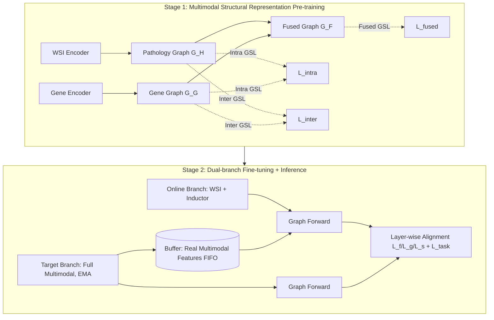

# Histopathology-Genomics Multi-modal Structural Representation Learning for Data-Efficient Precision Oncology

**Conference**: ICLR 2026  
**OpenReview**: [https://openreview.net/forum?id=24QX6XpvSL](https://openreview.net/forum?id=24QX6XpvSL)  
**Code**: [https://github.com/WkEEn/MSRL](https://github.com/WkEEn/MSRL)  
**Area**: Medical Image / Computational Pathology / Multimodal Representation Learning  
**Keywords**: Pathology-genomics multimodal, missing modality, Graph Structural Learning (GSL), survival prediction, data-efficient inference

## TL;DR
MSRL uses Graph Structural Learning to pre-train a "pathology-genomics" cross-case association graph. During the fine-tuning stage, it utilizes a buffer storing real genomic features, allowing cases with only Whole Slide Images (WSI) during inference to "borrow" genomic information from diagnostically related cases. This enables the model to approach the accuracy of full multimodal fusion in scenarios where genomics are missing.

## Background & Motivation
**Background**: Fusing Whole Slide Images (WSI) and genomic data has become a mainstream paradigm in precision oncology. WSI provide morphological and cellular organization information, while genomics provide molecular-level microenvironment characterization. Their complementarity allows for more personalized case representations. However, genomic sequencing is costly and complex, and in clinical reality, many cases only have WSI without paired genomic data.

**Limitations of Prior Work**: To handle missing genomics during inference, existing works take two routes: (1) Adding an auxiliary task during training, using reconstruction or distillation loss to establish associations between WSI and genomics, then using learned prompts to replace the missing modality during inference. (2) Using generative methods (e.g., conditional VAE) to synthesize genomic features from WSI. These methods share two common flaws:

- **Focusing on individual cases while ignoring inter-case associations**: Reconstruction depends solely on a case's own WSI to predict genomics, focusing on intra-case alignment but losing inter-case diagnostic associations.
- **Wasted real genomic data in the training set**: During inference, genomics are synthesized "out of thin air," while the real genomic data of diagnostically related cases in the training set are not utilized, leading to synthetic features that are inauthentic and lack information.

**Key Challenge**: Missing modalities need to be "completed," but genomics synthesized purely from a single case's WSI are unauthentic and disrupt diagnostic associations. The high-dimensional ($d=768$) and low-rank distribution of genomics (where samples are far fewer than dimensions) makes generators like VAE prone to sampling noise.

**Goal**: While using only a single WSI modality during inference, explicitly model inter-case associations and utilize **real** genomic data from the training set as a structural prior to make the completion of missing genomics more credible.

**Core Idea**: **[Structured Association Completion]** Instead of generating genomics per case, pre-train a multimodal association graph to characterize inter-case diagnostic correlations. Use a buffer to cache the real multimodal features of training cases. During inference, plug the current WSI-only case into this graph to aggregate reliable genomic information from "diagnostically related real cases" via graph propagation.

## Method

### Overall Architecture
MSRL is divided into two stages. The **pre-training stage** uses TCGA pan-cancer data (6,361 complete paired cases) for self-supervised Graph Structural Learning (GSL) to align WSI and genomic representation spaces and construct a cross-case association graph. The **fine-tuning/inference stage** adopts an online-target dual-branch + buffer setup: the target branch processes complete multimodal data, is active only during training, and is updated via EMA. It guides the online branch (WSI-only) to learn missing gene completion. The buffer uses FIFO to cache real multimodal features of training cases; during inference, the current case is grouped with buffer cases for graph forward passes to complete missing data via real information.

### Key Designs

**1. Multi-view Self-supervised GSL Pre-training**: The core is a parameterized graph learner that adaptively infers optimal graph structures from node features (Algorithm 1: Layer-wise Hadamard weighting $z_i^{(l)}=E_i^{(l-1)}\odot\omega^{(l)}$, calculating similarity $S=E^{(L)}(E^{(L)})^T$, and post-processing into a refined adjacency matrix $A_r$). Pre-training uses three types of constraints: **intra-modality** uses contrastive learning to mine associations within the same modality—refined graph $A_r^H$ and augmented graph $A_{aug}^H$ are passed through GCNs, using InfoNCE to pull same-case representations together and push different-case representations apart $L_{InfoNCE}(Z_H;Z_H^{aug})=-\sum_k \log\frac{\exp(\text{sim}(z_k,z_k^{aug})/\tau)}{\sum_i \exp(\text{sim}(z_k,z_i^{aug})/\tau)}$; **inter-modality** aligns pathology and genomic representations of the same case; **fused-modality** constrains the fused representation $Z_F$ to retain both characteristics. $L_{gsl}=L_{intra}+L_{inter}+L_{fused}$.

**2. Buffer + Dual-branch**: Real genomic data from the training set is used as a "structural prior." The training set $D_{train}=\{X_G^s,X_I^s,y^s\}$ contains complete modalities, while the test set $D_{test}=\{X_I^s,y^s\}$ is WSI-only. The buffer is initialized with real multimodal features $D_{buffer}=\{\text{concat}(\phi_G(X_G^s),\phi_H(X_I^s))\}$ and updated via FIFO with target branch outputs. During **Graph Forward**, the current case feature is read out as $F$ alongside buffer features, then $A_r=\text{GSL}(F)$ and $Z=\text{GCN}(A_r,F)$. Cases with only WSI establish associations with **real** genomic features in the buffer through this dynamic graph, and missing information is completed during propagation.

**3. Inductor**: This module provides a genomic placeholder for the online branch. It reuses the same SNN architecture as the genomic encoder but takes WSI representations as input, outputting a "genomic prompt" to fill the missing data slot. This prompt is concatenated with WSI representations $f=\text{concat}(g,h)$ and subsequently completed through cross-case associations in the Graph Forward pass.

**4. Layer-wise Alignment Loss**: Aligning the online branch to the target branch at the "pre-graph, post-graph, and structure" levels. Fine-tuning uses layer-wise InfoNCE: $L_{f\_align}=L_{InfoNCE}(f,\hat f)$ (pre-graph fused features) and $L_{g\_align}=L_{InfoNCE}(Z,\hat Z)$ (post-graph GCN representations). At the structural level, sparse balanced BCE aligns the online graph $A_r$ with the target graph $\hat A_r$ using scaling factors $\alpha_0=\frac{c_0+c_1}{2c_0}$ and $\alpha_1=\frac{c_0+c_1}{2c_1}$ to balance non-zero versus predominantly zero elements. Total loss: $L_{fine\_tune}=L_{f\_align}+L_{g\_align}+L_{s\_align}+L_{task}$.

## Key Experimental Results

Data: 7,263 TCGA pan-cancer cases (32 cancer types). Pre-training on 6,361 cases; evaluation on 6 TCGA cohorts + 2 external CPTAC cohorts. WSI encoding via GigaPath.

### Main Results: Survival Prediction (C-Index, 5 Cohorts)

| Method | Modality | Overall C-Index |
|---|---|---|
| PANTHER (Strongest WSI w/o pre-train) | h. | 0.5967 |
| TITAN (WSI Foundation Model) | h. | 0.6007 |
| **MSRL_H** (Ours, pure WSI) | h. | **0.6131** |
| G-HANet | g.+h.→h. | 0.6246 |
| LD-CVAE | g.+h.→h. | 0.6313 |
| DisPro | g.+h.→h. | 0.6414 |
| **MSRL** (Train multi / Infer WSI) | g.+h.→h. | **0.6558** |
| SurvPath (Full multimodal fusion) | g.+h. | 0.6683 |
| **MSRL_multi** (Full multimodal) | g.+h. | **0.6794** |

In the missing modality setting, MSRL outperforms G-HANet, LD-CVAE, and DisPro by 3.12%, 2.45%, and 1.44% in C-Index, respectively, approaching the accuracy of full multimodal fusion. The full multimodal version, MSRL_multi, outperforms the second-best by 1.03%.

### Main Results: Precise Diagnosis (4 Tasks, AUC)

| Method | BRCA Stage | NSCLC Stage | EGFR Mut. | HER2 Status |
|---|---|---|---|---|
| TITAN | 0.648 | 0.639 | 0.822 | 0.693 |
| G-HANet | 0.632 | 0.634 | 0.830 | 0.715 |
| LD-CVAE | 0.646 | 0.650 | 0.836 | 0.717 |
| **MSRL** | **0.664** | **0.661** | **0.842** | **0.730** |

MSRL is optimal across all four tasks, with AUC gains of 1.1% to 1.8% over the second-best LD-CVAE.

### Ablation Study

| Variant | Overall C-Index |
|---|---|
| KNN (Euclidean) Static Graph | 0.6009 (↓0.0549) |
| KNN (Cosine) Static Graph | 0.6086 (↓0.0472) |
| MSRL_random GSL (No pre-train) | 0.6369 (↓0.0189) |
| MSRL_online buffer (Update buffer with online features) | 0.6451 (↓0.0107) |
| **MSRL** (Full) | **0.6558** |

GSL pre-training contributes +1.89%. The random GSL still outperforms both KNN variants, proving the learned graph captures implicit diagnostic associations rather than simple feature similarity.

### Key Findings
- **Static similarity graphs are far inferior to learned graphs**: KNN variants are 4.7% to 5.5% lower than the full MSRL.
- **Real data > Synthesized data**: G-HANet and LD-CVAE lag because high-dimensional low-rank genomic distributions are difficult to fit. MSRL avoids generation noise by using real genomic data from the buffer as structural guidance.
- **Strong Generalization**: On external CPTAC data, DisPro's C-Index dropped by 4.77%, whereas MSRL only dropped by 1.02%.
- **Fixed WSI corruption**: Training from scratch with high-dimensional genomic noise can damage WSI morphological representations; MSRL_H (pure WSI) improves F1 by 1.3% to 3.5% over the GigaPath baseline.

## Highlights & Insights
- **Paradigm shift from generation to retrieval/structure**: Instead of hallucinating genomics, the model "borrows" from diagnostically related real cases. This avoids the fundamental problem of generation noise in high-dimensional distributions.
- **Clever combination of buffer + dual-branch + EMA**: The target branch provides real supervision, the buffer persists real information, and the online branch enables WSI-only inference.
- **GSL captures diagnostic association over similarity**: This is cleanly proven by the KNN ablation, providing universal insights for modeling inter-case relationships in computational pathology.

## Limitations & Future Work
- **Buffer dependency**: Performance relies on the genomic coverage of the training set. If the training set is sparse or the test distribution varies significantly, the quality of "borrowed" neighbors may decrease.
- **Graph scalability**: The $K \times K$ adjacency matrix grows with the number of cases. Computational and memory costs for large-scale deployment require further discussion.
- **Evaluation scope**: Primarily tested on TCGA/CPTAC. Robustness across centers with varying staining batches and scanners needs broader verification.
- Future exploration could combine "real neighbor retrieval" with "lightweight generation" to handle areas with sparse neighbor density.

## Related Work & Insights
- **Multimodal Fusion**: MCAT (pathology patch attending to genes), CMTA (dual encoder alignment), SurvPath (gene pathway tokens), MOTCat (Optimal Transport). MSRL addresses issues like MCAT's unidirectional enhancement and CMTA's disruption of genomic sequence structures through inter-modality constraints and dedicated genomic encoders.
- **Restoration/Distillation of Missing Modalities**: G-HANet (proxy gene reconstruction), LD-CVAE (CVAE generation), DisPro (LLM distillation). These share the common flaw of being single-case focused and not using real genomics during inference, which is MSRL's primary entry point.
- **Graph Structural Learning (GSL)**: From differentiable GSL (Franceschi) to contrastive-based unsupervised GSL (Liu et al.). MSRL applies unsupervised multi-graph GSL to multimodal pathology-genomic association modeling.

## Rating
- **Novelty**: ⭐⭐⭐⭐ Shifts completion from "generation" to "structured retrieval based on real neighbors."
- **Experimental Thoroughness**: ⭐⭐⭐⭐ Comprehensive coverage across survival, diagnosis, and external validation with statistical significance mapping.
- **Writing Quality**: ⭐⭐⭐⭐ Logical flow from motivation to solution is clear; Algorithm pseudocode for dual-branch/buffer is well-provided.
- **Value**: ⭐⭐⭐⭐ Directly addresses the cost and missing data problem of genomic sequencing, offering significant practical value for clinical oncology.

<!-- RELATED:START -->

## Related Papers

- [\[ICLR 2026\] Joint Adaptation of Uni-modal Foundation Models for Multi-modal Alzheimer's Disease Diagnosis](joint_adaptation_of_uni-modal_foundation_models_for_multi-modal_alzheimers_disea.md)
- [\[CVPR 2026\] Cross-Modal Guided Visual Synthesis for Data-Efficient Multimodal Depression Recognition](../../CVPR2026/medical_imaging/cross-modal_guided_visual_synthesis_for_data-efficient_multimodal_depression_rec.md)
- [\[CVPR 2026\] TopoSlide: Topologically-Informed Histopathology Whole Slide Image Representation Learning](../../CVPR2026/medical_imaging/toposlide_topologically-informed_histopathology_whole_slide_image_representation.md)
- [\[ICLR 2026\] Frequency-Balanced Retinal Representation Learning with Mutual Information Regularization](frequency-balanced_retinal_representation_learning_with_mutual_information_regul.md)
- [\[ICLR 2026\] MedGMAE: Gaussian Masked Autoencoders for Medical Volumetric Representation Learning](medgmae_gaussian_masked_autoencoders_for_medical_volumetric_representation_learn.md)

<!-- RELATED:END -->
