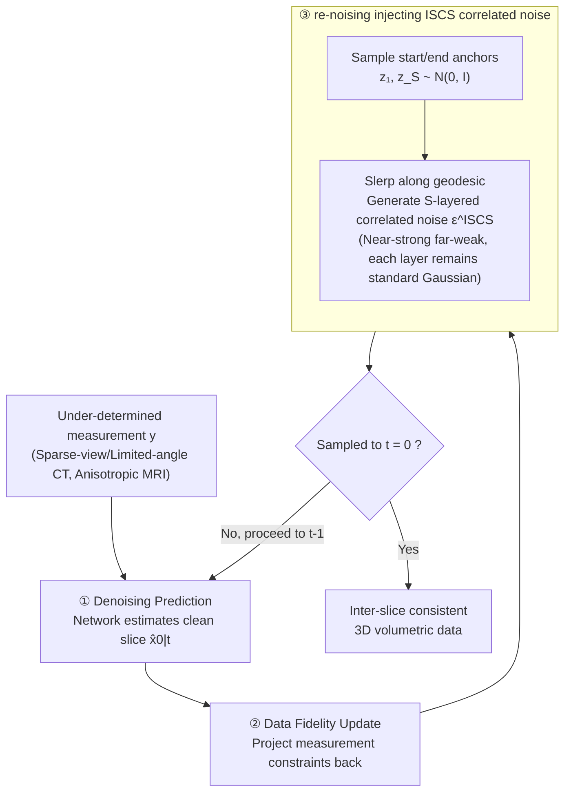

# Improving 2D Diffusion Models for 3D Medical Imaging with Inter-Slice Consistent Stochasticity

**Conference**: ICLR 2026  
**arXiv**: [2602.04162](https://arxiv.org/abs/2602.04162)  
**Code**: [GitHub](https://github.com/duchenhe/ISCS)  
**Area**: Medical Imaging/Diffusion Models  
**Keywords**: 3D Medical Reconstruction, 2D Diffusion Models, Inter-slice Consistency, Spherical Linear Interpolation, Plug-and-play

## TL;DR

Ours proposes Inter-Slice Consistent Stochasticity (ISCS), which eliminates inter-slice discontinuity artifacts in 3D medical reconstruction from 2D diffusion priors by generating inter-slice correlated noise via Spherical Linear Interpolation (Slerp) during the re-noising step of diffusion sampling. It requires zero extra computation, hyperparameters, or training overhead, and can be plugged-and-played into any 2D diffusion inverse solver, showing consistent improvements in sparse-view CT, limited-angle CT, and MRI super-resolution.

## Background & Motivation

**Clinical demand for 3D medical imaging**: Clinical diagnosis (e.g., tumor volume assessment, surgical planning, disease progression tracking) relies on complete and accurate 3D volumetric reconstruction rather than isolated 2D slices.

**Infeasibility of 3D diffusion models**: Directly training diffusion models on high-dimensional volumetric data faces the "curse of dimensionality"—memory, computation, and data requirements far exceed the capacity of most laboratories and industry (Pinaya et al., 2022; Guo et al., 2025; Wang et al., 2025).

**Practical compromise of 2D priors**: The mainstream approach is to train diffusion models on 2D slices and then reconstruct the 3D volume layer-by-layer; while computationally feasible, this introduces new issues.

**Root cause of inter-slice discontinuity**: Each 2D slice is sampled independently during the reverse diffusion process. The inherent stochastic noise injection causes the sampling trajectories of adjacent slices to be completely uncorrelated, resulting in severe structural discontinuities and artifacts along the z-axis when stacked.

**Limitations of Prior Work**: (a) TV regularization introduces sensitive hyperparameters and tends to over-smooth, erasing details; (b) 3D patch training / bi-planar priors increase training/inference complexity and impose extra constraints on data (e.g., requiring cubes); (c) these methods are essentially "post-processing patches" that do not address the root cause.

**Inspiration from the video domain**: Kwon & Ye (2025) noted that temporal flickering in video restoration also stems from uncoordinated diffusion sampling stochasticity and proposed Batch-Consistent Sampling (BCS) to mitigate it. Ours systematically migrates this insight to 3D medical reconstruction and proposes a superior solution.

## Method

### Overall Architecture

The process of solving 3D medical inverse problems layer-by-layer based on 2D diffusion models is an iterative three-step process: first, using the diffusion network for denoising to predict the clean slice $\hat{x}_{0|t}$; second, applying data fidelity updates to impose measurement constraints; and finally, re-noising to time step $t-1$ to continue the next round. All modifications of ISCS occur in this last step—replacing the independently sampled random noise for each layer with a globally smooth and correlated noise volume. Denoising, fidelity, network structure, and training procedures remain unchanged.

### Key Designs

**1. Root cause analysis: Locating inter-slice discontinuity in the stochastic component of re-noising**

To treat the disease at its source, the lesion must first be accurately located. Examining the re-noising step of the DDIM sampler:

$$x_{t-1} = \sqrt{\bar{\alpha}_{t-1}}\hat{x}_{0|t} + \underbrace{\sqrt{1-\bar{\alpha}_{t-1}-\eta^2\tilde{\beta}_t^2}\epsilon_{\theta^*}^{(t)}(x_t)}_{\text{确定性噪声}} + \underbrace{\eta\tilde{\beta}_t\epsilon}_{\text{随机噪声}}$$

The deterministic term is determined by network predictions, which naturally yield similar outputs for similar adjacent slices, and thus is not the issue. The real trouble lies in the stochastic term $\epsilon \sim \mathcal{N}(0, \mathbf{I})$, which is sampled independently for every layer, causing the sampling trajectories of adjacent slices to be completely decoupled. When the inverse problem is severely under-constrained (e.g., sparse-view CT where the data fidelity term barely restricts the solution space), this independent stochasticity gains excessive degrees of freedom, pushing adjacent layers toward entirely different solutions, resulting in structural breaks and artifacts along the z-axis. This decomposition identifies "uncoordinated stochasticity" as the root cause and directly points out: by making this stochasticity correlated across layers, discontinuity can be eliminated at the source without post-hoc smoothing.

**2. Slerp for correlated noise: Sharing stochasticity while maintaining distributions**

Having identified the lesion, the key is to make the noise correlated across layers without violating the premise that each layer follows a standard Gaussian distribution. ISCS samples two anchors $\mathbf{z}_1, \mathbf{z}_S \sim \mathcal{N}(0, \mathbf{I})$ for the $S$-layered volume and uses Spherical Linear Interpolation (Slerp) along the geodesic of the high-dimensional hypersphere to generate noise for intermediate layers:

$$\epsilon_i^{\text{ISCS}} = \text{slerp}(\mathbf{z}_1, \mathbf{z}_S; \alpha_i) = \frac{\sin((1-\alpha_i)\Omega)}{\sin(\Omega)}\mathbf{z}_1 + \frac{\sin(\alpha_i\Omega)}{\sin(\Omega)}\mathbf{z}_S$$

where $\alpha_i = (i-1)/(S-1)$ is the normalized position of the layer, and $\Omega = \arccos(\langle \mathbf{z}_1, \mathbf{z}_S \rangle / (\|\mathbf{z}_1\| \cdot \|\mathbf{z}_S\|))$ is the angle between the two anchors. The reason for using the geodesic rather than direct linear interpolation lies in the rigid constraints of high-dimensional geometry: the probability mass of a high-dimensional isotropic Gaussian is concentrated almost entirely on a thin spherical shell of radius $\sqrt{d}$ (Gaussian Annulus Theorem). Linear interpolation follows the chord, and the norm of interpolated points $\|z\| < \sqrt{d}$ would fall out of this typical set, making intermediate noise no longer valid standard Gaussian samples. Slerp follows the geodesic, maintaining the vector norm and distribution statistics, ensuring each layer's noise still follows $\mathcal{N}(0, \mathbf{I})$, thereby injecting inter-slice correlation without shaking the theoretical foundation of diffusion sampling.

**3. Gradient correlation structure: Replacing BCS identical noise with "Near-strong, Far-weak"**

BCS in the video domain also seeks to eliminate stochasticity between frames by injecting identical noise into all frames/layers. While sufficient for short videos (<16 frames, small inter-frame changes), this is too rigid for medical volumes (>300 layers, significant inter-slice anatomical changes). Identical noise strongly suppresses anatomical variation, improperly copying features from one layer to another with entirely different anatomy, creating stripe-like "copy artifacts." Slerp noise naturally avoids this: adjacent layers are highly correlated due to their small geodesic distance, ensuring local consistency, while correlation naturally decays as distance increases, leaving space to accommodate global anatomical changes. This "near-strong, far-weak" structure perfectly matches the "locally continuous, globally varying" essence of medical volumetric data.

**4. Plug-and-play integration: Zero extra overhead**

ISCS is implemented by simply replacing the independent noise in the sampler's re-noising step with the generated correlated noise volume:

$$x_{t-1} = \sqrt{\bar{\alpha}_{t-1}}\hat{x}_{0|t} + \sqrt{1-\bar{\alpha}_{t-1}-\sigma_t^2}\cdot\epsilon_\theta(x_t) + \sigma_t \cdot \epsilon^{\text{ISCS}}$$

The network architecture, loss function, training workflow, and inference-time optimization steps all remain unchanged, and no new hyperparameters are introduced. Because the modification is so minimal, it can be attached to any existing 2D diffusion inverse solver (DDNM, DDS, etc.), which is particularly friendly to medical imaging scenarios where compute and data are often scarce.

## Key Experimental Results

### Experimental Setup

- **CT Dataset**: AAPM 2016 Low-dose CT (10 patients, 5936 slices, 256×256), evaluated volume 256×256×300.
- **MRI Dataset**: IXI T1 Brain scans, evaluated volume 256×256×150, z-axis 5× downsampling to simulate anisotropy.
- **Baselines**: FDK, ADMM-TV (Traditional); DDNM, DDS (2D Diffusion Solvers); DDS+TV regularization.
- **Metrics**: PSNR, SSIM, LPIPS; three views (Axial/Coronal/Sagittal) evaluated independently.

### Main Results

#### Table 1: Sparse-view CT (30 views) Results

| Method | Axial PSNR | Coronal PSNR | Sagittal PSNR | Coronal SSIM | Sagittal LPIPS |
|------|-----------|-------------|-------------|-------------|---------------|
| FDK | 23.91 | 23.92 | 23.79 | 0.414 | 0.310 |
| ADMM-TV | 32.94 | 33.67 | 33.72 | 0.895 | 0.107 |
| DDS | 34.76 | 35.12 | 35.33 | 0.906 | 0.141 |
| DDS+TV | 36.26 | 37.08 | 37.50 | 0.938 | 0.088 |
| **DDS+ISCS (Ours)** | **36.97** | **37.75** | **38.16** | **0.944** | **0.065** |

#### Table 2: Limited-angle CT ([0°, 100°]) Results

| Method | Axial PSNR | Coronal PSNR | Sagittal PSNR | Coronal SSIM | |Δ| |
|------|-----------|-------------|-------------|-------------|-----|
| DDNM | 28.40 | 28.75 | 28.22 | 0.774 | 0.016443 |
| DDNM+ISCS | 30.89 | 31.88 | 31.59 | 0.906 | 0.001899 |
| DDS+TV | 31.40 | 33.33 | 32.83 | 0.906 | 0.002566 |
| **DDS+ISCS (Ours)** | **31.65** | **32.90** | **32.49** | **0.917** | **0.001966** |

### Ablation Study

#### Table 3: BCS vs ISCS (SVCT)

| Noise Type | Coronal PSNR | Coronal SSIM | Sagittal PSNR | Sagittal LPIPS |
|---------|-------------|-------------|-------------|---------------|
| BCS (Identical Noise) | 38.00 | 0.937 | 38.24 | 0.081 |
| **ISCS (Slerp Noise)** | **38.16** | **0.941** | **38.78** | **0.073** |

## Key Findings

1. **ISCS consistently improves across all tasks and baselines**: Whether using DDNM or DDS, and whether for CT or MRI, adding ISCS yields improvements, outperforming TV regularization which requires additional optimization in most metrics.
2. **Significant gains in Coronal and Sagittal views**: These two views directly reflect inter-slice consistency along the z-axis. ISCS's Sagittal LPIPS on SVCT dropped from 0.141 (DDS) to 0.065 (a 54% reduction), and from 0.193 to 0.077 on LACT.
3. **Slerp outperforms BCS**: Identical noise creates obvious stripe "copy artifacts" in medical volumes, while Slerp's gradient correlation structure is better suited for inter-slice anatomical changes.
4. **Early convergence of inter-slice difference metric |Δ|**: ISCS allows inter-slice differences to approach GT reference values early in the sampling process, whereas baselines maintain large gaps until the end. ISCS narrows the effective search space, helping the sampler converge more reliably.
5. **DDNM benefits more**: In LACT, DDNM+ISCS achieves gains of +2.49/+3.13/+3.37 dB (three views) over DDNM, indicating that weaker-constrained inverse problems benefit more from noise coordination.
6. **The cost of TV regularization**: While TV can improve quantitative metrics, it produces visually over-smoothed or "cartoonized" artifacts that erase fine anatomical details—ISCS has no such side effects.

## Highlights & Insights

- **Root treatment vs Symptom treatment**: TV regularization is "post-processing smoothing of inconsistent results," while ISCS is "controlling the cause of inconsistency at the source." The former masks symptoms; the latter eliminates the cause, making it more elegant and thorough.
- **Principled use of high-dimensional geometry**: The choice of Slerp is not ad hoc but based on rigorous mathematical derivation of the Gaussian Annulus Theorem—high-dimensional Gaussian noise concentrates on hyperspherical shells, so interpolation must follow the geodesic to preserve distribution invariance.
- **Zero-cost improvement**: No increase in computational overhead, no new hyperparameters, and no retraining required—highly valuable for medical imaging scenarios with limited computational resources.
- **Cross-domain transfer from video to medical**: Inter-frame discontinuity (video) and inter-slice discontinuity (3D medical) share the same root cause (uncoordinated sampling stochasticity), but direct application of BCS is suboptimal. Designing a more refined correlation structure for medical volumetric data (long sequences + large anatomical changes) demonstrates a research paradigm of "borrowing ideas but adapting to the domain."

## Limitations & Future Work

1. **Only two types of inverse solvers verified**: Experiments were only conducted on DDNM and DDS, not covering more recent DIS methods (e.g., MCG, DiffPIR), so generalizability needs further confirmation.
2. **Fixed noise correlation structure**: The Slerp structure with two terminal anchors and linear allocation is fixed and neither learned nor adapted to data—for regions with drastic anatomical changes (e.g., cervicothoracic junction), a spatially adaptive correlation field may be needed.
3. **Only VE diffusion models used**: All experiments are based on the VE-SDE framework, without verifying performance under VP-SDE or Flow Matching-based frameworks.
4. **Limited evaluation data scale**: CT evaluation used volume from only one patient, and MRI also used only one volume—statistical significance is limited.
5. **Multi-anchor or segmented Slerp not explored**: For ultra-long sequences (>300 layers), two terminal anchors might be insufficient for fine-grained control of correlations in middle regions; segmented interpolation or multi-anchor strategies are worth exploring.

## Related Work & Insights

### vs DDS+TV (Chung et al., 2024)
DDS+TV executes an additional TV regularization optimization step after re-noising to smooth the z-axis—this requires tuning the sensitive regularization weight $\lambda$, and over-smoothing can erase details. ISCS starts from the re-noising noise itself, requiring no extra optimization steps or hyperparameters. On SVCT, it achieves a Sagittal LPIPS of 0.065 vs 0.088 for TV (↓26%), while avoiding cartoonized artifacts.

### vs BCS (Kwon & Ye, 2025)
BCS is designed for video restoration and applies identical noise to all frames/layers—feasible for short videos (<16 frames) but produces "copy artifacts" in medical volumes (>300 layers). ISCS's Slerp noise allows inter-slice correlation to decay with distance, better adapting to the local continuity and global variation of medical data. Ablation (Table 3) shows ISCS outperforms BCS by 0.54 dB PSNR and 0.008 LPIPS on Sagittal views.

### vs DiffusionBlend (Song et al., 2024)
DiffusionBlend enhances 3D consistency by blending diffusion scores via 3D patch training—this requires additional 3D training costs and specialized data processing. ISCS requires no training at all and only modifies the noise sampling method during inference, making it simpler and more universal.

## Rating

- **Novelty**: ⭐⭐⭐⭐ Concise analysis from the root cause + principled solution using high-dimensional geometry. Slerp application in diffusion sampling is novel.
- **Experimental Thoroughness**: ⭐⭐⭐⭐ Cross-validation across three tasks (SVCT+LACT+MRI SR) and two solvers (DDNM+DDS), including ablation and trajectory analysis.
- **Writing Quality**: ⭐⭐⭐⭐⭐ Clear and smooth logical chain from problem definition → root cause analysis → solution derivation → experimental verification.
- **Value**: ⭐⭐⭐⭐⭐ Zero extra computation + plug-and-play + open-source code; directly valuable for the 3D medical imaging community.

<!-- RELATED:START -->

## Related Papers

- [\[CVPR 2026\] Revisiting 2D Foundation Models for Scalable 3D Medical Image Classification](../../CVPR2026/medical_imaging/revisiting_2d_foundation_models_for_scalable_3d_medical_image_classification.md)
- [\[ICLR 2026\] You Point, I Learn: Online Adaptation of Interactive Segmentation Models for Handling Distribution Shifts in Medical Imaging](you_point_i_learn_online_adaptation_of_interactive_segmentation_models_for_handl.md)
- [\[ICLR 2026\] DM4CT: Benchmarking Diffusion Models for Computed Tomography Reconstruction](dm4ct_benchmarking_diffusion_models_for_computed_tomography_reconstruction.md)
- [\[ICLR 2026\] OmniCT: Towards a Unified Slice-Volume LVLM for Comprehensive CT Analysis](omnict_towards_a_unified_slice-volume_lvlm_for_comprehensive_ct_analysis.md)
- [\[ICLR 2026\] Adaptive Domain Shift in Diffusion Models for Cross-Modality Image Translation](adaptive_domain_shift_in_diffusion_models_for_cross-modality_image_translation.md)

<!-- RELATED:END -->
