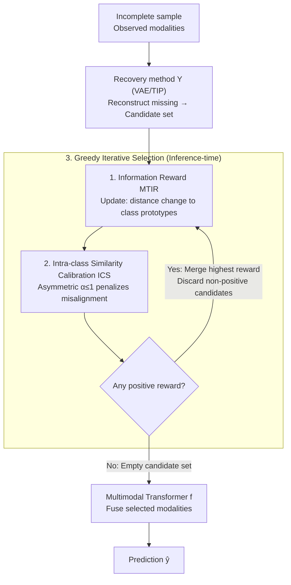

# Inference-Time Dynamic Modality Selection for Incomplete Multimodal Classification

**Conference**: ICLR 2026  
**arXiv**: [2601.22853](https://arxiv.org/abs/2601.22853)  
**Code**: [GitHub](https://github.com/siyi-wind/DyMo)  
**Area**: Multimodal Learning / Medical Imaging  
**Keywords**: incomplete multimodal, dynamic modality selection, inference-time, information gain, discarding-imputation dilemma

## TL;DR

Ours proposes DyMo—an inference-time dynamic modality selection framework. By theoretically deriving a reward function MTIR (Multimodal Task-Relevant Information Reward) based on a classification loss reduction proxy, class prototype distance, and intra-class similarity calibration, the framework iteratively selects and fuses reliable recovered modalities during inference. It systematically addresses the "discarding-imputation dilemma" (loss of information vs. introduction of noise).

## Background & Motivation

**Background**: Multimodal deep learning has made significant progress in fields such as healthcare, marketing, and embodied AI. However, in practical deployment, samples often lack one or more modalities due to sensor failure, differing acquisition protocols, or transmission errors.

**Limitations of Prior Work**:

1. **Imputation methods** (e.g., MoPoE, M3Care) reconstruct missing modalities via VAEs or other generative models. However, the quality of reconstruction varies—often resulting in low-fidelity (blurred/distorted) or semantically misaligned (label-mismatched) recoveries.

2. **Discarding methods** (e.g., ModDrop, MUSE) simply ignore missing modalities. However, when modalities with high task relevance are missing, the discriminative power based only on remaining modalities drops significantly.

3. **Existing dynamic fusion methods** (QMF, DynMM, PDF) primarily focus on intra-modal noise (low fidelity) and cannot detect inter-modal semantic misalignment.

**Key Challenge** (Discarding-Imputation Dilemma): Discarding missing modalities loses task-relevant information → performance degradation; imputing missing modalities may introduce task-irrelevant noise or semantic errors → performance degradation. Both approaches have drawbacks, and a dynamic trade-off mechanism is missing.

**Key Insight**: Rather than a binary choice, Ours dynamically evaluates whether each recovered modality is "worth fusing"—accepting it if the recovery increases task-relevant information (positive reward) and rejecting it if it introduces noise or misalignment (negative reward).

## Method

### Overall Architecture

DyMo decomposes the decision of "whether to impute and whether to use" into two steps: first, it uses an existing recovery method $\Upsilon$ (such as VAE or TIP) to reconstruct all missing modalities of an incomplete sample $\mathbb{X} = \{x^{(m)}\}_{m \in \mathcal{I}}$, yielding a set of candidate recovered modalities. Then, at inference time, it greedily and iteratively evaluates the MTIR reward (including intra-class similarity calibration) for each candidate. In each round, only the candidate with the highest reward is accepted, and all candidates with non-positive rewards are discarded. This continues until the candidate set is empty. Finally, the selected modalities are fed into a multimodal Transformer $f$ for prediction. $f$ consists of modality-specific encoders $h^{(m)}$, a multimodal Transformer $\psi$ with [CLS] tokens and attention masking, and a linear softmax classifier $\zeta$. The masking mechanism naturally supports arbitrary modality combinations, enabling the dynamic addition/subtraction of modalities within a single network. This process involves no extra training and occurs only as an inference-time decision.

### Key Designs

**1. MTIR Reward: Quantifying the Value of Recovery**

The root of the dilemma is the inability to determine beforehand whether a recovery provides information or noise. Starting from information theory, it is proven that task-relevant information $I(Y;\mathbf{Z})$ and empirical cross-entropy have a lower bound:

$$I(Y;\mathbf{Z}) \geq H(Y) - \hat{\mathcal{L}}_{ce} - G\sqrt{\frac{\ln(1/\delta)}{2|\mathcal{D}|}}$$

Thus, "reducing classification loss" is equivalent to "raising the lower bound of task-relevant information." Losses can be estimated at inference time by using predicted labels $\hat{y}$ as proxies for ground truth. To ensure robustness to training distributions, classification is viewed as mixed density estimation in the feature space relative to class prototypes: $p(y=k|\mathbf{z}) = \frac{\exp(-d_\phi(\mathbf{z}, \mathbf{c}_k))}{\sum_{k'}\exp(-d_\phi(\mathbf{z}, \mathbf{c}_{k'}))}$, where $\mathbf{c}_k$ are pre-stored prototypes and $d_\phi$ is the Bregman divergence. MTIR then simplifies to the change in the sample representation's distance to the class prototype before and after adding a recovered modality. A reduced distance (positive reward) indicates useful information, while an increased distance (negative reward) indicates harmful information pushing the sample toward the wrong cluster.

**2. Intra-class Similarity Calibration (ICS): Addressing Alignment Blind Spots**

MTIR only considers the distance change to the predicted class prototype, which might miss cases where the predicted class changes ($\hat{y} \neq \hat{y}^u$) but the distances to the respective prototypes remain similar. To counter this "semantic misalignment," a calibration term $\alpha$ is introduced based on the "intra-class similarity (ICS)" within the predicted cluster (approximated by a truncated normal distribution). Crucially, $\alpha$ is **asymmetric**—it only weights down the reward ($ \alpha < 1$) when the representation becomes less typical after recovery. Since observed modalities are reliable while synthesized ones are suspect, this "penalty-only" conservative stance makes the reward more sensitive to semantic shifts.

**3. Greedy Iterative Selection: Absorbing the Most Valuable Recoveries**

Instead of fusing all positive-reward modalities at once, DyMo uses greedy iteration (Algorithm 1). In each step, rewards are calculated for the current candidate set; the candidate with the highest reward is moved to the observed set, while all non-positive reward candidates are discarded. Rest-candidates' rewards are recalculated based on the updated observed set. This iterative approach accounts for how selected modalities change the fused feature distribution and prevents noise accumulation.

### Loss & Training

Training is conducted only on a complete dataset. To make the network robust to any combination of modalities, $A$ random modality subsets $\mathcal{S} \sim \mathcal{U}_A$ are sampled for each sample to simulate $2^M-1$ missing patterns. The classification loss is the average cross-entropy $\mathcal{L}_{class}$ across subsets. An auxiliary contrastive loss $\mathcal{L}_{aux}$ is added to ensure reliable class prototype distances by encouraging same-class clustering. The total loss is $\mathcal{L} = \mathcal{L}_{class} + \mathcal{L}_{aux}$, requiring no extra networks or multi-stage training.

## Key Experimental Results

### Main Results

Comparison with SOTA across 5 datasets (PolyMNIST/MST/CelebA/DVM/UKBB-CAD/UKBB-Infarction):

| Method | PolyMNIST(η=0.8) | MST(miss{M,T}) | CelebA(miss{T}) | DVM(γ=1) | CAD(γ=1) |
|------|------------------|----------------|-----------------|----------|----------|
| ModDrop | 88.44 | 82.47 | 87.32 | 87.97 | 69.18 |
| MTL | 91.14 | 84.37 | 89.38 | 92.32 | 70.23 |
| OnlineMAE | 90.09 | 86.67 | 86.67 | - | - |
| M3Care† | 87.92 | 85.16 | 91.32 | 93.43 | 72.48 |
| **DyMo_c** | **96.61** | **85.31** | **95.20** | **93.14** | **71.02** |
| **DyMo_e** | **96.81** | **86.84** | 93.67 | **93.36** | **72.17** |

On PolyMNIST with 80% missingness, DyMo outperforms OnlineMAE by +5.67%. On DVM with full tabular missingness, it exceeds ModDrop by +4.11%.

### Ablation Study

| Setup | PolyMNIST(η=0.8) | MST(miss{M,T}) |
|------|------------------|----------------|
| Baseline (Full fusion, no selection) | 84.21 | 80.73 |
| S (Simultaneous fusion of positive rewards) | 94.33 | 82.08 |
| I (Iterative selection of highest reward) | 94.50 | 82.12 |
| I+C (Iterative + Calibration, Full DyMo) | **96.61** | **85.31** |

### Key Findings

- Fusing all recovered modalities directly (Baseline) performs significantly worse than DyMo, confirming that recovery quality is unreliable.
- Iterative selection (I) slightly outperforms simultaneous selection (S), and ICS calibration (C) provides an additional 1-3% gain on most datasets.
- DyMo is robust to the choice of distance function (Cosine vs. Euclidean).
- Existing dynamic fusion methods (QMF/DynMM/PDF) show limited efficacy with VAE recoveries because they cannot detect semantic misalignment.

## Highlights & Insights

- The "Discarding-Imputation Dilemma" is clearly defined and systematically addressed with a theoretical framework.
- The theoretical chain from mutual information to classification loss and then to prototype distance is rigorous: $I(Y;\mathbf{Z})$ → Loss bound → Bregman divergence → Computable MTIR.
- The asymmetric design of ICS calibration ($\alpha \leq 1$) reflects a "conservative" engineering intuition regarding synthetic modalities.
- The training strategy is elegant: random subset simulation + contrastive loss, avoiding auxiliary networks.

## Limitations & Future Work

- The ICS calibration term slightly decreased performance on CAD/Infarction datasets, suggesting a need for dataset-specific hyperparameter tuning.
- Calculation of MTIR for each candidate requires a forward pass—inference overhead increases with the number of missing modalities.
- DyMo's performance upper bound is constrained by the underlying recovery method (e.g., TIP's limited capacity for full tabular recovery).
- Evaluation is limited to classification; it has not yet been extended to dense prediction tasks like segmentation or detection.

## Related Work & Insights

- **vs. ModDrop/MUSE**: Discarding methods suffer when high-information modalities are lost (MUSE drops 61% on MST); DyMo avoids this via selective recovery.
- **vs. MoPoE/M3Care**: Imputation methods produce unreliable recoveries in severe missingness; DyMo filters these via MTIR.
- **vs. QMF/DynMM/PDF**: Existing dynamic fusion focuses on intra-modal noise; DyMo detects both noise and semantic misalignment via class prototype distances.
- **Methodological Insight**: The idea of using task loss reduction as a proxy for information gain is applicable to any scenario requiring dynamic decision-making.

## Rating

- Novelty: ⭐⭐⭐⭐ (Innovative problem definition, sound theory)
- Experimental Thoroughness: ⭐⭐⭐⭐⭐ (5 datasets + 9 SOTA comparisons + comprehensive ablation)
- Writing Quality: ⭐⭐⭐⭐ (Tight link between theory and experiments, clear derivations)
- Value: ⭐⭐⭐⭐ (Generic framework for incomplete multimodal learning, directly applicable to medical imaging)

<!-- RELATED:START -->

## Related Papers

- [\[ICLR 2026\] ODEBRAIN: Continuous-Time EEG Graph for Modeling Dynamic Brain Networks](odebrain_continuous-time_eeg_graph_for_modeling_dynamic_brain_networks.md)
- [\[ECCV 2024\] TIP: Tabular-Image Pre-training for Multimodal Classification with Incomplete Data](../../ECCV2024/medical_imaging/tip_tabular-image_pre-training_for_multimodal_classification_with_incomplete_dat.md)
- [\[ICLR 2026\] Adaptive Domain Shift in Diffusion Models for Cross-Modality Image Translation](adaptive_domain_shift_in_diffusion_models_for_cross-modality_image_translation.md)
- [\[CVPR 2025\] Distilled Prompt Learning for Incomplete Multimodal Survival Prediction](../../CVPR2025/medical_imaging/distilled_prompt_learning_for_incomplete_multimodal_survival_prediction.md)
- [\[ICLR 2026\] ProstaTD: Bridging Surgical Triplet from Classification to Fully Supervised Detection](prostatd_bridging_surgical_triplet_from_classification_to_fully_supervised_detec.md)

<!-- RELATED:END -->
